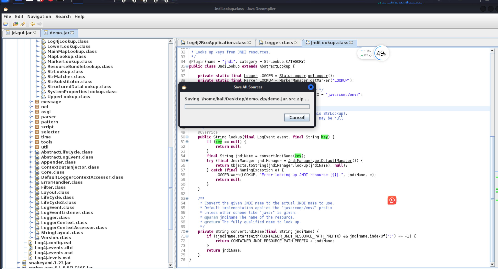

### log4j 漏洞原理
Log4j 是一款通用日志记录工具，其原理如下：开发人员可利用它记录当前程序状态，除直接记录文本外，还能使用简单表达式记录动态内容。表达式用 ${} 包裹，通过不同解析器解析，如 sys 解析器可在系统环境变量中查找指定内容进行替换。  
Log4j 中的 jndi 解析器通过 JDK 获取 jndi 对象来替换原有文本打印。JDK 会从指定 url 路径下载字节流并反序列化为 Java 对象作为 jndi 返回，反序列化过程会执行字节流中的程序。若攻击者能控制日志打印内容，就可让目标服务器从其指定的 url 下载代码字节流，使附带代码在目标服务器上执行。

### 漏洞修改原理：
log4j2中通过JndiLookup类进行jndi查找，造成漏洞。禁用JndiLookup一种方式是找到应用程序中打包的 log4j-core.jar，将其中的JndiLookup.class 文件删除后重新打包成新的 log4j-core.jar 即可。
### 环境准备
#### 1.下载kali
1. 推荐一个下载kali镜像很快的网站：https://mirrors.aliyun.com/kali-images/kali-2024.4/?spm=a2c6h.25603864.0.0.732b571caXKqrs

#### 2. 下载和配置docker


#### 3. VulFocus 环境搭建与运行
· 1. 拉取 VulFocus 镜像

· 2. 启动 VulFocus 容器
```
# 创建并进入 VulFocus 工作目录
mkdir -p ~/workspace/ctf-games/fofapro/vulfocus
cd ~/workspace/ctf-games/fofapro/vulfocus
# 启动 VulFocus（通过脚本或手动命令）
# 方式 1：使用自带脚本启动（若有 start.sh）
bash start.sh
# 方式 2：手动启动容器（指定端口映射）
docker run -d --name vulfocus_container \
  -p 80:80 \         # 映射 Web 端口
  -p 2222:2222      # 映射 SSH 端口
  vulfocus/vulfocus:latest
```

· 3. 访问VulFocus

### 漏洞修改过程：
1. 获取源码


2. 修改代码:直接修改 JndiLookup 类，让其 lookup 方法不进行实际的 JNDI 查找，而是直接返回一个安全的默认值。

3. 编译打包：重新编译项目并打包成新的 log4j-core.jar 文件。
参考：https://zhuanlan.zhihu.com/p/444140910
