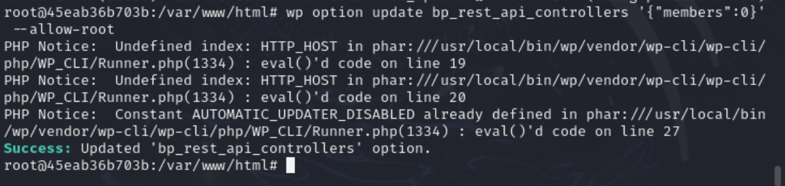
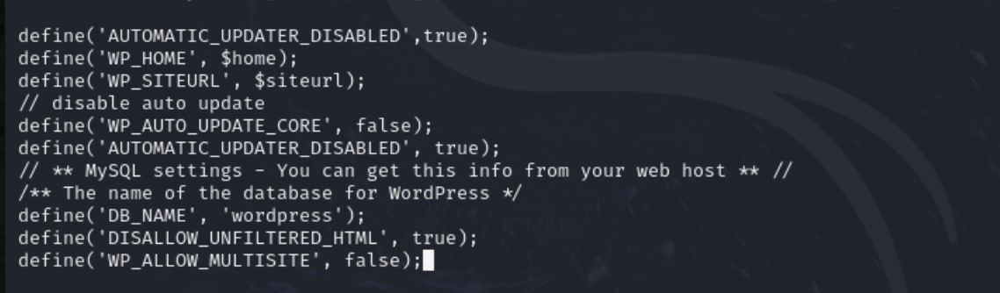

## 针对 WordPress 垂直越权漏洞（CVE-2021-21389）的修复方案
### 一.环境准备
#### 1.下载kali
 推荐一个下载kali镜像很快的网站：https://mirrors.aliyun.com/kali-images/kali-2024.4/?spm=a2c6h.25603864.0.0.732b571caXKqrs

#### 2. 下载和配置docker

#### 3. 拉取 VulFocus 漏洞镜像

#### 4. 启动 VulFocus 容器

### 二.修复漏洞
#### 1.手动安装 / 更新 BuddyPress 插件至7.2.1

#### 2.# 禁用危险REST端点

#### 3.文件上传防护
在 wp-config.php 中添加配置

DISALLOW_UNFILTERED_HTML 设置为 true 可以禁止未过滤的 HTML 上传，增强安全性；  
WP_ALLOW_MULTISITE 设置为 false 可以禁用 WordPress 多站点功能
#### 4.限制上传文件类型

这段代码的作用是匹配扩展名为 .php、.phtml 和 .phar 的文件，然后禁止所有来源对这些文件的访问，从而防止恶意上传可执行脚本文件。添加完成后，保存并关闭文件。
#### 5.API 权限控制

wp role reset subscriber 命令用于重置 subscriber 角色的权限到默认状态；    
wp cap remove subscriber read 命令用于移除 subscriber 角色的 read 能力，进一步限制其对网站内容（包括 /wp-json 相关 API ）的访问权限。
#### 6.添加日志配置内容

这部分配置定义了一种新的日志格式 sec_audit ，包含客户端 IP（%h ）、远程用户名（%l ）、认证用户名（%u ）、请求时间（%t ）、请求行（%r ）、状态码（%>s ）、响应大小（%b ）、引用页（%{Referer}i ）和用户代理（%{User-Agent}i ）等信息，并指定将符合该格式的日志记录到 /var/log/apache2/security_audit.log 文件中。
#### 7.防火墙设置
下载防火墙

添加规则

第一条命令创建了一个名为 WPAPI 的最近连接记录集，用于跟踪访问 80 端口（HTTP 端口 ）的 TCP 连接。第二条命令设置在 60 秒内，如果同一个源 IP 对 80 端口的访问次数达到 10 次，就丢弃后续的连接请求，以此限制 REST API 的访问频率，防止恶意高频访问。
阻断异常 User-Agent

该命令使用字符串匹配模块（-m string ），采用 bm 算法（--algo bm ），当检测到请求中的 User-Agent 字段包含 metasploit 时，就丢弃该请求，从而阻断可能来自恶意工具的访问。
### 三.修复验证
自动化测试脚本

这段代码使用 curl 命令向 http://localhost:8080/wp-json/buddypress/v1/signup 发送一个 POST 请求，携带注册用户的相关信息（用户名、邮箱、密码 ），模拟攻击者尝试利用注册绕过漏洞进行注册。
结果：

