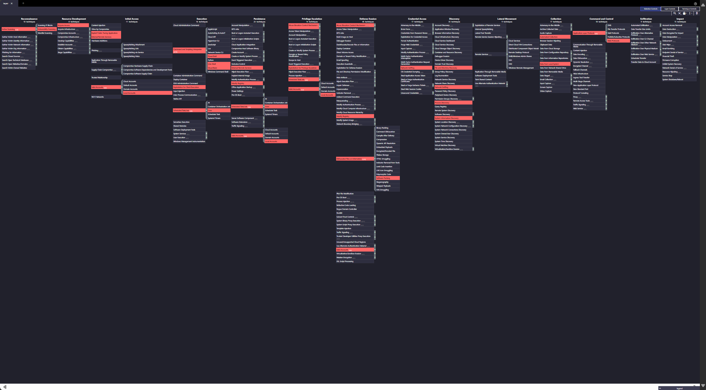
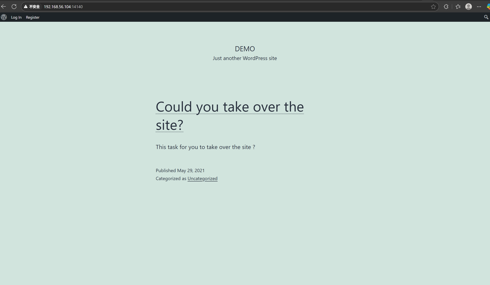
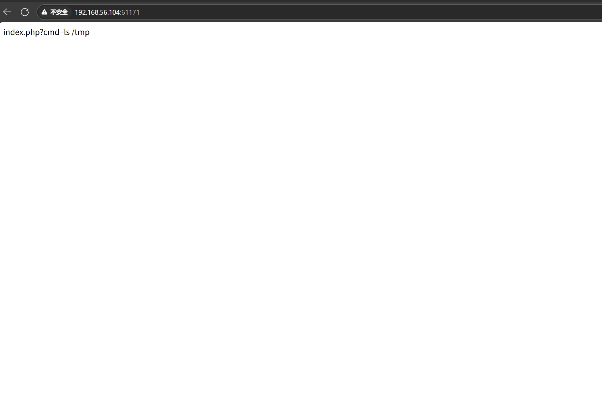
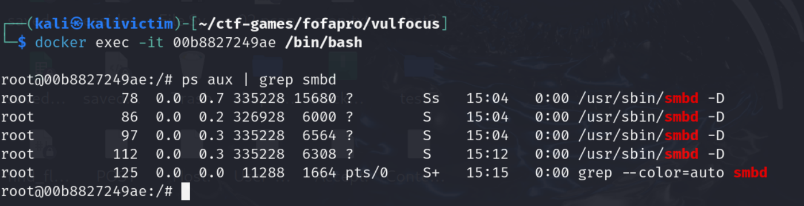
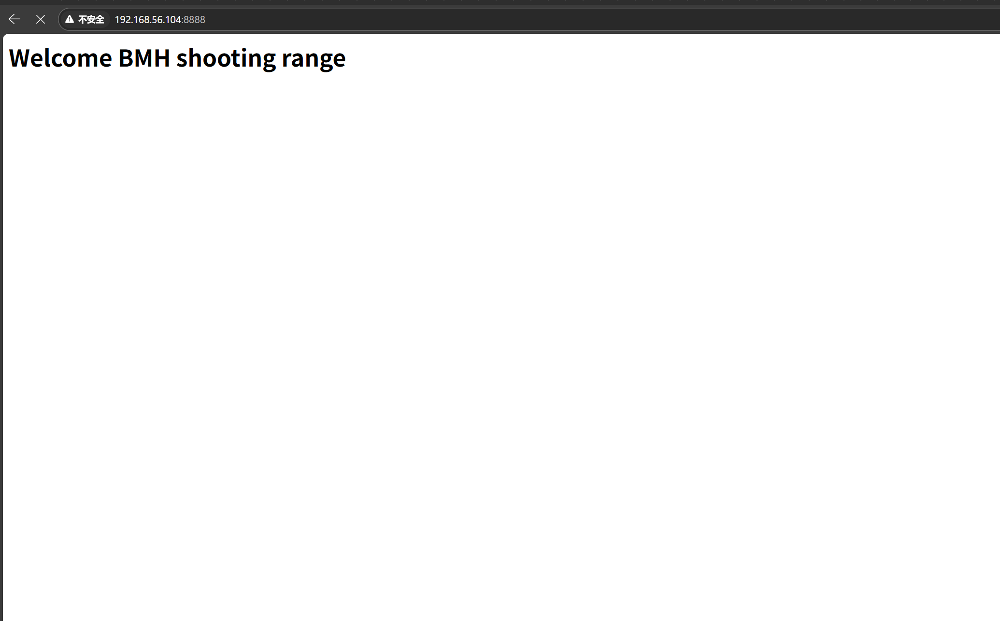

## ATT&AK navigator可视化

**可见json文件。**

## 具体技术点解释

## 入口靶标：wordpress_cve-2021-21389:latest

  **第一阶段：注册绕过（逻辑漏洞利用）**

**抓包注册请求 → 提取激活密钥 → 构造激活请求**

* **T1190 – Exploit Public-Facing Application**
  WordPress 注册逻辑存在缺陷，允许攻击者绕过激活验证，属于典型公共 Web 应用利用。

* **T1556.003 – Modify Authentication Process: Web Portal Capture**
  构造激活请求、绕过标准验证流程，属于认证逻辑篡改。

* **T1071.001 – Application Layer Protocol: Web**
  使用 HTTP 抓包与重放攻击（burp suite 操作）均基于 Web 协议通信。

---

**第二阶段：获取管理员权限（权限提升）**

**创建用户组 → 访问 `/groups/create/...` 创建组 → 用户被加入组**

* **T1098.001 – Account Manipulation: Additional Cloud Credentials / Privilege Grant**
  创建组的过程中，攻击者将自己的账户植入特定权限组，触发权限提升逻辑。

---

**抓包 manage/members 请求 → 提取 X-WP-Nonce 与 Cookie 参数**

* **T1557.002 – Man-in-the-Middle: ARP Cache Poisoning / Traffic Interception**
  虽然不是典型的网络中间人，但抓包工具（如 Burp）本质上拦截了用户与 Web 应用间通信。

* **T1110.001 – Brute Force: Password Guessing (弱匹配)**
  非常轻微适用：使用暴力方式猜测非标准接口参数或 token（如尝试获取 X-WP-Nonce）

---

**构造 POST 请求 → `wp-json/buddypress/v1/members/me` → 提权**

* **T1068 – Exploitation for Privilege Escalation**
  构造提权请求属于利用应用内部的权限漏洞直接获取更高权限。

* **T1078.003 – Valid Accounts: Local Accounts**
  利用有效用户身份 + X-WP-Nonce 提权。

---

**登录后台验证提权效果 → 访问 dashboard 页面**

* **T1087.001 – Account Discovery: Local Account**
  登录后确认账户权限是否为 admin，即是对本地账户权限的探测行为。

---

| Technique ID | Technique Name                                     | 阶段          | 说明                     | 推荐颜色      |
| ------------ | -------------------------------------------------- | ----------- | ---------------------- | --------- |
| T1190        | Exploit Public-Facing Application                  | 注册绕过        | WordPress 激活流程漏洞利用     | `#ff9999` |
| T1556.003    | Modify Authentication Process: Web Portal Capture  | 注册绕过        | 伪造激活请求绕过验证流程           | `#ffcc99` |
| T1071.001    | Application Layer Protocol: Web                    | 注册/提权请求发送阶段 | 所有 burp 操作通过 HTTP 接口构造 | `#cccccc` |
| T1098.001    | Account Manipulation: Additional Cloud Credentials | 创建用户组       | 利用分组机制将用户权限抬升          | `#66cccc` |
| T1557.002    | Man-in-the-Middle: Traffic Interception            | 抓包提权请求      | Burp 抓包拦截 token 信息     | `#ffdd99` |
| T1068        | Exploitation for Privilege Escalation              | 构造提权请求      | 用接口漏洞提升角色为管理员          | `#ffa07a` |
| T1078.003    | Valid Accounts: Local Accounts                     | 登录后台        | 使用已有账户访问管理后台           | `#ffff99` |
| T1087.001    | Account Discovery: Local Account                   | 权限验证        | 验证 dashboard 页面功能是否新增  | `#ccffcc` |

---

## 第一层靶标：samba-cve_2017_7494:latest

利用metasploit。

| 步骤 | 操作说明                                                                         |
| -- | ---------------------------------------------------------------------------- |
| ①  | 利用 `exploit/linux/samba/is_known_pipename` 模块触发漏洞                            |
| ②  | 设置 payload相关参数 |
| ③  | 启动监听器，获取反弹 shell（Meterpreter / Bash / Netcat）                                |
| ④  | 在 shell 中执行命令、提权、持久化                                                         |

---

| Technique ID  | Technique Name                                                  | 阶段       | 说明                                                  |
| ------------- | --------------------------------------------------------------- | -------- | --------------------------------------------------- |
| **T1203**     | **Exploitation for Client Execution**                           | 执行       | Metasploit 利用漏洞模块（比如 `samba/is_known_pipename`）进行触发 |
| **T1059.004** | **Command and Scripting Interpreter: Unix Shell**               | 执行       | 获取 shell 后，通过 Unix shell 执行命令                       |
| **T1053.003** | **Scheduled Task/Job: Cron**                                  | 权限维持 | 攻击者可创建 cron 持久化任务（如反弹 shell 持续存在）                   |

---

## 第一层靶标：vulshare_nginx-php-flag

###  攻击技术点

| ATT\&CK 技术 ID | 技术名称                                                 | 攻击阶段 | 行为描述                               |
| ------------- | ---------------------------------------------------- | ---- | ---------------------------------- |
| **T1203**     | Exploitation for Client Execution                    | 执行   | 直接通过 `cmd` 参数触发命令执行漏洞              |
| **T1059.001** | Command and Scripting Interpreter: PowerShell / Bash | 执行   | 在 URL 参数中执行 Linux 命令（如 `ls`、`cat`） |
| **T1040**     | Network Sniffing                                     | 侦察   | 可以在容器内抓取访问日志或包来检测攻击行为              |
| **T1595.002** | Active Scanning: Vulnerability Scanning              | 侦察   | 攻击者可能通过 Fuzz 发现 index.php 接收参数     |

---

## 第二层靶标： WebLogic – CVE-2020-2555

* 探测 WebLogic 控制台端口
* 构造 T3 反序列化 Payload 获取反弹 Shell 或 flag
* 监听并分析网络流量、日志确认利用是否成功

| ATT\&CK 技术 ID | 技术名称                                            | 阶段   | 说明                              |
| ------------- | ----------------------------------------------- | ---- | ------------------------------- |
| **T1190**     | Exploit Public-Facing Application               | 初始访问 | 通过反序列化漏洞攻击 WebLogic             |
| **T1059.005** | Command and Scripting Interpreter: Visual Basic | 执行   | 利用 T3 Payload 执行恶意命令            |
| **T1210**     | Exploitation of Remote Services                 | 横向移动 | 若攻击者通过反弹 Shell 获取控制权限，可进一步攻击内网  |
| **T1040**     | Network Sniffing                                | 侦察   | Wireshark 抓包分析是否存在 T3 通信或恶意命令流量 |
| **T1005**     | Data from Local System                          | 收集   | 读取 flag 文件作为靶场目标                |
| **T1057**     | Process Discovery                               | 发现   | 若攻击者探测运行服务、进程等信息                |

---

## 第二层靶标：Apache – CVE-2021-41773

* 使用 curl http://ip:port/cgi-bin/.%2e/%2e%2e/%2e%2e/etc/passwd 进行路径穿越读取
* 使用同样方式远程执行命令：如 curl 'http://ip/cgi-bin/.%2e/.%2e/.%2e/bin/sh -c "cat /flag"'
* 在服务器端分析 apache 访问日志，使用 tail -f access_log | grep ".."

###  ATT\&CK Navigator 标注：

| ATT\&CK 技术 ID | 技术名称                                            | 阶段   | 说明                       |
| ------------- | ----------------------------------------------- | ---- | ------------------------ |
| **T1190**     | Exploit Public-Facing Application               | 初始访问 | Apache 路径穿越与命令执行         |
| **T1083**     | File and Directory Discovery                    | 发现   | 使用路径穿越漏洞查看服务器文件系统结构      |
| **T1059.004** | Command and Scripting Interpreter: Unix Shell   | 执行   | 执行如 `cat /flag` 命令获取敏感数据 |
| **T1040**     | Network Sniffing                                | 侦察   | 使用 Wireshark 抓取请求        |
| **T1005**     | Data from Local System                          | 收集   | 读取 flag 文件               |

## 最终层靶标：vulfocus/thinkphp-cve_2018_1002015 —— ThinkPHP 框架远程代码执行

| ATT\&CK 技术 ID | 技术名称                                          | 攻击阶段 | 行为描述                               |
| ------------- | --------------------------------------------- | ---- | ---------------------------------- |
| **T1190**     | Exploit Public-Facing Application             | 初始访问 | RCE 利用的是公开服务接口（ThinkPHP 路由解析漏洞）    |
| **T1059.004** | Command and Scripting Interpreter: Unix Shell | 执行   | 构造 Payload 执行命令                    |
| **T1082**     | System Information Discovery                  | 发现   | 使用 `id`、`whoami`、`uname` 等命令确认执行身份 |
| **T1005**     | Data from Local System                        | 收集   | 读取本地 `flag` 文件属于敏感信息获取             |

## 各镜像单独启动测试
**1. wordpress_cve-2021-21389:latest（wordpress垂直越权）**
* CVE-2021-21389 是 WordPress 核心代码中一个因权限验证不严导致的垂直越权漏洞。攻击者可以通过此漏洞以低权限用户身份执行本应仅限管理员或高权限用户的操作。

* BuddyPress 是一个用于构建社区站点的WordPress插件。当BuddyPress处于5.0.0-7.2.1时，非特权用户可以通过利用REST API 成员端点（BuddyPress中用于管理成员数据的API接口）中的问题来获得管理员权限。

**2. c4pr1c3/vulshare_nginx-php-flag:latest**
* 命令执行（Command Execution）漏洞，即黑客可以直接在Web应用中执行系统命令，从而获取敏感信息或者拿下shell权限 命令执行漏洞可能造成的原因是Web服务器对用户输入命令安全检测不足，导致恶意代码被执行。

**3. vulfocus/samba-cve_2017_7494:latest**

* Samba实现Windows主机与Linux服务器之间的资源共享，Linux操作系统提供了Samba服务，Samba服务为两种不同的操作系统架起了一座桥梁，使Linux系统和Windows系统之间能够实现互相通信。samba在linux系统上实现SMB协议的服务，使用SMB协议在局域网上共享文件和打印机.CVE-2017-7494，2017年5月24日Samba发布了4.6.4版本，修复严重的远程代码执行漏洞，该漏洞影响了Samba 3.5.0 之后到4.6.4/4.5.10/4.4.14中间的所有版本，可以让恶意访问者远程控制受影响的Linux和Unix机器。

* 此镜像模拟的是Samba漏洞服务，而Samba是SMB文件共享服务，并非网页服务，因此不能直接通过网页访问确认是否可以成功启动。

我们进入容器内部，查看是否存在smbd或者nmbd进程。

**4. vulfocus/weblogic-cve_2019_2725:latest**
* CVE-2019-2725 是一个影响 Oracle WebLogic Server 的反序列化远程代码执行漏洞。这个漏洞允许未经授权的攻击者通过发送精心构造的恶意 HTTP 请求来远程执行命令。该漏洞利用了 WebLogic 的 XMLDecoder 反序列化漏洞，通过构造特定的 payload 来绕过 Oracle 官方的补丁。

**5. vulfocus/apache-cve_2021_41773:latest**

* Apache HTTP Server 2.4.49、2.4.50版本对路径规范化所做的更改中存在一个路径穿越漏洞，攻击者可利用该漏洞读取到Web目录外的其他文件，如系统配置文件、网站源码等，甚至在特定情况下，攻击者可构造恶意请求执行命令，控制服务器。

**6. vulfocus/thinkphp-cve_2018_1002015:latest**
* ThinkPHP 5.0.x版本和5.1.x版本中存在远程代码执行漏洞，该漏洞源于ThinkPHP在获取控制器名时未对用户提交的参数进行严格的过滤。远程攻击者可通过输入‘＼’字符的方式调用任意方法利用该漏洞执行代码。

