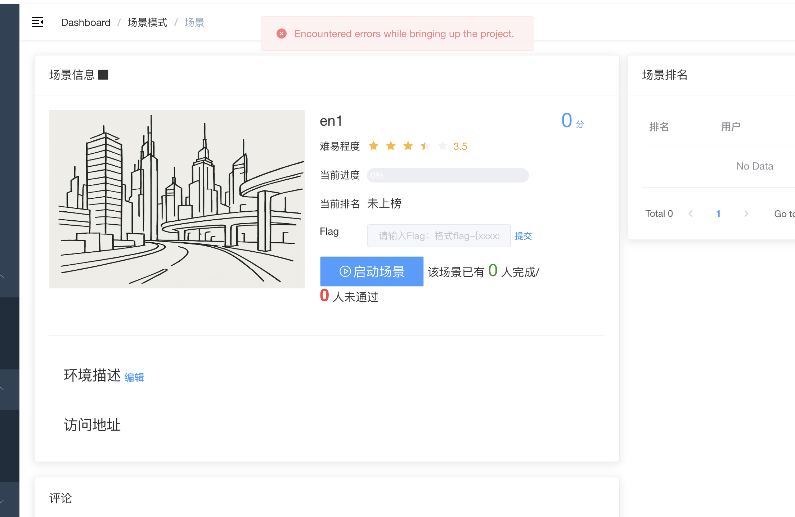

# Vulfocus 场景启动问题排查报告

## 问题描述



在 Kali Linux 虚拟机中使用 Vulfocus 创建和启动靶场场景时，遇到持续的 Docker 网络配置错误，导致场景中的部分容器无法正常启动。

### 核心错误信息

```
ERROR: for [容器名]  Cannot start service [服务名]: failed to create task for container: failed to create shim task: OCI runtime create failed: runc create failed: unable to start container process: error during container init: error running hook #0: error running hook: exit status 1, stdout: , stderr: failed to add interface [网卡接口] to sandbox: error setting interface "[网卡接口]" IP to [IP地址]/24: cannot program address [IP地址]/24 in sandbox interface because it conflicts with existing route {Ifindex: [索引] Dst: 0.0.0.0/0 Src: <nil> Gw: [网关IP] Flags: [] Table: 254 Realm: 0}: unknown
```

**典型错误示例：**

- `failed to add interface vethedd9435 to sandbox: error setting interface "vethedd9435" IP to 192.169.85.4/24: cannot program address 192.169.85.4/24 in sandbox interface because it conflicts with existing route {Ifindex: 57 Dst: 0.0.0.0/0 Src: <nil> Gw: 10.10.10.1 Flags: [] Table: 254 Realm: 0}: unknown`

## 环境信息

- **操作系统**: Kali Linux (在虚拟机中运行)
- **Vulfocus 版本**: 最新版本 (vulfocus/vulfocus:latest)
- **Docker 版本**: 系统默认版本
- **虚拟机网络配置**:
  - eth0: 10.211.55.5/24 (主要网络接口)
  - eth1: 10.37.133.3/24 (辅助网络接口)

## 问题分析

### 根本原因

Docker 在为 Vulfocus 场景中的不同容器配置网络时，尝试在主机的路由表中添加网络路由，但这些路由与已存在的默认路由产生冲突。具体表现为：

1. Vulfocus 为复杂场景创建多个自定义 Docker 网络（如 net1, net2, net3, DMZ, 核心网, db_net 等）
2. 每个网络都有自己的子网和网关（如 192.169.85.0/24, 192.170.84.0/24, 10.10.10.0/24 等）
3. 当 Docker 尝试为容器分配这些网络中的 IP 地址时，需要在主机路由表中设置相应的路由
4. 由于多个网络的默认路由配置冲突，导致无法正确建立网络连接

### 错误触发条件

- 场景包含多个自定义网络
- 网络间存在路由表冲突
- Docker 的网络子系统状态不一致

## 尝试的解决方案

### 第一轮：基础容器和网络清理

#### 1. 停止并移除相关容器

```bash
# 查看运行中的容器
docker ps

# 停止场景相关容器
docker stop 96c09a22-fff3-4908-8db6-2fbf1ba144ca_3x51zkdx4pu0_1 96c09a22-fff3-4908-8db6-2fbf1ba144ca_77yx7d1ge8o0_1 96c09a22-fff3-4908-8db6-2fbf1ba144ca_2e3rg8ivlnok_1

# 移除容器
docker rm [容器名称列表]
```

#### 2. 删除冲突的 Docker 网络

```bash
# 查看网络列表
docker network ls

# 删除自定义网络
docker network rm net1 net2 net3

# 结果：遇到 "network has active endpoints" 错误
```

#### 3. 检查并清理网络端点

```bash
# 检查网络详细信息
docker network inspect net1

# 发现仍有容器连接到网络，进行强制清理
docker stop [连接的容器] && docker rm [连接的容器]

# 再次尝试删除网络
docker network rm net1 net2 net3
```

### 第二轮：Docker 服务重置

#### 4. 重启 Docker 服务

```bash
sudo systemctl restart docker
```

#### 5. 重启 Vulfocus 容器

```bash
# 由于网络 ID 不匹配，需要重新创建
docker rm vulfocus_vul-focus_1
bash start.sh
```

### 第三轮：系统级重置

#### 6. 重启整个 Kali 虚拟机

- 完全重启虚拟机以清除所有网络状态
- 重新启动 Vulfocus 服务

### 第四轮：彻底清理策略

#### 7. 停止所有场景容器

```bash
docker stop 3423369e-3cac-4ea9-ab8c-c88c6fa3c455_3jn1btficv00_1 3423369e-3cac-4ea9-ab8c-c88c6fa3c455_4yeto65xseo0_1 3423369e-3cac-4ea9-ab8c-c88c6fa3c455_1tl6mi8o6ps0_1
docker rm 3423369e-3cac-4ea9-ab8c-c88c6fa3c455_3jn1btficv00_1 3423369e-3cac-4ea9-ab8c-c88c6fa3c455_4yeto65xseo0_1 3423369e-3cac-4ea9-ab8c-c88c6fa3c455_1tl6mi8o6ps0_1
```

#### 8. 批量清理所有未使用的网络

```bash
docker network prune -f

# 成功删除：net2, DMZ, db_net, 核心网, net3, net1
```

#### 9. 验证网络环境清洁度

```bash
docker network ls

# 确认只剩下系统默认网络：bridge, host, none, vulfocus_default
```

#### 10. 再次重启 Docker 服务并重建 Vulfocus

```bash
sudo systemctl restart docker
docker rm vulfocus_vul-focus_1
cd ~/ctf-games/fofapro/vulfocus && bash start.sh
```

### 第五轮：简化场景测试

#### 11. 尝试启动最简单的单容器场景

- 避免复杂的多网络场景
- 测试基础的 Docker 网络功能

## 解决方案执行时间线

| 时间  | 操作                 | 结果                       |
| ----- | -------------------- | -------------------------- |
| 13:35 | 首次发现问题         | 场景启动失败，IP 冲突错误  |
| 13:40 | 停止容器并删除网络   | 部分网络删除成功           |
| 14:26 | 重启 Docker 服务     | 临时缓解，但问题复现       |
| 14:29 | 重新创建场景         | 仍然失败，错误持续         |
| 14:50 | 重启 Kali 虚拟机     | 问题依然存在               |
| 15:22 | 再次全面清理         | 短期成功，但新场景再次失败 |
| 15:35 | 创建新网络配置       | 仍然遇到 IP 冲突           |
| 15:44 | 重启 Vulfocus 服务   | 问题持续                   |
| 16:20 | 最新测试（简化场景） | **问题依然存在**     |

## 当前状态

### 最新错误（2025-05-24 16:20）

即使在创建最简化的场景后，仍然遇到相同的网络冲突错误：

```
ERROR: for 1feb506c-4d63-41ee-864f-8085d65b609e_1q0vvivmktj4_1  Cannot start service 1q0vvivmktj4: failed to create task for container: failed to create shim task: OCI runtime create failed: runc create failed: unable to start container process: error during container init: error running hook #0: error running hook: exit status 1, stdout: , stderr: failed to add interface vethedd9435 to sandbox: error setting interface "vethedd9435" IP to 192.169.85.4/24: cannot program address 192.169.85.4/24 in sandbox interface because it conflicts with existing route {Ifindex: 57 Dst: 0.0.0.0/0 Src: <nil> Gw: 10.10.10.1 Flags: [] Table: 254 Realm: 0}: unknown
```

### 问题特征

1. **路由表冲突**: 新的网络接口 IP 与现有路由表中的默认路由冲突
2. **网关冲突**: 多个网络使用不同的网关（10.10.10.1, 192.170.84.1 等）
3. **接口索引冲突**: Docker 尝试创建的 veth 接口与现有接口索引冲突

## 未尝试的可能解决方案

### 1. 深层 Docker 配置清理

```bash
# 停止 Docker 服务
sudo systemctl stop docker

# 清理 Docker 的网络配置文件
sudo rm -rf /var/lib/docker/network/

# 重启 Docker 服务
sudo systemctl start docker
```

### 2. 修改 Vulfocus 网络配置

- 检查 Vulfocus 的网络配置文件
- 修改默认的网络子网设置，避免与系统网络冲突

### 3. 系统路由表手动清理

```bash
# 查看当前路由表
ip route show

# 手动删除冲突的路由（需要谨慎操作）
sudo ip route del [冲突路由]
```

### 4. Docker 网络子系统重置

```bash
# 重置整个 Docker 网络子系统
sudo systemctl stop docker
sudo ip link delete docker0
sudo systemctl start docker
```

### 5. 虚拟机网络配置检查

- 检查虚拟机的网络配置是否与 Docker 网络产生冲突
- 考虑调整虚拟机的网络模式（NAT vs. Bridged）

## 结论

这是一个深层的 Docker 网络路由冲突问题，可能与以下因素相关：

1. **虚拟机环境**: Kali 在虚拟机中运行可能影响网络配置
2. **Docker 版本兼容性**: 可能存在 Docker 版本与 Vulfocus 的兼容性问题
3. **系统级网络配置**: 主机系统的网络配置可能与 Docker 网络产生深层冲突
4. **Vulfocus 设计限制**: Vulfocus 的网络设计可能不适合当前的系统环境

**建议的下一步行动**：

1. 尝试在物理机上安装 Vulfocus 以排除虚拟机因素
2. 考虑使用其他靶场平台作为替代方案
3. 联系 Vulfocus 社区寻求技术支持
4. 尝试修改 Vulfocus 的网络配置以避免冲突

## 技术细节记录

### 网络配置冲突模式

- **冲突网段**: 192.169.85.0/24, 192.170.84.0/24, 10.10.10.0/24
- **冲突网关**: 10.10.10.1, 192.170.84.1
- **路由表**: Table 254 (默认路由表)
- **接口类型**: veth (虚拟以太网接口对)

### Docker 错误代码

- **OCI runtime create failed**: 容器运行时创建失败
- **runc create failed**: 底层容器创建工具失败
- **exit status 1**: 网络配置 hook 执行失败

这个问题显示了容器网络在复杂虚拟化环境中的挑战，需要更深入的系统级网络知识来解决。
