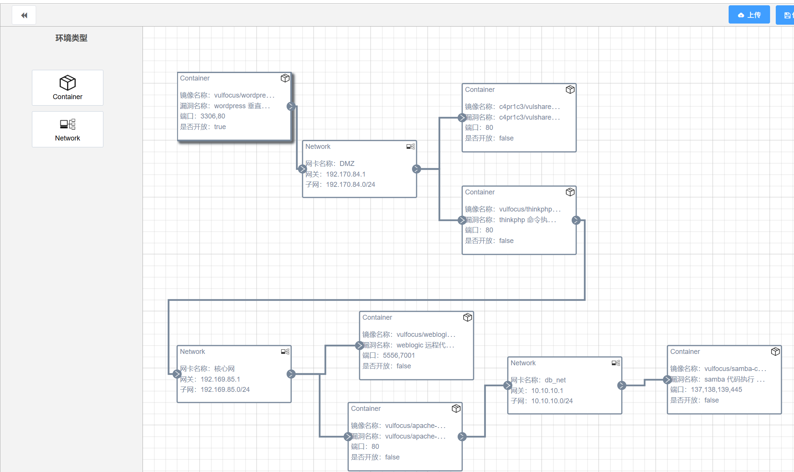
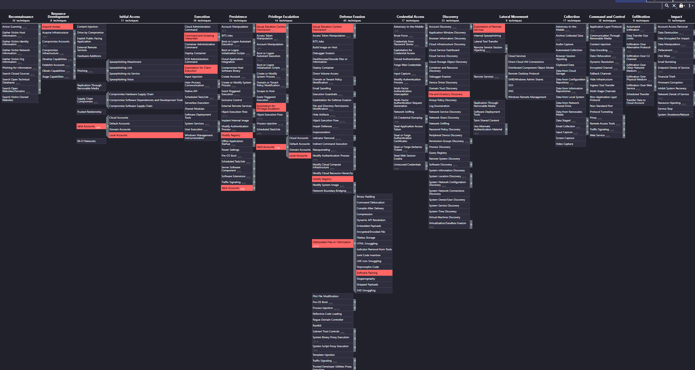

## 自定义靶场设计
在设计靶场时，我们的目标如下：
* 构建多网段、有隔离策略的网络环境（内网、外网、DMZ）
* 涵盖像“初始访问”“横向移动”等环节
* 支持红队完成多条攻击链（初始访问、提权、横移、持久化等）
* 支持蓝队全程检测、监控、溯源（流量、日志、告警）

我们先启动vulfocus镜像。

接下来我们选择符合要求，能够成功启动，同时具有易于攻击的特性的镜像。通过询问大模型，我们在vulfocus上拉取数个镜像进行测试。

经过启动测试，排除掉了一些无法正常启动的镜像，最后选择如下的镜像进行拓扑搭建。

同时，我们设计网卡如下：

### ATT&AK navigator可视化

可见json文件。

---

###  1. 初始访问入口（攻击起点）

####  容器：`vulfocus/wordpress`

* **漏洞点**：wordpress 垂直越权漏洞
* **端口开放**：3306,80
* **是否对外开放**：true
* **作用**：攻击者可以通过该容器公开的端口80发起Web攻击，利用垂直越权漏洞控制后台高权限账户。

>  **攻击目标**：获取Web Shell 或后台登录权限，作为入侵入口。

---

###  2. 横向移动阶段（利用DMZ网络）

####  网络：`DMZ` （192.170.84.0/24）

* **容器A**：`vulfocus/thinkphp`

  * **漏洞**：thinkphp命令执行漏洞
  * **端口**：80，是否开放：false（内部可访问）
  * **分析**：一旦攻击者控制wordpress容器，即可通过该网络访问ThinkPHP服务，利用其远程命令执行漏洞获取控制权。
* **容器B**：`c4pr1c3/vulshare`

  * **漏洞**：文件共享/上传类漏洞
  * **端口**：80，是否开放：false
  * **分析**：可能存在文件上传或信息泄露类漏洞，可进一步利用或用于提权辅助。

---

###  3. 向核心网渗透

####  网络：`核心网`（192.169.85.0/24）

* **容器**：`vulfocus/weblogic`

  * **漏洞**：weblogic远程代码执行漏洞
  * **端口**：5556, 7001，是否开放：false
  * **分析**：WebLogic 是高危组件，一旦攻击者进入核心网，RCE 可执行任意系统命令。

* **容器**：`vulfocus/apache-struts2`

  * **漏洞**：struts2远程命令执行漏洞
  * **端口**：80，是否开放：false
  * **分析**：同样是典型的RCE漏洞，Struts2 是历史攻击热点。

---

###  4. 数据库层控制与深度持久化

####  网络：`db_net`（10.10.10.0/24）

* **容器**：vulfocus/samba-c

  * **漏洞**：samba代码执行漏洞
  * \*\*端口：137, 138, 139, 445\`
  * **分析**：攻击者可通过写入共享服务配置，执行远程命令，或实现横向持久控制。

---
---

## 涉及漏洞概览

| 阶段     | 容器镜像              | 漏洞类型             | 利用方式                             |
|----------|-----------------------|----------------------|--------------------------------------|
| 初始     | wordpress             | 垂直越权漏洞         | 获取高权限后台控制                    |
| 横向移动 | thinkphp              | 远程命令执行漏洞     | 通过 Web 执行任意命令                |
| 横向移动 | vulshare（c4pr1c3）   | 文件上传/共享漏洞   | 上传脚本，配合其他漏洞                |
| 核心渗透 | weblogic              | 远程代码执行（RCE）   | 任意命令执行，扩大内网权限            |
| 核心渗透 | apache-struts2        | 远程命令执行（RCE）   | 老牌高危漏洞，多次被 APT 组织利用     |
| 深度渗透 | samba-c               | samba 服务命令执行    | 控制共享目录、提权、访问数据库文件等  |

测试是否能够正常启动，待我们编排好的场景发布后，尝试启动场景，可以成功启动即为成功。

