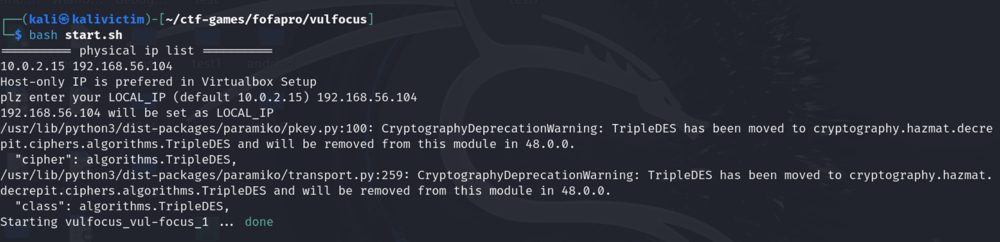
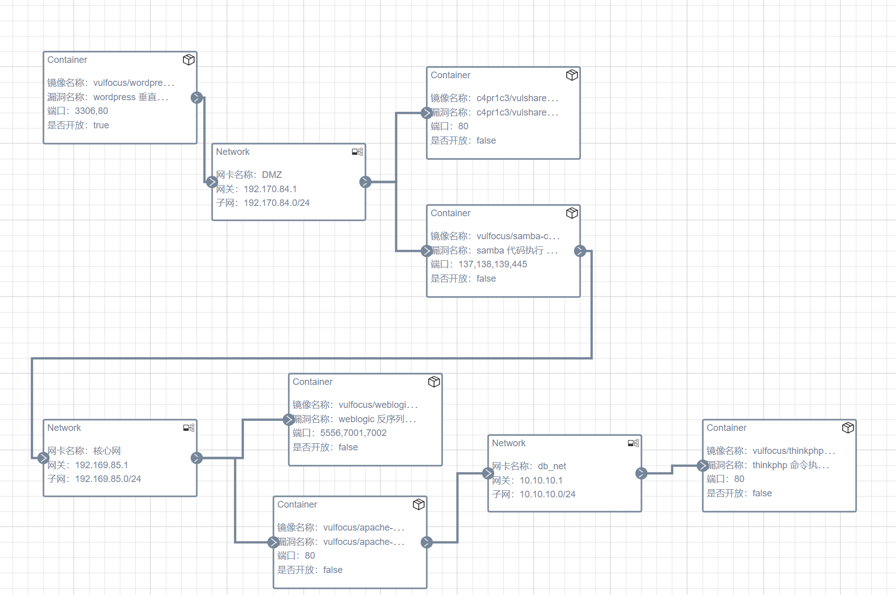
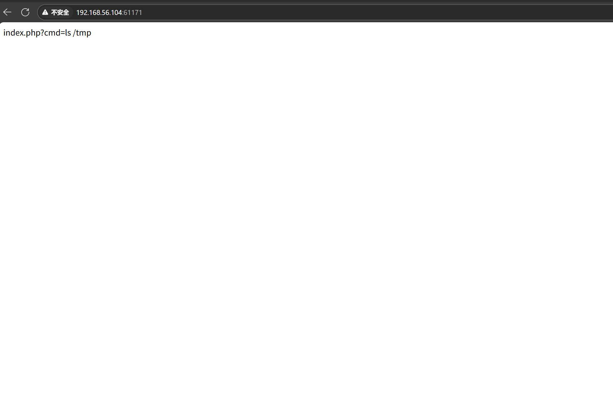
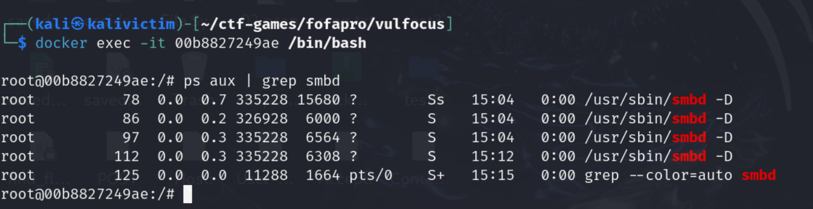
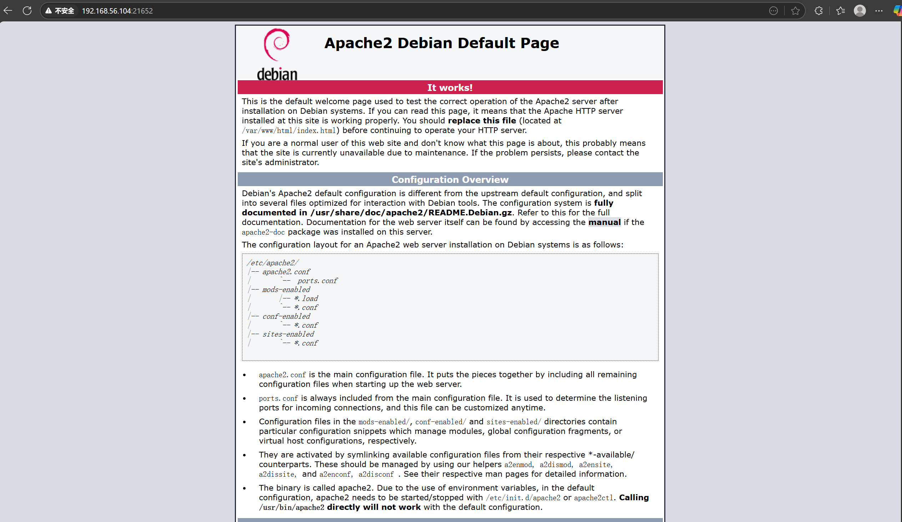

## 自定义靶场设计
在设计靶场时，我们的目标如下：
* 构建多网段、有隔离策略的网络环境（内网、外网、DMZ）
* 涵盖像“初始访问”“横向移动”等环节
* 支持红队完成多条攻击链（初始访问、提权、横移、持久化等）
* 支持蓝队全程检测、监控、溯源（流量、日志、告警）

我们先启动vulfocus镜像。

接下来我们选择符合要求，能够成功启动，同时具有易于攻击的特性的镜像。通过询问大模型，我们在vulfocus上拉取数个镜像进行测试。

经过启动测试，排除掉了一些无法正常启动的镜像，最后选择如下的镜像进行拓扑搭建。

同时，我们设计网卡如下：

### ATT&AK navigator可视化

可见json文件。

## 各镜像单独启动测试
**1. wordpress_cve-2021-21389:latest（wordpress垂直越权）**
* CVE-2021-21389 是 WordPress 核心代码中一个因权限验证不严导致的垂直越权漏洞。攻击者可以通过此漏洞以低权限用户身份执行本应仅限管理员或高权限用户的操作。

* BuddyPress 是一个用于构建社区站点的WordPress插件。当BuddyPress处于5.0.0-7.2.1时，非特权用户可以通过利用REST API 成员端点（BuddyPress中用于管理成员数据的API接口）中的问题来获得管理员权限。

**2. c4pr1c3/vulshare_nginx-php-flag:latest**
* 命令执行（Command Execution）漏洞，即黑客可以直接在Web应用中执行系统命令，从而获取敏感信息或者拿下shell权限 命令执行漏洞可能造成的原因是Web服务器对用户输入命令安全检测不足，导致恶意代码被执行。

**3. vulfocus/samba-cve_2017_7494:latest**

* Samba实现Windows主机与Linux服务器之间的资源共享，Linux操作系统提供了Samba服务，Samba服务为两种不同的操作系统架起了一座桥梁，使Linux系统和Windows系统之间能够实现互相通信。samba在linux系统上实现SMB协议的服务，使用SMB协议在局域网上共享文件和打印机.CVE-2017-7494，2017年5月24日Samba发布了4.6.4版本，修复严重的远程代码执行漏洞，该漏洞影响了Samba 3.5.0 之后到4.6.4/4.5.10/4.4.14中间的所有版本，可以让恶意访问者远程控制受影响的Linux和Unix机器。

* 此镜像模拟的是Samba漏洞服务，而Samba是SMB文件共享服务，并非网页服务，因此不能直接通过网页访问确认是否可以成功启动。

我们进入容器内部，查看是否存在smbd或者nmbd进程。

**4. vulfocus/weblogic-cve_2019_2725:latest**
* CVE-2019-2725是一个Oracle weblogic反序列化远程命令执行漏洞，这个漏洞依旧是根据weblogic的xmldecoder反序列化漏洞，通过针对Oracle官网历年来的补丁构造payload来绕过。

**5. vulfocus/apache-cve_2021_41773:latest**

* Apache HTTP Server 2.4.49、2.4.50版本对路径规范化所做的更改中存在一个路径穿越漏洞，攻击者可利用该漏洞读取到Web目录外的其他文件，如系统配置文件、网站源码等，甚至在特定情况下，攻击者可构造恶意请求执行命令，控制服务器。

**6. vulfocus/thinkphp-cve_2018_1002015:latest**
* ThinkPHP 5.0.x版本和5.1.x版本中存在远程代码执行漏洞，该漏洞源于ThinkPHP在获取控制器名时未对用户提交的参数进行严格的过滤。远程攻击者可通过输入‘＼’字符的方式调用任意方法利用该漏洞执行代码。

---

## 具体攻击链

---

### 1. 初始访问入口（攻击起点）

#### 容器：`vulfocus/wordpress`

* **漏洞点**：wordpress 垂直越权漏洞
* **端口开放**：3306, 80
* **是否对外开放**：true
* **作用**：攻击者可以通过公网访问80端口，发起Web攻击，通过垂直越权漏洞获取后台高权限账户或WebShell。

 **攻击目标**：获取高权限账户或WebShell，作为跳板节点。

---

### 2. 横向移动阶段（DMZ 区域）

#### 网络：`DMZ` （192.170.84.0/24）

* **容器A**：`c4pr1c3/vulshare`

  * **漏洞点**：文件上传/信息泄露漏洞
  * **端口**：80
  * **是否开放**：false
  * **分析**：攻击者在wordpress容器取得控制后可扫描DMZ网段，发现该服务，通过文件上传功能进一步上传WebShell或扫描工具，为后续渗透提供工具链支持。

* **容器B**：`vulfocus/samba-cve_2017_7494`

  * **漏洞点**：Samba 命令执行漏洞（如 CVE-2017-7494）
  * **端口**：137, 138, 139, 445
  * **是否开放**：false
  * **分析**：攻击者可访问Samba共享，上传恶意.so文件并触发远程加载，完成横向移动，取得宿主权限或更深层访问权限。

---

### 3. 核心网渗透（进入高敏感内部网络）

#### 网络：`核心网`（192.169.85.0/24）

* **容器A**：`vulfocus/weblogic`

  * **漏洞点**：Weblogic RCE（例如 CVE-2020-2555）
  * **端口**：5556, 7001, 7002
  * **是否开放**：false
  * **分析**：Weblogic 是企业中间件，RCE漏洞可被利用直接在容器或宿主上执行命令。该容器与DMZ网络相连，攻击者在控制samba容器后可通过网卡转发访问到Weblogic。

* **容器B**：`vulfocus/apache-struts2`

  * **漏洞点**：Struts2 RCE（如S2-045、S2-052等）
  * **端口**：80
  * **是否开放**：false
  * **分析**：历史著名RCE漏洞，攻击者可用精 crafted payload 执行命令，进一步深入网络。

---

### 4. 数据库层控制与持久化控制

#### 网络：`db_net`（10.10.10.0/24）

* **容器**：`vulfocus/thinkphp`

  * **漏洞点**：ThinkPHP命令执行漏洞（如CVE-2018-20062）
  * **端口**：80
  * **是否开放**：false
  * **分析**：容器与核心网中Samba容器连接，攻击者可利用samba转发进入db\_net，进而利用thinkphp的RCE漏洞上传持久化WebShell或访问数据库，获取敏感数据。

---

## 涉及漏洞概览

| 阶段   | 容器镜像              | 漏洞类型        | 利用方式            |
| ---- | ----------------- | ----------- | --------------- |
| 初始   | wordpress_cve-2021-21389     | 垂直越权漏洞      | 获取高权限后台控制       |
| 横向移动 | vulshare_nginx-php-flag | 文件上传/共享漏洞   | 上传工具，信息泄露、辅助提权  |
| 横向移动 | samba-cve_2017_7494          | 远程命令执行漏洞    | 加载恶意共享文件，远程代码执行 |
| 核心渗透 | weblogic-cve_2019_2725  | 远程代码执行（RCE） | 任意命令执行，控制中间件容器  |
| 核心渗透 | apache-cve_2021_41773 | 远程命令执行（RCE） | 命令执行，深入主机       |
| 深度渗透 | thinkphp-cve_2018_1002015    | 命令执行漏洞      | 执行命令，访问数据库或持久控制 |

---

如需我帮你生成 Markdown 文档、Visio 图示说明或生成攻击链模拟脚本，也可以继续告诉我！

测试是否能够正常启动，待我们编排好的场景发布后，尝试启动场景，可以成功启动即为成功。

