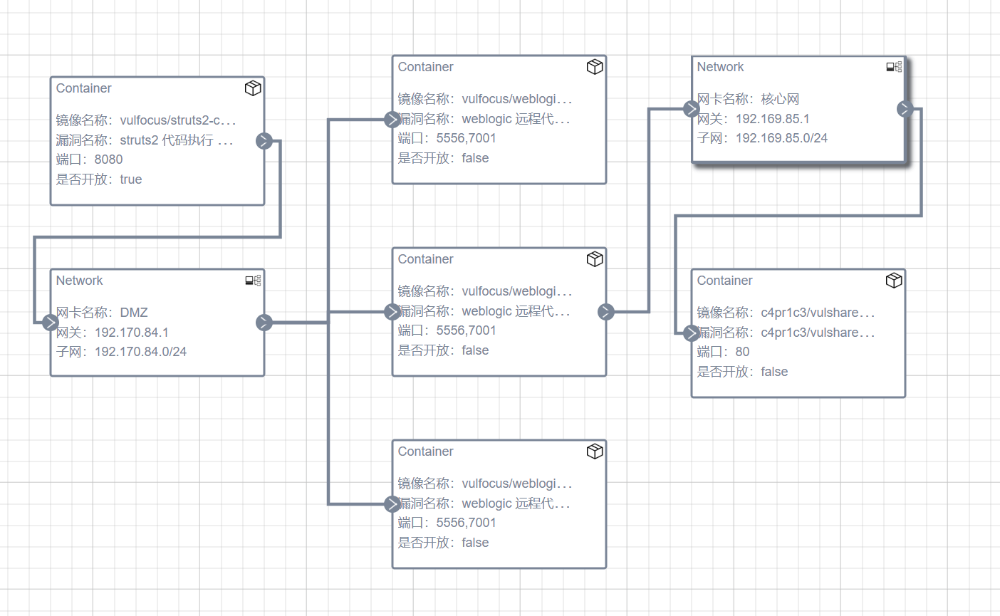
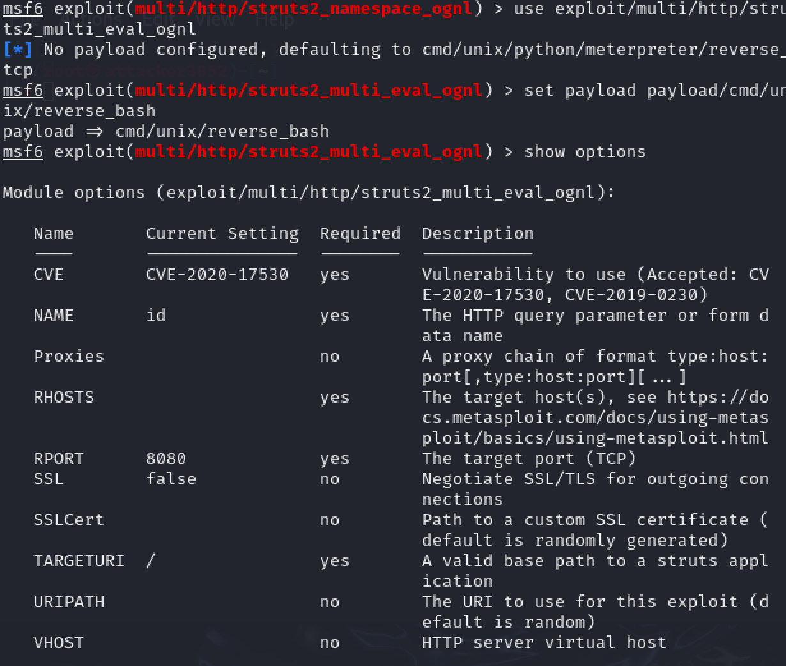
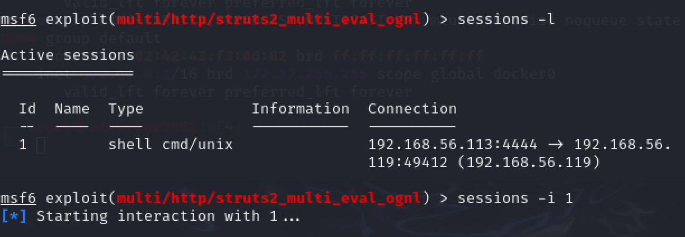
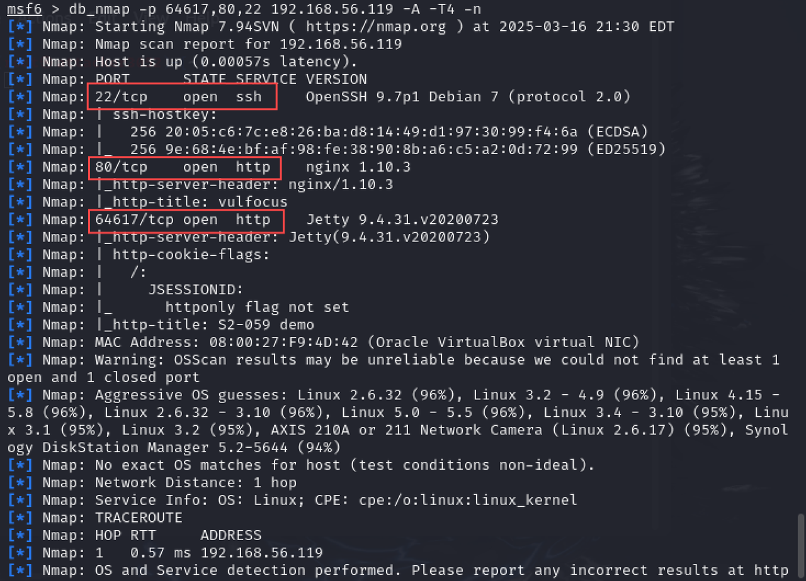
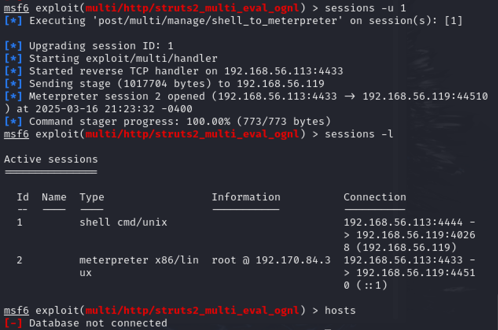
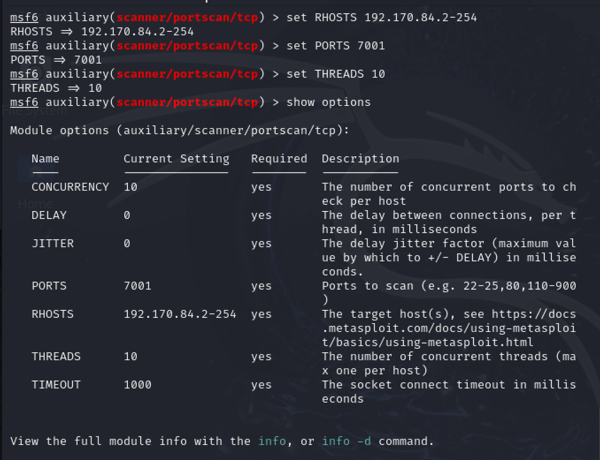
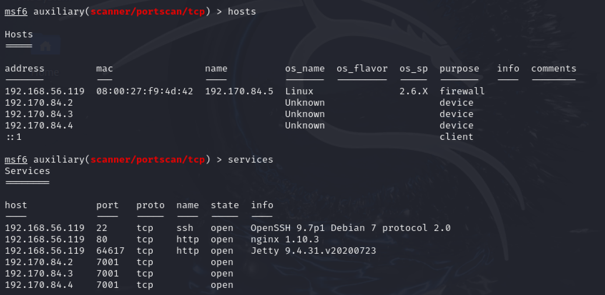

### victim

按照要求拉取三个镜像
```
ulfocus/weblogic-cve_2019_2725
vulfocus/struts2-cve_2020_17530:latest
vulshare/nginx-php-flag
```
我在网页上拉取镜像一直失败，最后发现在命令行里面拉取效果是一样的。

在容器目录下面start bash.sh启动容器，
遇到错误：

启动容器的时候要进入容器内部，输入```docker exec -it vulfocus-vul-focus-1 bash```
来启动redis-server:``` redis-server &```


在网页上创建子网

进行场景编排

启动场景

在启动了场景之后，开启对 `struts2-cve_2020_17530`的流量捕获

```bash
container_name="<替换为目标容器名称或ID>"
docker run --rm --net=container:${container_name} -v ${PWD}/tcpdump/${container_name}:/tcpdump kaazing/tcpdump
```

该命令在当前路径下创建了一个 `tcpdump`目录，并且将对指定容器监控的流量捕获到目录中


### attacker

## DMZ 入口靶标

入口靶标页面如下。其中的端口号就是场景启动页面显示的。

更新并初始化 `metasploit`

已知要利用的漏洞为 `struts2代码执行漏洞`，进行相关搜索搜索：


使用合适的 exp payload


可以show options来查看
进行相关设置，rhosts设置成自己的虚拟机地址,lhosts、rhosts分别是靶机的ip和端口。exploit -j发送

创建了一个sessoin

进入session1，ls/tmp发现第一个flag


## 建立立足点发现靶标2、3、4

对攻击目标进行扫描

可以看出在扫描前 `hosts`的内容只有一个之前指定的 ip 地址，扫描的结果显示发现了 22,80,64617 均为开放端口

查看services情况


将 session 1 的shell 升级为 Meterpreter Shell



进入升级后的 shell 并查看当前网络的情况：


发现入口靶机的内部地址： `192.170.84.3` 并且发现一个新的网段 `192.170.84.0/24`

使用autoroute开启路由转发

- Metasploit Framework的 autoroute 功能是内网渗透中实现路由转发的核心工具，主要用于通过已控制的主机会话（Session）访问内网其他网段的主机或服务。其核心作用是将目标内网的路由规则添加到MSF框架中，使得后续渗透操作可以直接通过该路由访问原本无法直接到达的内网资源

建立新的路由，查看路由

```
run autoroute -s 192.170.84.0/24
run autoroute -p
```


退出当前的 session 进行端口扫描。

搜索并选择portscan模块

```bash
search portscan
use auxiliary/scanner/portscan/tcp
```


查看参数并进行配置



这里的 rhosts 设置为 192.170.84.2-254 是因为内网网关ip为192.170.84.1，所以其他的ip一定介于192.170.84.2-254

开始扫描:


可以发现新扫描到的ip:192.170.84.2 192.170.84.3 192.170.84. 4

新扫描到的 ip 被同步到了 `hosts`与 `services`表中：



